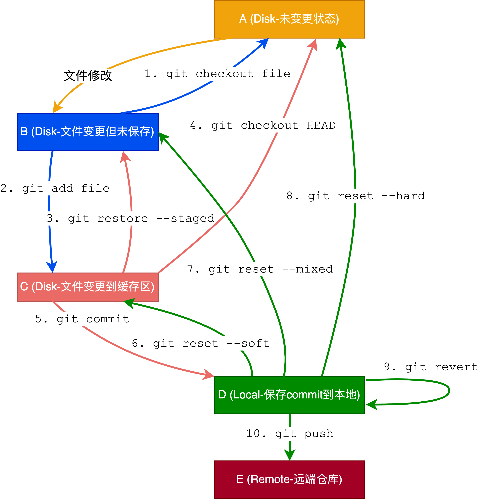

## 1 Github工作流

```shell
git clone # clone到本地
git checkout -b xxx # 切换至新的xxx分支上
# 修改活着添加本地代码
git diff # 查看自己对代码做出的改变
git add # 上传更新后的代码至暂存区
git commit # 将暂存区里更新后的代码更新到本地git
git push origin xxx # 将本地的xxx分支上传至github上的git
```

如果写自己代码过程中发现远端github上的代码有变化

```shell
git checkout master # 切换回master分支
git pull origin master # 将远端修改过的代码更新到本地
git checkout xxx # 回到xxx分支
git rebase master # 目前在xxx分支上，先把master移过来，然后根据我的commit来修改成新的内容
git push -f origin xxx # 把rebase后并且更新过的代码再push到远端
# 项目主人采用pull request中的squash and merge合并所有不同的commit
```

远端更新完成后

```shell
git branch -d xxx # 删除本地的git分支
git pull origin master # 把远端的最新代码拉至本地
```

## 2 Git撤销操作



```
A[Disk-未变更状态]
B[Disk-文件变更但未保存]
C[stage-文件变更到缓存区]
D[local-保存commit到本地]
E[remote-远端仓库]

A-->|文件修改|B
B-->|1. git checkout file|A
B-->|2. git add file|C
C-->|3. git restore -- staged |B
C-->|4. git checkout HEAD|A
C-->|5. git commit|D
D-->|6. git reset --soft|C
D-->|7. git reset --mixed|B
D-->|8. git reset --hard|A
D-->|9. git revert|D
D-->|10. git push|E
```


