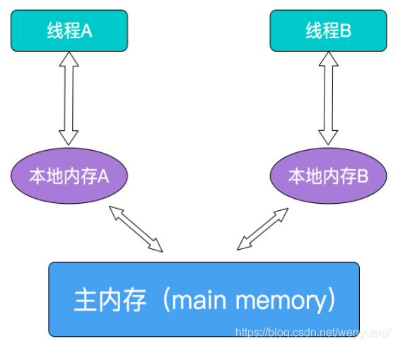
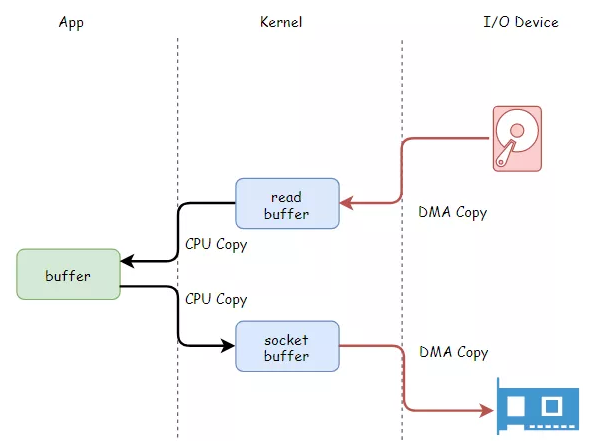
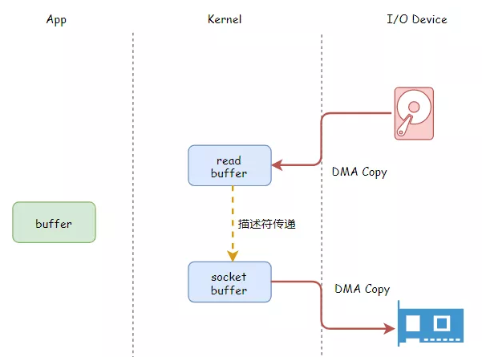
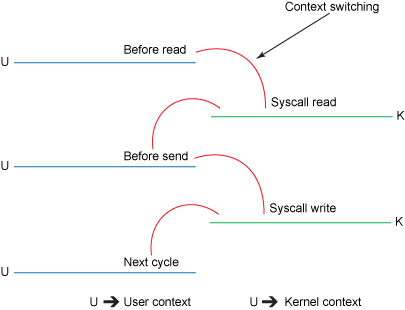
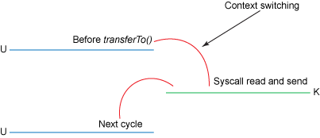
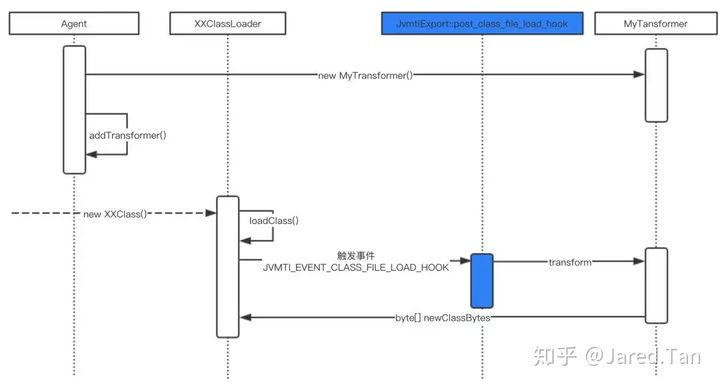
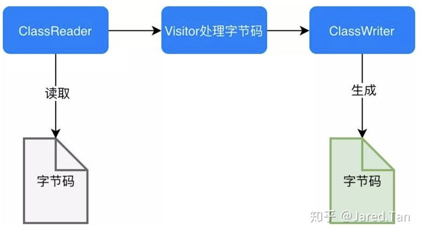

## 集合

### PriorityQueue

`Queue`是一个先进先出（FIFO）的队列。

在银行柜台办业务时，我们假设只有一个柜台在办理业务，但是办理业务的人很多，怎么办？

可以每个人先取一个号，例如：`A1`、`A2`、`A3`……然后，按照号码顺序依次办理，实际上这就是一个`Queue`。

如果这时来了一个VIP客户，他的号码是`V1`，虽然当前排队的是`A10`、`A11`、`A12`……但是柜台下一个呼叫的客户号码却是`V1`。

这个时候，我们发现，要实现“VIP插队”的业务，用`Queue`就不行了，因为`Queue`会严格按FIFO的原则取出队首元素。我们需要的是优先队列：`PriorityQueue`。

`PriorityQueue`和`Queue`的区别在于，它的出队顺序与元素的优先级有关，对`PriorityQueue`调用`remove()`或`poll()`方法，返回的总是优先级最高的元素。

要使用`PriorityQueue`，我们就必须给每个元素定义“优先级”。我们以实际代码为例，先看看`PriorityQueue`的行为：

```java
public class Main {
    public static void main(String[] args) {
        Queue<String> q = new PriorityQueue<>();
        // 添加3个元素到队列:
        q.offer("apple");
        q.offer("pear");
        q.offer("banana");
        System.out.println(q.poll()); // apple
        System.out.println(q.poll()); // banana
        System.out.println(q.poll()); // pear
        System.out.println(q.poll()); // null,因为队列为空
    }
}
```

放入的顺序是`"apple"`、`"pear"`、`"banana"`，但是取出的顺序却是`"apple"`、`"banana"`、`"pear"`，这是因为从字符串的排序看，`"apple"`排在最前面，`"pear"`排在最后面。

因此，放入`PriorityQueue`的元素，必须实现`Comparable`接口，`PriorityQueue`会根据元素的排序顺序决定出队的优先级。

如果我们要放入的元素并没有实现`Comparable`接口怎么办？`PriorityQueue`允许我们提供一个`Comparator`对象来判断两个元素的顺序。我们以银行排队业务为例，实现一个`PriorityQueue`：

```java
public class Main {
    public static void main(String[] args) {
        Queue<User> q = new PriorityQueue<>(new UserComparator());
        // 添加3个元素到队列:
        q.offer(new User("Bob", "A1"));
        q.offer(new User("Alice", "A2"));
        q.offer(new User("Boss", "V1"));
        System.out.println(q.poll()); // Boss/V1
        System.out.println(q.poll()); // Bob/A1
        System.out.println(q.poll()); // Alice/A2
        System.out.println(q.poll()); // null,因为队列为空
    }
}

class UserComparator implements Comparator<User> {
    public int compare(User u1, User u2) {
        if (u1.number.charAt(0) == u2.number.charAt(0)) {
            // 如果两人的号都是A开头或者都是V开头,比较号的大小:
            return u1.number.compareTo(u2.number);
        }
        if (u1.number.charAt(0) == 'V') {
            // u1的号码是V开头,优先级高:
            return -1;
        } else {
            return 1;
        }
    }
}

class User {
    public final String name;
    public final String number;

    public User(String name, String number) {
        this.name = name;
        this.number = number;
    }

    public String toString() {
        return name + "/" + number;
    }
}

```

#### 算法体现

[leetcode 295. 数据流的中位数](https://leetcode-cn.com/problems/find-median-from-data-stream/)

>中位数是有序列表中间的数。如果列表长度是偶数，中位数则是中间两个数的平均值。
>
>例如，
>
>[2,3,4] 的中位数是 3
>
>[2,3] 的中位数是 (2 + 3) / 2 = 2.5
>
>设计一个支持以下两种操作的数据结构：
>
>void addNum(int num) - 从数据流中添加一个整数到数据结构中。
>
>double findMedian() - 返回目前所有元素的中位数。
>
>示例：
>
>addNum(1)
>
>addNum(2)
>
>findMedian() -> 1.5
>
>addNum(3) 
>
>findMedian() -> 2

```java
Queue<Integer> A, B;

public LeetCode_MedianFinder() {

        A = new PriorityQueue<>();
        B = new PriorityQueue<>((x, y) -> (y - x));
}

public void addNum(int num) {

    if (A.size() != B.size()) {
        A.add(num);
        B.add(A.poll());
    } else {
        B.add(num);
        A.add(B.poll());
    }
}

public double findMedian() {

    return A.size() != B.size() ? A.peek() : (A.peek() + B.peek()) / 2.0;
}
```


## 异步同步机制

### 1.概述

多线程并发时，多个线程同时请求同一个资源，必然导致此资源的数据不安全，A线程修改了B线程的处理的数据，而B线程又修改了A线程处理的数理。显然这是由于全局资源造成的，有时为了解决此问题，优先考虑使用局部变量，退而求其次使用同步代码块，出于这样的安全考虑就必须牺牲系统处理性能，加在多线程并发时资源挣夺最激烈的地方，这就实现了线程的同步机制。

**同步**：A线程要请求某个资源，但是此资源正在被B线程使用中，因为同步机制存在，A线程请求不到，怎么办，A线程只能等待下去

**异步**：A线程要请求某个资源，但是此资源正在被B线程使用中，因为没有同步机制存在，A线程仍然请求的到，A线程无需等待

> 显然，同步最最安全，最保险的。而异步不安全，容易导致死锁，这样一个线程死掉就会导致整个进程崩溃，但没有同步机制的存在，性能会有所提升

### 2.同步、异步

同步：提交请求->等待服务器处理->处理完返回这个期间客户端浏览器不能干任何事

异步：请求通过事件触发->服务器处理（这是浏览器仍然可以作其他事情）->处理完毕

> 可见，彼“同步”非此“同步”——我们说的java中的那个共享数据同步（synchronized），一个同步的对象是指行为（动作），一个是同步的对象是指物质（共享数据）

### 3.并发编程的3个基本概念

#### 1.原子性

定义： 即一个操作或者多个操作 要么全部执行并且执行的过程不会被任何因素打断，要么就都不执行。

原子性是拒绝多线程操作的，不论是多核还是单核，具有原子性的量，同一时刻只能有一个线程来对它进行操作。简而言之，在整个操作过程中不会被线程调度器中断的操作，都可认为是原子性。例如 a=1是原子性操作，但是a++和a +=1就不是原子性操作。Java中的原子性操作包括：

1. 基本类型的读取和赋值操作，且赋值必须是数字赋值给变量，变量之间的相互赋值不是原子性操作。
2. 所有引用reference的赋值操作
3. java.concurrent.Atomic.* 包中所有类的一切操作

#### 2.可见性

定义：指当多个线程访问同一个变量时，一个线程修改了这个变量的值，其他线程能够立即看得到修改的值。

在多线程环境下，一个线程对共享变量的操作对其他线程是不可见的。==Java提供了volatile来保证可见性，当一个变量被volatile修饰后，表示着线程本地内存无效，当一个线程修改共享变量后他会立即被更新到主内存中，其他线程读取共享变量时，会直接从主内存中读取==。当然，synchronize和Lock都可以保证可见性。synchronized和Lock能保证同一时刻只有一个线程获取锁然后执行同步代码，并且在释放锁之前会将对变量的修改刷新到主存当中。因此可以保证可见性。

#### 3.有序性

定义：即程序执行的顺序按照代码的先后顺序执行。

Java内存模型中的有序性可以总结为：==如果在本线程内观察，所有操作都是有序的；如果在一个线程中观察另一个线程，所有操作都是无序的==。前半句是指“线程内表现为串行语义”，后半句是指“指令重排序”现象和“工作内存主内存同步延迟”现象。

在Java内存模型中，为了效率是允许编译器和处理器对指令进行重排序，当然重排序不会影响单线程的运行结果，但是对多线程会有影响。Java提供volatile来保证一定的有序性。最著名的例子就是单例模式里面的DCL（双重检查锁）。另外，可以通过synchronized和Lock来保证有序性，synchronized和Lock保证每个时刻是有一个线程执行同步代码，相当于是让线程顺序执行同步代码，自然就保证了有序性。

#### 4.锁的互斥和可见性

锁提供了两种主要特性：互斥（mutual exclusion） 和可见性（visibility）。

1. 互斥即一次只允许一个线程持有某个特定的锁，一次就只有一个线程能够使用该共享数据。
2. 可见性要更加复杂一些，它必须确保释放锁之前对共享数据做出的更改对于随后获得该锁的另一个线程是可见的。也即当一条线程修改了共享变量的值，新值对于其他线程来说是可以立即得知的。如果没有同步机制提供的这种可见性保证，线程看到的共享变量可能是修改前的值或不一致的值，这将引发许多严重问题。要使 volatile 变量提供理想的线程安全，必须同时满足下面两个条件：
   1. 对变量的写操作不依赖于当前值。
   2. 该变量没有包含在具有其他变量的不变式中。

实际上，这些条件表明，可以被写入 volatile 变量的这些有效值独立于任何程序的状态，包括变量的当前状态。事实上就是保证操作是原子性操作，才能保证使用volatile关键字的程序在并发时能够正确执行。

#### 5.JAVA的内存模型JMM以及共享变量的可见性

JMM决定一个线程对共享变量的写入何时对另一个线程可见，JMM定义了线程和主内存之间的抽象关系：共享变量存储在主内存(Main Memory)中，每个线程都有一个私有的本地内存（Local Memory），本地内存保存了被该线程使用到的主内存的副本拷贝，线程对变量的所有操作都必须在工作内存中进行，而不能直接读写主内存中的变量。



对于普通的共享变量来讲，线程A将其修改为某个值发生在线程A的本地内存中，此时还未同步到主内存中去；而线程B已经缓存了该变量的旧值，所以就导致了共享变量值的不一致。解决这种共享变量在多线程模型中的不可见性问题，较粗暴的方式自然就是加锁，但是此处使用synchronized或者Lock这些方式太重量级了，比较合理的方式其实就是volatile。

> 需要注意的是，JMM是个抽象的内存模型，所以所谓的本地内存，主内存都是抽象概念，并不一定就真实的对应cpu缓存和物理内存

#### 6.JAVA同步机制有4中实现方式

1. ThreadLocal
2. synchronized( )
3. wait() 与 notify()
4. volatile

目的：都是为了解决多线程中的对同一变量的访问冲突

1. ThreadLocal

   ThreadLocal 保证不同线程拥有不同实例，相同线程一定拥有相同的实例，即为每一个使用该变量的线程提供一个该变量值的副本，每一个线程都可以独立改变自己的副本，而不是与其它线程的副本冲突。

   优势：提供了线程安全的共享对象

   与其它同步机制的区别：同步机制是为了同步多个线程对相同资源的并发访问，是为了多个线程之间进行通信；而 ThreadLocal 是隔离多个线程的数据共享，从根本上就不在多个线程之间共享资源，这样当然不需要多个线程进行同步了。

2. 2.volatile

   volatile 修饰的成员变量在每次被线程访问时，都强迫从共享内存中重读该成员变量的值。而且，当成员变量发生变化时，强迫线程将变化值回写到共享内存。

   优势：这样在任何时刻，两个不同的线程总是看到某个成员变量的同一个值。

   缘由：Java 语言规范中指出，为了获得最佳速度，允许线程保存共享成员变量的私有拷贝，而且只当线程进入或者离开同步代码块时才与共享成员变量的原始值对比。这样当多个线程同时与某个对象交互时，就必须要注意到要让线程及时的得到共享成员变量的变化。而 volatile 关键字就是提示 VM ：对于这个成员变量不能保存它的私有拷贝，而应直接与共享成员变量交互。

   使用技巧：在两个或者更多的线程访问的成员变量上使用 volatile 。当要访问的变量已在synchronized 代码块中，或者为常量时，不必使用。

   线程为了提高效率，将某成员变量(如A)拷贝了一份（如B），线程中对A的访问其实访问的是B。只在某些动作时才进行A和B的同步，因此存在A和B不一致的情况。volatile就是用来避免这种情况的。 volatile告诉jvm，它所修饰的变量不保留拷贝，直接访问主内存中的（读操作多时使用较好；线程间需要通信，本条做不到）

3. Volatile 变量具有 synchronized 的可见性特性，但是不具备原子特性。这就是说线程能够自动发现 volatile 变量的最新值。Volatile 变量可用于提供线程安全，但是只能应用于非常有限的一组用例：多个变量之间或者某个变量的当前值与修改后值之间没有约束。

   您只能在有限的一些情形下使用 volatile 变量替代锁。要使 volatile 变量提供理想的线程安全，必须同时满足下面两个条件：

   对变量的写操作不依赖于当前值；该变量没有包含在具有其他变量的不变式中。

4. 3.sleep() vs wait()

   sleep是线程类（Thread）的方法，导致此线程暂停执行指定时间，把执行机会给其他线程，但是监控状态依然保持，到时后会自动恢复。调用sleep不会释放对象锁。

5. wait是Object类的方法，对此对象调用wait方法导致本线程放弃对象锁，进入等待此对象的等待锁定池，只有针对此对象发出notify方法（或notifyAll）后本线程才进入对象锁定池准备获得对象锁进入运行状态。

   > （如果变量被声明为volatile，在每次访问时都会和主存一致；如果变量在同步方法或者同步块中被访问，当在方法或者块的入口处获得锁以及方法或者块退出时释放锁时变量被同步。）

## 零拷贝

### 1.概述

==零拷贝的“零”是指用户态和内核态间copy数据的次数为零。==

传统的数据copy（文件到文件、client到server等）涉及到四次用户态内核态切换、四次copy。四次copy中，两次在用户态和内核态间copy需要CPU参与、两次在内核态与IO设备间copy为DMA方式不需要CPU参与。零拷贝避免了用户态和内核态间的copy（共2次）、减少了两次用户态内核态间的切换，因此数据传输效率高（4、4变2、2）。

> 零拷贝可以提高数据传输效率，但对于需要在用户传输过程中对数据进行加工的场景（如加密）就不适合使用零拷贝。





### 2.介绍

java 的zero copy多在网络应用程序中使用。==Java的libaries在linux和unix中支持zero copy==，关键的api是==java.nio.channel.FileChannel的transferTo()，transferFrom()方法==。我们可以用这两个方法来把bytes直接从调用它的channel传输到另一个writable byte channel，中间不会使data经过应用程序，以便提高数据转移的效率。许多web应用都会向用户提供大量的静态内容，这意味着有很多data从硬盘读出之后，会原封不动的通过socket传输给用户。这种操作看起来可能不会怎么消耗CPU，但是实际上它是低效的：kernal把数据从disk读出来，然后把它传输给user级的application，然后application再次把同样的内容再传回给处于kernal级的socket。这种场景下，application实际上只是作为一种低效的中间介质，用来把disk file的data传给socket。

data每次穿过user-kernel boundary，都会被copy，这会消耗cpu，并且占用RAM的带宽。幸运的是，你可以用一种叫做Zero-Copy的技术来去掉这些无谓的 copy。应用程序用zero copy来请求kernel直接把disk的data传输给socket，而不是通过应用程序传输。Zero copy大大提高了应用程序的性能，并且减少了kernel和user模式的上下文切换。使用kernel buffer做中介(而不是直接把data传到user buffer中)看起来比较低效(多了一次copy)。然而实际上kernel buffer是用来提高性能的。在进行读操作的时候，kernel buffer起到了预读cache的作用。当写请求的data size比kernel buffer的size小的时候，这能够显著的提升性能。在进行写操作时，kernel buffer的存在可以使得写请求完全异步。悲剧的是，当请求的data size远大于kernel buffer size的时候，这个方法本身变成了性能的瓶颈。因为data需要在disk，kernel buffer，user buffer之间拷贝很多次(每次写满整个buffer)。

==而Zero copy正是通过消除这些多余的data copy来提升性能。==

### 3.传统方式及涉及到的上下文切换

通过网络把一个文件传输给另一个程序，在OS的内部，这个copy操作要经历四次user mode和kernel mode之间的上下文切换，甚至连数据都被拷贝了四次。如下图：

具体步骤如下：

1. read() 调用导致一次从user mode到kernel mode的上下文切换。在内部调用了sys_read() 来从文件中读取data。第一次copy由DMA (direct memory access)完成，将文件内容从disk读出，存储在kernel的buffer中。
2. 然后请求的数据被copy到user buffer中，此时read()成功返回。调用的返回触发了第二次context switch: 从kernel到user。至此，数据存储在user的buffer中。
3. send() Socket call 带来了第三次context switch，这次是从user mode到kernel mode。同时，也发生了第三次copy：把data放到了kernel adress space中。当然，这次的kernel buffer和第一步的buffer是不同的buffer。
4. 最终 send() system call 返回了，同时也造成了第四次context switch。同时第四次copy发生，DMA egine将data从kernel buffer拷贝到protocol engine中。第四次copy是独立而且异步的。




### 4.Zero Copy方式及设计的上下文切换

在linux 2.4及以上版本的内核中(如linux 6或centos 6以上的版本）修改了socket buffer descriptor，使网卡支持 gather operation，通过kernel进一步减少数据的拷贝操作。这个方法不仅减少了context switch，还消除了和CPU有关的数据拷贝。user层面的使用方法没有变，但是内部原理却发生了变化：

transferTo()方法使得文件内容被copy到了kernel buffer，这一动作由DMA engine完成。 没有data被copy到socket buffer。取而代之的是socket buffer被追加了一些descriptor的信息，包括data的位置和长度。然后DMA engine直接把data从kernel buffer传输到protocol engine，这样就消除了唯一的一次需要占用CPU的拷贝操作。




5.NIO零拷贝示例

NIO中的FileChannel拥有transferTo和transferFrom两个方法，可直接把FileChannel中的数据拷贝到另外一个Channel，或直接把另外一个Channel中的数据拷贝到FileChannel。该接口常被用于高效的网络/文件的数据传输和大文件拷贝。在操作系统支持的情况下，通过该方法传输数据并不需要将源数据从内核态拷贝到用户态，再从用户态拷贝到目标通道的内核态，同时也减少了两次用户态和内核态间的上下文切换，也即使用了“零拷贝”，所以其性能一般高于Java IO中提供的方法。

#### 通过网络把一个文件从client传到server：

```java
/**
 * disk-nic零拷贝
 */
class ZerocopyServer {
    ServerSocketChannel listener = null;

    protected void mySetup() {
        InetSocketAddress listenAddr = new InetSocketAddress(9026);

        try {
            listener = ServerSocketChannel.open();
            ServerSocket ss = listener.socket();
            ss.setReuseAddress(true);
            ss.bind(listenAddr);
            System.out.println("监听的端口:" + listenAddr.toString());
        } catch (IOException e) {
            System.out.println("端口绑定失败 : " + listenAddr.toString() + " 端口可能已经被使用,出错原因: " + e.getMessage());
            e.printStackTrace();
        }

    }

    public static void main(String[] args) {
        ZerocopyServer dns = new ZerocopyServer();
        dns.mySetup();
        dns.readData();
    }

    private void readData() {
        ByteBuffer dst = ByteBuffer.allocate(4096);
        try {
            while (true) {
                SocketChannel conn = listener.accept();
                System.out.println("创建的连接: " + conn);
                conn.configureBlocking(true);
                int nread = 0;
                while (nread != -1) {
                    try {
                        nread = conn.read(dst);
                    } catch (IOException e) {
                        e.printStackTrace();
                        nread = -1;
                    }
                    dst.rewind();
                }
            }
        } catch (IOException e) {
            e.printStackTrace();
        }
    }
}

class ZerocopyClient {
    public static void main(String[] args) throws IOException {
        ZerocopyClient sfc = new ZerocopyClient();
        sfc.testSendfile();
    }

    public void testSendfile() throws IOException {
        String host = "localhost";
        int port = 9026;
        SocketAddress sad = new InetSocketAddress(host, port);
        SocketChannel sc = SocketChannel.open();
        sc.connect(sad);
        sc.configureBlocking(true);

        String fname = "src/main/java/zerocopy/test.data";
        FileChannel fc = new FileInputStream(fname).getChannel();
        long start = System.nanoTime();
        long nsent = 0, curnset = 0;
        curnset = fc.transferTo(0, fc.size(), sc);
        System.out.println("发送的总字节数:" + curnset + " 耗时(ns):" + (System.nanoTime() - start));
        try {
            sc.close();
            fc.close();
        } catch (IOException e) {
            System.out.println(e);
        }
    }
}
```

#### 文件到文件的零拷贝：

```java
/**
 * disk-disk零拷贝
 */
class ZerocopyFile {
    @SuppressWarnings("resource")
    public static void transferToDemo(String from, String to) throws IOException {
        FileChannel fromChannel = new RandomAccessFile(from, "rw").getChannel();
        FileChannel toChannel = new RandomAccessFile(to, "rw").getChannel();

        long position = 0;
        long count = fromChannel.size();

        fromChannel.transferTo(position, count, toChannel);

        fromChannel.close();
        toChannel.close();
    }

    @SuppressWarnings("resource")
    public static void transferFromDemo(String from, String to) throws IOException {
        FileChannel fromChannel = new FileInputStream(from).getChannel();
        FileChannel toChannel = new FileOutputStream(to).getChannel();

        long position = 0;
        long count = fromChannel.size();

        toChannel.transferFrom(fromChannel, position, count);

        fromChannel.close();
        toChannel.close();
    }

    public static void main(String[] args) throws IOException {
        String from = "src/main/java/zerocopy/1.data";
        String to = "src/main/java/zerocopy/2.data";
        // transferToDemo(from,to);
        transferFromDemo(from, to);
    }
}
```

## JAVA探针(Java Agent)

### 1.概述

笼统地来讲，Java Agent 是一个统称，该功能是 Java 虚拟机提供的一整套后门。==通过这套后门可以对虚拟机方方面面进行监控与分析，甚至干预虚拟机的运行。==

Java Agent 又叫做 Java 探针，Java Agent 是在 JDK1.5 引入的，==是一种可以动态修改 Java 字节码的技术==。Java 类编译之后形成字节码被 JVM 执行，在 JVM 在执行这些字节码之前获取这些字节码信息，并且通过字节码转换器对这些字节码进行修改，来完成一些额外的功能，这种就是 Java Agent 技术。

从用户使用层面来看，Java Agent 一般通过在应用启动参数中添加 -javaagent 参数添加 ClassFileTransformer 字节码转换器。 在 Java 虚拟机启动时，执行main() 函数之前，Java 虚拟机会先找到 -javaagent 命令指定 jar 包，然后执行 premain-class 中的 premain() 方法。用一句概括其功能的话就是：==main() 函数之前的一个拦截器。==

### 2.Java Agent可以实现什么样的功能？

从上面提到的字节码转换器的两种执行方式来看可以实现如下功能：

- Java Agent 能够在加载 Java 字节码之前进行拦截并对字节码进行修改;
- 在 Jvm 运行期间修改已经加载的字节码;

因此，通过以上两点即可实现在一些框架或是技术的采集点进行字节码修改，对应用进行监控（比如通过JVM CPU Profiler 从CPU、Memory、Thread、Classes、GC等多个方面对程序进行动态分析），或是对执行指定方法或接口时做一些额外操作，比如打印日志、打印方法执行时间、采集方法的入参和结果等；

基于前面对 Java Agent 大致机制的描述，我们不难猜到，能够干预 Java JVM 虚拟机的运行，那么就可以解决不限于如下的问题：

- 使用 JVMTI 对 class 文件加密：有时一些涉及到关键技术的 class 文件或者 jar 包我们不希望对外暴露，因而需要进行加密。使用一些常规的手段（例如使用混淆器或者自定义类加载器）来对 class 文件进行加密很容易被反编译。反编译后的代码虽然增加了阅读的难度，但花费一些功夫也是可以读懂的。使用 JVMTI 我们可以将解密的代码封装成 .dll, 或 .so 文件。这些文件想要反编译就很麻烦了，另外还能加壳。解密代码不能被破解，从而也就保护了我们想要加密的 class 文件。
- 使用 JVMTI 实现应用性能监控(APM) 在微服务大行其道的环境下，分布式系统的逻辑结构变得越来越复杂。这给系统性能分析和问题定位带来了非常大的挑战。基于JVMTI的APM能够解决分布式架构和微服务带来的监控和运维上的挑战。APM通过汇聚业务系统各处理环节的实时数据，分析业务系统各事务处理的交易路径和处理时间，实现对应用的全链路性能监测。开源的Skywalking、Pinpoint,、ZipKin、 Hawkular, 商业的 AppDynamics、OneAPM、Google Dapper等都是个中好手。

另外来看看 Github 上有哪些开源工具、项目使用到了 Agent 技术：

- 阿里巴巴开源的 Java 诊断工具—— **[Arthas](https://github.com/alibaba/arthas)**，深受开发者喜爱。在线排查问题，无需重启；动态跟踪 Java 代码；实时监控 JVM 状态。
- Apache **[Skywalking](https://github.com/apache/skywalking)** 的 Java Agent 则针对服务的调用链路、JVM 基础监控信息进行采集。
- Uber/jvm-profiler: 通过 Java Agent 采集 JVM CPU、Memory、IO等指标并发送给 Kafka、Console 以及可以自定义的发送器。

### 3.Java Agent的实现原理

从 JVM 类加载流程来看，字节码转换器的执行方式有两种：一种是在 main 方法执行之前，通过 premain 来实现，另一种是在程序运行中，通过 Attach Api 来实现。

对于 JVM 内部的 Attach 实现，是通过 `tools.jar` 这个包中的 `com.sun.tools.attach.VirtualMachine` 以及 `VirtualMachine.attach(pid)` 这种方式来实现的。底层则是通过 `JVMTI` 在运行前或者运行时，将自定义的 Agent 加载并和 VM 进行通信。

了解 Java Agent 的实现原理就必须先了解 Java 的类加载机制（这里不做过多介绍），这个是了解 Java Agent 的前提。

JVM 在类加载时触发`JVMTI_EVENT_CLASS_FILE_LOAD_HOOK` 事件调用添加的字节码转换器完成字节码转换，该过程时序如下：



Java Agent 所使用的 Instrumentation 依赖 JVMTI 实现，当然也可以绕过 Instrumentation 直接使用 JVMTI 实现 Agent。因此，JVMTI 与 JDI 组成了 Java 平台调试体系（JPDA）的主要能力。

如果想要深入了解 Java Agent,就得需要了解 JVMTI 以及 JVMTIAgent，下面分别介绍下：

#### 3.1**JVMTI**

JVMTI 是JVM Tool Interface 的缩写，是 JVM 暴露出来给用户扩展使用的接口集合，JVMTI 是基于事件驱动的，JVM每执行一定的逻辑就会调用一些事件的回调接口，这些接口可以给用户自行扩展来实现自己的逻辑。JVMTI是实现 Debugger、Profiler、Monitor、Thread Analyser 等工具的统一基础，在主流 Java 虚拟机中都有实现。

#### 3.2**JVMTIAgent**

JVMTI 并不一定在所有的 Java 虚拟机上都有实现，不同的虚拟机的实现也不尽相同。不过在一些主流的虚拟机中，比如 Sun 和 IBM，以及一些开源的如 Apache Harmony DRLVM 中，都提供了标准 JVMTI 实现。

JVMTI 是一套本地代码接口，因此使用 JVMTI 需要我们与 C/C++ 以及 JNI 打交道。事实上，开发时一般采用建立一个 Agent 的方式来使用 JVMTI，它使用 JVMTI 函数，设置一些回调函数，并从 Java 虚拟机中得到当前的运行态信息，并作出自己的判断，最后还可能操作虚拟机的运行态。把 Agent 编译成一个动态链接库之后，我们就可以在 Java 程序启动的时候来加载它（启动加载模式），也可以在 Java 5 之后使用运行时加载（活动加载模式）。

```text
-agentlib:agent-lib-name=options
-agentpath:path-to-agent=options
```

JVMTIAgent主要有三个方法，

- Agent_OnLoad 方法，如果 agent 在启动时加载，就执行这个方法
- Agent_OnAttach方法，如果agent不是在启动的时候加载的，是我们先attach到目标线程上，然后对对应的目标进程发送load命令来加载agent，在加载过程中调用Agent_OnAttach函数
- Agent_OnUnload 方法，在 agent 做卸载掉时候调用

#### 3.3**Instrument Agent**

说到 javaagent，必须要讲的是一个叫做 instrument 的 JVMTIAgent（Linux下对应的动态库是 libinstrument.so） instrument agent 实现了上面 Agent_OnLoad 方法和 Agent_OnAttach 方法，也就是即能在启动的时候加载 agent，也可以在运行期来加动态加载 agent，运行期动态加载 agent 依赖 JVM 的 attach 机制实现，通过发送 load 命令来加载 agent

那么什么是 JVM Attach 机制？

#### 3.4**JVM Attach 机制**

Jvm attach 机制是指 JVM 提供的一种 JVM 进程间通信的功能，能让一个进程传命令给另一个进程，并进行一些内部的操作，比如进行线程 dump，那么就需要执行 jstack 进行，然后把 pid 等参数传递给需要 dump 的线程来执行，这就是一种 java attach。

4.可以实现Java Agent的技术框架有哪些？

原理了解清楚了就需要实现，Java Agent 从实现上来看主要涉及到字节码增强的过程，其到过程大概是：

1. 修改字节码

1. 加载新的字节码

1. 替换旧的字节码

通过上面对 Java Agent 介绍之后，是不是发现，我想要实现一个 Java Agent 还得去深入学习那么多东西吗？

当然不用，这里就介绍几个常用的字节码增强工具：

- ASM：对于需要手动操纵字节码的需求，可以使用 ASM，它可以直接生成 .class 字节码文件，也可以在类被加载入 JVM 之前动态修改类行为。



- Javassist： ASM 是在指令层次上操作字节码的，我们的直观感受是在指令层次上操作字节码的框架实现起来比较晦涩。故除此之外，再简单介绍另外一类框架：强调源代码层次操作字节码的框架 Javassist。利用 Javassist 实现字节码增强时，可以无须关注字节码刻板的结构，其优点就在于编程简单。直接使用 Java 编码的形式，而不需要了解虚拟机指令，就能动态改变类的结构或者动态生成类。
- Instrument：Instrument 是 JVM 提供的一个可以修改已加载类的类库，专门为 Java 语言编写的插桩服务提供支持。它需要依赖 JVMTI 的 Attach API 机制实现。
- Byte Buddy：ByteBuddy 是一个开源 Java 库，其主要功能是帮助用户屏蔽字节码操作，以及复杂的 InstrumentationAPI。ByteBuddy 提供了一套类型安全的API和注解，我们可以直接使用这些 API 和注解轻松实现复杂的字节码操作。另外，Byte Buddy 提供了针对 Java Agent 的额外 API，帮助开发人员在 Java Agent 场景轻松增强已有代码。
