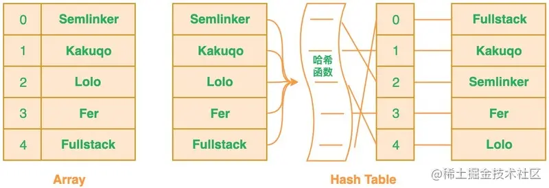
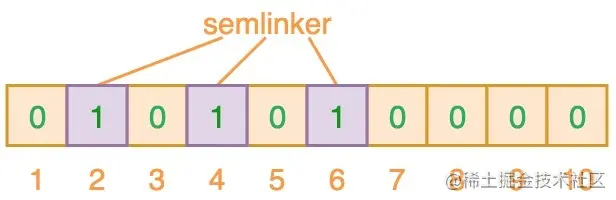
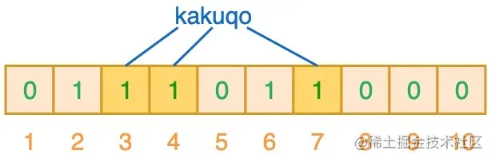
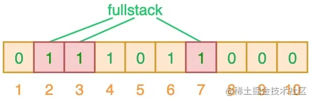

## 集合

### PriorityQueue

`Queue`是一个先进先出（FIFO）的队列。

在银行柜台办业务时，我们假设只有一个柜台在办理业务，但是办理业务的人很多，怎么办？

可以每个人先取一个号，例如：`A1`、`A2`、`A3`……然后，按照号码顺序依次办理，实际上这就是一个`Queue`。

如果这时来了一个VIP客户，他的号码是`V1`，虽然当前排队的是`A10`、`A11`、`A12`……但是柜台下一个呼叫的客户号码却是`V1`。

这个时候，我们发现，要实现“VIP插队”的业务，用`Queue`就不行了，因为`Queue`会严格按FIFO的原则取出队首元素。我们需要的是优先队列：`PriorityQueue`。

`PriorityQueue`和`Queue`的区别在于，它的出队顺序与元素的优先级有关，对`PriorityQueue`调用`remove()`或`poll()`方法，返回的总是优先级最高的元素。

要使用`PriorityQueue`，我们就必须给每个元素定义“优先级”。我们以实际代码为例，先看看`PriorityQueue`的行为：

```java
public class Main {
    public static void main(String[] args) {
        Queue<String> q = new PriorityQueue<>();
        // 添加3个元素到队列:
        q.offer("apple");
        q.offer("pear");
        q.offer("banana");
        System.out.println(q.poll()); // apple
        System.out.println(q.poll()); // banana
        System.out.println(q.poll()); // pear
        System.out.println(q.poll()); // null,因为队列为空
    }
}
```

放入的顺序是`"apple"`、`"pear"`、`"banana"`，但是取出的顺序却是`"apple"`、`"banana"`、`"pear"`，这是因为从字符串的排序看，`"apple"`排在最前面，`"pear"`排在最后面。

因此，放入`PriorityQueue`的元素，必须实现`Comparable`接口，`PriorityQueue`会根据元素的排序顺序决定出队的优先级。

如果我们要放入的元素并没有实现`Comparable`接口怎么办？`PriorityQueue`允许我们提供一个`Comparator`对象来判断两个元素的顺序。我们以银行排队业务为例，实现一个`PriorityQueue`：

```java
public class Main {
    public static void main(String[] args) {
        Queue<User> q = new PriorityQueue<>(new UserComparator());
        // 添加3个元素到队列:
        q.offer(new User("Bob", "A1"));
        q.offer(new User("Alice", "A2"));
        q.offer(new User("Boss", "V1"));
        System.out.println(q.poll()); // Boss/V1
        System.out.println(q.poll()); // Bob/A1
        System.out.println(q.poll()); // Alice/A2
        System.out.println(q.poll()); // null,因为队列为空
    }
}

class UserComparator implements Comparator<User> {
    public int compare(User u1, User u2) {
        if (u1.number.charAt(0) == u2.number.charAt(0)) {
            // 如果两人的号都是A开头或者都是V开头,比较号的大小:
            return u1.number.compareTo(u2.number);
        }
        if (u1.number.charAt(0) == 'V') {
            // u1的号码是V开头,优先级高:
            return -1;
        } else {
            return 1;
        }
    }
}

class User {
    public final String name;
    public final String number;

    public User(String name, String number) {
        this.name = name;
        this.number = number;
    }

    public String toString() {
        return name + "/" + number;
    }
}

```

#### 算法体现

[leetcode 295. 数据流的中位数](https://leetcode-cn.com/problems/find-median-from-data-stream/)

>中位数是有序列表中间的数。如果列表长度是偶数，中位数则是中间两个数的平均值。
>
>例如，
>
>[2,3,4] 的中位数是 3
>
>[2,3] 的中位数是 (2 + 3) / 2 = 2.5
>
>设计一个支持以下两种操作的数据结构：
>
>void addNum(int num) - 从数据流中添加一个整数到数据结构中。
>
>double findMedian() - 返回目前所有元素的中位数。
>
>示例：
>
>addNum(1)
>
>addNum(2)
>
>findMedian() -> 1.5
>
>addNum(3) 
>
>findMedian() -> 2

```java
Queue<Integer> A, B;

public LeetCode_MedianFinder() {

        A = new PriorityQueue<>();
        B = new PriorityQueue<>((x, y) -> (y - x));
}

public void addNum(int num) {

    if (A.size() != B.size()) {
        A.add(num);
        B.add(A.poll());
    } else {
        B.add(num);
        A.add(B.poll());
    }
}

public double findMedian() {

    return A.size() != B.size() ? A.peek() : (A.peek() + B.peek()) / 2.0;
}
```


## 异步同步机制

### 1.概述

多线程并发时，多个线程同时请求同一个资源，必然导致此资源的数据不安全，A线程修改了B线程的处理的数据，而B线程又修改了A线程处理的数理。显然这是由于全局资源造成的，有时为了解决此问题，优先考虑使用局部变量，退而求其次使用同步代码块，出于这样的安全考虑就必须牺牲系统处理性能，加在多线程并发时资源挣夺最激烈的地方，这就实现了线程的同步机制。

**同步**：A线程要请求某个资源，但是此资源正在被B线程使用中，因为同步机制存在，A线程请求不到，怎么办，A线程只能等待下去

**异步**：A线程要请求某个资源，但是此资源正在被B线程使用中，因为没有同步机制存在，A线程仍然请求的到，A线程无需等待

> 显然，同步最最安全，最保险的。而异步不安全，容易导致死锁，这样一个线程死掉就会导致整个进程崩溃，但没有同步机制的存在，性能会有所提升

### 2.同步、异步

同步：提交请求->等待服务器处理->处理完返回这个期间客户端浏览器不能干任何事

异步：请求通过事件触发->服务器处理（这是浏览器仍然可以作其他事情）->处理完毕

> 可见，彼“同步”非此“同步”——我们说的java中的那个共享数据同步（synchronized），一个同步的对象是指行为（动作），一个是同步的对象是指物质（共享数据）

### 3.并发编程的3个基本概念

#### 1.原子性

定义： 即一个操作或者多个操作 要么全部执行并且执行的过程不会被任何因素打断，要么就都不执行。

原子性是拒绝多线程操作的，不论是多核还是单核，具有原子性的量，同一时刻只能有一个线程来对它进行操作。简而言之，在整个操作过程中不会被线程调度器中断的操作，都可认为是原子性。例如 a=1是原子性操作，但是a++和a +=1就不是原子性操作。Java中的原子性操作包括：

1. 基本类型的读取和赋值操作，且赋值必须是数字赋值给变量，变量之间的相互赋值不是原子性操作。
2. 所有引用reference的赋值操作
3. java.concurrent.Atomic.* 包中所有类的一切操作

#### 2.可见性

定义：指当多个线程访问同一个变量时，一个线程修改了这个变量的值，其他线程能够立即看得到修改的值。

在多线程环境下，一个线程对共享变量的操作对其他线程是不可见的。==Java提供了volatile来保证可见性，当一个变量被volatile修饰后，表示着线程本地内存无效，当一个线程修改共享变量后他会立即被更新到主内存中，其他线程读取共享变量时，会直接从主内存中读取==。当然，synchronize和Lock都可以保证可见性。synchronized和Lock能保证同一时刻只有一个线程获取锁然后执行同步代码，并且在释放锁之前会将对变量的修改刷新到主存当中。因此可以保证可见性。

#### 3.有序性

定义：即程序执行的顺序按照代码的先后顺序执行。

Java内存模型中的有序性可以总结为：==如果在本线程内观察，所有操作都是有序的；如果在一个线程中观察另一个线程，所有操作都是无序的==。前半句是指“线程内表现为串行语义”，后半句是指“指令重排序”现象和“工作内存主内存同步延迟”现象。

在Java内存模型中，为了效率是允许编译器和处理器对指令进行重排序，当然重排序不会影响单线程的运行结果，但是对多线程会有影响。Java提供volatile来保证一定的有序性。最著名的例子就是单例模式里面的DCL（双重检查锁）。另外，可以通过synchronized和Lock来保证有序性，synchronized和Lock保证每个时刻是有一个线程执行同步代码，相当于是让线程顺序执行同步代码，自然就保证了有序性。

#### 4.锁的互斥和可见性

锁提供了两种主要特性：互斥（mutual exclusion） 和可见性（visibility）。

1. 互斥即一次只允许一个线程持有某个特定的锁，一次就只有一个线程能够使用该共享数据。
2. 可见性要更加复杂一些，它必须确保释放锁之前对共享数据做出的更改对于随后获得该锁的另一个线程是可见的。也即当一条线程修改了共享变量的值，新值对于其他线程来说是可以立即得知的。如果没有同步机制提供的这种可见性保证，线程看到的共享变量可能是修改前的值或不一致的值，这将引发许多严重问题。要使 volatile 变量提供理想的线程安全，必须同时满足下面两个条件：
   1. 对变量的写操作不依赖于当前值。
   2. 该变量没有包含在具有其他变量的不变式中。

实际上，这些条件表明，可以被写入 volatile 变量的这些有效值独立于任何程序的状态，包括变量的当前状态。事实上就是保证操作是原子性操作，才能保证使用volatile关键字的程序在并发时能够正确执行。

#### 5.JAVA的内存模型JMM以及共享变量的可见性

JMM决定一个线程对共享变量的写入何时对另一个线程可见，JMM定义了线程和主内存之间的抽象关系：共享变量存储在主内存(Main Memory)中，每个线程都有一个私有的本地内存（Local Memory），本地内存保存了被该线程使用到的主内存的副本拷贝，线程对变量的所有操作都必须在工作内存中进行，而不能直接读写主内存中的变量。


对于普通的共享变量来讲，线程A将其修改为某个值发生在线程A的本地内存中，此时还未同步到主内存中去；而线程B已经缓存了该变量的旧值，所以就导致了共享变量值的不一致。解决这种共享变量在多线程模型中的不可见性问题，较粗暴的方式自然就是加锁，但是此处使用synchronized或者Lock这些方式太重量级了，比较合理的方式其实就是volatile。

> 需要注意的是，JMM是个抽象的内存模型，所以所谓的本地内存，主内存都是抽象概念，并不一定就真实的对应cpu缓存和物理内存

#### 6.JAVA同步机制有4中实现方式

1. ThreadLocal
2. synchronized( )
3. wait() 与 notify()
4. volatile

目的：都是为了解决多线程中的对同一变量的访问冲突

1. ThreadLocal

   ThreadLocal 保证不同线程拥有不同实例，相同线程一定拥有相同的实例，即为每一个使用该变量的线程提供一个该变量值的副本，每一个线程都可以独立改变自己的副本，而不是与其它线程的副本冲突。

   优势：提供了线程安全的共享对象

   与其它同步机制的区别：同步机制是为了同步多个线程对相同资源的并发访问，是为了多个线程之间进行通信；而 ThreadLocal 是隔离多个线程的数据共享，从根本上就不在多个线程之间共享资源，这样当然不需要多个线程进行同步了。

2. 2.volatile

   volatile 修饰的成员变量在每次被线程访问时，都强迫从共享内存中重读该成员变量的值。而且，当成员变量发生变化时，强迫线程将变化值回写到共享内存。

   优势：这样在任何时刻，两个不同的线程总是看到某个成员变量的同一个值。

   缘由：Java 语言规范中指出，为了获得最佳速度，允许线程保存共享成员变量的私有拷贝，而且只当线程进入或者离开同步代码块时才与共享成员变量的原始值对比。这样当多个线程同时与某个对象交互时，就必须要注意到要让线程及时的得到共享成员变量的变化。而 volatile 关键字就是提示 VM ：对于这个成员变量不能保存它的私有拷贝，而应直接与共享成员变量交互。

   使用技巧：在两个或者更多的线程访问的成员变量上使用 volatile 。当要访问的变量已在synchronized 代码块中，或者为常量时，不必使用。

   线程为了提高效率，将某成员变量(如A)拷贝了一份（如B），线程中对A的访问其实访问的是B。只在某些动作时才进行A和B的同步，因此存在A和B不一致的情况。volatile就是用来避免这种情况的。 volatile告诉jvm，它所修饰的变量不保留拷贝，直接访问主内存中的（读操作多时使用较好；线程间需要通信，本条做不到）

3. Volatile 变量具有 synchronized 的可见性特性，但是不具备原子特性。这就是说线程能够自动发现 volatile 变量的最新值。Volatile 变量可用于提供线程安全，但是只能应用于非常有限的一组用例：多个变量之间或者某个变量的当前值与修改后值之间没有约束。

   您只能在有限的一些情形下使用 volatile 变量替代锁。要使 volatile 变量提供理想的线程安全，必须同时满足下面两个条件：

   对变量的写操作不依赖于当前值；该变量没有包含在具有其他变量的不变式中。

4. 3.sleep() vs wait()

   sleep是线程类（Thread）的方法，导致此线程暂停执行指定时间，把执行机会给其他线程，但是监控状态依然保持，到时后会自动恢复。调用sleep不会释放对象锁。

5. wait是Object类的方法，对此对象调用wait方法导致本线程放弃对象锁，进入等待此对象的等待锁定池，只有针对此对象发出notify方法（或notifyAll）后本线程才进入对象锁定池准备获得对象锁进入运行状态。

   > （如果变量被声明为volatile，在每次访问时都会和主存一致；如果变量在同步方法或者同步块中被访问，当在方法或者块的入口处获得锁以及方法或者块退出时释放锁时变量被同步。）

## 零拷贝

### 1.概述

==零拷贝的“零”是指用户态和内核态间copy数据的次数为零。==

传统的数据copy（文件到文件、client到server等）涉及到四次用户态内核态切换、四次copy。四次copy中，两次在用户态和内核态间copy需要CPU参与、两次在内核态与IO设备间copy为DMA方式不需要CPU参与。零拷贝避免了用户态和内核态间的copy（共2次）、减少了两次用户态内核态间的切换，因此数据传输效率高（4、4变2、2）。

> 零拷贝可以提高数据传输效率，但对于需要在用户传输过程中对数据进行加工的场景（如加密）就不适合使用零拷贝。


### 2.介绍

java 的zero copy多在网络应用程序中使用。==Java的libaries在linux和unix中支持zero copy==，关键的api是==java.nio.channel.FileChannel的transferTo()，transferFrom()方法==。我们可以用这两个方法来把bytes直接从调用它的channel传输到另一个writable byte channel，中间不会使data经过应用程序，以便提高数据转移的效率。许多web应用都会向用户提供大量的静态内容，这意味着有很多data从硬盘读出之后，会原封不动的通过socket传输给用户。这种操作看起来可能不会怎么消耗CPU，但是实际上它是低效的：kernal把数据从disk读出来，然后把它传输给user级的application，然后application再次把同样的内容再传回给处于kernal级的socket。这种场景下，application实际上只是作为一种低效的中间介质，用来把disk file的data传给socket。

data每次穿过user-kernel boundary，都会被copy，这会消耗cpu，并且占用RAM的带宽。幸运的是，你可以用一种叫做Zero-Copy的技术来去掉这些无谓的 copy。应用程序用zero copy来请求kernel直接把disk的data传输给socket，而不是通过应用程序传输。Zero copy大大提高了应用程序的性能，并且减少了kernel和user模式的上下文切换。使用kernel buffer做中介(而不是直接把data传到user buffer中)看起来比较低效(多了一次copy)。然而实际上kernel buffer是用来提高性能的。在进行读操作的时候，kernel buffer起到了预读cache的作用。当写请求的data size比kernel buffer的size小的时候，这能够显著的提升性能。在进行写操作时，kernel buffer的存在可以使得写请求完全异步。悲剧的是，当请求的data size远大于kernel buffer size的时候，这个方法本身变成了性能的瓶颈。因为data需要在disk，kernel buffer，user buffer之间拷贝很多次(每次写满整个buffer)。

==而Zero copy正是通过消除这些多余的data copy来提升性能。==

### 3.传统方式及涉及到的上下文切换

通过网络把一个文件传输给另一个程序，在OS的内部，这个copy操作要经历四次user mode和kernel mode之间的上下文切换，甚至连数据都被拷贝了四次。如下图：

具体步骤如下：

1. read() 调用导致一次从user mode到kernel mode的上下文切换。在内部调用了sys_read() 来从文件中读取data。第一次copy由DMA (direct memory access)完成，将文件内容从disk读出，存储在kernel的buffer中。
2. 然后请求的数据被copy到user buffer中，此时read()成功返回。调用的返回触发了第二次context switch: 从kernel到user。至此，数据存储在user的buffer中。
3. send() Socket call 带来了第三次context switch，这次是从user mode到kernel mode。同时，也发生了第三次copy：把data放到了kernel adress space中。当然，这次的kernel buffer和第一步的buffer是不同的buffer。
4. 最终 send() system call 返回了，同时也造成了第四次context switch。同时第四次copy发生，DMA egine将data从kernel buffer拷贝到protocol engine中。第四次copy是独立而且异步的。


### 4.Zero Copy方式及设计的上下文切换

在linux 2.4及以上版本的内核中(如linux 6或centos 6以上的版本）修改了socket buffer descriptor，使网卡支持 gather operation，通过kernel进一步减少数据的拷贝操作。这个方法不仅减少了context switch，还消除了和CPU有关的数据拷贝。user层面的使用方法没有变，但是内部原理却发生了变化：

transferTo()方法使得文件内容被copy到了kernel buffer，这一动作由DMA engine完成。 没有data被copy到socket buffer。取而代之的是socket buffer被追加了一些descriptor的信息，包括data的位置和长度。然后DMA engine直接把data从kernel buffer传输到protocol engine，这样就消除了唯一的一次需要占用CPU的拷贝操作。


5.NIO零拷贝示例

NIO中的FileChannel拥有transferTo和transferFrom两个方法，可直接把FileChannel中的数据拷贝到另外一个Channel，或直接把另外一个Channel中的数据拷贝到FileChannel。该接口常被用于高效的网络/文件的数据传输和大文件拷贝。在操作系统支持的情况下，通过该方法传输数据并不需要将源数据从内核态拷贝到用户态，再从用户态拷贝到目标通道的内核态，同时也减少了两次用户态和内核态间的上下文切换，也即使用了“零拷贝”，所以其性能一般高于Java IO中提供的方法。

#### 通过网络把一个文件从client传到server：

```java
/**
 * disk-nic零拷贝
 */
class ZerocopyServer {
    ServerSocketChannel listener = null;

    protected void mySetup() {
        InetSocketAddress listenAddr = new InetSocketAddress(9026);

        try {
            listener = ServerSocketChannel.open();
            ServerSocket ss = listener.socket();
            ss.setReuseAddress(true);
            ss.bind(listenAddr);
            System.out.println("监听的端口:" + listenAddr.toString());
        } catch (IOException e) {
            System.out.println("端口绑定失败 : " + listenAddr.toString() + " 端口可能已经被使用,出错原因: " + e.getMessage());
            e.printStackTrace();
        }

    }

    public static void main(String[] args) {
        ZerocopyServer dns = new ZerocopyServer();
        dns.mySetup();
        dns.readData();
    }

    private void readData() {
        ByteBuffer dst = ByteBuffer.allocate(4096);
        try {
            while (true) {
                SocketChannel conn = listener.accept();
                System.out.println("创建的连接: " + conn);
                conn.configureBlocking(true);
                int nread = 0;
                while (nread != -1) {
                    try {
                        nread = conn.read(dst);
                    } catch (IOException e) {
                        e.printStackTrace();
                        nread = -1;
                    }
                    dst.rewind();
                }
            }
        } catch (IOException e) {
            e.printStackTrace();
        }
    }
}

class ZerocopyClient {
    public static void main(String[] args) throws IOException {
        ZerocopyClient sfc = new ZerocopyClient();
        sfc.testSendfile();
    }

    public void testSendfile() throws IOException {
        String host = "localhost";
        int port = 9026;
        SocketAddress sad = new InetSocketAddress(host, port);
        SocketChannel sc = SocketChannel.open();
        sc.connect(sad);
        sc.configureBlocking(true);

        String fname = "src/main/java/zerocopy/test.data";
        FileChannel fc = new FileInputStream(fname).getChannel();
        long start = System.nanoTime();
        long nsent = 0, curnset = 0;
        curnset = fc.transferTo(0, fc.size(), sc);
        System.out.println("发送的总字节数:" + curnset + " 耗时(ns):" + (System.nanoTime() - start));
        try {
            sc.close();
            fc.close();
        } catch (IOException e) {
            System.out.println(e);
        }
    }
}
```

#### 文件到文件的零拷贝：

```java
/**
 * disk-disk零拷贝
 */
class ZerocopyFile {
    @SuppressWarnings("resource")
    public static void transferToDemo(String from, String to) throws IOException {
        FileChannel fromChannel = new RandomAccessFile(from, "rw").getChannel();
        FileChannel toChannel = new RandomAccessFile(to, "rw").getChannel();

        long position = 0;
        long count = fromChannel.size();

        fromChannel.transferTo(position, count, toChannel);

        fromChannel.close();
        toChannel.close();
    }

    @SuppressWarnings("resource")
    public static void transferFromDemo(String from, String to) throws IOException {
        FileChannel fromChannel = new FileInputStream(from).getChannel();
        FileChannel toChannel = new FileOutputStream(to).getChannel();

        long position = 0;
        long count = fromChannel.size();

        toChannel.transferFrom(fromChannel, position, count);

        fromChannel.close();
        toChannel.close();
    }

    public static void main(String[] args) throws IOException {
        String from = "src/main/java/zerocopy/1.data";
        String to = "src/main/java/zerocopy/2.data";
        // transferToDemo(from,to);
        transferFromDemo(from, to);
    }
}
```

## JAVA探针(Java Agent)

### 1.概述

笼统地来讲，Java Agent 是一个统称，该功能是 Java 虚拟机提供的一整套后门。==通过这套后门可以对虚拟机方方面面进行监控与分析，甚至干预虚拟机的运行。==

Java Agent 又叫做 Java 探针，Java Agent 是在 JDK1.5 引入的，==是一种可以动态修改 Java 字节码的技术==。Java 类编译之后形成字节码被 JVM 执行，在 JVM 在执行这些字节码之前获取这些字节码信息，并且通过字节码转换器对这些字节码进行修改，来完成一些额外的功能，这种就是 Java Agent 技术。

从用户使用层面来看，`Java Agent` 一般通过在应用启动参数中添加 `-javaagent` 参数添加 `ClassFileTransformer `字节码转换器。 在 Java 虚拟机启动时，执行main() 函数之前，Java 虚拟机会先找到 `-javaagent` 命令指定 jar 包，然后执行 `premain-class` 中的 `premain()` 方法。用一句概括其功能的话就是：==main() 函数之前的一个拦截器。==

### 2.Java Agent可以实现什么样的功能？

从上面提到的字节码转换器的两种执行方式来看可以实现如下功能：

- Java Agent 能够在加载 Java 字节码之前进行拦截并对字节码进行修改;
- 在 `Jvm `运行期间修改已经加载的字节码;

因此，通过以上两点即可实现在一些框架或是技术的采集点进行字节码修改，对应用进行监控（比如通过JVM CPU Profiler 从CPU、Memory、Thread、Classes、GC等多个方面对程序进行动态分析），或是对执行指定方法或接口时做一些额外操作，比如打印日志、打印方法执行时间、采集方法的入参和结果等；

基于前面对 Java Agent 大致机制的描述，我们不难猜到，能够干预 Java JVM 虚拟机的运行，那么就可以解决不限于如下的问题：

- 使用 JVMTI 对 class 文件加密：有时一些涉及到关键技术的 class 文件或者 jar 包我们不希望对外暴露，因而需要进行加密。使用一些常规的手段（例如使用混淆器或者自定义类加载器）来对 class 文件进行加密很容易被反编译。反编译后的代码虽然增加了阅读的难度，但花费一些功夫也是可以读懂的。使用 JVMTI 我们可以将解密的代码封装成 .dll, 或 .so 文件。这些文件想要反编译就很麻烦了，另外还能加壳。解密代码不能被破解，从而也就保护了我们想要加密的 class 文件。
- 使用 JVMTI 实现应用性能监控(APM) 在微服务大行其道的环境下，分布式系统的逻辑结构变得越来越复杂。这给系统性能分析和问题定位带来了非常大的挑战。基于JVMTI的APM能够解决分布式架构和微服务带来的监控和运维上的挑战。APM通过汇聚业务系统各处理环节的实时数据，分析业务系统各事务处理的交易路径和处理时间，实现对应用的全链路性能监测。开源的Skywalking、Pinpoint,、ZipKin、 Hawkular, 商业的 AppDynamics、OneAPM、Google Dapper等都是个中好手。

另外来看看 Github 上有哪些开源工具、项目使用到了 Agent 技术：

- 阿里巴巴开源的 Java 诊断工具—— **[Arthas](https://github.com/alibaba/arthas)**，深受开发者喜爱。在线排查问题，无需重启；动态跟踪 Java 代码；实时监控 JVM 状态。
- Apache **[Skywalking](https://github.com/apache/skywalking)** 的 Java Agent 则针对服务的调用链路、JVM 基础监控信息进行采集。
- Uber/jvm-profiler: 通过 Java Agent 采集 JVM CPU、Memory、IO等指标并发送给 Kafka、Console 以及可以自定义的发送器。

### 3.Java Agent的实现原理

从 JVM 类加载流程来看，字节码转换器的执行方式有两种：一种是在 main 方法执行之前，通过 premain 来实现，另一种是在程序运行中，通过 Attach Api 来实现。

对于 JVM 内部的 Attach 实现，是通过 `tools.jar` 这个包中的 `com.sun.tools.attach.VirtualMachine` 以及 `VirtualMachine.attach(pid)` 这种方式来实现的。底层则是通过 `JVMTI` 在运行前或者运行时，将自定义的 Agent 加载并和 VM 进行通信。

了解 Java Agent 的实现原理就必须先了解 Java 的类加载机制（这里不做过多介绍），这个是了解 Java Agent 的前提。

JVM 在类加载时触发`JVMTI_EVENT_CLASS_FILE_LOAD_HOOK` 事件调用添加的字节码转换器完成字节码转换，该过程时序如下：


Java Agent 所使用的 Instrumentation 依赖 JVMTI 实现，当然也可以绕过 Instrumentation 直接使用 JVMTI 实现 Agent。因此，JVMTI 与 JDI 组成了 Java 平台调试体系（JPDA）的主要能力。

如果想要深入了解 Java Agent,就得需要了解 `JVMTI `以及 `JVMTIAgent`，下面分别介绍下：

#### 3.1**JVMTI**

JVMTI 是JVM Tool Interface 的缩写，是 JVM 暴露出来给用户扩展使用的接口集合，JVMTI 是基于事件驱动的，JVM每执行一定的逻辑就会调用一些事件的回调接口，这些接口可以给用户自行扩展来实现自己的逻辑。JVMTI是实现 Debugger、Profiler、Monitor、Thread Analyser 等工具的统一基础，在主流 Java 虚拟机中都有实现。

#### 3.2**JVMTIAgent**

JVMTI 并不一定在所有的 Java 虚拟机上都有实现，不同的虚拟机的实现也不尽相同。不过在一些主流的虚拟机中，比如 Sun 和 IBM，以及一些开源的如 Apache Harmony DRLVM 中，都提供了标准 JVMTI 实现。

JVMTI 是一套本地代码接口，因此使用 JVMTI 需要我们与 C/C++ 以及 JNI 打交道。事实上，开发时一般采用建立一个 Agent 的方式来使用 JVMTI，它使用 JVMTI 函数，设置一些回调函数，并从 Java 虚拟机中得到当前的运行态信息，并作出自己的判断，最后还可能操作虚拟机的运行态。把 Agent 编译成一个动态链接库之后，我们就可以在 Java 程序启动的时候来加载它（启动加载模式），也可以在 Java 5 之后使用运行时加载（活动加载模式）。

```text
-agentlib:agent-lib-name=options
-agentpath:path-to-agent=options
```

JVMTIAgent主要有三个方法，

- Agent_OnLoad 方法，如果 agent 在启动时加载，就执行这个方法
- Agent_OnAttach方法，如果agent不是在启动的时候加载的，是我们先attach到目标线程上，然后对对应的目标进程发送load命令来加载agent，在加载过程中调用Agent_OnAttach函数
- Agent_OnUnload 方法，在 agent 做卸载掉时候调用

#### 3.3**Instrument Agent**

说到 javaagent，必须要讲的是一个叫做 instrument 的 JVMTIAgent（Linux下对应的动态库是 libinstrument.so） instrument agent 实现了上面 Agent_OnLoad 方法和 Agent_OnAttach 方法，也就是即能在启动的时候加载 agent，也可以在运行期来加动态加载 agent，运行期动态加载 agent 依赖 JVM 的 attach 机制实现，通过发送 load 命令来加载 agent

那么什么是 JVM Attach 机制？

#### 3.4**JVM Attach 机制**

Jvm attach 机制是指 JVM 提供的一种 JVM 进程间通信的功能，能让一个进程传命令给另一个进程，并进行一些内部的操作，比如进行线程 dump，那么就需要执行 jstack 进行，然后把 pid 等参数传递给需要 dump 的线程来执行，这就是一种 java attach。

4.可以实现Java Agent的技术框架有哪些？

原理了解清楚了就需要实现，Java Agent 从实现上来看主要涉及到字节码增强的过程，其到过程大概是：

1. 修改字节码

1. 加载新的字节码

1. 替换旧的字节码

通过上面对 Java Agent 介绍之后，是不是发现，我想要实现一个 Java Agent 还得去深入学习那么多东西吗？

当然不用，这里就介绍几个常用的字节码增强工具：

- ASM：对于需要手动操纵字节码的需求，可以使用 ASM，它可以直接生成 .class 字节码文件，也可以在类被加载入 JVM 之前动态修改类行为。


- Javassist： ASM 是在指令层次上操作字节码的，我们的直观感受是在指令层次上操作字节码的框架实现起来比较晦涩。故除此之外，再简单介绍另外一类框架：强调源代码层次操作字节码的框架 Javassist。利用 Javassist 实现字节码增强时，可以无须关注字节码刻板的结构，其优点就在于编程简单。直接使用 Java 编码的形式，而不需要了解虚拟机指令，就能动态改变类的结构或者动态生成类。
- Instrument：Instrument 是 JVM 提供的一个可以修改已加载类的类库，专门为 Java 语言编写的插桩服务提供支持。它需要依赖 JVMTI 的 Attach API 机制实现。
- Byte Buddy：ByteBuddy 是一个开源 Java 库，其主要功能是帮助用户屏蔽字节码操作，以及复杂的 InstrumentationAPI。ByteBuddy 提供了一套类型安全的API和注解，我们可以直接使用这些 API 和注解轻松实现复杂的字节码操作。另外，Byte Buddy 提供了针对 Java Agent 的额外 API，帮助开发人员在 Java Agent 场景轻松增强已有代码。

## 同步指令

Java虚拟机可以支持方法级的同步和方法内部一段执行序列的同步，这两种同步结构都是使用管程`Monitor`(也称为锁)来实现。

方法级的同步是隐式的，无须通过字节码指令来控制，它实现在方法调用和返回操作中。虚拟机可以从方法常量池中的方法表结构中的`ACC_SYNCHRONIZED`访问标志得到一个方法是否被声明为同步方法。当方法调用时，调用指令将会检查方法的`ACC_SYNCHRONIZED`访问标志是否被设置，如果设置了，执行线程要求先成功持有管程，然后才能执行方法，最后当方法完成时释放管程。在方法执行期间，执行线程持有了管程，其它任何线程都无法再获取同一管程。如果一个同步方法执行期间抛出了异常，并且在方法内部无法处理此异常，那这个同步方法所持有的管程将在异常抛到同步方法边界之外时自动释放。

同步一段指令集序列通常是由java语言中的synchronized语句块来表示的，Java虚拟机的指令集中有`monitorenter`和`monitorexit`两条指令来支持synchronized关键字的语义，正确实现synchronized关键字需要Javac编译器与Java虚拟机两者共同协作支持：

```java
void onlyMe(Foo f){
    synchronized(f){
        doSonmething();
    }
}
```

编译后，字节码序列如下：

```
Method void onlyMe(Foo)
 0 aload_1		//将对象f入栈
 1 dup			//复制栈顶元素(即f的引用)
 2 astore_2		//将栈顶元素存储到局部变量表变量槽 2 中
 3 monitorenter	//以栈顶元素(f)作为锁，开始同步
 4 aload_0		//将局部变量槽 0(this指针)的元素入栈
 5 invokevirtual #35	//调用doSomething()方法
 8 aload_2		//将局部变量Slow 2的元素(f)入栈
 9 monitorexit	//退出同步
10 goto 18 (+8)	//方法正常结束，跳转到18返回
13 astore_3		//从这步开始是异常路径，见异常表的Taget 13
14 aload_2		//将局部变量Slow 2的元素(f)入栈
15 monitorexit	//退出同步
16 aload_3		//将局部变量Slow 3的元素(异常对象)入栈
17 athrow		//把异常对象重新抛给onlyMe()方法的调用者
18 return		//方法正常返回


Exception table:
FromTo Target Type
4	10	13	any
13	16	13	any
```

编译器必须确保无论方法通过何种方式完成，方法中调用过的每条monitorenter指令都必须有其对应的monitorexit指令，而无论这个方法是正常结束还是异常结束。

为了保证在方法异常完成时`monitorenter`和`monitorenter`指令依然可以正常配对执行，编译器会自动产生一个异常处理程序。

## 类必须立即初始化的情况

1. 遇到`new`,`getstatic`,`putstatic`和`invokestatic`这四条字节码指令时，如果类型没有进行初始化，则需要先触发其初始化阶段。能够生成这四条指令的典型java代码场景有：
   1. 使用`new`关键字实例化对象的时候
   2. 读取或设置一个类型的静态字段(被`final`修饰，已在编译器把结果放入常量池的静态字段除外)的时候
   3. 调用一个类型的静态方法的时候
2. 使用`java.lang.reflect`包的方法对类型进行反射调用的时候，如果类型没有进行过初始化，则需要先触发其初始化
3. 当初始化类的时候，如果发现其父类还没有进行过初始化，则需要先触发其父类的初始化
4. 当虚拟机启动时，用户需要指定一个要执行的主类(包含`main()`方法时的那个类)虚拟机会先初始化这个类
5. 当使用JDK7新加入的动态语言支持时，如果一个`java.lang.invoke.MethodHandle`实例最后的解析结果为`REF_getStatic`、`REF_putStatic`、`REF_invokeStatic`、`REF_newInvokeSpecial`四种类型的方法句柄，并且这个方法句柄对应的类没有进行过初始化，则需要先触发其初始化
6. 当一个接口中定义了JDK8新加入的默认方法(被`default`关键字修饰的接口方法)时，如果有这个接口的实现类发生了初始化，那该接口要在其之前被初始化

## 数组是类

1. 数组是有对应的类，这个类是在JVM运行时创建的，所以没有对应的class 文件。
2. 数组的类名是：[ 开头的，和普通类的不一样。
3. 数组类中不包含任何成员和变量（可以通过getClass拿到 Class 对象来查看），数组的长度length是通过JVM的指令 `arraylength `直接得到的。
4. 数组的类和一般类在JVM中是区分对待的，JVM会对数组类做一些特殊的操作，比如数组类的对象创建是通过JVM指令直接执行的，比如 `newarray- `创建一个数组对象，`multianewarray-`创建多个数组对象。
5. 数组类并不是只有一个类，而是会有很多个。数组类的类型是由数组的内容和维度同时决定的。比如：int[] 的类名是：[I ；int[][] 的类名是:[[I （其中的 I 是 int 类型的在虚拟机指令中数据类型）。这是两个不同的类。

### **Java虚拟机规范**

#### 3.9. 数组

```java
void createBuffer() {
    int buffer[];
    int bufsz = 100;
    int value = 12;
    buffer = new int[bufsz];
    buffer[10] = value;
    value = buffer[11];
}
```

可能编译为：

```
Method void createBuffer()
0   bipush 100     // Push int constant 100 (bufsz)
2   istore_2       // Store bufsz in local variable 2
3   bipush 12      // Push int constant 12 (value)
5   istore_3       // Store value in local variable 3
6   iload_2        // Push bufsz...
7   newarray int   // ...and create new int array of that length
9   astore_1       // Store new array in buffer
10  aload_1        // Push buffer
11  bipush 10      // Push int constant 10
13  iload_3        // Push value
14  iastore        // Store value at buffer[10]
15  aload_1        // Push buffer
16  bipush 11      // Push int constant 11
18  iaload         // Push value at buffer[11]...
19  istore_3       // ...and store it in value
20  return
```

`anewarray`*指令*用于创建对象引用的一维数组，例如：

```java
void createThreadArray() {
    Thread threads[];
    int count = 10;
    threads = new Thread[count];
    threads[0] = new Thread();
}

```

编译为：

```
Method void createThreadArray()
0   bipush 10           // Push int constant 10
2   istore_2            // Initialize count to that
3   iload_2             // Push count, used by anewarray
4   anewarray class #1  // Create new array of class Thread
7   astore_1            // Store new array in threads
8   aload_1             // Push value of threads
9   iconst_0            // Push int constant 0
10  new #1              // Create instance of class Thread
13  dup                 // Make duplicate reference...
14  invokespecial #5    // ...for Thread's constructor
                        // Method java.lang.Thread.<init>()V
17  aastore             // Store new Thread in array at 0
18  return
```

anewarray指令*还可*用于创建多维数组的第一维。或者，可以使用*multianewarray指令一次创建多个维度。*例如三维数组：

```
int[][][] create3DArray() {
    int grid[][][];
    grid = new int[10][5][];
    return grid;
}

```

编译为

```
Method int create3DArray()[][][]
0   bipush 10                // Push int 10 (dimension one)
2   iconst_5                 // Push int 5 (dimension two)
3   multianewarray #1 dim #2 // Class [[[I, a three-dimensional
                             // int array; only create the
                             // first two dimensions
7   astore_1                 // Store new array...
8   aload_1                  // ...then prepare to return it
9   areturn
```

*multianewarray*指令的第一个操作数是要创建的数组类类型的运行时常量池索引。第二个是实际创建的该数组类型的维数。multianewarray 指令可用于创建类型的所有维度，如代码*所示*`create3DArray`。请注意，多维数组只是一个对象，因此分别由*aload_1*和*areturn*指令加载和返回。

#### 5.3.3Creating Array Classes

以下步骤用于创建使用类加载器表示的 数组类C。类加载器可以是引导类加载器或用户定义的类加载器。 

如果`L`已经被记录为与 具有相同组件类型的数组类的初始加载器，`N`则该类是C，并且不需要创建数组类。

否则，将执行以下步骤来创建C：

1. 如果组件类型是类型，则使用类加载器递归应用`reference`本节的算法，以便加载并创建C的组件类型。

2. Java 虚拟机使用指定的组件类型和维数创建一个新的数组类。

   如果组件类型是`reference`类型，则将C标记为已由组件类型的定义类加载器定义。否则，C被标记为已由引导类加载器定义。

   在任何情况下，Java 虚拟机都会记录它`L`是C的初始加载器。

   如果组件类型是`reference`类型，则数组类的可访问性取决于其组件类型的可访问性。否则，所有类和接口都可以访问数组类。

## 类加载过程

==类加载全过程：加载，验证，准备，解析和初始化==


## 类加载器

==通过一个类的全限定名来获取描述该类的二进制字节流==

对于任意一个类，都必须由加载它的类加载器和这个类本身一起共同确立其在Java虚拟机中的唯一性，每个类加载器，都拥有一个独立的类命称空间。比较两个类是否“相等”，只有在这两个类是由同一个类加载器加载的前提下才有意义，否则，即使这两个类来源于同一个Class文件，被同一个Java虚拟机加载，只要加载他们的类加载器不同，那这两个类就必定不相等。

这里指的==相等==，包括代表类的Class对象的`equals()`，`isAssignableFrom()`方法`isinstance()`方法的返回结果，也包括使用`instanceof`关键字做对象所属关系判定等各种情况。

站在Java虚拟机的角度来看，只存在两种不同的类加载器：

1. ==启动类加载器==(`Bootstrap ClassLoader`)，这个类加载器使用C++语言实现(仅限于HotSpot)，是虚拟机自身的一部分；
2. ==其它所有的类加载器==，这些类加载器都由Java语言实现，独立存在于虚拟机外部，并且全部继承自抽象类`java.lang.ClassLoader`

三层类加载器：

1. 启动类加载器(`Bootstrap Class Loader`)：负责加载存放在`<JAVA_HOME>/lib`目录，或者被`-Xbootclasspath`参数所指定的路径中存放的，并且是Java虚拟机能够识别的类库加载到虚拟机的内存中。启动类加载器无法被Java程序直接引用，用户在编写自定义加载器时，如果需要吧加载请求委派给引导类加载器处理，直接使用`null`代替即可。
2. 扩展类加载器(`Extension Class Loader`)：在类`sun.misc.Launcher$ExtClassLoader`中以Java代码的形式实现。负责加载`<JAVA_HOME>/lib/ext`目录，或者被`java.ext.dirs`系统变量所指定的路径中所有的类库。开发者可以直接在程序中使用扩展类加载器来加载Class文件。
3. 应用类加载器(`Application Class Loader`)：由`sun.misc.Launcher$AppClassLoader`来实现。负责加载用户类路径`ClassPath`上所有的类库，开发者可以直接在代码中使用这个类加载器。

### 双亲委派机制

工作过程：

如果一个类加载器收到了类加载的请求，它首先不会自己去尝试加载这个类，而是把这个请求委派给父类加载器去完成，每个层次的类加载器都是如此，因此所有的加载请求最终都应该传送到最顶层的启动类加载器中，只有当父加载器反馈自己无法完成这个加载请求(==它的搜索范围中没有找到所需的类==)时，自家在其才会尝试去完成加载。

优点：

Java中的类随着它的类加载器一起具备了一种带有优先级的层次关系。例如类`java.lang.Object`，它存放在`rt.jar`之中，无论哪个类加载器要加载这个类，最终都是委派给处于模型最顶端的启动类加载器进行加载，因此，Object类在程序的各种类加载器环境中都能保证是同一个类。

==双亲委派模型的实现==(集中在`java.lang.ClassLoader`的`loadClass()`方法中)

```java
protected synchronized Class<?> loadClass(String name, boolean resolve) throws ClassNotFoundException{
    //首先，检查请求的类是否已经被加载过了
    
    Class c = findLoadedClass(name);
    if(c == null){
        try{
            if(parent == null){
                c = parent.loadClass(name, false);
            }else{
                c = findBootStrapClassOrNull(name);
            }catch(ClassNotFoundException e){
                //如果父类加载器抛出ClassNotFoundException
                //说明父类加载器无法完成加载请求
            }
            if(c == null){
                //在父类加载器无法加载时
                //再调用本身的findClass方法来进行类加载
                c == findClass(name);                
            }
        }
    }
    if(resolve){
        resolveClass(c);
    }
    return c;
}
```

#### 破坏双亲委派机制

1. 发生在双亲委派模型出现之前(JDK1.2之前)
2. 模型自身缺陷，双亲委派很好地解决了各个类加载器协作时基础类型的一致性问题
2. 是由于用户对程序动态性的追求而导致的，动态性指：代码热替换(Hot Swap)、模块热部署(Hot Deployment)。


### 模块化热部署

#### OSGi

实现模块化热部署的关键是它自定义的类加载器机制的实现，每个程序模块都由一个自己的类加载器，当需要更换一个Bundle时，就把Bundle连同类加载器一起换掉以实现代码的热替换。在OSGi环境下类加载器不再双亲委派模型推荐的树状结构，而是进一步发展为更为复杂的网状结构，当收到类加载请求时，OSGi将按照下面的顺序进行类搜索：

1. 将以`java.*`开头的类，委派给父类加载器加载
2. 否则，将委派列表名单内的类，委派给父类加载器加载。
3. 否则，将Import列表中的类，委派给Export这个类的Bundle的类加载器加载
4. 否则，查找当前Bundle的ClassPath，使用自己的类加载器加载
5. 否则，查找类是否在自己的Fragment Bundle中，如果在，则委派给Fragment Bundle的类加载器加载
6. 否则，查找Dynamic Import列表的Bundle，委派给对应Bundle的类加载器加载
7. 否则，类查找失败

 

## 虚拟机和物理机

“虚拟机”是相对于“物理机”的概念，这两种机器都由代码执行能力，其区别是物理机的执行引擎是直接建立在处理器、缓存、指令集和操作系统上，而虚拟机的执行引擎则是由软件自行实现的，因此可以不受物理条件制约地定制指令集与执行引擎的结构体系，能够执行那些不被硬件直接支持的指令集格式。

在不同的虚拟机实现中，执行引擎在执行字节码的时候，通常会有解释执行（解释器执行）和编译执行（即时编译器产生本地代码执行）两种选择。

## 局部变量表槽复用对垃圾回收的影响

为了节省栈帧耗用的内存空间，局部变量表中的变量槽是可以重用的，方法体中定义的变量，其作用域并不一定会覆盖整个方法体，如果当前字节码PC计算器的值已经超出了某个变量的作用域，那这个变量对应的变量槽就可以交给其它变量来重用。

```java
//1
public static void main(String[] args) {
        byte[] placeHolder = new byte[64 * 1024 * 1024];

        System.gc();
}

//不回收

//2

public static void main(String[] args) {

        {
            byte[] placeHolder = new byte[64 * 1024 * 1024];
        }

        System.gc();
}

//不回收

//3
public static void main(String[] args) {

        {
            byte[] placeHolder = new byte[64 * 1024 * 1024];
        }
        int a = 0;

        System.gc();
}

//回收
```

## 分派

### 静态分派(编译阶段)(多分派)

所有依赖静态类型来决定方法执行版本的分派动作，都称为静态分派，静态分派的最典型引用表现为==方法重载==。静态分派发生在编译阶段，因此确定静态分派的动作实际上不是由虚拟机来执行的。

```java
public class StaticDispath{
    static abstract class Human{}
    
    static class Man extends Human{}
    
    static class Woman extends Human{}
    
    public void sayHello(Human guy){
        System.out.println("hello,guy!");
    }
    
    public void sayHello(Man guy){
        System.out.println("hello,gentleman!");
    }
    
    public void sayHello(Woman guy){
        System.out.println("hello,lady!");
    }
    
    public static void main(String[] args){
        Human man = new Man();
        Human woman = new Woman();
        StaticDispath sr = new StaticDispath();
        sr.sayHello(man);
        sr.sayHello(woman);
    }
}

//结果
//hello,guy!
//hello,guy!
```

```java
Human man = new Man();
```

其中Human称为变量的静态类型，Man称为变量的实际类型。静态类型和实际类型在程序中都可能发生变化，区别是静态类型的变化仅仅在使用时发生，变量本身的静态类型不会被改变，并且最终的静态类型在编译期是可知的；而实际类型变化的结果在运行期才可确定，编译器在编译程序的时候并不知道一个对象的实际类型是什么

```java
//实际类型变化
Human human = (new Random()).nextBoolean()?new Man():new Woman();

//静态类型变化

sr.sayHello((Man)human);
sr.sayHello((Woman)human);
```

需要注意Javac编译器虽然能确定出方法的重载版本，但在很多情况下这个重载版本并不是唯一的，往往只能确定一个先对合适的版本。

```java
public class Overload{
    public static void sayHello(Object arg){
        System.out.println("hello Object");
    }
    public static void sayHello(int arg){
        System.out.println("hello int");
    }
    public static void sayHello(long arg){
        System.out.println("hello long");
    }
    public static void sayHello(Character arg){
        System.out.println("hello Character");
    }
    public static void sayHello(char arg){
        System.out.println("hello char");
    }
    public static void sayHello(char... arg){
        System.out.println("hello char...");
    }
    public static void sayHello(Serializable arg){
        System.out.println("hello Serializable");
    }
    
    public static void main(String[] args){
        sayHello('a');
    }
}
```

运行后输出`hello char`，注释掉`void sayHello(char arg)`

输出`hello int`，注释掉`void sayHello(int arg)`，自动转型为`int`,`a`的`Unicode`十进制数字`97`

输出`hello long`，注释掉`void sayHello(long arg)`，再发生一次自动转型`long`,按照`char>int>long>float>double`转型匹配

输出`hello Character`，注释掉`void sayHello(Character arg)`，自动装箱

输出`hello Serializable`，注释掉`void sayHello(Serializable arg)`，因为`java.lang.Serializable`是`java.lang.Character`类实现的一个接口

输出`hello Object`，注释掉`void sayHello(Object arg)`，装箱后转型为父类

输出`hello char...`，可变长参数的优先级最低

### 动态分派(运行阶段)(单分派)

多态性的根源在于虚方法调用指令`invokevirtual`的执行逻辑：

1. 找到操作数栈顶的第一个元素所指向的对象的实际类型记作C
2. 如果在类型C中找到了与常量中的描述符和简单名称都符合的方法，则进行访问权限校验，如果通过则返回这个方法的直接引用，查找过程结束；不通过则返回`java.lang.IllegalAccessError`异常
3. 否则，按照继承关系从下到上依次对C的各个父类进行第二步的搜索和验证过程
4. 如果始终没有找到合适的方法，则抛出`java.lang.AbstractMethodError`异常

## 布隆过滤器

布隆过滤器（Bloom Filter）是 1970 年由布隆提出的。它实际上是一个很长的二进制向量和一系列随机映射函数。布隆过滤器可以用于检索一个元素是否在一个集合中。**它的优点是空间效率和查询时间都比一般的算法要好的多，缺点是有一定的误识别率和删除困难**。

### 1、简介

当你往简单数组或列表中插入新数据时，将不会根据插入项的值来确定该插入项的索引值。这意味着新插入项的索引值与数据值之间没有直接关系。这样的话，当你需要在数组或列表中搜索相应值的时候，你必须遍历已有的集合。若集合中存在大量的数据，就会影响数据查找的效率。

针对这个问题，你可以考虑使用哈希表。**利用哈希表你可以通过对 “值” 进行哈希处理来获得该值对应的键或索引值**，然后把该值存放到列表中对应的索引位置。这意味着索引值是由插入项的值所确定的，当你需要判断列表中是否存在该值时，只需要对值进行哈希处理并在相应的索引位置进行搜索即可，这时的搜索速度是非常快的。



根据定义，布隆过滤器可以检查值是 **“可能在集合中”** 还是 **“绝对不在集合中”**。“可能” 表示有一定的概率，也就是说可能存在一定为误判率。那为什么会存在误判呢？下面我们来分析一下具体的原因。

布隆过滤器（Bloom Filter）本质上是由长度为 m 的位向量或位列表（仅包含 0 或 1 位值的列表）组成，最初所有的值均设置为 0，如下图所示。


为了将数据项添加到布隆过滤器中，我们会提供 K 个不同的哈希函数，并将结果位置上对应位的值置为 “1”。在前面所提到的哈希表中，我们使用的是单个哈希函数，因此只能输出单个索引值。而对于布隆过滤器来说，我们将使用多个哈希函数，这将会产生多个索引值。



如上图所示，当输入 “semlinker” 时，预设的 3 个哈希函数将输出 2、4、6，我们把相应位置 1。假设另一个输入 ”kakuqo“，哈希函数输出 3、4 和 7。你可能已经注意到，索引位 4 已经被先前的 “semlinker” 标记了。此时，我们已经使用 “semlinker” 和 ”kakuqo“ 两个输入值，填充了位向量。当前位向量的标记状态为：



当对值进行搜索时，与哈希表类似，我们将使用 3 个哈希函数对 ”搜索的值“ 进行哈希运算，并查看其生成的索引值。假设，当我们搜索 ”fullstack“ 时，3 个哈希函数输出的 3 个索引值分别是 2、3 和 7：




从上图可以看出，相应的索引位都被置为 1，这意味着我们可以说 ”fullstack“ 可能已经插入到集合中。事实上这是误报的情形，产生的原因是由于哈希碰撞导致的巧合而将不同的元素存储在相同的比特位上。幸运的是，布隆过滤器有一个可预测的误判率（FPP）：
$$
P_{f} p \approx\left(1-e^{-\frac{k n}{m}}\right)^{k}
$$

- n 是已经添加元素的数量；
- k 哈希的次数；
- m 布隆过滤器的长度（如比特数组的大小）；

极端情况下，当布隆过滤器没有空闲空间时（满），每一次查询都会返回 true 。这也就意味着 m 的选择取决于期望预计添加元素的数量 n ，并且 m 需要远远大于 n 。

实际情况中，布隆过滤器的长度 m 可以根据给定的误判率（FFP）的和期望添加的元素个数 n 的通过如下公式计算：
$$
m=-\frac{n \ln P_{f p}}{(\ln 2)^{2}}
$$
了解完上述的内容之后，我们可以得出一个结论，**当我们搜索一个值的时候，若该值经过 K 个哈希函数运算后的任何一个索引位为 ”0“，那么该值肯定不在集合中。但如果所有哈希索引值均为 ”1“，则只能说该搜索的值可能存在集合中**。

### 2、应用

在实际工作中，布隆过滤器常见的应用场景如下：

- 网页爬虫对 URL 去重，避免爬取相同的 URL 地址；
- 反垃圾邮件，从数十亿个垃圾邮件列表中判断某邮箱是否垃圾邮箱；
- Google Chrome 使用布隆过滤器识别恶意 URL；
- Medium 使用布隆过滤器避免推荐给用户已经读过的文章；
- Google BigTable，Apache HBbase 和 Apache Cassandra 使用布隆过滤器减少对不存在的行和列的查找。 除了上述的应用场景之外，布隆过滤器还有一个应用场景就是解决缓存穿透的问题。所谓的缓存穿透就是服务调用方每次都是查询不在缓存中的数据，这样每次服务调用都会到数据库中进行查询，如果这类请求比较多的话，就会导致数据库压力增大，这样缓存就失去了意义。

利用布隆过滤器我们可以预先把数据查询的主键，比如用户 ID 或文章 ID 缓存到过滤器中。当根据 ID 进行数据查询的时候，我们先判断该 ID 是否存在，若存在的话，则进行下一步处理。若不存在的话，直接返回，这样就不会触发后续的数据库查询。需要注意的是缓存穿透不能完全解决，我们只能将其控制在一个可以容忍的范围内

## 编译器

在Java技术下谈"编译器"而没有具体上下文语境的话，是一个很模糊的表达：

1. 前端编译器：把`*.java`文件转变成`*.class`文件的过程；
2. Java虚拟机的即时编译器(常称为JIT编译器，`Just In Time Compiler`)，运行期把字节码转变成本地机器码的过程；
3. 还可能指使用静态的提前编译器(常称为`AOT`编译器，`Ahead Of Time Compiler`)直接把程序编译成与目标机器指令集相关的二进制代码过程。

## 语法糖

> `Java`虚拟机运行时并不直接支持这些语法，他们在编译阶段被还原回原始的基础语法结构，这个过程就成为解语法糖。在`Javac`的源码中，解语法糖的过程由`desugar()`方法触发，在`com.sun.tools.javac.comp.TransTypes`类和`com.sun.tools.javac.comp.Lower`类中完成。

### 1.泛型

泛型的本质是参数化类型(`Parameterized Type`)或者参数化多态(`Parametric Polymorphism`)的应用，即可以将操作的数据类型指定为方法签名中的一种特殊参数，这种参数类型能够用在类，接口和方法的创建中，分别构成泛型类，泛型接口和泛型方法。

`Java`选择的泛型实现方法叫做**类型擦除式泛型(`Type Erasure Generics`)**，Java中的泛型只在程序源码中存在，在编译后的字节码文件中，全部泛型都被替换为原来的**裸类型(`Raw Type`)**，并且在相应的位置插入强制转型代码，因此对于运行期的Java语言来说`ArrayList<int>`和`ArrayList<String>`其实是同一个类型。

**Java中不支持的泛型用法**

```java
public class TypeErasureGenerics<E>{
    public void doSomething(Object item){
        if(item instanceof E){//不合法，无法对泛型进行实例判断
            ...
        }
        E newItem = new E();//不合法，无法使用泛型创建对象
        E[] itemArray = new E[10];//不合法，无法使用泛型创建数组
    }
}

```

#### 1.2类型擦除

要让所有需要泛型化的已有类型，譬如`ArrayList`，原地泛型化后变成了`ArrayList<T>`，而且必须保证以前直接用`ArrayList`的代码在泛型新版本里必须还能继续用这用一个容器，就必须让所有泛型化的实例类型，譬如`ArrayList<Integer>`、`ArrayList<String>`这些全部自动称为`ArrayList`的子类型才能可以，否则类型转换就是不安全的。由此引出了"裸类型(`Raw Type`)"的概念，裸类型应该被视为所有该类型泛化实例的共同父类型`Super Type`。

```java
ArrayList<Integer> ilist = new ArrayList<>();
ArrayList<String> slist = new ArrayyList<>();

ArrayList list;//裸类型
list = ilist;
list = slist;
```

如何实现裸类型：

直接在编译时把`ArrayList<Integer>`还原回`ArrayList`，只在元素访问、修改时自动插入一些强制类型转换和检查指令。

```java
public static void main(String[] args) {

    Map<String, String> map = new HashMap<>();
    map.put("hello", "你好");
    map.put("how are you?", "fine");
    System.out.println(map.get("hello"));
    System.out.println(map.get("how are you?"));

}
```

泛型擦除后：

```java
public static void main(String args[])
{
	Map map = new HashMap();
	map.put("hello", "你好");
	map.put("how are you?", "fine");
	System.out.println((String)map.get("hello"));
	System.out.println((String)map.get("how are you?"));
}
```

带来的问题：

1. 使用擦除法实现泛型直接导致了对原始类型数据的支持称为新的麻烦

   ```java
   ArrayList<int> ilist = new ArrayList<>();//无法编译
   ArrayList<long> llist = new ArrayyList<>();
   
   ArrayList list;//裸类型
   list = ilist;
   list = llist;
   ```

2. 运行期无法取到泛型类型信息

   ```java
   public class GenericType{
       public static void method(List<String> list){
           System.out.println("invoke method List<String>");
       }
       public static void method(List<Integer> list){
           System.out.println("invoke method List<String>");
       }
   }
   
   //ERROR
   //'method(List<String>)' clashes with 'method(List<Integer>)'; both methods have same erasure
   ```

   参数`List<Integer>`和`List<String>`编译之后被擦除，变成了同一种裸类型`List`，类型擦除导致这两个方法的特征签名变得一模一样。

### 2.自动装箱、拆箱与遍历循环

```java
public static void main(String[] args) {


    List<Integer> list = Arrays.asList(1, 2, 3, 4);
    int sum = 0;
    for (int i : list) {
        sum += i;
    }
    System.out.println(sum);

}
```

编译之后：

```java
public static void main(String args[])
{
	List list = Arrays.asList(new Integer[] {
		Integer.valueOf(1), 
        Integer.valueOf(2), 
        Integer.valueOf(3), 
        Integer.valueOf(4)
	});
	int sum = 0;
	for (Iterator iterator = list.iterator(); iterator.hasNext();)
	{
		int i = ((Integer)iterator.next()).intValue();
		sum += i;
	}

	System.out.println(sum);
}
```

#### 2.1自动装箱的陷阱

```java
public static void main(String[] args) {

    Integer a = 1;
    Integer b = 2;
    Integer c = 3;
    Integer d = 3;
    Integer e = 321;
    Integer f = 321;
    Long g = 3L;

    System.out.println(c == d);
    System.out.println(e == f);
    System.out.println(c == (a + b));
    System.out.println(c.equals(a + b));
    System.out.println(g == (a + b));
    System.out.println(g.equals(a + b));
}

//输出
//True
//False
//True
//True
//True
//False
```

泛型擦除后：

```java
public static void main(String args[])
{
	Integer a = Integer.valueOf(1);
	Integer b = Integer.valueOf(2);
	Integer c = Integer.valueOf(3);
	Integer d = Integer.valueOf(3);
	Integer e = Integer.valueOf(321);
	Integer f = Integer.valueOf(321);
	Long g = Long.valueOf(3L);
	System.out.println(c == d);
	System.out.println(e == f);
	System.out.println(c.intValue() == a.intValue() + b.intValue());
	System.out.println(c.equals(Integer.valueOf(a.intValue() + b.intValue())));
	System.out.println(g.longValue() == (long)(a.intValue() + b.intValue()));
	System.out.println(g.equals(Integer.valueOf(a.intValue() + b.intValue())));
}
```

### 3.条件编译

Java语言可以进行条件编译，方法就是使用条件为常量的`if语句`，该代码中的`if`语句不同于其它Java代码，它在**编译阶段**就会被**运行**：

```java
public static void main(String[] args) {

    if (true) {
        System.out.println("block 1");
    } else {
        System.out.println("block 2");

    }
}
```

编译后：

```
public static void main(String args[])
{
	System.out.println("block 1");
}
```

##  后端编译

### 1.即时编译器

目前主流地两款商用Java虚拟机(`HotSpot`、`OpenJ9`)里，Java程序最初都是通过解释器进行执行的，当虚拟机发现某个方法或代码块地运行特别频繁，就会把这些代码认定为"热点代码"(`Hot Spot Code`)，为了提高热点代码地执行效率，在运行时虚拟机将会把这些代码编译成本地机器码，并以各种手段尽可能进行代码优化，运行时完成这个任务地后端编译器被称为即时编译器。

#### 1.1解释器和编译器

`HotSpot`、`OpenJ9`内部都同时包含解释器与编译器，各有优势，当程序需要迅速启动和执行地时候，解释器可以首先发挥作用，省去编译的时间，立即运行。当程序启动后，随着时间地推移，编译器逐渐发挥作用，把越来越多地代码编译成本地代码，这样可以减少解释器地中间损耗，获得更高地执行效率。当程序运行环境中内存资源限制较大，可以使用解释器执行节约内存，反之可以使用编译执行来提升效率。同时，解释器还可以作为编译器激进优化时后备地**逃生门**，让编译器根据概率选择一些不能保证所有情况都正确，但大多数时候都能提升速度地优化手段，当激进假设不成立，可以通过逆优化退回到解释状态继续执行。

`HotSpot`虚拟机内置了两个(或三个)即时编译器，两个存在已久，分别称为**客户端编译器(Client Compiler)**和**服务端编译器(Server Compiler)**，或者称为C1编译器和C2编译器，第三个时JDK10出现的，长期目标时代替C2地`Graal`编译器。

#### 1.2编译对象和触发条件

**热点代码：**

1. 被多次调用地方法
2. 被多次执行的循环体

编译的目标对象都是整个方法体，而不会是单独的循环体。第一种情况，由于依靠方法调用触发的编译，编译器理所当然会以整个方法作为编译对象，这种编译也是虚拟机中标准的即时编译方式。而对于另一种情况，尽管编译动作是由循环体所触发，热点只是方法的一部分，但编译器依然必须以整个方法作为编译对象，只是执行入口会稍有不同，编译时传入执行入口点字节码序号。

要知道某段代码是不是热点代码，是不是需要触发即时编译器，这个行为称为**热点探测(Hot Spot Code Detection)**，热点探测并不一定要知道方法具体被调用了多少次，热点探测方法：

1. 基于采样的热点探测(Sample Based Hot Spot Code Detection)，`J9`采用这种方法的虚拟机会周期性地检查各个线程地调用栈顶，如果发现某个方法经常出现在栈顶，那这个方法就是**热点方法**
   - 优点：实现简单高效
   - 缺点：很难精确地确认一个方法地热度
2. 基于计数器地热点探测(Counter Based Hot Spot Code Detection)，`HotSpot`采用该方法地虚拟机会为每个方法建立计数器，统计方法地执行次数，如果执行次数超过一定地阈值就认为它是**热点方法**
   - 优点：精确严谨
   - 缺点：实现麻烦

### 2.编译优化技术


## This引用逃逸

### 1.简介

在构造器构造还未彻底完成前（即实例初始化阶段还未完成），将自身this引用向外抛出并被其他线程复制（访问）了该引用，可能会问到该还未被初始化的变量，甚至可能会造成更大严重的问题。

```java
/**
 * 模拟this逃逸
 * @author Lijian
 *
 */
public class ThisEscape {
    //final常量会保证在构造器内完成初始化（但是仅限于未发生this逃逸的情况下，具体可以看多线程对final保证可见性的实现）
    final int i;
    //尽管实例变量有初始值，但是还实例化完成
    int j = 0;
    static ThisEscape obj;
    public ThisEscape() {
        i=1;
        j=1;
        //将this逃逸抛出给线程B
        obj = this;
    }
    public static void main(String[] args) {
        //线程A：模拟构造器中this逃逸,将未构造完全对象引用抛出
        /*Thread threadA = new Thread(new Runnable() {
            @Override
            public void run() {
                //obj = new ThisEscape();
            }
        });*/
        //线程B：读取对象引用，访问i/j变量
        Thread threadB = new Thread(new Runnable() {
            @Override
            public void run() {
                //可能会发生初始化失败的情况解释：实例变量i的初始化被重排序到构造器外，此时1还未被初始化
                ThisEscape objB = obj;
                try {
                    System.out.println(objB.j);
                } catch (NullPointerException e) {
                    System.out.println("发生空指针错误：普通变量j未被初始化");
                }
                try {
                    System.out.println(objB.i);
                } catch (NullPointerException e) {
                    System.out.println("发生空指针错误：final变量i未被初始化");
                }
            }
        });
            //threadA.start();
            threadB.start();
    }
}


//print
//发生空指针错误：普通变量j未被初始化
//发生空指针错误：final变量i未被初始化
```

输出结果：这说明ThisEscape还未完成实例化，构造还未彻底结束。

另一种情况是利用线程A模拟this逃逸，但不一定会发生，线程A模拟构造器正在构造...而线程B尝试访问变量，这是因为

1. 由于JVM的指令重排序存在，实例变量i的初始化被安排到构造器外（final可见性保证是final变量规定在构造器中完成的）；
2. 类似于this逃逸，线程A中构造器构造还未完全完成。

所以尝试多次输出（相信我一定会发生的，只是概率相对低），也会发生类似this引用逃逸的情况。

```java
/**
 * 模拟this逃逸
 * @author Lijian
 *
 */
public class ThisEscape {
    //final常量会保证在构造器内完成初始化（但是仅限于未发送this逃逸的情况下）
    final int i;
    //尽管实例变量有初始值，但是还实例化完成
    int j = 0;
    static ThisEscape obj;
    public ThisEscape() {
        i=1;
        j=1;
        //obj = this ;
    }
    public static void main(String[] args) {
        //线程A：模拟构造器中this逃逸,将未构造完全对象引用抛出
        Thread threadA = new Thread(new Runnable() {
            @Override
            public void run() {
                //构造初始化中...线程B可能获取到还未被初始化完成的变量
                //类似于this逃逸，但并不定发生
                obj = new ThisEscape();
            }
        });
        //线程B：读取对象引用，访问i/j变量
        Thread threadB = new Thread(new Runnable() {
            @Override
            public void run() {
                //可能会发生初始化失败的情况解释：实例变量i的初始化被重排序到构造器外，此时1还未被初始化
                ThisEscape objB = obj;
                try {
                    System.out.println(objB.j);
                } catch (NullPointerException e) {
                    System.out.println("发生空指针错误：普通变量j未被初始化");
                }
                try {
                    System.out.println(objB.i);
                } catch (NullPointerException e) {
                    System.out.println("发生空指针错误：final变量i未被初始化");
                }
            }
        });
            threadA.start();
            threadB.start();
    }
}

//输出
//发生空指针错误：普通变量j未被初始化
//发生空指针错误：final变量i未被初始化
```

### 2.什么情况下会This逃逸？

1. **在构造器中很明显地抛出this引用提供其他线程使用（如上述的明显将this抛出）。**
2. **在构造器中内部类使用外部类情况：内部类访问外部类是没有任何条件的，也不要任何代价，也就造成了当外部类还未初始化完成的时候，内部类就尝试获取为初始化完成的变量**
   - 在构造器中启动线程：启动的线程任务是内部类，在内部类中xxx.this访问了外部类实例，就会发生访问到还未初始化完成的变量
   - 在构造器中注册事件，这是因为在构造器中监听事件是有回调函数（可能访问了操作了实例变量），而事件监听一般都是异步的。在还未初始化完成之前就可能发生回调访问了未初始化的变量。

在构造器中启动线程代码实现：

```java
/**
 * 模拟this逃逸2：构造器中启动线程
 * @author Lijian
 *
 */
public class ThisEscape2 {
    final int i;
    int j;
    public ThisEscape2() {
        i = 1;
        j = 1;
        new Thread(new RunablTest()).start();
    }
    //内部类实现Runnable：引用外部类
    private class RunablTest implements Runnable{
        @Override
        public void run() {
            try {
                System.out.println(ThisEscape2.this.j);
            } catch (NullPointerException e) {
                System.out.println("发生空指针错误：普通变量j未被初始化");
            }
            try {
                System.out.println(ThisEscape2.this.i);
            } catch (NullPointerException e) {
                System.out.println("发生空指针错误：final变量i未被初始化");
            }
        }
        
    }
    public static void main(String[] args) {
        new ThisEscape2();
    }
}
```

构造器中注册事件，引用网上的一段伪代码将以解释：

```java
public class ThisEscape3 {
    private final int var;
 
    public ThisEscape3(EventSource source) {
　　　　 //注册事件，会一直监听，当发生事件e时，会执行回调函数doSomething
        source.registerListener(
　　　　　　　//匿名内部类实现
            new EventListener() {
                public void onEvent(Event e) {
　　　　　　　　　　　 //此时ThisEscape3可能还未初始化完成，var可能还未被赋值，自然就发生严重错误
                    doSomething(e);
                }
            }
        );
        var = 10;
    }
    // 在回调函数中访问变量
    int doSomething(Event e) {
        return var;
    }
}
```

### 3.怎样避免This逃逸？

（1）单独编写一个启动线程的方法，不要在构造器中启动线程，尝试在外部启动。

```
...
private Thread t;
public ThisEscape2() {
    t = new Thread(new EscapeRunnable());
}

public void initStart() {
    t.start();
}
...
```

（2）将事件监听放置于构造器外，比如new Object()的时候就启动事件监听，但是在构造器内不能使用事件监听，那可以在static{}中加事件监听，这样就跟构造器解耦了

```
static{
    source.registerListener(
            new EventListener() {
                public void onEvent(Event e) {
                    doSomething(e);
                }
            }
        );
        var = 10;
    }
}   
```

this引用逃逸问题实则是Java多线程编程中需要注意的问题，引起逃逸的原因无非就是在多线程的编程中“滥用”引用（往往涉及构造器中显式或隐式地滥用this引用），在使用到this引用的时候需要特别注意！

## 一致性HashCode

### 1.简介

> 在Java语言里一个对象如果计算过哈希码，就应该一直保持该值不变，否则很多依赖对象哈希码的API都可能存在出错风险，而作为绝大多数对象哈希码来源的`Object::hashCode()`方法，返回的是对象的一致性哈希码`Identity Hash Code`，这个值是能强制保证不变的，它通过在对象头中存储计算结果来保证第一次计算之后，再次调用该方法取到的哈希码值永远不会再发生改变。因此当一个对象已经计算过一致性哈希码之后，它就再也无法进入偏向锁状态，而当一个对象已经处于偏向锁状态，又收到需要计算其一致性哈希码请求时，它的偏向锁状态会立即撤销，并且锁会膨胀为重量级锁。在重量级锁的实现中，对象头指向了重量级锁的位置，代表重量级锁的`ObjectMonitor`类里有字段可以记录非加锁状态(标志位`01`)下的`Mark Word`，可以存储原来的哈希码。

```java
public static void test06() throws InterruptedException {
    Thread.sleep(5000);//等待偏向锁启动，默认启动时间5s
    Object o = new Object();
    System.out.println(o.hashCode());
    System.out.println(ClassLayout.parseInstance(o).toPrintable());
    synchronized (o) {
        System.out.println(ClassLayout.parseInstance(o).toPrintable());
    }
}
```

输出：

```
366712642
java.lang.Object object internals:
OFF  SZ   TYPE DESCRIPTION               VALUE
  0   8        (object header: mark)     0x00000015db974201 (hash: 0x15db9742; age: 0)
  8   4        (object header: class)    0xf80001e5
 12   4        (object alignment gap)    
Instance size: 16 bytes
Space losses: 0 bytes internal + 4 bytes external = 4 bytes total

java.lang.Object object internals:
OFF  SZ   TYPE DESCRIPTION               VALUE
  0   8        (object header: mark)     0x0000000002c3f418 (thin lock: 0x0000000002c3f418)
  8   4        (object header: class)    0xf80001e5
 12   4        (object alignment gap)    
Instance size: 16 bytes
Space losses: 0 bytes internal + 4 bytes external = 4 bytes total
```

```java
public static void test06() throws InterruptedException {
    Thread.sleep(5000);
    Object o = new Object();
    System.out.println(ClassLayout.parseInstance(o).toPrintable());
    synchronized (o) {
        System.out.println(ClassLayout.parseInstance(o).toPrintable());
    }
}
```

输出：

```
java.lang.Object object internals:
OFF  SZ   TYPE DESCRIPTION               VALUE
  0   8        (object header: mark)     0x0000000000000005 (biasable; age: 0)
  8   4        (object header: class)    0xf80001e5
 12   4        (object alignment gap)    
Instance size: 16 bytes
Space losses: 0 bytes internal + 4 bytes external = 4 bytes total

java.lang.Object object internals:
OFF  SZ   TYPE DESCRIPTION               VALUE
  0   8        (object header: mark)     0x000000000115e005 (biased: 0x0000000000004578; epoch: 0; age: 0)
  8   4        (object header: class)    0xf80001e5
 12   4        (object alignment gap)    
Instance size: 16 bytes
Space losses: 0 bytes internal + 4 bytes external = 4 bytes total
```

```java
public static void test06() throws InterruptedException {
    Thread.sleep(5000);
    Object o = new Object();
    System.out.println(ClassLayout.parseInstance(o).toPrintable());
    synchronized (o) {
        System.out.println(ClassLayout.parseInstance(o).toPrintable());
        System.out.println(o.hashCode());
        System.out.println(ClassLayout.parseInstance(o).toPrintable());
    }
}
```

```
java.lang.Object object internals:
OFF  SZ   TYPE DESCRIPTION               VALUE
  0   8        (object header: mark)     0x0000000000000005 (biasable; age: 0)
  8   4        (object header: class)    0xf80001e5
 12   4        (object alignment gap)    
Instance size: 16 bytes
Space losses: 0 bytes internal + 4 bytes external = 4 bytes total

java.lang.Object object internals:
OFF  SZ   TYPE DESCRIPTION               VALUE
  0   8        (object header: mark)     0x00000000032ae005 (biased: 0x000000000000cab8; epoch: 0; age: 0)
  8   4        (object header: class)    0xf80001e5
 12   4        (object alignment gap)    
Instance size: 16 bytes
Space losses: 0 bytes internal + 4 bytes external = 4 bytes total

693632176
java.lang.Object object internals:
OFF  SZ   TYPE DESCRIPTION               VALUE
  0   8        (object header: mark)     0x000000001ccd1d4a (fat lock: 0x000000001ccd1d4a)
  8   4        (object header: class)    0xf80001e5
 12   4        (object alignment gap)    
Instance size: 16 bytes
Space losses: 0 bytes internal + 4 bytes external = 4 bytes total
```

> 以上说的hashcode的计算都来自Object::hashCode()或者System::identityHashCode(Objcet)方法，如果重写了hashCode（）方法，计算hashcode时不会产生以上的问题。


### 2.hashcode和identityHashCode

```java
public native int hashCode();
```

`hashcode`规定：

1. 在Java应用程序执行期间，无论何时在同一对象上多次调用hashCode方法，只要在对象的相等比较中使用的信息没有被修改，它必须一致地返回相同的整数。该整数在应用程序的一次执行和同一应用程序的另一次执行之间不必保持一致。
2. 如果两个对象根据equals(Object)方法是相等的，那么对两个对象中的每个对象调用hashCode方法必须产生相同的整数结果。
3. 如果两个对象根据equals(Object)方法是不相等的，则不需要对两个对象中的每个对象调用hashCode方法必须产生不同的整数结果。但是，程序员应该意识到，为不相等的对象生成不同的整数结果可能会提高哈希表的性能。

```java
public static native int identityHashCode(Object x);
```

`identityHashCode`规定：

1. 无论给定对象的类是否覆盖hashCode()，返回给定对象的哈希码与默认方法hashCode()返回的哈希码相同。空引用的哈希码是零。

```java
import static java.lang.System.out;
/**
 * 一个对象的hashCode和identityHashCode 的关系：
 * 1：对象的hashCode，一般是通过将该对象的内部地址转换成一个整数来实现的
 * 2：当一个类没有重写Object类的hashCode()方法时，它的hashCode和identityHashCode是一致的
 * 3：当一个类重写了Object类的hashCode()方法时，它的hashCode则有重写的实现逻辑决定，此时的hashCode值一般就不再和对象本身的内部地址有相应的哈希关系了
 * 4：当null调用hashCode方法时，会抛出空指针异常，但是调用System.identityHashCode(null)方法时能正常的返回0这个值
 * 5：一个对象的identityHashCode能够始终和该对象的内部地址有一个相对应的关系，从这个角度来讲，它可以用于代表对象的引用地址，所以，在理解==这个操作运算符的时候是比较有用的
 *
 */

public class HashCodeTestMain
{
    /**
     * 输出对象重写的hashCode和唯一的hashCode
     * @param object
     */
    public static void printHashCodes(final Object object)
    {
        //输入对象的数据类型，以及调用toString()方法后返回的字符串形式，当对象为空时，此处输出null
        out.println("\nThe object type is  : " + (object != null ? object.getClass().getName() : "null") + "\nThe object value is : "+String.valueOf(object));
        //输出对象的hashCode值，当对象为空时，此处输出N/A
        out.println("Overridden hashCode : " + (object != null ? object.hashCode() : "N/A"));
        //输出对象的identityHashCode值，如果对应的类没有重写Object类的hashCode()方法，则和默认的hashCode值一致
        out.println("Identity   hashCode : " + System.identityHashCode(object));
    }

    /**
     * 主函数，程序执行的入口
     * @param arguments
     */
    public static void main(String[] arguments)
    {
        //基本数据类型的测试数据
        final byte _byte = 6;
        final char _char = 's';
        final short _short = 6;
        final int _int = 6;
        final long _long = 6L;
        final float _float = 6;
        final double _double= 6;
        final boolean _boolean = true;

        //包装类型的测试数据
        final Byte _Byte = 9;
        final Character _Character = 'S';
        final Short _Short = 9;
        final Integer _Integer = 9;
        final Long _Long = 9L;
        final Float _Float = 9F;
        final Double _Double = 9D;
        final Boolean _Boolean = false;

        //字符串类型的测试数据
        final String someString = "someString";
        //null
        final String nullString = null;
        //自定义的测试对象
        final User user = new User(666,"godtrue");

        //基本数据类型的测试数据
        out.println("\n测试基本数据类型的数据");
        printHashCodes(_byte);
        printHashCodes(_char);
        printHashCodes(_short);
        printHashCodes(_int);
        printHashCodes(_long);
        printHashCodes(_float);
        printHashCodes(_double);
        printHashCodes(_boolean);

        //包装类型的测试数据
        out.println("\n测试包装数据类型的数据");
        printHashCodes(_Byte);
        printHashCodes(_Character);
        printHashCodes(_Short);
        printHashCodes(_Integer);
        printHashCodes(_Long);
        printHashCodes(_Float);
        printHashCodes(_Double);
        printHashCodes(_Boolean);

       //字符串类型的测试数据
        out.println("\n测试字符串类型的数据");
        printHashCodes(someString);

        //null
        out.println("\n测试null空对象");
        printHashCodes(nullString);

        //自定义的测试对象
        out.println("\n测试自定义对象，构造此类的时候没有重写它的hashCode()方法");
        printHashCodes(user);
    }
}
```

```java
public class User {
    private Integer id;
    private String name;

    public User() {
    }

    public User(Integer id ,String name) {
        this.id = id;
        this.name = name;
    }

    @Override
    public String toString() {
        final StringBuffer sb = new StringBuffer("{\"User\":{");
        sb.append("\"id\":\"").append(id).append("\"").append(",");
        sb.append("\"name\":\"").append(name).append("\"");
        sb.append("}}");
        return sb.toString();
    }

    public String getName() {
        return name;
    }

    public void setName(String name) {
        this.name = name;
    }
}
```

输出结果：

```
测试基本数据类型的数据

The object type is  : java.lang.Byte
The object value is : 6
Overridden hashCode : 6
Identity   hashCode : 356573597

The object type is  : java.lang.Character
The object value is : s
Overridden hashCode : 115
Identity   hashCode : 1735600054

The object type is  : java.lang.Short
The object value is : 6
Overridden hashCode : 6
Identity   hashCode : 21685669

The object type is  : java.lang.Integer
The object value is : 6
Overridden hashCode : 6
Identity   hashCode : 2133927002

The object type is  : java.lang.Long
The object value is : 6
Overridden hashCode : 6
Identity   hashCode : 1836019240

The object type is  : java.lang.Float
The object value is : 6.0
Overridden hashCode : 1086324736
Identity   hashCode : 325040804

The object type is  : java.lang.Double
The object value is : 6.0
Overridden hashCode : 1075314688
Identity   hashCode : 1173230247

The object type is  : java.lang.Boolean
The object value is : true
Overridden hashCode : 1231
Identity   hashCode : 856419764

测试包装数据类型的数据

The object type is  : java.lang.Byte
The object value is : 9
Overridden hashCode : 9
Identity   hashCode : 621009875

The object type is  : java.lang.Character
The object value is : S
Overridden hashCode : 83
Identity   hashCode : 1265094477

The object type is  : java.lang.Short
The object value is : 9
Overridden hashCode : 9
Identity   hashCode : 2125039532

The object type is  : java.lang.Integer
The object value is : 9
Overridden hashCode : 9
Identity   hashCode : 312714112

The object type is  : java.lang.Long
The object value is : 9
Overridden hashCode : 9
Identity   hashCode : 692404036

The object type is  : java.lang.Float
The object value is : 9.0
Overridden hashCode : 1091567616
Identity   hashCode : 1554874502

The object type is  : java.lang.Double
The object value is : 9.0
Overridden hashCode : 1075970048
Identity   hashCode : 1846274136

The object type is  : java.lang.Boolean
The object value is : false
Overridden hashCode : 1237
Identity   hashCode : 1639705018

测试字符串类型的数据

The object type is  : java.lang.String
The object value is : someString
Overridden hashCode : -1264993755
Identity   hashCode : 1627674070

测试null空对象

The object type is  : null
The object value is : null
Overridden hashCode : N/A
Identity   hashCode : 0

测试自定义对象，构造此类的时候没有重写它的hashCode()方法

The object type is  : com.test.User
The object value is : {"User":{"id":"666","name":"godtrue"}}
Overridden hashCode : 1360875712
Identity   hashCode : 1360875712
```


