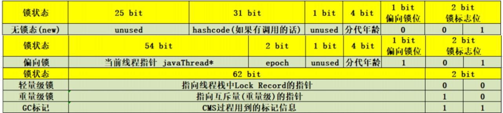
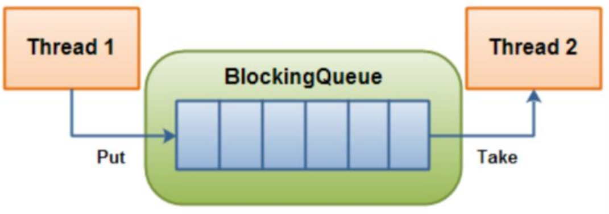

# JAVA学习笔记


[TOC]

## 一、Thread

### 1.基础线程机制


> 阻塞和等待的区别在于，阻塞是被动的，它是在等待获取一个排它锁。而等待是主动的，通过调用 Thread.sleep() 和 Object.wait() 等方法进入。

#### 线程使用方式

有三种使用线程的方法:

- 实现 Runnable 接口；
- 实现 Callable 接口；
- 继承 Thread 类。

实现 Runnable 和 Callable 接口的类只能当做一个可以在线程中运行的任务，不是真正意义上的线程，因此最后还需要通过 Thread 来调用。可以说任务是通过线程驱动从而执行的。


#### Executor

Executor 管理多个异步任务的执行，而无需程序员显式地管理线程的生命周期。这里的异步是指多个任务的执行互不干扰，不需要进行同步操作。

主要有三种 Executor:

- CachedThreadPool: 一个任务创建一个线程；
- FixedThreadPool: 所有任务只能使用固定大小的线程； 
- SingleThreadExecutor: 相当于大小为 1 的 FixedThreadPool。

```java
public static void main(String[] args) {
    ExecutorService executorService = Executors.newCachedThreadPool();
    for (int i = 0; i < 5; i++) {
        executorService.execute(new MyRunnable());
    }
    executorService.shutdown();
}
```

#### Daemon

守护线程是程序运行时在后台提供服务的线程，不属于程序中不可或缺的部分。

当所有非守护线程结束时，程序也就终止，同时会杀死所有守护线程。

main() 属于非守护线程。

使用 setDaemon() 方法将一个线程设置为守护线程。

```java
public static void main(String[] args) {
    Thread thread = new Thread(new MyRunnable());
    thread.setDaemon(true);
}
```

#### sleep()

Thread.sleep(millisec) 方法会休眠当前正在执行的线程，millisec 单位为毫秒。

sleep() 可能会抛出 InterruptedException，因为<mark>异常不能跨线程传播回 main() </mark>中，因此必须在本地进行处理。线程中抛出的其它异常也同样需要在本地进行处理

```java
public void run() {
    try {
        Thread.sleep(3000);
    } catch (InterruptedException e) {
        e.printStackTrace();
    }
}
```

#### yield()

对静态方法 Thread.yield() 的调用声明了当前线程已经完成了生命周期中最重要的部分，可以切换给其它线程来执行。该方法只是对线程调度器的一个建议，而且也只是建议具有相同优先级的其它线程可以运行。

```java
public void run() {
    Thread.yield();
}

```

#### 线程中断

一个线程执行完毕之后会自动结束，如果在运行过程中发生异常也会提前结束。

#### InterruptedException

通过调用一个线程的 interrupt() 来中断该线程，如果该线程处于阻塞、限期等待或者无限期等待状态，那么就会抛出 InterruptedException，从而提前结束该线程。但是<mark>不能中断 I/O 阻塞和 synchronized 锁阻塞。</mark>

#### Executor 的中断操作

调用 Executor 的 shutdown() 方法会等待线程都执行完毕之后再关闭，但是如果调用的是 shutdownNow() 方法，则相当于调用每个线程的 interrupt() 方法。

以下使用 Lambda 创建线程，相当于创建了一个匿名内部线程。

```java
public static void main(String[] args) {
    ExecutorService executorService = Executors.newCachedThreadPool();
    executorService.execute(() -> {
        try {
            Thread.sleep(2000);
            System.out.println("Thread run");
        } catch (InterruptedException e) {
            e.printStackTrace();
        }
    });
    executorService.shutdownNow();
    System.out.println("Main run");
}

```

```java
Main run
java.lang.InterruptedException: sleep interrupted
	at java.lang.Thread.sleep(Native Method)
	at com.aifurion.executor.ExecutorTest.lambda$main$0(ExecutorTest.java:20)
	at java.util.concurrent.ThreadPoolExecutor.runWorker(ThreadPoolExecutor.java:1142)
	at java.util.concurrent.ThreadPoolExecutor$Worker.run(ThreadPoolExecutor.java:617)
	at java.lang.Thread.run(Thread.java:748)
```

#### 线程互斥同步

#### synchronized

**1. 同步一个代码块**(<mark>作用于同一个对象</mark>)

```java
public void func() {
    synchronized (this) {
        // ...
    }
}
```

它只作用于同一个对象，如果调用两个对象上的同步代码块，就不会进行同步。

对于以下代码，使用 ExecutorService 执行了两个线程，由于调用的是同一个对象的同步代码块，因此这两个线程会进行同步，当一个线程进入同步语句块时，另一个线程就必须等待。

**2. 同步一个方法**(<mark>作用于同一个对象</mark>)

```java
public synchronized void func () {
    // ...
}
```

**3. 同步一个类**(<mark>作用于整个类</mark>)

```java
public void func() {
    synchronized (SynchronizedExample.class) {
        // ...
    }
}
```

作用于整个类，也就是说两个线程调用同一个类的不同对象上的这种同步语句，也会进行同步。

**4. 同步一个静态方法**(<mark>作用于整个类</mark>)

#### ReentrantLock

ReentrantLock 是 java.util.concurrent(J.U.C)包中的锁。

```java
public class LockExample {
    private Lock lock = new ReentrantLock();

    public void func() {
        lock.lock();
        try {
            for (int i = 0; i < 10; i++) {
                System.out.print(i + " ");
            }
        } finally {
            lock.unlock(); // 确保释放锁，从而避免发生死锁。
        }
    }
}
```

#### 比较

**1. 锁的实现**

synchronized 是 JVM 实现的，而 ReentrantLock 是 JDK 实现的。

**2. 性能**

新版本 Java 对 synchronized 进行了很多优化，例如自旋锁等，synchronized 与 ReentrantLock 大致相同。

**3. 等待可中断**

当持有锁的线程长期不释放锁的时候，正在等待的线程可以选择放弃等待，改为处理其他事情。

ReentrantLock 可中断，而 synchronized 不行。

**4. 公平锁**

公平锁是指多个线程在等待同一个锁时，必须按照申请锁的时间顺序来依次获得锁。

synchronized 中的锁是非公平的，ReentrantLock 默认情况下也是非公平的，但是也可以是公平的。

**5. 锁绑定多个条件**

一个 ReentrantLock 可以同时绑定多个 Condition 对象

#### 使用选择

除非需要使用 ReentrantLock 的高级功能，否则优先使用 synchronized。这是因为 synchronized 是 JVM 实现的一种锁机制，JVM 原生地支持它，而 ReentrantLock 不是所有的 JDK 版本都支持。并且使用 synchronized 不用担心没有释放锁而导致死锁问题，因为 JVM 会确保锁的释放。

#### 线程之间的协作

#### join()

在线程中调用另一个线程的 join() 方法，会将当前线程挂起，而不是忙等待，直到目标线程结束。

#### wait() notify() notifyAll()

调用 wait() 使得线程等待某个条件满足，线程在等待时会被挂起，当其他线程的运行使得这个条件满足时，其它线程会调用 notify() 或者 notifyAll() 来唤醒挂起的线程。

它们都属于 Object 的一部分，而不属于 Thread。

只能用在同步方法或者同步控制块中使用，否则会在运行时抛出 IllegalMonitorStateExeception。

使用 wait() 挂起期间，线程会释放锁。这是因为，如果没有释放锁，那么其它线程就无法进入对象的同步方法或者同步控制块中，那么就无法执行 notify() 或者 notifyAll() 来唤醒挂起的线程，造成死锁。

**wait() 和 sleep() 的区别**

- wait() 是 Object 的方法，而 sleep() 是 Thread 的静态方法；
- wait() 会释放锁，sleep() 不会。

#### await() signal() signalAll()

java.util.concurrent 类库中提供了 Condition 类来实现线程之间的协调，可以在 Condition 上调用 await() 方法使线程等待，其它线程调用 signal() 或 signalAll() 方法唤醒等待的线程。相比于 wait() 这种等待方式，await() 可以指定等待的条件，因此更加灵活。

```java
public class AwaitSignalExample {
    private Lock lock = new ReentrantLock();
    private Condition condition = lock.newCondition();

    public void before() {
        lock.lock();
        try {
            System.out.println("before");
            condition.signalAll();
        } finally {
            lock.unlock();
        }
    }

    public void after() {
        lock.lock();
        try {
            condition.await();
            System.out.println("after");
        } catch (InterruptedException e) {
            e.printStackTrace();
        } finally {
            lock.unlock();
        }
    }
}
```


### 2.线程安全

#### 2.1 线程安全

> 不是一个非真即假的命题
>
> 可以将共享数据按照安全程度的强弱顺序分成以下五类: 
>
> 不可变、绝对线程安全、相对线程安全、线程兼容和线程对立。

##### 2.1.1 不可变

不可变(Immutable)的对象一定是线程安全的，不需要再采取任何的线程安全保障措施。只要一个不可变的对象被正确地构建出来，永远也不会看到它在多个线程之中处于不一致的状态。

多线程环境下，应当尽量使对象成为不可变，来满足线程安全。

不可变的类型:

- final 关键字修饰的基本数据类型
- String
- 枚举类型
- Number 部分子类，如 Long 和 Double 等数值包装类型，BigInteger 和 BigDecimal 等大数据类型。但同为 Number 的原子类 AtomicInteger 和 AtomicLong 则是可变的。

#####  2.1.2  绝对线程安全

不管运行时环境如何，调用者都不需要任何额外的同步措施。

##### 2.1.3  相对线程安全

相对线程安全需要保证对这个对象单独的操作是线程安全的，在调用的时候不需要做额外的保障措施。但是对于一些特定顺序的连续调用，就可能需要在调用端使用额外的同步手段来保证调用的正确性。

在 Java 语言中，大部分的线程安全类都属于这种类型，例如 Vector、HashTable、Collections 的 synchronizedCollection() 方法包装的集合等。

> 对于下面的代码，如果删除元素的线程删除了 Vector 的一个元素，而获取元素的线程试图访问一个已经被删除的元素，那么就会抛出 ArrayIndexOutOfBoundsException。

```java
public class VectorUnsafeExample {
    private static Vector<Integer> vector = new Vector<>();

    public static void main(String[] args) {
        while (true) {
            for (int i = 0; i < 100; i++) {
                vector.add(i);
            }
            ExecutorService executorService = Executors.newCachedThreadPool();
            executorService.execute(() -> {
                for (int i = 0; i < vector.size(); i++) {
                    vector.remove(i);
                }
            });
            executorService.execute(() -> {
                for (int i = 0; i < vector.size(); i++) {
                    vector.get(i);
                }
            });
            executorService.shutdown();
        }
    }
}
```

```java
Exception in thread "Thread-159738" java.lang.ArrayIndexOutOfBoundsException: Array index out of range: 3
    at java.util.Vector.remove(Vector.java:831)
    at VectorUnsafeExample.lambda$main$0(VectorUnsafeExample.java:14)
    at VectorUnsafeExample$$Lambda$1/713338599.run(Unknown Source)
    at java.lang.Thread.run(Thread.java:745)
```

如果要保证上面的代码能正确执行下去，就需要对删除元素和获取元素的代码进行同步。

```java
executorService.execute(() -> {
    synchronized (vector) {
        for (int i = 0; i < vector.size(); i++) {
            vector.remove(i);
        }
    }
});
executorService.execute(() -> {
    synchronized (vector) {
        for (int i = 0; i < vector.size(); i++) {
            vector.get(i);
        }
    }
});

```

#####  2.1.4 线程兼容

线程兼容是指对象本身并不是线程安全的，但是可以通过在调用端正确地使用同步手段来保证对象在并发环境中可以安全地使用，我们平常说一个类不是线程安全的，绝大多数时候指的是这一种情况。Java API 中大部分的类都是属于线程兼容的，如与前面的 Vector 和 HashTable 相对应的集合类 ArrayList 和 HashMap 等。

##### 2.1.5 线程对立

线程对立是指无论调用端是否采取了同步措施，都无法在多线程环境中并发使用的代码。由于 Java 语言天生就具备多线程特性，线程对立这种排斥多线程的代码是很少出现的，而且通常都是有害的，应当尽量避免。

#### 2.2线程安全的实现方法

##### 2.2.1 互斥同步

synchronized 和 ReentrantLock。

##### 2.2.2非阻塞同步

互斥同步最主要的问题就是线程阻塞和唤醒所带来的性能问题，因此这种同步也称为阻塞同步。

互斥同步属于一种悲观的并发策略，总是认为只要不去做正确的同步措施，那就肯定会出现问题。无论共享数据是否真的会出现竞争，它都要进行加锁(这里讨论的是概念模型，实际上虚拟机会优化掉很大一部分不必要的加锁)、用户态核心态转换、维护锁计数器和检查是否有被阻塞的线程需要唤醒等操作。

**(一)CAS**

随着硬件指令集的发展，我们可以使用基于冲突检测的乐观并发策略: 先进行操作，<mark>如果没有其它线程争用共享数据，那操作就成功了，否则采取补偿措施(不断地重试，直到成功为止)</mark>。这种乐观的并发策略的许多实现都不需要将线程阻塞，因此这种同步操作称为非阻塞同步。

<mark>乐观锁需要操作和冲突检测这两个步骤具备原子性，这里就不能再使用互斥同步来保证了，只能靠硬件来完成。</mark>

硬件支持的原子性操作最典型的是: 比较并交换(Compare-and-Swap，CAS)。CAS 指令需要有 3 个操作数，分别是内存地址 V、旧的预期值 A 和新值 B。当执行操作时，只有当 V 的值等于 A，才将 V 的值更新为 B。

**(二)AtomicInteger**

J.U.C 包里面的整数原子类 AtomicInteger，其中的 compareAndSet() 和 getAndIncrement() 等方法都使用了 Unsafe 类的 CAS 操作。

以下代码使用了 AtomicInteger 执行了自增的操作。

```java
private AtomicInteger cnt = new AtomicInteger();

public void add() {
    cnt.incrementAndGet();
}
```

以下代码是 incrementAndGet() 的源码，它调用了 unsafe 的 getAndAddInt() 。

```java
public final int incrementAndGet() {
    return unsafe.getAndAddInt(this, valueOffset, 1) + 1;
}
```

>以下代码是 getAndAddInt() 源码，var1 指示对象内存地址，var2 指示该字段相对对象内存地址的偏移，var4 指示操作需要加的数值，这里为 1。通过 getIntVolatile(var1, var2) 得到旧的预期值，通过调用 compareAndSwapInt() 来进行 CAS 比较，如果该字段内存地址中的值等于 var5，那么就更新内存地址为 var1+var2 的变量为 var5+var4。

可以看到 getAndAddInt() 在一个循环中进行，发生冲突的做法是不断的进行重试。

```java
public final int getAndAddInt(Object var1, long var2, int var4) {
    int var5;
    do {
        var5 = this.getIntVolatile(var1, var2);
    } while(!this.compareAndSwapInt(var1, var2, var5, var5 + var4));

    return var5;
}
```

**(三)ABA**

如果一个变量初次读取的时候是 A 值，它的值被改成了 B，后来又被改回为 A，那 CAS 操作就会误认为它从来没有被改变过。

J.U.C 包提供了一个带有标记的原子引用类 AtomicStampedReference 来解决这个问题，它可以通过控制变量值的版本来保证 CAS 的正确性。大部分情况下 ABA 问题不会影响程序并发的正确性，如果需要解决 ABA 问题，改用传统的互斥同步可能会比原子类更高效。

##### 2.2.3无同步方案

要保证线程安全，并不是一定就要进行同步。如果一个方法本来就不涉及共享数据，那它自然就无须任何同步措施去保证正确性。

**(一)栈封闭**

多个线程访问同一个方法的局部变量时，不会出现线程安全问题，因为局部变量存储在虚拟机栈中，属于线程私有的。

```java
import java.util.concurrent.ExecutorService;
import java.util.concurrent.Executors;

public class StackClosedExample {
    public void add100() {
        int cnt = 0;
        for (int i = 0; i < 100; i++) {
            cnt++;
        }
        System.out.println(cnt);
    }
    
    public static void main(String[] args) {
        StackClosedExample example = new StackClosedExample();
        ExecutorService executorService = Executors.newCachedThreadPool();
        executorService.execute(() -> example.add100());
        executorService.execute(() -> example.add100());
        executorService.shutdown();
    }    
    
}

//100
//100
```

**(二)线程本地存储(Thread Local Storage)**

如果一段代码中所需要的数据必须与其他代码共享，那就看看这些共享数据的代码是否能保证在同一个线程中执行。如果能保证，我们就可以把共享数据的可见范围限制在同一个线程之内，这样，无须同步也能保证线程之间不出现数据争用的问题。

符合这种特点的应用并不少见，大部分使用消费队列的架构模式(如“生产者-消费者”模式)都会将产品的消费过程尽量在一个线程中消费完。其中最重要的一个应用实例就是经典 Web 交互模型中的“一个请求对应一个服务器线程”(Thread-per-Request)的处理方式，这种处理方式的广泛应用使得很多 Web 服务端应用都可以使用线程本地存储来解决线程安全问题。

可以使用 java.lang.ThreadLocal 类来实现线程本地存储功能。

对于以下代码，thread1 中设置 threadLocal 为 1，而 thread2 设置 threadLocal 为 2。过了一段时间之后，thread1 读取 threadLocal 依然是 1，不受 thread2 的影响。

```java
public class ThreadLocalExample {
    public static void main(String[] args) {
        ThreadLocal threadLocal = new ThreadLocal();
        Thread thread1 = new Thread(() -> {
            threadLocal.set(1);
            try {
                Thread.sleep(1000);
            } catch (InterruptedException e) {
                e.printStackTrace();
            }
            System.out.println(threadLocal.get());
            threadLocal.remove();
        });
        Thread thread2 = new Thread(() -> {
            threadLocal.set(2);
            threadLocal.remove();
        });
        thread1.start();
        thread2.start();
    }
}

// 1
```

为了理解 ThreadLocal，先看以下代码:

```java
public class ThreadLocalExample1 {
    public static void main(String[] args) {
        ThreadLocal threadLocal1 = new ThreadLocal();
        ThreadLocal threadLocal2 = new ThreadLocal();
        Thread thread1 = new Thread(() -> {
            threadLocal1.set(1);
            threadLocal2.set(1);
        });
        Thread thread2 = new Thread(() -> {
            threadLocal1.set(2);
            threadLocal2.set(2);
        });
        thread1.start();
        thread2.start();
    }
}
```

底层结构为：


每个 Thread 都有一个 ThreadLocal.ThreadLocalMap 对象，Thread 类中就定义了 ThreadLocal.ThreadLocalMap 成员。

```java
/* ThreadLocal values pertaining to this thread. This map is maintained
 * by the ThreadLocal class. */
ThreadLocal.ThreadLocalMap threadLocals = null;

```

当调用一个 ThreadLocal 的 set(T value) 方法时，先得到当前线程的 ThreadLocalMap 对象，然后将 ThreadLocal->value 键值对插入到该 Map 中。

```java
public void set(T value) {
    Thread t = Thread.currentThread();
    ThreadLocalMap map = getMap(t);
    if (map != null)
        map.set(this, value);
    else
        createMap(t, value);
}

```

get方法类似

```java
public T get() {
    Thread t = Thread.currentThread();
    ThreadLocalMap map = getMap(t);
    if (map != null) {
        ThreadLocalMap.Entry e = map.getEntry(this);
        if (e != null) {
            @SuppressWarnings("unchecked")
            T result = (T)e.value;
            return result;
        }
    }
    return setInitialValue();
}

```

ThreadLocal 从理论上讲并不是用来解决多线程并发问题的，因为根本不存在多线程竞争。

**(三)可重入代码(Reentrant Code)**

这种代码也叫做纯代码(Pure Code)，可以在代码执行的任何时刻中断它，转而去执行另外一段代码(包括递归调用它本身)，而在控制权返回后，原来的程序不会出现任何错误。

可重入代码有一些共同的特征，例如不依赖存储在堆上的数据和公用的系统资源、用到的状态量都由参数中传入、不调用非可重入的方法等。


### 3.Synchronized


#### 3.1 synchronized

- Synchronized可以作用在哪里? 分别通过对象锁和类锁进行举例。
- Synchronized本质上是通过什么保证线程安全的? 分三个方面回答：加锁和释放锁的原理，可重入原理，保证可见性原理。
- Synchronized由什么样的缺陷?  Java Lock是怎么弥补这些缺陷的。
- Synchronized和Lock的对比，和选择?
- Synchronized在使用时有何注意事项?
- Synchronized修饰的方法在抛出异常时,会释放锁吗?
- 多个线程等待同一个snchronized锁的时候，JVM如何选择下一个获取锁的线程?
- Synchronized使得同时只有一个线程可以执行，性能比较差，有什么提升的方法?
- 我想更加灵活地控制锁的释放和获取(现在释放锁和获取锁的时机都被规定死了)，怎么办?
- 什么是锁的升级和降级? 什么是JVM里的偏斜锁、轻量级锁、重量级锁?
- 不同的JDK中对Synchronized有何优化?

#### 3.2 Synchronized的使用

在应用Sychronized关键字时需要把握如下注意点：

- 一把锁只能同时被一个线程获取，没有获得锁的线程只能等待；
- 每个实例都对应有自己的一把锁(this),不同实例之间互不影响；例外：锁对象是*.class以及synchronized修饰的是static方法的时候，所有对象公用同一把锁
- synchronized修饰的方法，无论方法正常执行完毕还是抛出异常，都会释放锁

**对象锁**

代码块形式：手动指定锁定对象，也可是是this,也可以是自定义的锁

**类锁**

指synchronize修饰静态的方法或指定锁对象为Class对象

##### 3.2.1 Synchronized原理分析

**加锁和释放锁的原理**

```java
public class SynchronizedDemo2 {
    Object object = new Object();
    public void method1() {
        synchronized (object) {
        }
    }
}
```

字节码：

```
 0 aload_0
 1 getfield #3 <com/aifurion/sync/TestSync.object : Ljava/lang/Object;>
 4 dup
 5 astore_1
 6 monitorenter
 7 aload_1
 8 monitorexit
 9 goto 17 (+8)
12 astore_2
13 aload_1
14 monitorexit
15 aload_2
16 athrow
17 return
```

每个对象都与一个监视器相关联。当且仅当监视器有所有者时，它才会被锁定。执行*monitorenter*的线程尝试获得与*objectref*关联的监视器的所有权，如下所示：

- 如果与*objectref*关联的监视器的条目计数为零，则线程进入监视器并将其条目计数设置为 1。该线程然后是监视器的所有者。
- 如果线程已经拥有与*objectref*关联的监视器 ，它会重新进入监视器，增加其条目计数。
- 如果另一个线程已经拥有与*objectref*关联的监视器 ，线程会阻塞，直到监视器的条目计数为零，然后再次尝试获得所有权。

`monitorexit指令`：释放对于monitor的所有权，释放过程很简单，就是讲monitor的计数器减1，如果减完以后，计数器不是0，则代表刚才是重入进来的，当前线程还继续持有这把锁的所有权，如果计数器变成0，则代表当前线程不再拥有该monitor的所有权，即释放锁。

下图表现了对象，对象监视器，同步队列以及执行线程状态之间的关系：


该图可以看出，任意线程对Object的访问，首先要获得Object的监视器，如果获取失败，该线程就进入同步状态，线程状态变为BLOCKED，当Object的监视器占有者释放后，在同步队列中得线程就会有机会重新获取该监视器

##### 3.2.2 可重入原理：加锁次数计数器

上面的demo中在执行完同步代码块之后紧接着再会去执行一个静态同步方法，而这个方法锁的对象依然就这个类对象，那么这个正在执行的线程还需要获取该锁吗? 

答案是不必的，从上图中就可以看出来，执行静态同步方法的时候就只有一条monitorexit指令，并没有monitorenter获取锁的指令。这就是锁的重入性，即在同一锁程中，线程不需要再次获取同一把锁。

Synchronized先天具有重入性。每个对象拥有一个计数器，当线程获取该对象锁后，计数器就会加一，释放锁后就会将计数器减一。

##### 3.2.3 保证可见性的原理：内存模型和happens-before规则

Synchronized的happens-before规则，即监视器锁规则：对同一个监视器的解锁，happens-before于对该监视器的加锁。继续来看代码：

```java
public class MonitorDemo {
    private int a = 0;
    public synchronized void writer() {     // 1
        a++;                                // 2
    }                                       // 3

    public synchronized void reader() {    // 4
        int i = a;                         // 5
    }                                      // 6
}
```

该代码的happens-before关系如图所示：


在图中每一个箭头连接的两个节点就代表之间的happens-before关系，黑色的是通过程序顺序规则推导出来，<mark>红色的为监视器锁规则推导而出</mark>：线程A释放锁happens-before线程B加锁，<mark>蓝色的则是通过程序顺序规则和监视器锁规则推测出来happens-befor关系</mark>，通过传递性规则进一步推导的happens-before关系。现在我们来重点关注2 happens-before 5，通过这个关系我们可以得出什么?

根据happens-before的定义中的一条:<mark>如果A happens-before B，则A的执行结果对B可见，并且A的执行顺序先于B。</mark>线程A先对共享变量A进行加一，由2 happens-before 5关系可知线程A的执行结果对线程B可见即线程B所读取到的a的值为1。

#### 3.3 JVM中锁的优化

简单来说在JVM中monitorenter和monitorexit字节码依赖于底层的操作系统的Mutex Lock来实现的，但是由于使用Mutex Lock需要将当前线程挂起并从用户态切换到内核态来执行，这种切换的代价是非常昂贵的；然而在现实中的大部分情况下，同步方法是运行在单线程环境(无锁竞争环境)如果每次都调用Mutex Lock那么将严重的影响程序的性能。**不过在jdk1.6中对锁的实现引入了大量的优化，如锁粗化(Lock Coarsening)、锁消除(Lock Elimination)、轻量级锁(Lightweight Locking)、偏向锁(Biased Locking)、适应性自旋(Adaptive Spinning)等技术来减少锁操作的开销**。

- `锁粗化(Lock Coarsening)`：也就是减少不必要的紧连在一起的unlock，lock操作，将多个连续的锁扩展成一个范围更大的锁。
- `锁消除(Lock Elimination)`：通过运行时JIT编译器的逃逸分析来消除一些没有在当前同步块以外被其他线程共享的数据的锁保护，通过逃逸分析也可以在线程本地Stack上进行对象空间的分配(同时还可以减少Heap上的垃圾收集开销)。
- `轻量级锁(Lightweight Locking)`：这种锁实现的背后基于这样一种假设，即在真实的情况下我们程序中的大部分同步代码一般都处于无锁竞争状态(即单线程执行环境)，在无锁竞争的情况下完全可以避免调用操作系统层面的重量级互斥锁，取而代之的是在monitorenter和monitorexit中只需要依靠一条CAS原子指令就可以完成锁的获取及释放。当存在锁竞争的情况下，执行CAS指令失败的线程将调用操作系统互斥锁进入到阻塞状态，当锁被释放的时候被唤醒(具体处理步骤下面详细讨论)。
- `偏向锁(Biased Locking)`：是为了在无锁竞争的情况下避免在锁获取过程中执行不必要的CAS原子指令，因为CAS原子指令虽然相对于重量级锁来说开销比较小但还是存在非常可观的本地延迟。
- `适应性自旋(Adaptive Spinning)`：当线程在获取轻量级锁的过程中执行CAS操作失败时，在进入与monitor相关联的操作系统重量级锁(mutex semaphore)前会进入忙等待(Spinning)然后再次尝试，当尝试一定的次数后如果仍然没有成功则调用与该monitor关联的semaphore(即互斥锁)进入到阻塞状态

#### 3.4 锁的类型

在Java SE 1.6里Synchronied同步锁，一共有四种状态：`无锁`、`偏向锁`、`轻量级锁`、`重量级锁`，它会随着竞争情况逐渐升级。锁可以升级但是不可以降级，目的是为了提供获取锁和释放锁的效率。

> 锁膨胀方向： 无锁 → 偏向锁 → 轻量级锁 → 重量级锁 (此过程是不可逆的)

##### 3.4.1 自旋锁与自适应自旋锁

###### 自旋锁

> 引入背景：大家都知道，在没有加入锁优化时，Synchronized是一个非常“胖大”的家伙。在多线程竞争锁时，当一个线程获取锁时，它会阻塞所有正在竞争的线程，这样对性能带来了极大的影响。在挂起线程和恢复线程的操作都需要转入内核态中完成，这些操作对系统的并发性能带来了很大的压力。同时HotSpot团队注意到在很多情况下，共享数据的锁定状态只会持续很短的一段时间，为了这段时间去挂起和回复阻塞线程并不值得。在如今多处理器环境下，完全可以让另一个没有获取到锁的线程在门外等待一会(自旋)，但不放弃CPU的执行时间。等待持有锁的线程是否很快就会释放锁。为了让线程等待，我们只需要让线程执行一个忙循环(自旋)，这便是自旋锁由来的原因。

自旋锁早在JDK1.4 中就引入了，只是当时默认时关闭的。在JDK 1.6后默认为开启状态。自旋锁本质上与阻塞并不相同，先不考虑其对多处理器的要求，如果锁占用的时间非常的短，那么自旋锁的性能会非常的好，相反，其会带来更多的性能开销(因为在线程自旋时，始终会占用CPU的时间片，如果锁占用的时间太长，那么自旋的线程会白白消耗掉CPU资源)。因此自旋等待的时间必须要有一定的限度，如果自选超过了限定的次数仍然没有成功获取到锁，就应该使用传统的方式去挂起线程了，在JDK定义中，自旋锁默认的自旋次数为10次，用户可以使用参数`-XX:PreBlockSpin`来更改。

> 可是现在又出现了一个问题：如果线程锁在线程自旋刚结束就释放掉了锁，那么是不是有点得不偿失。所以这时候我们需要更加聪明的锁来实现更加灵活的自旋。来提高并发的性能。(这里则需要自适应自旋锁！)

###### 自适应自旋锁

在JDK 1.6中引入了自适应自旋锁。这就意味着自旋的时间不再固定了，而是由<mark>前一次在同一个锁上的自旋时间及锁的拥有者的状态来决定的</mark>。

如果在同一个锁对象上，自旋等待刚刚成功获取过锁，并且持有锁的线程正在运行中，那么JVM会认为该锁自旋获取到锁的可能性很大，会自动增加等待时间。比如增加到100此循环。相反，如果对于某个锁，自旋很少成功获取锁。那再以后要获取这个锁时将可能省略掉自旋过程，以避免浪费处理器资源。有了自适应自旋，JVM对程序的锁的状态预测会越来越准备，JVM也会越来越聪明。

###### 锁消除

锁消除时指虚拟机即时编译器再运行时，对一些代码上要求同步，但是被检测到不可能存在共享数据竞争的锁进行消除。锁消除的主要判定依据来源于<mark>逃逸分析</mark>的数据支持。意思就是：JVM会判断再一段程序中的同步明显不会逃逸出去从而被其他线程访问到，那JVM就把它们当作栈上(线程私有)数据对待，认为这些数据时线程独有的，不需要加同步。此时就会进行锁消除。

当然在实际开发中，我们很清楚的知道那些地方时线程独有的，不需要加同步锁，但是在Java API中有很多方法都是加了同步的，那么此时JVM会判断这段代码是否需要加锁。如果数据并不会逃逸，则会进行锁消除。比如如下操作：在操作String类型数据时，由于String是一个不可变类，对字符串的连接操作总是通过生成的新的String对象来进行的。因此Javac编译器会对String连接做自动优化。在JDK 1.5之前会使用StringBuffer对象的连续append()操作，在JDK 1.5及以后的版本中，会转化为StringBuidler对象的连续append()操作。[String详解](../String/String.md)

```java
public static String test(String s1, String s2, String s3) {
    String s = s1 + s2 + s3;
    return s;
}
```

```
 0 new #2 <java/lang/StringBuilder>
 3 dup
 4 invokespecial #3 <java/lang/StringBuilder.<init> : ()V>
 7 aload_0
 8 invokevirtual #4 <java/lang/StringBuilder.append : (Ljava/lang/String;)Ljava/lang/StringBuilder;>
11 aload_1
12 invokevirtual #4 <java/lang/StringBuilder.append : (Ljava/lang/String;)Ljava/lang/StringBuilder;>
15 aload_2
16 invokevirtual #4 <java/lang/StringBuilder.append : (Ljava/lang/String;)Ljava/lang/StringBuilder;>
19 invokevirtual #5 <java/lang/StringBuilder.toString : ()Ljava/lang/String;>
22 astore_3
23 aload_3
24 areturn
```

><java/lang/StringBuilder.append : (Ljava/lang/String;)Ljava/lang/StringBuilder;>
>
><java/lang/StringBuilder.append		方法名
>
>(Ljava/lang/String;)							参数列表
>
>Ljava/lang/StringBuilder;>				返回值类型

众所周知，StringBuilder不是安全同步的，但是在上述代码中，JVM判断该段代码并不会逃逸，则将该代码带默认为线程独有的资源，并不需要同步，所以执行了锁消除操作。(还有Vector中的各种操作也可实现锁消除。在没有逃逸出数据安全防卫内)

###### 锁粗化

原则上，我们都知道在加同步锁时，尽可能的将同步块的作用范围限制到尽量小的范围(只在共享数据的实际作用域中才进行同步，这样是为了使得需要同步的操作数量尽可能变小。在存在锁同步竞争中，也可以使得等待锁的线程尽早的拿到锁)。

大部分上述情况是完美正确的，但是如果存在连串的一系列操作都对同一个对象反复加锁和解锁，甚至加锁操作时出现在循环体中的，那即使没有线程竞争，频繁地进行互斥同步操作也会导致不必要地性能操作。

这里贴上根据上述Javap 编译地情况编写地实例java类

```java
public static String test(String s1, String s2, String s3) {
    StringBuffer sb = new StringBuffer();
    sb.append(s1);
    sb.append(s2);
    sb.append(s3);
    return sb.toString();
}

```

在上述地连续append()操作中就属于这类情况。JVM会检测到这样一连串地操作都是对同一个对象加锁，那么JVM会将加锁同步地范围扩展(粗化)到整个一系列操作的 外部，使整个一连串地append()操作只需要加锁一次就可以了。

##### 3.4.2 轻量级锁

在JDK 1.6之后引入的轻量级锁，需要注意的是轻量级锁并不是替代重量级锁的，而是对在大多数情况下同步块并不会有竞争出现提出的一种优化。它可以减少重量级锁对线程的阻塞带来地线程开销。从而提高并发性能。

如果要理解轻量级锁，那么必须先要了解HotSpot虚拟机中对象头地内存布局。上面介绍Java对象头也详细介绍过。在对象头中(`Object Header`)存在两部分。第一部分用于存储对象自身的运行时数据，`HashCode`、`GC Age`、`锁标记位`、`是否为偏向锁`。等。一般为32位或者64位(视操作系统位数定)。官方称之为`Mark Word`，它是实现轻量级锁和偏向锁的关键。 另外一部分存储的是指向方法区对象类型数据的指针(`Klass Point`)，如果对象是数组的话，还会有一个额外的部分用于存储数据的长度。

###### 轻量级锁加锁

在线程执行同步块之前，JVM会先在当前线程的栈帧中创建一个名为锁记录(`Lock Record`)的空间，用于存储锁对象目前的`Mark Word`的拷贝(JVM会将对象头中的`Mark Word`拷贝到锁记录中，官方称为`Displaced Mark Ward`)这个时候线程堆栈与对象头的状态如图：



如上图所示：如果当前对象没有被锁定，那么锁标志位位01状态，JVM在执行当前线程时，首先会在当前线程栈帧中创建锁记录`Lock Record`的空间用于存储锁对象目前的`Mark Word`的拷贝。

 然后，虚拟机使用CAS操作将标记字段Mark Word拷贝到锁记录中，并且将`Mark Word`更新为指向`Lock Record`的指针。如果更新成功了，那么这个线程就有用了该对象的锁，并且对象Mark Word的锁标志位更新为(`Mark Word`中最后的2bit)00，即表示此对象处于轻量级锁定状态，如图：


如果这个更新操作失败，JVM会检查当前的`Mark Word`中是否存在指向当前线程的栈帧的指针，如果有，说明该锁已经被获取，可以直接调用。如果没有，则说明该锁被其他线程抢占了，如果有两条以上的线程竞争同一个锁，那轻量级锁就不再有效，直接膨胀位重量级锁，没有获得锁的线程会被阻塞。此时，锁的标志位为`10.Mark Word`中存储的时指向重量级锁的指针。

轻量级解锁时，会使用原子的CAS操作将`Displaced Mark Word`替换回到对象头中，如果成功，则表示没有发生竞争关系。如果失败，表示当前锁存在竞争关系。锁就会膨胀成重量级锁。两个线程同时争夺锁，导致锁膨胀的流程图如下：


##### 3.4.3 偏向锁

> 引入背景：在大多实际环境下，锁不仅不存在多线程竞争，而且总是由同一个线程多次获取，那么在同一个线程反复获取所释放锁中，其中并还没有锁的竞争，那么这样看上去，多次的获取锁和释放锁带来了很多不必要的性能开销和上下文切换。

为了解决这一问题，HotSpot的作者在Java SE 1.6 中对Synchronized进行了优化，引入了偏向锁。当一个线程访问同步快并获取锁时，会在对象头和栈帧中的锁记录里存储锁偏向的线程ID，以后该线程在进入和推出同步块时不需要进行CAS操作来加锁和解锁。只需要简单地测试一下对象头的`Mark Word`里是否存储着指向当前线程的偏向锁。如果成功，表示线程已经获取到了锁。


######  偏向锁的撤销

偏向锁使用了一种等待竞争出现才会释放锁的机制。所以当其他线程尝试获取偏向锁时，持有偏向锁的线程才会释放锁。但是偏向锁的撤销需要等到全局安全点(就是当前线程没有正在执行的字节码)。它会首先暂停拥有偏向锁的线程，让你后检查持有偏向锁的线程是否活着。如果线程不处于活动状态，直接将对象头设置为无锁状态。如果线程活着，JVM会遍历栈帧中的锁记录，栈帧中的锁记录和对象头要么偏向于其他线程，要么恢复到无锁状态或者标记对象不适合作为偏向锁。


**锁的优缺点对比**

| **锁**   | **优点**                                                     | **缺点**                                                     | **使用场景**                       |
| -------- | ------------------------------------------------------------ | ------------------------------------------------------------ | ---------------------------------- |
| 偏向锁   | 加锁和解锁不需要CAS操作，没有额外的性能消耗，和执行非同步方法相比仅存在纳秒级的差距 | 如果线程间存在锁竞争，会带来额外的锁撤销的消耗               | 适用于只有一个线程访问同步快的场景 |
| 轻量级锁 | 竞争的线程不会阻塞，提高了响应速度                           | 如线程成始终得不到锁竞争的线程，使用自旋会消耗CPU性能        | 追求响应时间，同步快执行速度非常快 |
| 重量级锁 | 线程竞争不适用自旋，不会消耗CPU                              | 线程阻塞，响应时间缓慢，在多线程下，频繁的获取释放锁，会带来巨大的性能消耗 | 追求吞吐量，同步快执行速度较长     |


##### 3.4.4读写锁

1. 在线程持有读锁的情况下，该线程不能取得写锁(因为获取写锁的时候，如果发现当前的读锁被占用，就马上获取失败，不管读锁是不是被当前线程持有。
2. 在线程持有写锁的情况下，该线程可以继续获取读锁（获取读锁时如果发现写锁被占用，只有写锁没有被当前线程占用的情况才会获取失败）。

原因: 当线程获取读锁的时候，可能有其他线程同时也在持有读锁，因此不能把获取读锁的线程“升级”为写锁；==**而对于获得写锁的线程，它一定独占了读写锁，因此可以继续让它获取读锁，当它同时获取了写锁和读锁后，还可以先释放写锁继续持有读锁，这样一个写锁就“降级”为了读锁**==。


#### 3.5 Synchronized与Lock

##### synchronized的缺陷

- `效率低`：锁的释放情况少，只有代码执行完毕或者异常结束才会释放锁；试图获取锁的时候不能设定超时，不能中断一个正在使用锁的线程，相对而言，Lock可以中断和设置超时
- `不够灵活`：加锁和释放的时机单一，每个锁仅有一个单一的条件(某个对象)，相对而言，读写锁更加灵活
- `无法知道是否成功获得锁`，相对而言，Lock可以拿到状态，如果成功获取锁，....，如果获取失败

##### Lock解决相应问题

Lock类这里不做过多解释，主要看里面的4个方法:

- `lock()`: 加锁
- `unlock()`: 解锁
- `tryLock()`: 尝试获取锁，返回一个boolean值
- `tryLock(long,TimeUtil)`: 尝试获取锁，可以设置超时

Synchronized只有锁只与一个条件(是否获取锁)相关联，不灵活，后来`Condition与Lock的结合`解决了这个问题。

多线程竞争一个锁时，其余未得到锁的线程只能不停的尝试获得锁，而不能中断。高并发的情况下会导致性能下降。ReentrantLock的lockInterruptibly()方法可以优先考虑响应中断。 一个线程等待时间过长，它可以中断自己，然后ReentrantLock响应这个中断，不再让这个线程继续等待。有了这个机制，使用ReentrantLock时就不会像synchronized那样产生死锁了。

##### 再深入理解

synchronized是通过软件(JVM)实现的，简单易用，即使在JDK5之后有了Lock，仍然被广泛地使用。

- **使用Synchronized有哪些要注意的？**
  - 锁对象不能为空，因为锁的信息都保存在对象头里
  - 作用域不宜过大，影响程序执行的速度，控制范围过大，编写代码也容易出错
  - 避免死锁
  - 在能选择的情况下，既不要用Lock也不要用synchronized关键字，用java.util.concurrent包中的各种各样的类，如果不用该包下的类，在满足业务的情况下，可以使用synchronized关键，因为代码量少，避免出错
- **synchronized是公平锁吗？**

synchronized实际上是非公平的，新来的线程有可能立即获得监视器，而在等待区中等候已久的线程可能再次等待，不过这种抢占的方式可以预防饥饿。


### 4.volatile

- volatile关键字的作用是什么?
- volatile能保证原子性吗?
- 之前32位机器上共享的long和double变量的为什么要用volatile? 现在64位机器上是否也要设置呢?
- i++为什么不能保证原子性?
- volatile是如何实现可见性的?  内存屏障。
- volatile是如何实现有序性的?  happens-before等
- 说下volatile的应用场景?

#### 4.1 volatile的作用详解

##### 4.1.1防重排序

在并发环境下的单例实现方式，我们通常可以采用双重检查加锁(DCL)的方式来实现。其源码如下：

```java
public class Singleton {
    public static volatile Singleton singleton;
    /**
     * 构造函数私有，禁止外部实例化
     */
    private Singleton() {};
    public static Singleton getInstance() {
        if (singleton == null) {
            synchronized (singleton.class) {
                if (singleton == null) {
                    singleton = new Singleton();
                }
            }
        }
        return singleton;
    }
}
```

现在我们分析一下为什么要在变量singleton之间加上volatile关键字。要理解这个问题，先要了解对象的构造过程，实例化一个对象其实可以分为三个步骤：

- 分配内存空间。
- 初始化对象。
- 将内存空间的地址赋值给对应的引用。

但是由于操作系统可以`对指令进行重排序`，所以上面的过程也可能会变成如下过程：

- 分配内存空间。
- 将内存空间的地址赋值给对应的引用。
- 初始化对象

如果是这个流程，多线程环境下就可能将一个未初始化的对象引用暴露出来，从而导致不可预料的结果。因此，为了防止这个过程的重排序，我们需要将变量设置为volatile类型的变量。

##### 4.1.2实现可见性

内存可见性是指当一个线程修改了某个变量的值，其它线程总是能知道这个变量变化。也就是说，如果线程 A 修改了共享变量 V 的值，那么线程 B 在使用 V 的值时，能立即读到 V 的最新值。

> 可见性解决方案：
>
> - 加锁
>
> 为什么加锁后就保证了变量的内存可见性了？ 因为当一个线程进入 synchronized代码块后，线程获取到锁，会清空本地内存，然后从主内存中拷贝共享变量的最新值到本地内存作为副本，执行代码，又将修改后的副本值刷新到主内存中，最后线程释放锁。
>
> - volatile
>
> 使用 volatile 修饰共享变量后，每个线程要操作变量时会从主内存中将变量拷贝到本地内存作为副本，当线程操作变量副本并写回主内存后，会通过 **CPU 总线嗅探机制**告知其他线程该变量副本已经失效，需要重新从主内存中读取
>
> - final
>
> final的可见性是指被final修饰的字段在构造器中一旦被初始化完成，那么其它线程中就能看见这个final字段了。

可见性问题主要指一个线程修改了共享变量值，而另一个线程却看不到。引起可见性问题的主要原因是每个线程拥有自己的一个高速缓存区——线程工作内存。volatile关键字能有效的解决这个问题，我们看下下面的例子，就可以知道其作用：

```java
public class VolatileTest {
    int a = 1;
    int b = 2;

    public void change(){
        a = 3;
        b = a;
    }

    public void print(){
        System.out.println("b="+b+";a="+a);
    }

    public static void main(String[] args) {
        while (true){
            final VolatileTest test = new VolatileTest();
            new Thread(new Runnable() {
                @Override
                public void run() {
                    try {
                        Thread.sleep(10);
                    } catch (InterruptedException e) {
                        e.printStackTrace();
                    }
                    test.change();
                }
            }).start();
            new Thread(new Runnable() {
                @Override
                public void run() {
                    try {
                        Thread.sleep(10);
                    } catch (InterruptedException e) {
                        e.printStackTrace();
                    }
                    test.print();
                }
            }).start();
        }
    }
}
```

直观上说，这段代码的结果只可能有两种：b=3;a=3 或 b=2;a=1。不过运行上面的代码(可能时间上要长一点)，你会发现除了上两种结果之外，还出现了第三种结果：

```
...... 
b=2;a=1
b=2;a=1
b=3;a=3
b=3;a=3
b=3;a=1 // 这里
b=3;a=3
b=2;a=1
b=3;a=3
b=3;a=3
......

```

为什么会出现b=3;a=1这种结果呢? 正常情况下，如果先执行change方法，再执行print方法，输出结果应该为b=3;a=3。相反，如果先执行的print方法，再执行change方法，结果应该是 b=2;a=1。那b=3;a=1的结果是怎么出来的? 原因就是第一个线程将值a=3修改后，但是对第二个线程是不可见的，所以才出现这一结果。如果将a和b都改成volatile类型的变量再执行，则再也不会出现b=3;a=1的结果了。

##### 4.1.3 保证原子性:单次读/写

volatile不能保证完全的原子性，只能保证单次的读/写操作具有原子性。

##### 问题1： i++为什么不能保证原子性?

对volatile变量的单次读/写操作可以保证原子性的，如long和double类型变量，但是并不能保证i++这种操作的原子性，因为本质上i++是读、写两次操作。

```java
public class VolatileTest01 {
    volatile int i;

    public void addI(){
        i++;
    }

    public static void main(String[] args) throws InterruptedException {
        final  VolatileTest01 test01 = new VolatileTest01();
        for (int n = 0; n < 1000; n++) {
            new Thread(new Runnable() {
                @Override
                public void run() {
                    try {
                        Thread.sleep(10);
                    } catch (InterruptedException e) {
                        e.printStackTrace();
                    }
                    test01.addI();
                }
            }).start();
        }
        Thread.sleep(10000);//等待10秒，保证上面程序执行完成
        System.out.println(test01.i);
    }
}
```

大家可能会误认为对变量i加上关键字volatile后，这段程序就是线程安全的。大家可以尝试运行上面的程序。下面是我本地运行的结果：981 可能每个人运行的结果不相同。不过应该能看出，volatile是无法保证原子性的(否则结果应该是1000)。原因也很简单，i++其实是一个复合操作，包括三步骤：

- 读取i的值。

- 对i加1。

- 将i的值写回内存。 volatile是无法保证这三个操作是具有原子性的，我们可以通过AtomicInteger或者Synchronized来保证+1操作的原子性。 注：上面几段代码中多处执行了Thread.sleep()方法，目的是为了增加并发问题的产生几率，无其他作用。

##### 问题2：共享的long和double变量的为什么要用volatile?

因为long和double两种数据类型的操作可分为高32位和低32位两部分，因此普通的long或double类型读/写可能不是原子的。因此，鼓励大家将共享的long和double变量设置为volatile类型，这样能保证任何情况下对long和double的单次读/写操作都具有原子性。

#### 4.2 volatile 的实现原理

##### 4.2.1 volatile 可见性实现

> volatile 变量的内存可见性是基于内存屏障(Memory Barrier)实现

- 内存屏障，又称内存栅栏，是一个 CPU 指令。

- 在程序运行时，为了提高执行性能，编译器和处理器会对指令进行重排序，JMM 为了保证在不同的编译器和 CPU 上有相同的结果，通过插入特定类型的内存屏障来禁止+ 特定类型的编译器重排序和处理器重排序，插入一条内存屏障会告诉编译器和 CPU：不管什么指令都不能和这条 Memory Barrier 指令重排序。

写一段简单的 Java 代码，声明一个 volatile 变量，并赋值。

```java
public class Test {
    private volatile int a;
    public void update() {
        a = 1;
    }
    public static void main(String[] args) {
        Test test = new Test();
        test.update();
    }
}
```

编译后的汇编代码:

```assembly
......
  0x0000000002951563: and    $0xffffffffffffff87,%rdi
  0x0000000002951567: je     0x00000000029515f8
  0x000000000295156d: test   $0x7,%rdi
  0x0000000002951574: jne    0x00000000029515bd
  0x0000000002951576: test   $0x300,%rdi
  0x000000000295157d: jne    0x000000000295159c
  0x000000000295157f: and    $0x37f,%rax
  0x0000000002951586: mov    %rax,%rdi
  0x0000000002951589: or     %r15,%rdi
  0x000000000295158c: lock cmpxchg %rdi,(%rdx)  //在 volatile 修饰的共享变量进行写操作的时候会多出 lock 前缀的指令
  0x0000000002951591: jne    0x0000000002951a15
  0x0000000002951597: jmpq   0x00000000029515f8
  0x000000000295159c: mov    0x8(%rdx),%edi
  0x000000000295159f: shl    $0x3,%rdi
  0x00000000029515a3: mov    0xa8(%rdi),%rdi
  0x00000000029515aa: or     %r15,%rdi
......
```

lock 前缀的指令在多核处理器下会引发两件事情:

- 将当前处理器缓存行的数据写回到系统内存。
- 写回内存的操作会使在其他 CPU 里缓存了该内存地址的额数据无效。

为了提高处理速度，处理器不直接和内存进行通信，而是先将系统内存的数据读到内部缓存(L1，L2 或其他)后再进行操作，但操作完不知道何时会写到内存。

如果对声明了 volatile 的变量进行写操作，JVM 就会向处理器发送一条 lock 前缀的指令，将这个变量所在缓存行的数据写回到系统内存。

为了保证各个处理器的缓存是一致的，实现了缓存一致性协议(MESI)，每个处理器通过嗅探在总线上传播的数据来检查自己缓存的值是不是过期了，当处理器发现自己缓存行对应的内存地址被修改，就会将当前处理器的缓存行设置成无效状态，当处理器对这个数据进行修改操作的时候，会重新从系统内存中把数据读到处理器缓存里。

所有多核处理器下还会完成：当处理器发现本地缓存失效后，就会从内存中重读该变量数据，即可以获取当前最新值。

volatile 变量通过这样的机制就使得每个线程都能获得该变量的最新值。

###### lock 指令

在 Pentium 和早期的 IA-32 处理器中，lock 前缀会使处理器执行当前指令时产生一个 LOCK# 信号，会对总线进行锁定，其它 CPU 对内存的读写请求都会被阻塞，直到锁释放。 后来的处理器，加锁操作是由高速缓存锁代替总线锁来处理。 因为锁总线的开销比较大，锁总线期间其他 CPU 没法访问内存。 这种场景多缓存的数据一致通过缓存一致性协议(MESI)来保证。

###### 缓存一致性

缓存是分段(line)的，一个段对应一块存储空间，称之为缓存行，它是 CPU 缓存中可分配的最小存储单元，大小 32 字节、64 字节、128 字节不等，这与 CPU 架构有关，通常来说是 64 字节。 LOCK# 因为锁总线效率太低，因此使用了多组缓存。 为了使其行为看起来如同一组缓存那样。因而设计了 缓存一致性协议。 缓存一致性协议有多种，但是日常处理的大多数计算机设备都属于 " 嗅探(snooping)" 协议。 所有内存的传输都发生在一条共享的总线上，而所有的处理器都能看到这条总线。 缓存本身是独立的，但是内存是共享资源，所有的内存访问都要经过仲裁(同一个指令周期中，只有一个 CPU 缓存可以读写内存)。 CPU 缓存不仅仅在做内存传输的时候才与总线打交道，而是不停在嗅探总线上发生的数据交换，跟踪其他缓存在做什么。 当一个缓存代表它所属的处理器去读写内存时，其它处理器都会得到通知，它们以此来使自己的缓存保持同步。 只要某个处理器写内存，其它处理器马上知道这块内存在它们的缓存段中已经失效。

##### 4.2.2 有序性实现

为了性能优化，JMM 在不改变正确语义的前提下，会允许编译器和处理器对指令序列进行重排序。JMM 提供了内存屏障阻止这种重排序。

Java 编译器会在生成指令系列时在适当的位置会插入内存屏障指令来禁止特定类型的处理器重排序。

JMM 会针对编译器制定 volatile 重排序规则表。


" NO " 表示禁止重排序。

为了实现 volatile 内存语义时，编译器在生成字节码时，会在指令序列中插入内存屏障来禁止特定类型的处理器重排序。

对于编译器来说，发现一个最优布置来最小化插入屏障的总数几乎是不可能的，为此，JMM 采取了保守的策略。

- 在每个 volatile 写操作的前面插入一个 StoreStore 屏障。
- 在每个 volatile 写操作的后面插入一个 StoreLoad 屏障。
- 在每个 volatile 读操作的后面插入一个 LoadLoad 屏障。
- 在每个 volatile 读操作的后面插入一个 LoadStore 屏障。

volatile 写是在前面和后面分别插入内存屏障，而 volatile 读操作是在后面插入两个内存屏障。


| 内存屏障       | 说明                                                  |
| -------------- | ----------------------------------------------------- |
| StoreStore屏障 | 禁止上面的普通写和下面的volatile写重排序              |
| StoreLoad屏障  | 防止上面的volatile写与下面可能有的volatile读/写重排序 |
| LoadLoad屏障   | 禁止下面所有的普通读操作和上面的volatile读重排序      |
| LoadStore屏障  | 禁止下面所有的普通写操作和上面的volatile读重操作      |

#### 4.3 volatile 的应用场景

使用 volatile 必须具备的条件

- 对变量的写操作不依赖于当前值。
- 该变量没有包含在具有其他变量的不变式中。
- 只有在状态真正独立于程序内其他内容时才能使用 volatile

##### 模式1：状态标志

也许实现 volatile 变量的规范使用仅仅是使用一个布尔状态标志，用于指示发生了一个重要的一次性事件，例如完成初始化或请求停机。

##### 模式2：一次性安全发布(one-time safe publication)

缺乏同步会导致无法实现可见性，这使得确定何时写入对象引用而不是原始值变得更加困难。在缺乏同步的情况下，可能会遇到某个对象引用的更新值(由另一个线程写入)和该对象状态的旧值同时存在。(这就是造成著名的双重检查锁定(double-checked-locking)问题的根源，其中对象引用在没有同步的情况下进行读操作，产生的问题是您可能会看到一个更新的引用，但是仍然会通过该引用看到不完全构造的对象)。

##### 模式3：独立观察(independent observation)

安全使用 volatile 的另一种简单模式是定期 发布 观察结果供程序内部使用。例如，假设有一种环境传感器能够感觉环境温度。一个后台线程可能会每隔几秒读取一次该传感器，并更新包含当前文档的 volatile 变量。然后，其他线程可以读取这个变量，从而随时能够看到最新的温度值。

##### 模式4：volatile bean 模式

在 volatile bean 模式中，JavaBean 的所有数据成员都是 volatile 类型的，并且 getter 和 setter 方法必须非常普通 —— 除了获取或设置相应的属性外，不能包含任何逻辑。此外，对于对象引用的数据成员，引用的对象必须是有效不可变的。(这将禁止具有数组值的属性，因为当数组引用被声明为 volatile 时，只有引用而不是数组本身具有 volatile 语义)。对于任何 volatile 变量，不变式或约束都不能包含 JavaBean 属性。

##### 模式5：开销较低的读－写锁策略

volatile 的功能还不足以实现计数器。因为 ++x 实际上是三种操作(读、添加、存储)的简单组合，如果多个线程凑巧试图同时对 volatile 计数器执行增量操作，那么它的更新值有可能会丢失。 如果读操作远远超过写操作，可以结合使用内部锁和 volatile 变量来减少公共代码路径的开销。 安全的计数器使用 synchronized 确保增量操作是原子的，并使用 volatile 保证当前结果的可见性。如果更新不频繁的话，该方法可实现更好的性能，因为读路径的开销仅仅涉及 volatile 读操作，这通常要优于一个无竞争的锁获取的开销。

##### 模式6：双重检查(double-checked)

单例模式的一种实现方式，但很多人会忽略 volatile 关键字，因为没有该关键字，程序也可以很好的运行，只不过代码的稳定性总不是 100%，说不定在未来的某个时刻，隐藏的 bug 就出来了。


### 5. final详解

- 所有的final修饰的字段都是编译期常量吗?

- 如何理解private所修饰的方法是隐式的final?

- 说说final类型的类如何拓展? 比如String是final类型，我们想写个MyString复用所有String中方法，同时增加一个新的toMyString()的方法，应该如何做?

- final方法可以被重载吗? 可以

- 父类的final方法能不能够被子类重写? 不可以

- 说说final域重排序规则?

- 说说final的原理?

- 使用 final 的限制条件和局限性?

#### 5.1基础使用

**修饰类**

当某个类的整体定义为final时，就表明了你不能打算继承该类，而且也不允许别人这么做。即这个类是不能有子类的。

> final类型的类如何拓展? 比如String是final类型，我们想写个MyString复用所有String中方法，同时增加一个新的toMyString()的方法，应该如何做?

设计模式中最重要的两种关系，一种是继承/实现；另外一种是组合关系。所以当遇到不能用继承的(final修饰的类),应该考虑用组合, 如下代码大概写个组合实现的意思：

```java
class MyString{

    private String innerString;

    // ...init & other methods

    // 支持老的方法
    public int length(){
        return innerString.length(); // 通过innerString调用老的方法
    }

    // 添加新方法
    public String toMyString(){
        //...
    }
}
```

**修饰方法**

- private 方法是隐式的final
- final方法是可以被重载的

**private final**

类中所有private方法都隐式地指定为final的，由于无法取用private方法，所以也就不能覆盖它。可以对private方法增添final关键字，但这样做并没有什么好处。看下下面的例子：

```java
public class Base {
    private void test() {
    }
}
public class Son extends Base{
    public void test() {
    }
    public static void main(String[] args) {
        Son son = new Son();
        Base father = son;
        //father.test();
    }
}
```

Base和Son都有方法test(),但是这并不是一种覆盖，因为private所修饰的方法是隐式的final，也就是无法被继承，所以更不用说是覆盖了，在Son中的test()方法不过是属于Son的新成员罢了，Son进行向上转型得到father，但是father.test()是不可执行的，因为Base中的test方法是private的，无法被访问到。

#### 5.2赋值阶段

**final修饰**

<mark>基本数据类型：</mark>

非final修饰的变量，在准备环节进行默认初始化赋值（赋予默认初始值）。
final修饰以后，在准备环节进行显示赋值（直接赋予给定的值）
如果使用<mark>字面量</mark>的方式定义一个字符串的常量的话，也是在准备环节进行显示赋值

```java
private static final String constStr = "Const";
```

- $\color{red}{这里不包含基本数据类型的字段用staticfinal修饰的情况，因为final在编译的时候就会分配了，准备阶段会显式赋值。}$
- 注意这里不会为实例变量分配初始化，类变量会分配在方法区中，而实例变量是会随着对象一起分配到Java堆中。
- 在这个阶段并不会像初始化阶段中那样会有初始化或者代码被执行。

**static+final修饰**

**说明**：使用static+ final修饰的字段的显式赋值的操作，到底是在哪个阶段进行的赋值？ 

- 情况1：在链接阶段的准备环节赋值

- 情况2：在初始化阶段&lt;clinit&gt;()中赋值 

**结论**： 在链接阶段的准备环节赋值的情况： 

- 对于基本数据类型的字段来说，如果使用static final修饰，则显式赋值(直接赋值常量，而非调用方法)通常是在链接阶段的准备环节进行 

- 对于String来说，如果使用字面量的方式赋值，使用static final修饰的话，则显式赋值通常是在链接阶段的准备环节进行 
- 在初始化阶段&lt;clinit&gt;()中赋值的情况： 排除上述的在准备环节赋值的情况之外的情况。

**最终结论**：<mark>使用static+final修饰，且显示赋值中不涉及到方法或构造器调用的基本数据类型或String类型的显式赋值，是在链接阶段的准备环节进行。</mark>

**blank final**

Java允许生成空白final，也就是说被声明为final但又没有给出定值的字段,但是必须在该字段被使用之前被赋值，这给予我们两种选择：

- 在定义处进行赋值(这不叫空白final)
- 在构造器中进行赋值，保证了该值在被使用前赋值。

这增强了final的灵活性。

看下面代码:

```java
public class Test {
    final int i1 = 1;
    final int i2;//空白final
    public Test() {
        i2 = 1;
    }
    public Test(int x) {
        this.i2 = x;
    }
}
```

这样赋值，更为灵活，但是如果字段由static和final修饰，仅能在定义处赋值，因为<mark>该字段不属于对象，属于这个类</mark>

#### 5.3 final域重排序规则

在java内存模型中我们知道java内存模型为了能让处理器和编译器底层发挥他们的最大优势，对底层的约束就很少，也就是说针对底层来说java内存模型就是一弱内存数据模型。同时，处理器和编译为了性能优化会对指令序列有编译器和处理器重排序。那么，在多线程情况下,final会进行怎样的重排序? 会导致线程安全的问题吗? 

**final域为基本类型**

```java
public class FinalDemo {
    private int a;  //普通域
    private final int b; //final域
    private static FinalDemo finalDemo;

    public FinalDemo() {
        a = 1; // 1. 写普通域
        b = 2; // 2. 写final域
    }

    public static void writer() {
        finalDemo = new FinalDemo();
    }

    public static void reader() {
        FinalDemo demo = finalDemo; // 3.读对象引用
        int a = demo.a;    //4.读普通域
        int b = demo.b;    //5.读final域
    }
}
```

假设线程A在执行writer()方法，线程B执行reader()方法

##### 写final域重排序规则

写final域的重排序规则禁止对final域的写重排序到构造函数之外，这个规则的实现主要包含了两个方面：

- JMM禁止编译器把final域的写重排序到构造函数之外；
- 编译器会在final域写之后，构造函数return之前，插入一个storestore屏障。这个屏障可以禁止处理器把final域的写重排序到构造函数之外。

我们再来分析writer方法，虽然只有一行代码，但实际上做了两件事情：

- 构造了一个FinalDemo对象；
- 把这个对象赋值给成员变量finalDemo。

我们来画下存在的一种可能执行时序图，如下：


由于a,b之间没有数据依赖性，普通域(普通变量)a可能会被重排序到构造函数之外，线程B就有可能读到的是普通变量a初始化之前的值(零值)，这样就可能出现错误。而final域变量b，根据重排序规则，会禁止final修饰的变量b重排序到构造函数之外，从而b能够正确赋值，线程B就能够读到final变量初始化后的值。

因此，写final域的重排序规则可以确保：在对象引用为任意线程可见之前，对象的final域已经被正确初始化过了，而普通域就不具有这个保障。比如在上例，线程B有可能就是一个未正确初始化的对象finalDemo。

##### 读final域重排序规则

读final域重排序规则为：在一个线程中，初次读对象引用和初次读该对象包含的final域，JMM会禁止这两个操作的重排序。(注意，这个规则仅仅是针对处理器)，处理器会在读final域操作的前面插入一个LoadLoad屏障。实际上，读对象的引用和读该对象的final域存在间接依赖性，一般处理器不会重排序这两个操作。但是有一些处理器会重排序，因此，这条禁止重排序规则就是针对这些处理器而设定的。

read()方法主要包含了三个操作：

- 初次读引用变量finalDemo;
- 初次读引用变量finalDemo的普通域a;
- 初次读引用变量finalDemo的final与b;

假设线程A写过程没有重排序，那么线程A和线程B有一种的可能执行时序为下图：


读对象的普通域被重排序到了读对象引用的前面就会出现线程B还未读到对象引用就在读取该对象的普通域变量，这显然是错误的操作。而final域的读操作就“限定”了在读final域变量前已经读到了该对象的引用，从而就可以避免这种情况。

读final域的重排序规则可以确保：在读一个对象的final域之前，一定会先读这个包含这个final域的对象的引用。

#### 5.4 final域为引用类型

##### 对final修饰的对象的成员域写操作

针对引用数据类型，final域写针对编译器和处理器重排序增加了这样的约束：在构造函数内对一个final修饰的对象的成员域的写入，与随后在构造函数之外把这个被构造的对象的引用赋给一个引用变量，这两个操作是不能被重排序的。注意这里的是“增加”也就说前面对final基本数据类型的重排序规则在这里还是使用。这句话是比较拗口的，下面结合实例来看。

```java
public class FinalReferenceDemo {
    final int[] arrays;
    private FinalReferenceDemo finalReferenceDemo;

    public FinalReferenceDemo() {
        arrays = new int[1];  //1
        arrays[0] = 1;        //2
    }

    public void writerOne() {
        finalReferenceDemo = new FinalReferenceDemo(); //3
    }

    public void writerTwo() {
        arrays[0] = 2;  //4
    }

    public void reader() {
        if (finalReferenceDemo != null) {  //5
            int temp = finalReferenceDemo.arrays[0];  //6
        }
    }
}
```

针对上面的实例程序，线程线程A执行wirterOne方法，执行完后线程B执行writerTwo方法，然后线程C执行reader方法。下图就以这种执行时序出现的一种情况来讨论。


由于对final域的写禁止重排序到构造方法外，因此1和3不能被重排序。由于一个final域的引用对象的成员域写入不能与随后将这个被构造出来的对象赋给引用变量重排序，因此2和3不能重排序。

##### 对final修饰的对象的成员域读操作

JMM可以确保线程C至少能看到写线程A对final引用的对象的成员域的写入，即能看下arrays[0] = 1，而写线程B对数组元素的写入可能看到可能看不到。JMM不保证线程B的写入对线程C可见，线程B和线程C之间存在数据竞争，此时的结果是不可预知的。如果可见的，可使用锁或者volatile。

#### 5.5 关于final重排序的总结

按照final修饰的数据类型分类：

- 基本数据类型:
  - `final域写`：禁止final域写与构造方法重排序，即禁止final域写重排序到构造方法之外，从而保证该对象对所有线程可见时，该对象的final域全部已经初始化过。
  - `final域读`：禁止初次读对象的引用与读该对象包含的final域的重排序。
- 引用数据类型：
  - `额外增加约束`：禁止在构造函数对一个final修饰的对象的成员域的写入与随后将这个被构造的对象的引用赋值给引用变量 重排序

#### 5.6 final再深入理解

##### 5.6.1 final的实现原理

上面我们提到过，写final域会要求编译器在<mark>final域写之后，构造函数返回前插入一个StoreStore屏障</mark>。读final域的重排序规则会要求编译器在<mark>读final域的操作前插入一个LoadLoad屏障。<mark>

很有意思的是，如果以X86处理为例，X86不会对写-写重排序，所以StoreStore屏障可以省略。由于不会对有间接依赖性的操作重排序，所以在X86处理器中，读final域需要的LoadLoad屏障也会被省略掉。也就是说，以X86为例的话，对final域的读/写的内存屏障都会被省略！具体是否插入还是得看是什么处理器。

##### 5.6.2 为什么final引用不能从构造函数中“溢出”

这里还有一个比较有意思的问题：上面对final域写重排序规则可以确保我们在使用一个对象引用的时候该对象的final域已经在构造函数被初始化过了。但是这里其实是有一个前提条件的，也就是：在构造函数，不能让这个被构造的对象被其他线程可见，也就是说该对象引用不能在构造函数中“溢出”。以下面的例子来说：

```java
public class FinalReferenceEscapeDemo {
    private final int a;
    private FinalReferenceEscapeDemo referenceDemo;

    public FinalReferenceEscapeDemo() {
        a = 1;  //1
        referenceDemo = this; //2
    }

    public void writer() {
        new FinalReferenceEscapeDemo();
    }

    public void reader() {
        if (referenceDemo != null) {  //3
            int temp = referenceDemo.a; //4
        }
    }
}
```


假设一个线程A执行writer方法另一个线程执行reader方法。因为构造函数中操作1和2之间没有数据依赖性，1和2可以重排序，先执行了2，这个时候引用对象referenceDemo是个没有完全初始化的对象，而当线程B去读取该对象时就会出错。尽管依然满足了final域写重排序规则：在引用对象对所有线程可见时，其final域已经完全初始化成功。但是，引用对象“this”逸出，该代码依然存在线程安全的问题。

##### 5.6.3 使用 final 的限制条件和局限性

当声明一个 final 成员时，必须在构造函数退出前设置它的值。

```java
public class MyClass {
  private final int myField = 1;
  public MyClass() {
    ...
  }
}
```

或

```java
public class MyClass {
  private final int myField;
  public MyClass() {
    ...
    myField = 1;
    ...
  }
}
```

##### 5.6.4 再思考一个有趣的现象：

```java
byte b1=1;
byte b2=3;
byte b3=b1+b2;//当程序执行到这一行的时候会出错，因为b1、b2可以自动转换成int类型的变量，运算时java虚拟机对它进行了转换，结果导致把一个int赋值给byte-----出错
```

如果对b1 b2加上final就不会出错

```java
final byte b1=1;
final byte b2=3;
byte b3=b1+b2;//不会出错，相信你看了上面的解释就知道原因了。
```


### 6.join()的使用场景


> Thread 对象的结束先行发生于 join() 方法返回


在很多情况下，主线程创建并启动子线程，如果子线程中要进行大量的耗时运算，主线程将可能早于子线程结束。如果主线程需要知道子线程的执行结果时，就需要等待子线程执行结束了。主线程可以sleep(xx),但这样的xx时间不好确定，因为子线程的执行时间不确定，join()方法比较合适这个场景。

> 主线程的代码块中，如果碰到了t.join()方法，此时主线程需要等待（阻塞），等待子线程结束了(Waits for this thread to die.),才能继续执行t.join()之后的代码块。


#### 6.1测试

```java
public class TestJoin {
    public static void main(String[] args) throws InterruptedException {
        Thread thread = new Thread(() -> {
            System.out.println("-----------");
            try {
                Thread.sleep(5000);
            } catch (InterruptedException e) {
                e.printStackTrace();
            }
        });
        thread.start();
        thread.join();
        System.out.println("===========");
    }
}
```

```
-----------
...五秒左右后输出
===========
```


> Join方法实现是通过wait（Object 提供的方法）。 当main线程调用t.join时候，main线程会获得线程对象t的锁（wait 意味着拿到该对象的锁),调用该对象的wait(等待时间)，直到该对象唤醒main线程 ，比如退出后。这就意味着main 线程调用t.join时，必须能够拿到线程t对象的锁。

#### 6.2 源码

> join() 一共有三个重载版本，分别是无参、一个参数、两个参数：

```java
 public final void join() throws InterruptedException;

 public final synchronized void join(long millis) throws InterruptedException;

 public final synchronized void join(long millis, int nanos) throws InterruptedException;
```

> (1) 三个方法都被final修饰，无法被子类重写。
>
> (2) join(long), join(long, long) 是synchronized method，同步的对象是当前线程实例。
>
> (2) 无参版本和两个参数版本最终都调用了一个参数的版本。
>
> (3) join() 和 join(0) 是等价的，表示一直等下去；join(非0)表示等待一段时间。
>
> 从源码可以看到 join(0) 调用了Object.wait(0)，其中Object.wait(0) 会一直等待，直到被notify中断才返回。
>
> while(isAlive())是为了防止子线程伪唤醒(spurious wakeup)，只要子线程没有TERMINATED的，父线程就需要继续等下去。
>
> (4) join() 和 sleep() 一样，可以被中断（被中断时，会抛出 InterrupptedException 异常）；不同的是，join() 内部调用了 wait()，会出让锁，而 sleep() 会一直保持锁。


```java
 public final void join() throws InterruptedException {
        join(0);
 }
```


```java
public final synchronized void join(long millis)
    throws InterruptedException {
        long base = System.currentTimeMillis();
        long now = 0;

        if (millis < 0) {
            throw new IllegalArgumentException("timeout value is negative");
        }

        if (millis == 0) {
            while (isAlive()) {
                wait(0);
            }
        } else {
            while (isAlive()) {
                long delay = millis - now;
                if (delay <= 0) {
                    break;
                }
                wait(delay);
                now = System.currentTimeMillis() - base;
            }
        }
    }
```

```java
//对输入的纳秒时间进行四舍五入
public final synchronized void join(long millis, int nanos)
    throws InterruptedException {

        if (millis < 0) {
            throw new IllegalArgumentException("timeout value is negative");
        }

        if (nanos < 0 || nanos > 999999) {
            throw new IllegalArgumentException(
                                "nanosecond timeout value out of range");
        }

        if (nanos >= 500000 || (nanos != 0 && millis == 0)) {
            millis++;
        }

        join(millis);
    }
```


## 二、JUC

### 1.JUC总述

- JUC框架包含几个部分?
- 每个部分有哪些核心的类?
- 最最核心的类有哪些?


**JUC框架包含：**

- Lock框架和Tools类(把图中这两个放到一起理解)

- Collections: 并发集合
- Atomic: 原子类
- Executors: 线程池

#### 1.1 Lock框架和Tools类


#### 1.2 Collections: 并发集合


#### 1.3 Atomic: 原子类

其基本的特性就是在多线程环境下，当有多个线程同时执行这些类的实例包含的方法时，具有排他性，即当某个线程进入方法，执行其中的指令时，不会被其他线程打断，而别的线程就像自旋锁一样，一直等到该方法执行完成，才由JVM从等待队列中选择一个另一个线程进入，这只是一种逻辑上的理解。实际上是借助硬件的相关指令来实现的，不会阻塞线程(或者说只是在硬件级别上阻塞了)。

#### 1.4 Executors: 线程池


### 2.JUC原子类: CAS, Unsafe和原子类详解

- 线程安全的实现方法有哪些?
- 什么是CAS?
- CAS使用示例，结合AtomicInteger给出示例?
- CAS会有哪些问题?
- 针对这这些问题，Java提供了哪几个解决的?
- AtomicInteger底层实现? CAS+volatile
- 请阐述你对Unsafe类的理解?
- 说说你对Java原子类的理解? 包含13个，4组分类，说说作用和使用场景。
- AtomicStampedReference是什么?
- AtomicStampedReference是怎么解决ABA的? 内部使用Pair来存储元素值及其版本号
- java中还有哪些类可以解决ABA的问题? AtomicMarkableReference

#### 2.1 什么是CAS

CAS的全称为Compare-And-Swap，直译就是对比交换。<mark>是一条CPU的原子指令，其作用是让CPU先进行比较两个值是否相等</mark>，然后原子地更新某个位置的值，经过调查发现，其实现方式是基于硬件平台的汇编指令，就是说<mark>CAS是靠硬件实现的</mark>，<mark>JVM只是封装了汇编调用</mark>，那些AtomicInteger类便是使用了这些封装后的接口。  

> 简单解释：CAS操作需要输入两个数值，一个旧值(期望操作前的值)和一个新值，在操作期间先比较下在旧值有没有发生变化，如果没有发生变化，才交换成新值，发生了变化则不交换。

CAS操作是原子性的，所以多线程并发使用CAS更新数据时，可以不使用锁。JDK中大量使用了CAS来更新数据而防止加锁(synchronized 重量级锁)来保持原子更新。

##### 2.1.1 CAS 问题

CAS 方式为乐观锁，synchronized 为悲观锁。因此使用 CAS 解决并发问题通常情况下性能更优。

但使用 CAS 方式也会有几个问题：

##### 2.1.2 ABA问题

因为CAS需要在操作值的时候，检查值有没有发生变化，比如没有发生变化则更新，但是如果一个值原来是A，变成了B，又变成了A，那么使用CAS进行检查时则会发现它的值没有发生变化，但是实际上却变化了。

ABA问题的解决思路就是使用版本号。在变量前面追加上版本号，每次变量更新的时候把版本号加1，那么A->B->A就会变成1A->2B->3A。

从Java 1.5开始，JDK的Atomic包里提供了一个类AtomicStampedReference来解决ABA问题。这个类的compareAndSet方法的作用是首先检查当前引用是否等于预期引用，并且检查当前标志是否等于预期标志，如果全部相等，则以原子方式将该引用和该标志的值设置为给定的更新值

##### 2.1.3 循环时间长开销大

自旋CAS如果长时间不成功，会给CPU带来非常大的执行开销。如果JVM能支持处理器提供的pause指令，那么效率会有一定的提升。pause指令有两个作用：

第一，它可以延迟流水线执行命令(de-pipeline)，使CPU不会消耗过多的执行资源，延迟的时间取决于具体实现的版本，在一些处理器上延迟时间是零；

第二，它可以避免在退出循环的时候因内存顺序冲突(Memory Order Violation)而引起CPU流水线被清空(CPU Pipeline Flush)，从而提高CPU的执行效率。

##### 2.1.4只能保证一个共享变量的原子操作

当对一个共享变量执行操作时，我们可以使用循环CAS的方式来保证原子操作，但是对多个共享变量操作时，循环CAS就无法保证操作的原子性，这个时候就可以用锁。

还有一个取巧的办法，就是把多个共享变量合并成一个共享变量来操作。比如，有两个共享变量i = 2，j = a，合并一下ij = 2a，然后用CAS来操作ij。

从Java 1.5开始，JDK提供了AtomicReference类来保证引用对象之间的原子性，就可以把多个变量放在一个对象里来进行CAS操作。

##### 2.1.5 UnSafe类详解

> 上文我们了解到Java原子类是通过UnSafe类实现的，这节主要分析下UnSafe类。UnSafe类在J.U.C中CAS操作有很广泛的应用。

Unsafe是位于sun.misc包下的一个类，主要提供一些用于执行低级别、不安全操作的方法，如直接访问系统内存资源、自主管理内存资源等，这些方法在提升Java运行效率、增强Java语言底层资源操作能力方面起到了很大的作用。但由于Unsafe类使Java语言拥有了类似C语言指针一样操作内存空间的能力，这无疑也增加了程序发生相关指针问题的风险。在程序中过度、不正确使用Unsafe类会使得程序出错的概率变大，使得Java这种安全的语言变得不再“安全”，因此对Unsafe的使用一定要慎重。

这个类尽管里面的方法都是 public 的，但是并没有办法使用它们，JDK API 文档也没有提供任何关于这个类的方法的解释。总而言之，对于 Unsafe 类的使用都是受限制的，只有授信的代码才能获得该类的实例，当然 JDK 库里面的类是可以随意使用的。


如上图所示，Unsafe提供的API大致可分为内存操作、CAS、Class相关、对象操作、线程调度、系统信息获取、内存屏障、数组操作等几类，下面将对其相关方法和应用场景进行详细介绍。

##### 2.1.6 Unsafe与CAS

反编译出来的代码：

```java
public final int getAndAddInt(Object paramObject, long paramLong, int paramInt)
  {
    int i;
    do
      i = getIntVolatile(paramObject, paramLong);
    while (!compareAndSwapInt(paramObject, paramLong, i, i + paramInt));
    return i;
  }

  public final long getAndAddLong(Object paramObject, long paramLong1, long paramLong2)
  {
    long l;
    do
      l = getLongVolatile(paramObject, paramLong1);
    while (!compareAndSwapLong(paramObject, paramLong1, l, l + paramLong2));
    return l;
  }

  public final int getAndSetInt(Object paramObject, long paramLong, int paramInt)
  {
    int i;
    do
      i = getIntVolatile(paramObject, paramLong);
    while (!compareAndSwapInt(paramObject, paramLong, i, paramInt));
    return i;
  }

  public final long getAndSetLong(Object paramObject, long paramLong1, long paramLong2)
  {
    long l;
    do
      l = getLongVolatile(paramObject, paramLong1);
    while (!compareAndSwapLong(paramObject, paramLong1, l, paramLong2));
    return l;
  }

  public final Object getAndSetObject(Object paramObject1, long paramLong, Object paramObject2)
  {
    Object localObject;
    do
      localObject = getObjectVolatile(paramObject1, paramLong);
    while (!compareAndSwapObject(paramObject1, paramLong, localObject, paramObject2));
    return localObject;
  }

```

从源码中发现，内部使用自旋的方式进行CAS更新(while循环进行CAS更新，如果更新失败，则循环再次重试)。

又从Unsafe类中发现，原子操作其实只支持下面三个方法。

```java
public final native boolean compareAndSwapObject(Object paramObject1, long paramLong, Object paramObject2, Object paramObject3);

public final native boolean compareAndSwapInt(Object paramObject, long paramLong, int paramInt1, int paramInt2);

public final native boolean compareAndSwapLong(Object paramObject, long paramLong1, long paramLong2, long paramLong3);
```

我们发现Unsafe只提供了3种CAS方法：compareAndSwapObject、compareAndSwapInt和compareAndSwapLong。都是native方法。

#### 2.2 Unsafe底层

不妨再看看Unsafe的compareAndSwap*方法来实现CAS操作，它是一个本地方法，实现位于unsafe.cpp中。

```c++
UNSAFE_ENTRY(jboolean, Unsafe_CompareAndSwapInt(JNIEnv *env, jobject unsafe, jobject obj, jlong offset, jint e, jint x))
  UnsafeWrapper("Unsafe_CompareAndSwapInt");
  oop p = JNIHandles::resolve(obj);
  jint* addr = (jint *) index_oop_from_field_offset_long(p, offset);
  return (jint)(Atomic::cmpxchg(x, addr, e)) == e;
UNSAFE_END
```

可以看到它通过 `Atomic::cmpxchg` 来实现比较和替换操作。其中参数x是即将更新的值，参数e是原内存的值。

如果是Linux的x86，`Atomic::cmpxchg`方法的实现如下：

```c++
inline jint Atomic::cmpxchg (jint exchange_value, volatile jint* dest, jint compare_value) {
  int mp = os::is_MP();
  __asm__ volatile (LOCK_IF_MP(%4) "cmpxchgl %1,(%3)"
                    : "=a" (exchange_value)
                    : "r" (exchange_value), "a" (compare_value), "r" (dest), "r" (mp)
                    : "cc", "memory");
  return exchange_value;
}
```

而windows的x86的实现如下：

```c++
inline jint Atomic::cmpxchg (jint exchange_value, volatile jint* dest, jint compare_value) {
    int mp = os::isMP(); //判断是否是多处理器
    _asm {
        mov edx, dest
        mov ecx, exchange_value
        mov eax, compare_value
        LOCK_IF_MP(mp)
        cmpxchg dword ptr [edx], ecx
    }
}

// Adding a lock prefix to an instruction on MP machine
// VC++ doesn't like the lock prefix to be on a single line
// so we can't insert a label after the lock prefix.
// By emitting a lock prefix, we can define a label after it.
#define LOCK_IF_MP(mp) __asm cmp mp, 0  \
                       __asm je L0      \
                       __asm _emit 0xF0 \
                       __asm L0:
```

如果是多处理器，为cmpxchg指令添加lock前缀。反之，就省略lock前缀(单处理器会不需要lock前缀提供的内存屏障效果)。这里的lock前缀就是使用了处理器的总线锁(最新的处理器都使用缓存锁代替总线锁来提高性能)。


> cmpxchg(void* ptr, int old, int new)，如果ptr和old的值一样，则把new写到ptr内存，否则返回ptr的值，整个操作是原子的。在Intel平台下，会用lock cmpxchg来实现，使用lock触发缓存锁，这样另一个线程想访问ptr的内存，就会被block住。


#### 2.3 AtomicInteger

以 AtomicInteger 为例，常用 API：

```java
public final int get()：获取当前的值
public final int getAndSet(int newValue)：获取当前的值，并设置新的值
public final int getAndIncrement()：获取当前的值，并自增
public final int getAndDecrement()：获取当前的值，并自减
public final int getAndAdd(int delta)：获取当前的值，并加上预期的值
void lazySet(int newValue): 最终会设置成newValue,使用lazySet设置值后，可能导致其他线程在之后的一小段时间内还是可以读到旧的值。
```

相比 Integer 的优势，多线程中让变量自增：

```java
private volatile int count = 0;
// 若要线程安全执行执行 count++，需要加锁
public synchronized void increment() {
    count++;
}
public int getCount() {
    return count;
}
```

使用 AtomicInteger 后：

```java
private AtomicInteger count = new AtomicInteger();

public void increment() {
    count.incrementAndGet();
}
// 使用 AtomicInteger 后，不需要加锁，也可以实现线程安全
public int getCount() {
    return count.get();
}
```

**源码解析**

```java
// AtomicInteger.java
public class AtomicInteger extends Number implements java.io.Serializable {
    private static final Unsafe unsafe = Unsafe.getUnsafe();
    private static final long valueOffset;
    static {
        try {
            //用于获取value字段相对当前对象的“起始地址”的偏移量
            valueOffset = unsafe.objectFieldOffset(AtomicInteger.class.getDeclaredField("value"));
        } catch (Exception ex) { throw new Error(ex); }
    }

    private volatile int value;

    //返回当前值
    public final int get() {
        return value;
    }

    //递增加detla
    public final int getAndAdd(int delta) {
        //三个参数，1、当前的实例 2、value实例变量的偏移量 3、当前value要加上的数(value+delta)。
        return unsafe.getAndAddInt(this, valueOffset, delta);
    }

    //递增加1
    public final int incrementAndGet() {
        return unsafe.getAndAddInt(this, valueOffset, 1) + 1;
    }
...
}

```

```java
// Unsafe.class

public final int getAndAddInt(Object var1, long var2, int var4) {
        int var5;
        do {
            var5 = this.getIntVolatile(var1, var2);
        } while(!this.compareAndSwapInt(var1, var2, var5, var5 + var4));

        return var5;
}
```


我们可以看到 AtomicInteger 底层用的是volatile的变量和CAS来进行更改数据的。

- volatile保证线程的可见性，多线程并发时，一个线程修改数据，可以保证其它线程立马看到修改后的值
- CAS 保证数据更新的原子性。


#### 2.4 延伸到所有原子类：共13个

##### 2.4.1 原子更新基本类型(3)

使用原子的方式更新基本类型，Atomic包提供了以下3个类。

- AtomicBoolean: 原子更新布尔类型。
- AtomicInteger: 原子更新整型。
- AtomicLong: 原子更新长整型。

以上3个类提供的方法几乎一模一样，可以参考上面AtomicInteger中的相关方法。

##### 2.4.2原子更新数组(4)

通过原子的方式更新数组里的某个元素，Atomic包提供了以下的4个类：

- AtomicIntegerArray: 原子更新整型数组里的元素。
- AtomicLongArray: 原子更新长整型数组里的元素。
- AtomicReferenceArray: 原子更新引用类型数组里的元素。  这三个类的最常用的方法是如下两个方法：
- get(int index)：获取索引为index的元素值。
- compareAndSet(int i,E expect,E update): 如果当前值等于预期值，则以原子方式将数组位置i的元素设置为update值。

举个AtomicIntegerArray例子：

```java
import java.util.concurrent.atomic.AtomicIntegerArray;

public class Demo {
    public static void main(String[] args) throws InterruptedException {
        AtomicIntegerArray array = new AtomicIntegerArray(new int[] { 0, 0 });
        System.out.println(array);
        System.out.println(array.getAndAdd(1, 2));
        System.out.println(array);
    }
}

//	[0, 0]
//	0
//	[0, 2]
```

##### 2.4.3原子更新引用类型(3)

Atomic包提供了以下三个类：

- AtomicReference: 原子更新引用类型。
- AtomicStampedReference: 原子更新引用类型, 内部使用Pair来存储元素值及其版本号。
- AtomicMarkableReferce: 原子更新带有标记位的引用类型。

```java
import java.util.concurrent.atomic.AtomicReference;

public class AtomicReferenceTest {
    public static void main(String[] args){

        // 创建两个Person对象，它们的id分别是101和102。
        Person p1 = new Person(101);
        Person p2 = new Person(102);
        // 新建AtomicReference对象，初始化它的值为p1对象
        AtomicReference ar = new AtomicReference(p1);
        // 通过CAS设置ar。如果ar的值为p1的话，则将其设置为p2。
        ar.compareAndSet(p1, p2);

        Person p3 = (Person)ar.get();
        System.out.println("p3 is "+p3);
        System.out.println("p3.equals(p1)="+p3.equals(p1));
    }
}

class Person {
    volatile long id;
    public Person(long id) {
        this.id = id;
    }
    public String toString() {
        return "id:"+id;
    }
}

```

结果说明：

- 新建AtomicReference对象ar时，将它初始化为p1。
- 紧接着，通过CAS函数对它进行设置。如果ar的值为p1的话，则将其设置为p2。
- 最后，获取ar对应的对象，并打印结果。p3.equals(p1)的结果为false，这是因为Person并没有覆盖equals()方法，而是采用继承自Object.java的equals()方法；而Object.java中的equals()实际上是调用"=="去比较两个对象，即比较两个对象的地址是否相等。

##### 2.4.4原子更新字段类(4)

Atomic包提供了四个类进行原子字段更新：

- AtomicIntegerFieldUpdater: 原子更新整型的字段的更新器。
- AtomicLongFieldUpdater: 原子更新长整型字段的更新器。
- AtomicStampedFieldUpdater: 原子更新带有版本号的引用类型。
- AtomicReferenceFieldUpdater: 上面已经说过此处不在赘述。

这四个类的使用方式都差不多，是基于反射的原子更新字段的值。要想原子地更新字段类需要两步:

- 第一步，因为原子更新字段类都是抽象类，每次使用的时候必须使用静态方法newUpdater()创建一个更新器，并且需要设置想要更新的类和属性。
- 第二步，更新类的字段必须使用public volatile修饰。

##### 2.4.5AtomicStampedReference解决ABA问题

AtomicStampedReference主要维护包含一个对象引用以及一个可以自动更新的整数"stamp"的pair对象来解决ABA问题。

```java
public class AtomicStampedReference<V> {
    private static class Pair<T> {
        final T reference;  //维护对象引用
        final int stamp;  //用于标志版本
        private Pair(T reference, int stamp) {
            this.reference = reference;
            this.stamp = stamp;
        }
        static <T> Pair<T> of(T reference, int stamp) {
            return new Pair<T>(reference, stamp);
        }
    }
    private volatile Pair<V> pair;
    ....
    
    /**
      * expectedReference ：更新之前的原始值
      * newReference : 将要更新的新值
      * expectedStamp : 期待更新的标志版本
      * newStamp : 将要更新的标志版本
      */
    public boolean compareAndSet(V   expectedReference,
                             V   newReference,
                             int expectedStamp,
                             int newStamp) {
        // 获取当前的(元素值，版本号)对
        Pair<V> current = pair;
        return
            // 引用没变
            expectedReference == current.reference &&
            // 版本号没变
            expectedStamp == current.stamp &&
            // 新引用等于旧引用
            ((newReference == current.reference &&
            // 新版本号等于旧版本号
            newStamp == current.stamp) ||
            // 构造新的Pair对象并CAS更新
            casPair(current, Pair.of(newReference, newStamp)));
    }

    private boolean casPair(Pair<V> cmp, Pair<V> val) {
        // 调用Unsafe的compareAndSwapObject()方法CAS更新pair的引用为新引用
        return UNSAFE.compareAndSwapObject(this, pairOffset, cmp, val);
    }

```

- 如果元素值和版本号都没有变化，并且和新的也相同，返回true；
- 如果元素值和版本号都没有变化，并且和新的不完全相同，就构造一个新的Pair对象并执行CAS更新pair。

可以看到，java中的实现跟我们上面讲的ABA的解决方法是一致的。

- 首先，使用版本号控制；
- 其次，不重复使用节点(Pair)的引用，每次都新建一个新的Pair来作为CAS比较的对象，而不是复用旧的；
- 最后，外部传入元素值及版本号，而不是节点(Pair)的引用

```java
public class AtomicStampedReferenceTest {
    private static AtomicStampedReference<Integer> atomicStampedRef =
            new AtomicStampedReference<>(1, 0);

    public static void main(String[] args) {
        Thread main = new Thread(() -> {
            System.out.println("操作线程" + Thread.currentThread() + ",初始值 a = " + atomicStampedRef.getReference());
            int stamp = atomicStampedRef.getStamp(); //获取当前标识别
            try {
                Thread.sleep(1000); //等待1秒 ，以便让干扰线程执行
            } catch (InterruptedException e) {
                e.printStackTrace();
            }
            boolean isCASSuccess = atomicStampedRef.compareAndSet(2, 2, stamp, stamp + 1);  //此时expectedReference
            // 未发生改变，但是stamp已经被修改了,所以CAS失败
            System.out.println("操作线程" + Thread.currentThread() + ",CAS操作结果: " + isCASSuccess);
        }, "主操作线程");

        Thread other = new Thread(() -> {
            Thread.yield(); // 确保thread-main 优先执行
            atomicStampedRef.compareAndSet(1, 2, atomicStampedRef.getStamp(), atomicStampedRef.getStamp() + 1);
            System.out.println("操作线程" + Thread.currentThread() + ",【increment】 ,值 = " + atomicStampedRef.getReference());
            atomicStampedRef.compareAndSet(2, 1, atomicStampedRef.getStamp(), atomicStampedRef.getStamp() + 1);
            System.out.println("操作线程" + Thread.currentThread() + ",【decrement】 ,值 = " + atomicStampedRef.getReference());
        }, "干扰线程");

        main.start();
        other.start();
    }

}
```

```
// 输出
> 操作线程Thread[主操作线程,5,main],初始值 a = 2
> 操作线程Thread[干扰线程,5,main],【increment】 ,值 = 2
> 操作线程Thread[干扰线程,5,main],【decrement】 ,值 = 1
> 操作线程Thread[主操作线程,5,main],CAS操作结果: false
```


### 3.LockSupport

- 为什么LockSupport也是核心基础类? AQS框架借助于两个类：Unsafe(提供CAS操作)和LockSupport(提供park/unpark操作)

- 写出分别通过wait/notify和LockSupport的park/unpark实现同步?

- LockSupport.park()会释放锁资源吗? 那么Condition.await()呢?

- Thread.sleep()、Object.wait()、Condition.await()、LockSupport.park()的区别? 重点

- 如果在wait()之前执行了notify()会怎样?

- 如果在park()之前执行了unpark()会怎样?

#### 3.1 简介

LockSupport用来创建锁和其它同步类的基本线程阻塞原语，当调用LockSupport.park时，表示当前线程将会等待，直至获得许可，当调用LockSupport.unpark时，必须把等待获得许可的线程作为参数进行传递，好让此线程继续运行。

#### 3.2源码

**类的属性**

```java
public class LockSupport {
    // Hotspot implementation via intrinsics API
    private static final sun.misc.Unsafe UNSAFE;
    // 表示内存偏移地址
    private static final long parkBlockerOffset;
    // 随机种子
    private static final long SEED;
    // 探针
    private static final long PROBE;
    // 次级种子
    private static final long SECONDARY;
    
    static {
        try {
            // 获取Unsafe实例
            UNSAFE = sun.misc.Unsafe.getUnsafe();
            // 线程类类型
            Class<?> tk = Thread.class;
            // 获取Thread的parkBlocker字段的内存偏移地址
            parkBlockerOffset = UNSAFE.objectFieldOffset
                (tk.getDeclaredField("parkBlocker"));
            // 获取Thread的threadLocalRandomSeed字段的内存偏移地址
            SEED = UNSAFE.objectFieldOffset
                (tk.getDeclaredField("threadLocalRandomSeed"));
            // 获取Thread的threadLocalRandomProbe字段的内存偏移地址
            PROBE = UNSAFE.objectFieldOffset
                (tk.getDeclaredField("threadLocalRandomProbe"));
            // 获取Thread的threadLocalRandomSecondarySeed字段的内存偏移地址
            SECONDARY = UNSAFE.objectFieldOffset
                (tk.getDeclaredField("threadLocalRandomSecondarySeed"));
        } catch (Exception ex) { throw new Error(ex); }
    }
}
```

**构造函数**

```java
// 私有构造函数，无法被实例化
private LockSupport() {}
```

#### 3.3核心函数分析

在分析LockSupport函数之前，先引入sun.misc.Unsafe类中的park和unpark函数，因为LockSupport的核心函数都是基于Unsafe类中定义的park和unpark函数，下面给出两个函数的定义:

```java
public native void park(boolean isAbsolute, long time);
public native void unpark(Thread thread);
```

说明: 对两个函数的说明如下:

- park函数，阻塞线程，并且该线程在下列情况发生之前都会被阻塞: 
  - ① 调用unpark函数，释放该线程的许可。
  - ② 该线程被中断。
  - ③ 设置的时间到了。并且，当time为绝对时间时，isAbsolute为true，否则，isAbsolute为false。当time为0时，表示无限等待，直到unpark发生。
- unpark函数，释放线程的许可，即激活调用park后阻塞的线程。这个函数不是安全的，调用这个函数时要确保线程依旧存活。

##### park函数

park函数有两个重载版本，方法摘要如下

```java
public static void park()；
public static void park(Object blocker)；
```

说明: 两个函数的区别在于park()函数有没有blocker，即没有设置线程的parkBlocker字段。park(Object)型函数如下。

```java
public static void park(Object blocker) {
    // 获取当前线程
    Thread t = Thread.currentThread();
    // 设置Blocker
    setBlocker(t, blocker);
    // 获取许可
    UNSAFE.park(false, 0L);
    // 重新可运行后再此设置Blocker
    setBlocker(t, null);
}
```

说明: 调用park函数时，首先获取当前线程，然后设置当前线程的parkBlocker字段，即调用setBlocker函数，之后调用Unsafe类的park函数，之后再调用setBlocker函数。那么问题来了，为什么要在此park函数中要调用两次setBlocker函数呢? 原因其实很简单，调用park函数时，当前线程首先设置好parkBlocker字段，然后再调用Unsafe的park函数，此后，当前线程就已经阻塞了，等待该线程的unpark函数被调用，所以后面的一个setBlocker函数无法运行，unpark函数被调用，该线程获得许可后，就可以继续运行了，也就运行第二个setBlocker，把该线程的parkBlocker字段设置为null，这样就完成了整个park函数的逻辑。如果没有第二个setBlocker，那么之后没有调用park(Object blocker)，而直接调用getBlocker函数，得到的还是前一个park(Object blocker)设置的blocker，显然是不符合逻辑的。总之，必须要保证在park(Object blocker)整个函数执行完后，该线程的parkBlocker字段又恢复为null。所以，park(Object)型函数里必须要调用setBlocker函数两次。setBlocker方法如下。

```java
private static void setBlocker(Thread t, Object arg) {
    // 设置线程t的parkBlocker字段的值为arg
    UNSAFE.putObject(t, parkBlockerOffset, arg);
}
```

说明: 此方法用于设置线程t的parkBlocker字段的值为arg。

另外一个无参重载版本，park()函数如下。

```java
public static void park() {
    // 获取许可，设置时间为无限长，直到可以获取许可
    UNSAFE.park(false, 0L);
}
```

说明: 调用了park函数后，会禁用当前线程，除非许可可用。在以下三种情况之一发生之前，当前线程都将处于休眠状态，即下列情况发生时，当前线程会获取许可，可以继续运行。

- 其他某个线程将当前线程作为目标调用 unpark。
- 其他某个线程中断当前线程。
- 该调用不合逻辑地(即毫无理由地)返回。

##### parkNanos函数

此函数表示在许可可用前禁用当前线程，并最多等待指定的等待时间。具体函数如下。

```java
public static void parkNanos(Object blocker, long nanos) {
    if (nanos > 0) { // 时间大于0
        // 获取当前线程
        Thread t = Thread.currentThread();
        // 设置Blocker
        setBlocker(t, blocker);
        // 获取许可，并设置了时间
        UNSAFE.park(false, nanos);
        // 设置许可
        setBlocker(t, null);
    }
}
```

说明: 该函数也是调用了两次setBlocker函数，nanos参数表示相对时间，表示等待多长时间。

##### parkUntil函数

此函数表示在指定的时限前禁用当前线程，除非许可可用, 具体函数如下:

```java
public static void parkUntil(Object blocker, long deadline) {
    // 获取当前线程
    Thread t = Thread.currentThread();
    // 设置Blocker
    setBlocker(t, blocker);
    UNSAFE.park(true, deadline);
    // 设置Blocker为null
    setBlocker(t, null);
}
```

说明: 该函数也调用了两次setBlocker函数，deadline参数表示绝对时间，表示指定的时间

##### unpark函数

此函数表示如果给定线程的许可尚不可用，则使其可用。如果线程在 park 上受阻塞，则它将解除其阻塞状态。否则，保证下一次调用 park 不会受阻塞。如果给定线程尚未启动，则无法保证此操作有任何效果。具体函数如下:

```java
public static void unpark(Thread thread) {
    if (thread != null) // 线程为不空
        UNSAFE.unpark(thread); // 释放该线程许可
}
```

说明: 释放许可，指定线程可以继续运行。

#### 3.4LockSupport示例说明

##### 3.4.1 使用wait/notify实现线程同步

```java
class MyThread extends Thread {
    
    public void run() {
        synchronized (this) {
            System.out.println("before notify");            
            notify();
            System.out.println("after notify");    
        }
    }
}

public class WaitAndNotifyDemo {
    public static void main(String[] args) throws InterruptedException {
        MyThread myThread = new MyThread();            
        synchronized (myThread) {
            try {        
                myThread.start();
                // 主线程睡眠3s
                Thread.sleep(3000);
                System.out.println("before wait");
                // 阻塞主线程
                myThread.wait();
                System.out.println("after wait");
            } catch (InterruptedException e) {
                e.printStackTrace();
            }            
        }        
    }
}
```


##### 3.4.2 使用park/unpark实现线程同步

```java
public class ParkAndUnpackDemo {

    public static void main(String[] args) {
        MyThread myThread = new MyThread(Thread.currentThread());
        myThread.start();
        System.out.println("before park");
        // 获取许可
        LockSupport.park("ParkAndUnparkDemo");
        System.out.println("after park");
    }
}


class MyThread extends Thread {

    private Object object;

    public MyThread(Object object) {
        this.object = object;
    }

    public void run() {
        System.out.println("before unpark");
        try {
            Thread.sleep(1000);
        } catch (InterruptedException e) {
            e.printStackTrace();
        }
        // 获取blocker
        System.out.println("Blocker info " + LockSupport.getBlocker((Thread) object));
        // 释放许可
        LockSupport.unpark((Thread) object);
        // 休眠500ms，保证先执行park中的setBlocker(t, null);
        try {
            Thread.sleep(500);
        } catch (InterruptedException e) {
            e.printStackTrace();
        }
        // 再次获取blocker
        System.out.println("Blocker info " + LockSupport.getBlocker((Thread) object));

        System.out.println("after unpark");
    }
}


```

> before park
> before unpark
> Blocker info ParkAndUnparkDemo
> after park
> Blocker info null
> after unpark

#### 3.5更深入的理解

##### 3.5.1 Thread.sleep()和Object.wait()的区别

首先，我们先来看看Thread.sleep()和Object.wait()的区别，这是一个烂大街的题目了，大家应该都能说上来两点。

- Thread.sleep()不会释放占有的锁，Object.wait()会释放占有的锁；
- Thread.sleep()必须传入时间，Object.wait()可传可不传，不传表示一直阻塞下去；
- Thread.sleep()到时间了会自动唤醒，然后继续执行；
- Object.wait()不带时间的，需要另一个线程使用Object.notify()唤醒；
- Object.wait()带时间的，假如没有被notify，到时间了会自动唤醒，这时又分好两种情况，一是立即获取到了锁，线程自然会继续执行；二是没有立即获取锁，线程进入同步队列等待获取锁；

其实，他们俩最大的区别就是Thread.sleep()不会释放锁资源，Object.wait()会释放锁资源。

##### 3.5.2 Thread.sleep()和Condition.await()的区别

Object.wait()和Condition.await()的原理是基本一致的，不同的是Condition.await()底层是调用LockSupport.park()来实现阻塞当前线程的。

实际上，它在阻塞当前线程之前还干了两件事，一是把当前线程添加到条件队列中，二是“完全”释放锁，也就是让state状态变量变为0，然后才是调用LockSupport.park()阻塞当前线程。

##### 3.5.3 Thread.sleep()和LockSupport.park()的区别

LockSupport.park()还有几个兄弟方法——parkNanos()、parkUtil()等，我们这里说的park()方法统称这一类方法。

- 从功能上来说，Thread.sleep()和LockSupport.park()方法类似，都是阻塞当前线程的执行，且都不会释放当前线程占有的锁资源；
- Thread.sleep()没法从外部唤醒，只能自己醒过来；
- LockSupport.park()方法可以被另一个线程调用LockSupport.unpark()方法唤醒；
- Thread.sleep()方法声明上抛出了InterruptedException中断异常，所以调用者需要捕获这个异常或者再抛出；
- LockSupport.park()方法不需要捕获中断异常；
- Thread.sleep()本身就是一个native方法；
- LockSupport.park()底层是调用的Unsafe的native方法；

##### 3.5.4 Object.wait()和LockSupport.park()的区别

二者都会阻塞当前线程的运行，他们有什么区别呢? 经过上面的分析相信你一定很清楚了，真的吗? 往下看！

- Object.wait()方法需要在synchronized块中执行；
- LockSupport.park()可以在任意地方执行；
- Object.wait()方法声明抛出了中断异常，调用者需要捕获或者再抛出；
- LockSupport.park()不需要捕获中断异常；
- Object.wait()不带超时的，需要另一个线程执行notify()来唤醒，但不一定继续执行后续内容；
- LockSupport.park()不带超时的，需要另一个线程执行unpark()来唤醒，一定会继续执行后续内容；
- 如果在wait()之前执行了notify()会怎样? 抛出IllegalMonitorStateException异常；
- 如果在park()之前执行了unpark()会怎样? 线程不会被阻塞，直接跳过park()，继续执行后续内容；

park()/unpark()底层的原理是“二元信号量”，你可以把它相像成只有一个许可证的Semaphore，只不过这个信号量在重复执行unpark()的时候也不会再增加许可证，最多只有一个许可证。

##### 3.5.5 LockSupport.park()会释放锁资源吗?

不会，它只负责阻塞当前线程，释放锁资源实际上是在Condition的await()方法中实现的


### 4.锁核心类AQS详解

> AbstractQueuedSynchronizer抽象类是核心，需要重点掌握。它提供了一个基于FIFO队列，可以用于构建锁或者其他相关同步装置的基础框架

- 什么是AQS? 为什么它是核心?

- AQS的核心思想是什么? 它是怎么实现的? 底层数据结构等

- AQS有哪些核心的方法?

- AQS定义什么样的资源获取方式? AQS定义了两种资源获取方式：`独占`(只有一个线程能访问执行，又根据是否按队列的顺序分为`公平锁`和`非公平锁`，如-----`ReentrantLock`) 和`共享`(多个线程可同时访问执行，如`Semaphore`、`CountDownLatch`、 `CyclicBarrier` )。`ReentrantReadWriteLock`可以看成是组合式，允许多个线程同时对某一资源进行读。

- AQS底层使用了什么样的设计模式? 模板

- AQS的应用示例?

#### 4.1 简介

AQS是一个用来构建锁和同步器的框架，使用AQS能简单且高效地构造出应用广泛的大量的同步器，比如我们提到的ReentrantLock，Semaphore，其他的诸如ReentrantReadWriteLock，SynchronousQueue，FutureTask等等皆是基于AQS的。当然，我们自己也能利用AQS非常轻松容易地构造出符合我们自己需求的同步器。

#### 4.2 核心思想

AQS核心思想是，如果被请求的共享资源空闲，则将当前请求资源的线程设置为有效的工作线程，并且将共享资源设置为锁定状态。如果被请求的共享资源被占用，那么就需要一套线程阻塞等待以及被唤醒时锁分配的机制，这个机制AQS是用CLH队列锁实现的，即将暂时获取不到锁的线程加入到队列中。

> CLH(Craig,Landin,and Hagersten)队列是一个虚拟的双向队列(虚拟的双向队列即不存在队列实例，仅存在结点之间的关联关系)。AQS是将每条请求共享资源的线程封装成一个CLH锁队列的一个结点(Node)来实现锁的分配。

AQS使用一个int成员变量来表示同步状态，通过内置的FIFO队列来完成获取资源线程的排队工作。AQS使用CAS对该同步状态进行原子操作实现对其值的修改。

```java
private volatile int state;//共享变量，使用volatile修饰保证线程可见性
```

状态信息通过procted类型的getState，setState，compareAndSetState进行操作

```java
//返回同步状态的当前值
protected final int getState() {  
        return state;
}
 // 设置同步状态的值
protected final void setState(int newState) { 
        state = newState;
}
//原子地(CAS操作)将同步状态值设置为给定值update如果当前同步状态的值等于expect(期望值)
protected final boolean compareAndSetState(int expect, int update) {
        return unsafe.compareAndSwapInt(this, stateOffset, expect, update);
}
```

#### 4.3 资源的共享方式

AQS定义两种资源共享方式

- Exclusive(独占)：只有一个线程能执行，如ReentrantLock。又可分为公平锁和非公平锁：
  - 公平锁：按照线程在队列中的排队顺序，先到者先拿到锁
  - 非公平锁：当线程要获取锁时，无视队列顺序直接去抢锁，谁抢到就是谁的
- Share(共享)：多个线程可同时执行，如Semaphore/CountDownLatch。Semaphore、CountDownLatCh、 CyclicBarrier、ReadWriteLock 我们都会在后面讲到。

ReentrantReadWriteLock 可以看成是组合式，因为ReentrantReadWriteLock也就是读写锁允许多个线程同时对某一资源进行读。

不同的自定义同步器争用共享资源的方式也不同。自定义同步器在实现时只需要实现共享资源 state 的获取与释放方式即可，至于具体线程等待队列的维护(如获取资源失败入队/唤醒出队等)，AQS已经在上层已经帮我们实现好了

#### 4.4 底层使用了模板方法模式

> 同步器的设计是基于模板方法模式的，如果需要自定义同步器一般的方式是这样(模板方法模式很经典的一个应用)：

使用者继承AbstractQueuedSynchronizer并重写指定的方法。(这些重写方法很简单，无非是对于共享资源state的获取和释放) 将AQS组合在自定义同步组件的实现中，并调用其模板方法，而这些模板方法会调用使用者重写的方法。

AQS使用了模板方法模式，自定义同步器时需要重写下面几个AQS提供的模板方法：

```java
isHeldExclusively()//该线程是否正在独占资源。只有用到condition才需要去实现它。
tryAcquire(int)//独占方式。尝试获取资源，成功则返回true，失败则返回false。
tryRelease(int)//独占方式。尝试释放资源，成功则返回true，失败则返回false。
tryAcquireShared(int)//共享方式。尝试获取资源。负数表示失败；0表示成功，但没有剩余可用资源；正数表示成功，且有剩余资源。
tryReleaseShared(int)//共享方式。尝试释放资源，成功则返回true，失败则返回false。
```

默认情况下，每个方法都抛出 UnsupportedOperationException。 这些方法的实现必须是内部线程安全的，并且通常应该简短而不是阻塞。AQS类中的其他方法都是final ，所以无法被其他类使用，只有这几个方法可以被其他类使用。

以ReentrantLock为例，state初始化为0，表示未锁定状态。A线程lock()时，会调用tryAcquire()独占该锁并将state+1。此后，其他线程再tryAcquire()时就会失败，直到A线程unlock()到state=0(即释放锁)为止，其它线程才有机会获取该锁。当然，释放锁之前，A线程自己是可以重复获取此锁的(state会累加)，这就是可重入的概念。但要注意，获取多少次就要释放多么次，这样才能保证state是能回到零态的。

#### 4.5 数据结构

AbstractQueuedSynchronizer类底层的数据结构是使用`CLH队列`是一个虚拟的双向队列。AQS是将每条请求共享资源的线程封装成一个CLH锁队列的一个结点(Node)来实现锁的分配。其中Sync queue，即同步队列，是双向链表，包括head结点和tail结点，head结点主要用作后续的调度。而Condition queue不是必须的，其是一个单向链表，只有当使用Condition时，才会存在此单向链表。并且可能会有多个Condition queue。


## 三、阻塞队列

### 1.1简介

Concurrent包中，BlockingQueue很好的解决了多线程中，如何高效安全“传输”数据的问题。通过这些高效并且线程安全的队列类，为我们快速搭建高质量的多线程程序带来极大的便利。
阻塞队列，顾名思义，首先它是一个队列,通过一个共享的队列，可以使得数据由队列的一端输入，从另外一端输出。




1. 当队列是空的，从队列中获取元素的操作将会被阻塞
2. 当队列是满的，从队列中添加元素的操作将会被阻塞
3. 试图从空的队列中获取元素的线程将会被阻塞，直到其他线程往空的队列插入新的元素
4. 试图向已满的队列中添加新元素的线程将会被阻塞，直到其他线程从队列中移除一个或多个元素或者完全清空，使队列变得空闲起来并后续新增

**常用的队列主要有以下两种：**

1. 先进先出（FIFO）：先插入的队列的元素也最先出队列，类似于排队的功能。从某种程度上来说这种队列也体现了一种公平性
2. 后进先出（LIFO）：后插入队列的元素最先出队列，这种队列优先处理最近发生的事件(栈)

在多线程领域：所谓阻塞，在某些情况下会挂起线程（即阻塞），一旦条件满足，被挂起的线程又会自动被唤起。

**为什么需要BlockingQueue？**

==好处是我们不需要关心什么时候需要阻塞线程，什么时候需要唤醒线程==，因为这一切BlockingQueue都给你一手包办了在concurrent包发布以前，在多线程环境下，我们每个程序员都必须去自己控制这些细节，尤其还要兼顾效率和线程安全，而这会给我们的程序带来不小的复杂度。

### 1.2应用场景

**多线程环境中**，通过队列可以很容易实现数据共享，==比如经典的“生产者”和“消费者”模型中==，通过队列可以很便利地实现两者之间的数据共享。假设我们有若干生产者线程，另外又有若干个消费者线程。如果生产者线程需要把准备好的数据共享给消费者线程，利用队列的方式来传递数据，就可以很方便地解决他们之间的数据共享问题。但如果生产者和消费者在某个时间段内，万一发生数据处理速度不匹配的情况呢？理想情况下，如果生产者产出数据的速度大于消费者消费的速度，并且当生产出来的数据累积到一定程度的时候，那么生产者必须暂停等待一下（阻塞生产者线程），以便等待消费者线程把累积的数据处理完毕，反之亦然。

1. 当队列中没有数据的情况下，消费者端的所有线程都会被自动阻塞（挂起），直到有数据放入队列
2. 当队列中填满数据的情况下，生产者端的所有线程都会被自动阻塞（挂起），直到队列中有空的位置，线程被自动唤醒


### 1.3常见的 BlockingQueue

#### 1.3.1ArrayBlockingQueue(由数组结构组成的有界阻塞队列)

基于==数组的阻塞队列实现==，在ArrayBlockingQueue内部，维护了一个定长数组，以便缓存队列中的数据对象，这是一个常用的阻塞队列，除了一个定长数组外，ArrayBlockingQueue内部还保存着两个整形变量，分别标识着队列的头部和尾部在数组中的位置。

ArrayBlockingQueue==在生产者放入数据和消费者获取数据，都是共用同一个锁对象==，由此也意味着两者无法真正并行运行，这点尤其不同于LinkedBlockingQueue；按照实现原理来分析，ArrayBlockingQueue完全可以采用分离锁，从而实现生产者和消费者操作的完全并行运行。DougLea之所以没这样去做，也许是因为ArrayBlockingQueue的数据写入和获取操作已经足够轻巧，以至于引入独立的锁机制，除了给代码带来额外的复杂性外，其在性能上完全占不到任何便宜。==ArrayBlockingQueue和LinkedBlockingQueue间还有一个明显的不同之处在于，前者在插入或删除元素时不会产生或销毁任何额外的对象实例，而后者则会生成一个额外的Node对象。这在长时间内需要高效并发地处理大批量数据的系统中，其对于GC的影响还是存在一定的区别==。而在创建ArrayBlockingQueue时，我们还可以控制对象的内部锁是否采用公平锁，默认采用非公平锁。

#### 1.3.2LinkedBlockingQueue(由链表结构组成的有界阻塞队列)

==基于链表的阻塞队列==，同ArrayListBlockingQueue类似，其内部也维持着==一个数据缓冲队列==（该队列由一个链表构成），当生产者往队列中放入一个数据时，队列会从生产者手中获取数据，并缓存在队列内部，而生产者立即返回；==只有当队列缓冲区达到最大值缓存容量时==（LinkedBlockingQueue可以通过构造函数指定该值），才会阻塞生产者队列，直到消费者从队列中消费掉一份数据，生产者线程会被唤醒，反之对于消费者这端的处理也基于同样的原理。而LinkedBlockingQueue之所以能够高效的处理并发数据，==还因为其对于生产者端和消费者端分别采用了独立的锁来控制数据同步==，这也意味着在高并发的情况下生产者和消费者可以并行地操作队列中的数据，以此来提高整个队列的并发性能。

==ArrayBlockingQueue 和 LinkedBlockingQueue 是两个最普通也是最常用的阻塞队列，一般情况下，在处理多线程间的生产者消费者问题，使用这两个类足以。==

**总结**

1. 在多线程领域：所谓阻塞，在某些情况下会挂起线程（即阻塞），一旦条件满足，被挂起的线程又会自动被唤起。
2. 为什么需要BlockingQueue?在concurrent包发布以前，在多线程环境下，我们每个程序员都必须去自己控制这些细节，尤其还要兼顾效率和线程安全，而这会给我们的程序带来不小的复杂度。使用后我们不需要关心什么时候需要阻塞线程，什么时候需要唤醒线程，因为这一切BlockingQueue都给你一手包办了。


## fail-fast与fail-safe有什么区别？

- `fail-fast`（快速失败）是`Java`对`java.util`包下的所有集合类的是一种错误检测机制。
- `fail-safe`（安全失败）采用安全失败机制的集合容器，在遍历时不是直接在集合内容上访问的，而是先复制原有集合内容，在拷贝的集合上进行遍历。

**区别**

`java.util`包下面的所有的集合类都是快速失败的，而`java.util.concurrent`包下面的所有的类都是安全失败的。fail-fast（快速失败）的迭代器会抛出`ConcurrentModificationException`异常，而因为安全失败是基于对底层集合做拷贝，所以，它不受源集合上修改的影响，安全失败的迭代器永远不会抛出这样的异常。

`fail-fast`触发方式

首先是触发场景，若触发了快速失败，其场景一定是多线程同事操作一个集合类。以`ArrayList`来说，通过查看源码得知：在`ArrayList`中的`Iterator`（继承父类`AbstractList`中的`Iterator`）中发现，当对`ArrayList`进行迭代时，当调用`next()`和`remove()`方法时，会去调用检查方法`checkForComodification()`去检查是否要抛出`ConcurrentModificationException`异常。

注意：这里异常的抛出条件是检测到 `modCount！=expectedmodCount `这个条件。如果集合发生变化时修改`modCount`值刚好又设置为了`expectedmodCount`值，则异常不会抛出。因此，不能依赖于这个异常是否抛出而进行并发操作的编程，这个异常只建议用于检测并发修改的`bug`。

> 具体检查方法：在说具体方法前，先要理解两个变量`modCount `和`expectedModCount`。`expectedModCount `当迭代器创建时创建并且赋值为`modCount `，并且`expectedModCount `不可以被修改，而`modCount `当`ArrayList`每被结构上修改一次`modCount ++`，所以只要判断`expectedModCount `和`modCount `两个变量是否一致即可决定是否抛出异常。

所谓结构被修改指的是，当对集合进行`add()`, `remove()` 或`clear()` 操作时，即改变集合的长度时就会改变集合的结构。在这里需要注意一点：当该变集合中元素的取值时，这不是改变集合的结构。

`fail-fast`解决方法

可以使用`java.util.concurrent`包中的集合类进行操作。如需要一个`ArrayList`时可以使用`java.util.concurrent`中对应的`CopyOnWriteArrayList`类进行操作。`CopyOnWriteArrayList`和`ArrayList`所实现有所不同，`CopyOnWriteArrayList`没有继承于`AbstractList`，它仅仅只是实现了List接口。

`fail-safe`
原理：由于迭代时是对原集合的拷贝进行遍历，所以在遍历过程中对原集合所作的修改并不能被迭代器检测到，所以不会触发`ConcurrentModificationException`。

缺点：基于拷贝内容的优点是避免了`ConcurrentModificationException`，但同样地，迭代器并不能访问到修改后的内容，即：迭代器遍历的是开始遍历那一刻拿到的集合拷贝，在遍历期间原集合发生的修改迭代器是不知道的。

场景：`java.util.concurrent`包下的容器都是安全失败，可以在多线程下并发使用，并发修改