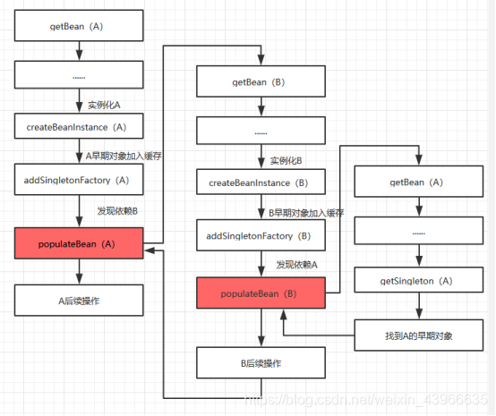

## Spring

### 1 Spring IOC如何解决循环引用？

#### 1.1 三级缓存

SpringIOC 通过三级缓存来解决循环依赖问题，三级缓存指的是三个Map：

- singletonObjects：一级缓存，key为BeanName，value为Bean，日常获取Bean的地方

- earlySingletonObjects：二级缓存，key为BeanName，value为Bean，已经实例化但还没有进行属性注入的Bean，由三级缓存放入
- singletonFactories：三级缓存，key为BeanName，value为对象工厂（ObjectFactory）

在实际使用中，要获取一个bean，先从一级缓存一直查找到三级缓存，缓存bean的时候是从三级到一级的顺序保存，并且缓存bean的过程中，三个缓存都是互斥的，只会保持bean在一个缓存中，而且，最终都会在一级缓存中。

解决循环依赖

SpringIOC解决循环依赖的思路就是依靠缓存，同时还得引出个概念即早期暴露引用。我们知道在IOC容器里Bean的初始化的过程分为三个步骤：==创建实例、属性注入实例、回调实例实现的接口方法==。

解决思路就在这：当我们创建实例与属性注入实例这俩个步骤之间的时候，我们引入缓存，将这些已经创建好但是并没有注入属性的实例放到缓存里，而这些放在缓存里但是没有被注入属性的实例对象，就是解决循环依赖的方法。

打个比方：A对象的创建需要引用到B对象，而B对象的创建也需要A对象，而此时当B对象创建的时候直接从缓存里引用A对象（虽然不是完全体A对象，毕竟没有赋值处理），当B对象完成创建以后再被A对象引用进去，则A对象也完成了创建。

解决循环依赖具体过程

对Bean的创建最为核心三个方法解释如下：

- createBeanInstance：实例化，通过反射调用对象构造方法实例化对象；
- populateBean：填充属性，主要是对bean的依赖属性进行赋值；
- initializeBean：初始化，可以回调InitializingBean、initMethod等方法。

实例化A的时候，先将A创建（早期对象）放入一个池子（singletonFactories）中。这个时候虽然属性没有赋值，但是容器已经能认识这个是A对象，只是属性全是null而已。在populateBean方法中对属性赋值的时候，发现A依赖了B，那么就先去创建B，又走一遍bean的创建过程（创建B）。同样也会把B的早期对象放入缓存（singletonFactories）中。当B又走到 populateBean方法（负责填充Bean实例属性的方法）的时候，发现依赖了A，我们又去创建A，但是这个时候去创建A，发现我们在缓存（singletonFactories）能找到A（早期对象），此时会通过A的ObjectFactory获取A，并把A从三级缓存移到二级缓存。然后就可以把B的A属性赋值了，这个时候B就初始化完成了，初始化完成后就会把B从三级缓存移到一级缓存。完成B实例化后，回到A调用的populateBean方法中。返回的就是B对象了，对A的B属性进行赋值就可以了。

#### 1.2 IOC无法解决的两种循环依赖

- 一种是非单例对象，因为非单例对象不会放入缓存的。每次都是需要创建。
- 二是通过构造器注入，也无法解决。从上面的流程可以看出，调用构造器创建实例是在createBeanInstance方法，而解决循环依赖是在populateBean（负责属性注入的方法）这个方法中，执行顺序也决定了无法解决该种循环依赖。

#### 1.3 为什么采用三级缓存？

- 一级缓存是单例缓存池（singletonObjects）

- 二级缓存是早期对象（earlySingletonObjects）

- 三级缓存是一个包裹对象ObjectFactory（registeredSingletons），通过getObject获取到早期对象。

从上面的流程来看，实际上二级缓存已经可以解决循环依赖了，那么为什么Spring还要包裹出来一个三级缓存呢？

三级缓存其实是为了解决代理对象之间（AOP）的循环依赖。如果没有三级缓存，在对象被AOP代理的情况下，存入二级缓存前都需要先去做AOP代理。二级缓存存在的必要就是为了性能，从三级缓存的工厂创建出对象，直接放入二级缓存，避免每次都从工厂中获取。

通过第三级缓存我们可以拿到可能经过包装的对象，解决对象代理封装的问题。

三级缓存的value是ObjectFactory，ObjectFactory 的 getObject 如果包装的对象被AOP代理，则会返回相应的代理对象。

#### 1.4 三级缓存的划分及作用

一级缓存 singletonObjects 是完整的bean，它可以被外界任意使用，并且不会有歧义。

二级缓存 earlySingletonObjects 是不完整的bean，没有完成初始化，它与singletonObjects的分离主要是职责的分离以及边界划分，可以试想一个Map缓存里既有完整可使用的bean，也有不完整的，只能持有引用的bean，在复杂度很高的架构中，很容易出现歧义，并带来一些不可预知的错误。

三级缓存 singletonFactories ，其职责就是包装一个bean，有回调逻辑，主要用于解决代理对象的循环依赖，所以它的作用非常清晰，并且只能处于第三层。

在实际使用中，要获取一个bean，先从一级缓存一直查找到三级缓存，缓存bean的时候是从三级到一级的顺序保存，并且缓存bean的过程中，三个缓存都是互斥的，只会保持bean在一个缓存中，而且，最终都会在一级缓存中。

#### 1.5 总结

1. SpringIOC 通过三级缓存解决循环依赖
2. 要获取一个bean，先从一级缓存一直查找到三级缓存，缓存bean的时候是从三级到一级的顺序保存，并且缓存bean的过程中，三个缓存都是互斥的，只会保持bean在一个缓存中，而且，最终都会在一级缓存中。
3. Bean在实例化后（createBeanInstance）、属性注入前（populateBean），会先将属性为null的Bean包装成对象工厂（ObjectFactory）放入三级缓存中，在属性注入过程中会依次从一级到三级查询缓存查找依赖的Bean，不存在则先实例化依赖的Bean，完成属性注入。Bean初始化完成后，会被放入一级缓存。
4. 三级缓存其实是为了解决代理对象之间（AOP）的循环依赖，通过第三级缓存我们可以拿到可能经过包装的对象，解决对象代理封装的问题。