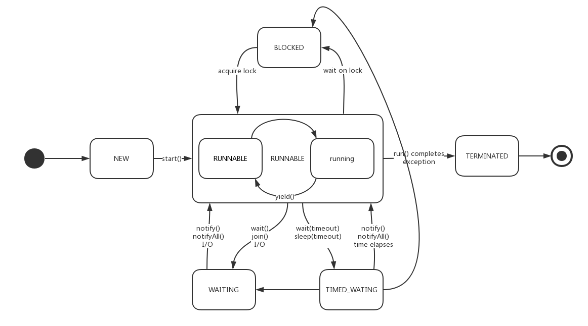

## join()的使用场景


> Thread 对象的结束先行发生于 join() 方法返回


在很多情况下，主线程创建并启动子线程，如果子线程中要进行大量的耗时运算，主线程将可能早于子线程结束。如果主线程需要知道子线程的执行结果时，就需要等待子线程执行结束了。主线程可以sleep(xx),但这样的xx时间不好确定，因为子线程的执行时间不确定，join()方法比较合适这个场景。

> 主线程的代码块中，如果碰到了t.join()方法，此时主线程需要等待（阻塞），等待子线程结束了(Waits for this thread to die.),才能继续执行t.join()之后的代码块。




### 测试

```java
public class TestJoin {
    public static void main(String[] args) throws InterruptedException {
        Thread thread = new Thread(() -> {
            System.out.println("-----------");
            try {
                Thread.sleep(5000);
            } catch (InterruptedException e) {
                e.printStackTrace();
            }
        });
        thread.start();
        thread.join();
        System.out.println("===========");
    }
}
```

```
-----------
...五秒左右后输出
===========
```


> Join方法实现是通过wait（Object 提供的方法）。 当main线程调用t.join时候，main线程会获得线程对象t的锁（wait 意味着拿到该对象的锁),调用该对象的wait(等待时间)，直到该对象唤醒main线程 ，比如退出后。这就意味着main 线程调用t.join时，必须能够拿到线程t对象的锁。

### 源码

> join() 一共有三个重载版本，分别是无参、一个参数、两个参数：

```java
 public final void join() throws InterruptedException;

 public final synchronized void join(long millis) throws InterruptedException;

 public final synchronized void join(long millis, int nanos) throws InterruptedException;
```

> (1) 三个方法都被final修饰，无法被子类重写。
>
> (2) join(long), join(long, long) 是synchronized method，同步的对象是当前线程实例。
>
> (2) 无参版本和两个参数版本最终都调用了一个参数的版本。
>
> (3) join() 和 join(0) 是等价的，表示一直等下去；join(非0)表示等待一段时间。
>
> 从源码可以看到 join(0) 调用了Object.wait(0)，其中Object.wait(0) 会一直等待，直到被notify中断才返回。
>
> while(isAlive())是为了防止子线程伪唤醒(spurious wakeup)，只要子线程没有TERMINATED的，父线程就需要继续等下去。
>
> (4) join() 和 sleep() 一样，可以被中断（被中断时，会抛出 InterrupptedException 异常）；不同的是，join() 内部调用了 wait()，会出让锁，而 sleep() 会一直保持锁。


```java
 public final void join() throws InterruptedException {
        join(0);
 }
```


```java
public final synchronized void join(long millis)
    throws InterruptedException {
        long base = System.currentTimeMillis();
        long now = 0;

        if (millis < 0) {
            throw new IllegalArgumentException("timeout value is negative");
        }

        if (millis == 0) {
            while (isAlive()) {
                wait(0);
            }
        } else {
            while (isAlive()) {
                long delay = millis - now;
                if (delay <= 0) {
                    break;
                }
                wait(delay);
                now = System.currentTimeMillis() - base;
            }
        }
    }
```

```java
//对输入的纳秒时间进行四舍五入
public final synchronized void join(long millis, int nanos)
    throws InterruptedException {

        if (millis < 0) {
            throw new IllegalArgumentException("timeout value is negative");
        }

        if (nanos < 0 || nanos > 999999) {
            throw new IllegalArgumentException(
                                "nanosecond timeout value out of range");
        }

        if (nanos >= 500000 || (nanos != 0 && millis == 0)) {
            millis++;
        }

        join(millis);
    }
```

