## 一、操作系统简介篇

### 1. 解释一下什么是操作系统

操作系统是管理硬件和软件的一种应用程序。操作系统是运行在计算机上最重要的一种软件，它管理计算机的资源和进程以及所有的硬件和软件。它为计算机硬件和软件提供了一种中间层，使应用软件和硬件进行分离，让我们无需关注硬件的实现，把关注点更多放在软件应用上。

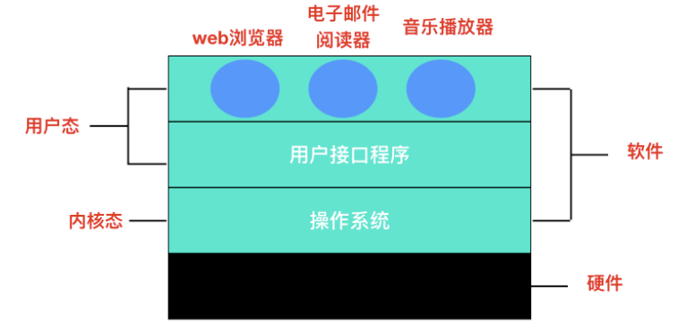

通常情况下，计算机上会运行着许多应用程序，它们都需要对内存和 CPU 进行交互，操作系统的目的就是为了保证这些访问和交互能够准确无误的进行。

### 2. 操作系统的主要功能

一般来说，现代操作系统主要提供下面几种功能

1. 进程管理: 进程管理的主要作用就是任务调度，在单核处理器下，操作系统会为每个进程分配一个任务，进程管理的工作十分简单；而在多核处理器下，操作系统除了要为进程分配任务外，还要解决处理器的调度、分配和回收等问题
2. 内存管理：内存管理主要是操作系统负责管理内存的分配、回收，在进程需要时分配内存以及在进程完成时回收内存，协调内存资源，通过合理的页面置换算法进行页面的换入换出
3. 设备管理：根据确定的设备分配原则对设备进行分配，使设备与主机能够并行工作，为用户提供良好的设备使用界面。
4. 文件管理：有效地管理文件的存储空间，合理地组织和管理文件系统，为文件访问和文件保护提供更有效的方法及手段。
5. 提供用户接口：操作系统提供了访问应用程序和硬件的接口，使用户能够通过应用程序发起系统调用从而操纵硬件，实现想要的功能。

### 3. 软件访问硬件的几种方式

> 软件访问硬件其实就是一种 IO 操作，软件访问硬件的方式，也就是 I/O 操作的方式有哪些。

硬件在 I/O 上大致分为并行和串行，同时也对应串行接口和并行接口。随着计算机技术的发展，I/O 控制方式也在不断发展。选择和衡量 I/O 控制方式有如下三条原则:

1. 数据传送速度足够快，能满足用户的需求但又不丢失数据；
2. 系统开销小，所需的处理控制程序少；
3. 能充分发挥硬件资源的能力，使 I/O 设备尽可能忙，而 CPU 等待时间尽可能少。

**根据以上控制原则，I/O 操作可以分为四类**

- 直接访问：直接访问由用户进程直接控制主存或 CPU 和外围设备之间的信息传送。直接程序控制方式又称为忙/等待方式。

- 中断驱动：为了减少程序直接控制方式下 CPU 的等待时间以及提高系统的并行程度，系统引入了中断机制。中断机制引入后，外围设备仅当操作正常结束或异常结束时才向 CPU 发出中断请求。在 I/O 设备输入每个数据的过程中，由于无需 CPU 的干预，一定程度上实现了 CPU 与 I/O 设备的并行工作。

上述两种方法的特点都是以 CPU 为中心，数据传送通过一段程序来实现，软件的传送手段限制了数据传送的速度。接下来介绍的这两种 I/O 控制方式采用硬件的方法来显示 I/O 的控制。

- DMA 直接内存访问：为了进一步减少 CPU 对 I/O 操作的干预，防止因并行操作设备过多使 CPU 来不及处理或因速度不匹配而造成的数据丢失现象，引入了 DMA 控制方式。
- 通道控制方式：通道，独立于 CPU 的专门负责输入输出控制的处理机，它控制设备与内存直接进行数据交换。有自己的通道指令，这些指令由 CPU 启动，并在操作结束时向 CPU 发出中断信号。

### 4. 解释一下操作系统的主要目的是什么

操作系统是一种软件，它的主要目的有三种

1. 管理计算机资源，这些资源包括 CPU、内存、磁盘驱动器、打印机等。
2. 提供一种图形界面，就像我们前面描述的那样，它提供了用户和计算机之间的桥梁。
3. 为其他软件提供服务，操作系统与软件进行交互，以便为其分配运行所需的任何必要资源。

### 5. 操作系统的种类有哪些

操作系统通常预装在你购买计算机之前。大部分用户都会使用默认的操作系统，但是你也可以升级甚至更改操作系统。但是一般常见的操作系统只有三种：**Windows、macOS 和 Linux**。

### 6. 为什么 Linux 系统下的应用程序不能直接在 Windows 下运行

其中一点是因为 Linux 系统和 Windows 系统的格式不同，**格式就是协议**，就是在固定位置有意义的数据。Linux 下的可执行程序文件格式是 `elf`，可以使用 `readelf` 命令查看 elf 文件头。

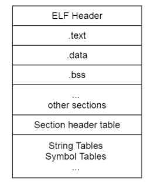

而 Windows 下的可执行程序是 `PE` 格式，它是一种可移植的可执行文件。

还有一点是因为 Linux 系统和 Windows 系统的 API 不同，这个 API 指的就是操作系统的 API，Linux 中的 API 被称为**系统调用**，是通过` int 0x80` 这个软中断实现的。而 Windows 中的 API 是放在动态链接库文件中的，也就是 Windows 开发人员所说的 DLL ，这是一个库，里面包含代码和数据。Linux 中的可执行程序获得系统资源的方法和 Windows 不一样，所以显然是不能在 Windows 中运行的。

### 7. 操作系统结构

#### 7.1 单体系统

在大多数系统中，整个系统在内核态以单一程序的方式运行。整个操作系统是以程序集合来编写的，链接在一块形成一个大的二进制可执行程序，这种系统称为单体系统。

在单体系统中构造实际目标程序时，会首先编译所有单个过程（或包含这些过程的文件），然后使用系统链接器将它们全部绑定到一个可执行文件中

在单体系统中，对于每个系统调用都会有一个服务程序来保障和运行。需要一组实用程序来弥补服务程序需要的功能，例如从用户程序中获取数据。可将各种过程划分为一个三层模型

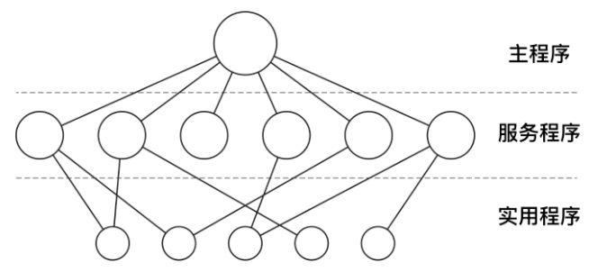

除了在计算机初启动时所装载的核心操作系统外，许多操作系统还支持额外的扩展。比如 I/O 设备驱动和文件系统。这些部件可以按需装载。在 UNIX 中把它们叫做 `共享库(shared library)`，在 Windows 中则被称为 `动态链接库(Dynamic Link Library,DLL)`。他们的扩展名为 .dll，在` C:\Windows\system32` 目录下存在 1000 多个 DLL 文件，所以不要轻易删除 C 盘文件，否则可能就炸了哦。

#### 7.2 分层系统

分层系统使用层来分隔不同的功能单元。每一层只与该层的上层和下层通信。每一层都使用下面的层来执行其功能。层之间的通信通过预定义的固定接口通信。

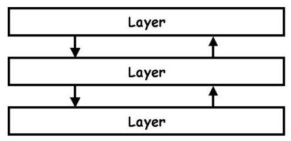

#### 7.3 微内核

为了实现高可靠性，将操作系统划分成小的、层级之间能够更好定义的模块是很有必要的，只有一个模块 — 微内核 — 运行在内核态，其余模块可以作为普通用户进程运行。由于把每个设备驱动和文件系统分别作为普通用户进程，这些模块中的错误虽然会使这些模块崩溃，但是不会使整个系统死机。`MINIX 3` 是微内核的代表作，它的具体结构如下:

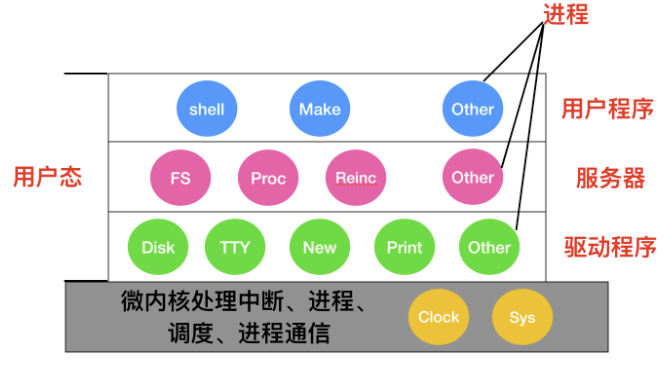

在内核的外部，系统的构造有三层，它们都在用户态下运行，最底层是设备驱动器。由于它们都在用户态下运行，所以不能物理的访问 I/O 端口空间，也不能直接发出 I/O 命令。相反，为了能够对 I/O 设备编程，驱动器构建一个结构，指明哪个参数值写到哪个 I/O 端口，并声称一个内核调用，这样就完成了一次调用过程。

#### 7.4 客户-服务器模式

微内核思想的策略是把进程划分为两类：`服务器`，每个服务器用来提供服务；`客户端`，使用这些服务。这个模式就是所谓的 `客户-服务器`模式。

客户-服务器模式会有两种载体，一种情况是一台计算机既是客户又是服务器，在这种方式下，操作系统会有某种优化；但是普遍情况下是客户端和服务器在不同的机器上，它们通过局域网或广域网连接。


客户通过发送消息与服务器通信，客户端并不需要知道这些消息是在本地机器上处理，还是通过网络被送到远程机器上处理。对于客户端而言，这两种情形是一样的：都是发送请求并得到回应。

### 8. 为什么称为陷入内核

如果把软件结构进行分层说明的话，应该是这个样子的，最外层是应用程序，里面是操作系统内核。


应用程序处于`特权级 3`，操作系统内核处于`特权级 0` 。如果用户程序想要访问操作系统资源时，会发起系统调用，陷入内核，这样 CPU 就进入了内核态，执行内核代码。至于为什么是陷入，我们看图，内核是一个凹陷的构造，有陷下去的感觉，所以称为陷入。

### 9. 什么是用户态和内核态

用户态和内核态是操作系统的两种运行状态。

- 内核态：处于内核态的 CPU 可以访问任意的数据，包括外围设备，比如网卡、硬盘等，处于内核态的 CPU 可以从一个程序切换到另外一个程序，并且占用 CPU 不会发生抢占情况，一般处于特权级 0 的状态我们称之为内核态。
- 用户态：处于用户态的 CPU 只能受限的访问内存，并且不允许访问外围设备，用户态下的 CPU 不允许独占，也就是说 CPU 能够被其他程序获取。

> 那么为什么要有用户态和内核态呢？

这个主要是访问能力的限制的考量，计算机中有一些比较危险的操作，比如设置时钟、内存清理，这些都需要在内核态下完成，如果随意进行这些操作，那你的系统得崩溃多少次。

#### 9.1 用户态和内核态是如何切换的？

所有的用户进程都是运行在用户态的，但是我们上面也说了，用户程序的访问能力有限，一些比较重要的比如从硬盘读取数据，从键盘获取数据的操作则是内核态才能做的事情，而这些数据却又对用户程序来说非常重要。所以就涉及到两种模式下的转换，即**用户态 -> 内核态 -> 用户态**，而唯一能够做这些操作的只有 `系统调用`，而能够执行系统调用的就只有 `操作系统`。

一般用户态 -> 内核态的转换我们都称之为 trap 进内核，也被称之为 `陷阱指令(trap instruction)`。

他们的工作流程如下：


- 首先用户程序会调用 `glibc` 库，`glibc `是一个标准库，同时也是一套核心库，库中定义了很多关键 API。
- `glibc `库知道针对不同体系结构调用`系统调用`的正确方法，它会根据体系结构应用程序的二进制接口设置用户进程传递的参数，来准备系统调用。
- 然后，`glibc `库调用`软件中断指令(SWI)` ，这个指令通过更新 `CPSR` 寄存器将模式改为超级用户模式，然后跳转到地址 `0x08` 处。
- 到目前为止，整个过程仍处于用户态下，在执行 SWI 指令后，允许进程执行内核代码，MMU 现在允许内核虚拟内存访问
- 从地址 `0x08 `开始，进程执行加载并跳转到中断处理程序，这个程序就是 ARM 中的 `vector_swi()`。
- 在 `vector_swi()` 处，从 SWI 指令中提取系统调用号 SCNO，然后使用 SCNO 作为系统调用表 `sys_call_table` 的索引，调转到系统调用函数。
- 执行系统调用完成后，将还原用户模式寄存器，然后再以用户模式执行。

### 10. 什么是内核

在计算机中，内核是一个计算机程序，它是操作系统的核心，可以控制操作系统中所有的内容。内核通常是在 boot loader 装载程序之前加载的第一个程序。

这里还需要了解一下什么是 boot loader。

boot loader 又被称为引导加载程序，能够将计算机的操作系统放入内存中。在电源通电或者计算机重启时，BIOS 会执行一些初始测试，然后将控制权转移到引导加载程序所在的主引导记录(MBR) 。

### 11. 什么是实时系统

实时操作系统对时间做出了严格的要求，实时操作系统分为两种：**硬实时和软实时**

硬实时操作系统规定某个动作必须在规定的时刻内完成或发生，比如汽车生产车间，焊接机器必须在某一时刻内完成焊接，焊接的太早或者太晚都会对汽车造成永久性伤害。

软实时操作系统虽然不希望偶尔违反最终的时限要求，但是仍然可以接受。并且不会引起任何永久性伤害。比如数字音频、多媒体、手机都是属于软实时操作系统。

你可以简单理解硬实时和软实时的两个指标：是否在时刻内必须完成以及是否造成严重损害。

### 12.Linux 操作系统的启动过程

1. 当计算机电源通电后，BIOS会进行`开机自检(Power-On-Self-Test, POST)`，对硬件进行检测和初始化。因为操作系统的启动会使用到磁盘、屏幕、键盘、鼠标等设备。下一步，磁盘中的第一个分区，也被称为 `MBR(Master Boot Record)` 主引导记录，被读入到一个固定的内存区域并执行。这个分区中有一个非常小的，只有 512 字节的程序。程序从磁盘中调入 boot 独立程序，boot 程序将自身复制到高位地址的内存从而为操作系统释放低位地址的内存。

2. 复制完成后，boot 程序读取启动设备的根目录。boot 程序要理解文件系统和目录格式。然后 boot 程序被调入内核，把控制权移交给内核。直到这里，boot 完成了它的工作。系统内核开始运行。

3. 内核启动代码是使用汇编语言完成的，主要包括创建内核堆栈、识别 CPU 类型、计算内存、禁用中断、启动内存管理单元等，然后调用 C 语言的 main 函数执行操作系统部分。

4. 这部分也会做很多事情，首先会分配一个消息缓冲区来存放调试出现的问题，调试信息会写入缓冲区。如果调试出现错误，这些信息可以通过诊断程序调出来。

5. 然后操作系统会进行自动配置，检测设备，加载配置文件，被检测设备如果做出响应，就会被添加到已链接的设备表中，如果没有相应，就归为未连接直接忽略。

6. 配置完所有硬件后，接下来要做的就是仔细手工处理进程0，设置其堆栈，然后运行它，执行初始化、配置时钟、挂载文件系统。创建` init 进程(进程 1 )` 和 `守护进程(进程 2)`。

7. init 进程会检测它的标志以确定它是否为单用户还是多用户服务。在前一种情况中，它会调用 fork 函数创建一个 shell 进程，并且等待这个进程结束。后一种情况调用 fork 函数创建一个运行系统初始化的 shell 脚本`（即 /etc/rc）`的进程，这个进程可以进行文件系统一致性检测、挂载文件系统、开启守护进程等。

8. 然后 `/etc/rc` 这个进程会从 `/etc/ttys` 中读取数据，`/etc/ttys` 列出了所有的终端和属性。对于每一个启用的终端，这个进程调用 `fork `函数创建一个自身的副本，进行内部处理并运行一个名为 `getty `的程序。`getty `程序会在终端上输入`login:`。

9. 等待用户输入用户名，在输入用户名后，getty 程序结束，登陆程序` /bin/login` 开始运行。login 程序需要输入密码，并与保存在` /etc/passwd` 中的密码进行对比，如果输入正确，login 程序以用户 shell 程序替换自身，等待第一个命令。如果不正确，login 程序要求输入另一个用户名。

   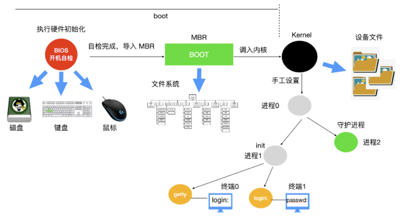

## 二、进程和线程篇

### 1. 多处理系统的优势

随着处理器的不断增加，我们的计算机系统由单机系统变为了多处理系统，多处理系统的吞吐量比较高，多处理系统拥有多个并行的处理器，这些处理器共享时钟、内存、总线、外围设备等。多处理系统由于可以共享资源，因此可以开源节流，省钱。整个系统的可靠性也随之提高。

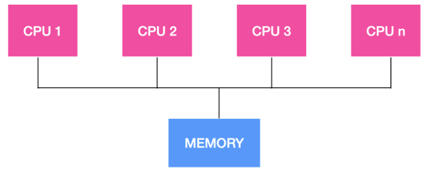

### 2. 什么是进程和进程表

进程就是正在执行程序的实例，比如说 Web 程序就是一个进程，shell 也是一个进程，文章编辑器 typora 也是一个进程。

操作系统负责管理所有正在运行的进程，操作系统会为每个进程分配特定的时间来占用 CPU，操作系统还会为每个进程分配特定的资源。

操作系统为了跟踪每个进程的活动状态，维护了一个`进程表`。在进程表的内部，列出了每个进程的状态以及每个进程使用的资源等。

### 3. 什么是线程，线程和进程的区别

我们上面说到进程是正在运行的程序的实例，而线程其实就是进程中的单条流向，因为线程具有进程中的某些属性，所以线程又被称为轻量级的进程。浏览器如果是一个进程的话，那么浏览器下面的每个 tab 页可以看作是一个个的线程。

1. 调度：进程是资源管理的基本单位，线程是程序执行的基本单位。
2. 切换：线程上下文切换比进程上下文切换要快得多。
3. 拥有资源：进程是拥有资源的一个独立单位，线程不拥有系统资源，但是可以访问隶属于进程的资源。
4. 系统开销：创建或撤销进程时，系统都要为之分配或回收系统资源，如内存空间，I/O设备等，OS所付出的开销显著大于在创建或撤销线程时的开销，进程切换的开销也远大于线程切换的开销。

下面是线程和进程持有资源的区别:

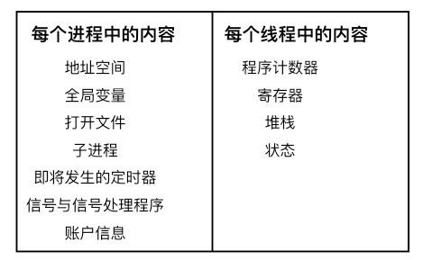

### 4. 什么是上下文切换

对于单核单线程 CPU 而言，在某一时刻只能执行一条 CPU 指令。上下文切换 (Context Switch) 是一种 将 CPU 资源从一个进程分配给另一个进程的机制。从用户角度看，计算机能够并行运行多个进程，这恰恰是操作系统通过快速上下文切换造成的结果。在切换的过程中，操作系统需要先存储当前进程的状态 (包括内存空间的指针，当前执行完的指令等等)，再读入下一个进程的状态，然后执行此进程。

### 5. 使用多线程的好处是什么

多线程是程序员不得不知的基本素养之一，所以，下面我们给出一些多线程编程的好处

- 能够提高对用户的响应顺序
- 在流程中的资源共享
- 比较经济适用
- 能够对多线程架构有深入的理解

### 6. 进程终止的方式

**进程的终止**

进程在创建之后，它就开始运行并做完成任务。然而，没有什么事儿是永不停歇的，包括进程也一样。进程早晚会发生终止，但是通常是由于以下情况触发的

1. 正常退出(自愿的)
2. 错误退出(自愿的)
3. 严重错误(非自愿的)
4. 被其他进程杀死(非自愿的)

#### 6.1 正常退出

多数进程是由于完成了工作而终止。当编译器完成了所给定程序的编译之后，编译器会执行一个系统调用告诉操作系统它完成了工作。这个调用在 UNIX 中是 `exit `，在 Windows 中是 `ExitProcess`。面向屏幕中的软件也支持自愿终止操作。字处理软件、Internet 浏览器和类似的程序中总有一个供用户点击的图标或菜单项，用来通知进程删除它锁打开的任何临时文件，然后终止。

#### 6.2 错误退出

进程发生终止的第二个原因是发现严重错误，例如，如果用户执行如下命令:

```shell
cc foo.c	
```


为了能够编译` foo.c `但是该文件不存在，于是编译器就会发出声明并退出。在给出了错误参数时，面向屏幕的交互式进程通常并不会直接退出，因为这从用户的角度来说并不合理，用户需要知道发生了什么并想要进行重试，所以这时候应用程序通常会弹出一个对话框告知用户发生了系统错误，是需要重试还是退出。

#### 6.3 严重错误

进程终止的第三个原因是由进程引起的错误，通常是由于程序中的错误所导致的。例如，执行了一条非法指令，引用不存在的内存，或者除数是 0 等。在有些系统比如 UNIX 中，进程可以通知操作系统，它希望自行处理某种类型的错误，在这类错误中，进程会收到信号（中断），而不是在这类错误出现时直接终止进程。

#### 6.4 被其他进程杀死

第四个终止进程的原因是，某个进程执行系统调用告诉操作系统杀死某个进程。在 UNIX 中，这个系统调用是 kill。在 Win32 中对应的函数是 `TerminateProcess`（注意不是系统调用）。

### 7. 进程间状态模型

#### 7.1进程的三态模型

当一个进程开始运行时，它可能会经历下面这几种状态:

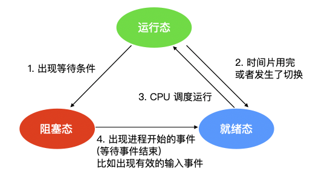

图中会涉及三种状态

1. `运行态`：运行态指的就是进程实际占用 CPU 时间片运行时
2. `就绪态`：就绪态指的是可运行，但因为其他进程正在运行而处于就绪状态
3. `阻塞态`：阻塞态又被称为睡眠态，它指的是进程不具备运行条件，正在等待被 CPU 调度。

逻辑上来说，运行态和就绪态是很相似的。这两种情况下都表示进程`可运行`，但是第二种情况没有获得 CPU 时间分片。第三种状态与前两种状态不同的原因是这个进程不能运行，CPU 空闲时也不能运行。

三种状态会涉及四种状态间的切换，在操作系统发现进程不能继续执行时会发生`状态1`的轮转，在某些系统中进程执行系统调用，例如 `pause`，来获取一个阻塞的状态。在其他系统中包括 UNIX，当进程从管道或特殊文件（例如终端）中读取没有可用的输入时，该进程会被自动终止。

转换 2 和转换 3 都是由进程调度程序（操作系统的一部分）引起的，进程本身不知道调度程序的存在。转换 2 的出现说明进程调度器认定当前进程已经运行了足够长的时间，是时候让其他进程运行 CPU 时间片了。当所有其他进程都运行过后，这时候该是让第一个进程重新获得 CPU 时间片的时候了，就会发生转换 3。

> **程序调度指的是，决定哪个进程优先被运行和运行多久，这是很重要的一点**。已经设计出许多算法来尝试平衡系统整体效率与各个流程之间的竞争需求。

当进程等待的一个外部事件发生时（如从外部输入一些数据后），则发生转换 4。如果此时没有其他进程在运行，则立刻触发转换 3，该进程便开始运行，否则该进程会处于就绪阶段，等待 CPU 空闲后再轮到它运行。

#### 7.2 进程的五态模型

在三态模型的基础上，增加了两个状态，即 `新建` 和 `终止` 状态。


- 新建态：进程的新建态就是进程刚创建出来的时候

> 创建进程需要两个步骤：即为新进程分配所需要的资源和空间，设置进程为就绪态，并等待调度执行。

- 终止态：进程的终止态就是指进程执行完毕，到达结束点，或者因为错误而不得不中止进程。

>终止一个进程需要两个步骤：
>
>1. 先等待操作系统或相关的进程进行善后处理。
>2. 然后回收占用的资源并被系统删除。

### 8. 调度算法都有哪些

调度算法分为三大类：**批处理中的调度**、**交互系统中的调度**、**实时系统中的调度**

#### 8.1 批处理中的调度

**先来先服务**

使用此算法，将按照请求顺序为进程分配 CPU。最基本的，会有一个就绪进程的等待队列。当第一个任务从外部进入系统时，将会立即启动并允许运行任意长的时间。它不会因为运行时间太长而中断。当其他作业进入时，它们排到就绪队列尾部。当正在运行的进程阻塞，处于等待队列的第一个进程就开始运行。当一个阻塞的进程重新处于就绪态时，它会像一个新到达的任务，会排在队列的末尾，即排在所有进程最后。

**最短作业优先**

批处理中，第二种调度算法是 最短作业优先(`Shortest Job First`)，我们假设运行时间已知。例如，一家保险公司，因为每天要做类似的工作，所以人们可以相当精确地预测处理 1000 个索赔的一批作业需要多长时间。当输入队列中有若干个同等重要的作业被启动时，调度程序应使用最短优先作业算法

> 需要注意的是，在所有的进程都可以运行的情况下，最短作业优先的算法才是最优的。

**最短剩余时间优先**

最短作业优先的抢占式版本被称作为 最短剩余时间优先`(Shortest Remaining Time Next) `算法。使用这个算法，调度程序总是选择剩余运行时间最短的那个进程运行。当一个新作业到达时，其整个时间同当前进程的剩余时间做比较。如果新的进程比当前运行进程需要更少的时间，当前进程就被挂起，而运行新的进程。这种方式能够使短期作业获得良好的服务。

#### 8.2 交互式系统中的调度

交互式系统中在个人计算机、服务器和其他系统中都是很常用的，所以有必要来探讨一下交互式调度

**轮询调度**
一种最古老、最简单、最公平并且最广泛使用的算法就是 轮询算法(round-robin)。每个进程都会被分配一个时间段，称为时间片(quantum)，在这个时间片内允许进程运行。如果时间片结束时进程还在运行的话，则抢占一个 CPU 并将其分配给另一个进程。如果进程在时间片结束前阻塞或结束，则 CPU 立即进行切换。轮询算法比较容易实现。调度程序所做的就是维护一个可运行进程的列表，就像下图中的 a，当一个进程用完时间片后就被移到队列的末尾，就像下图的 b。

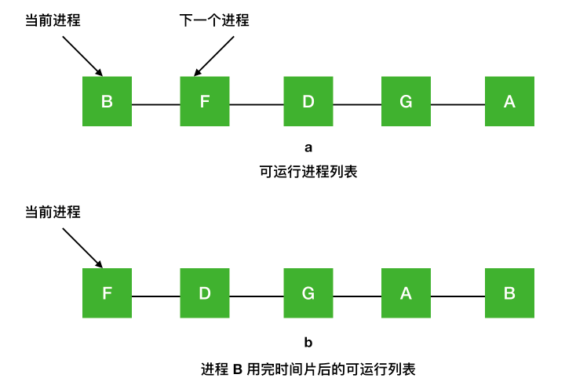

**优先级调度**

事实情况是不是所有的进程都是优先级相等的。例如，在一所大学中的等级制度，首先是院长，然后是教授、秘书、后勤人员，最后是学生。这种将外部情况考虑在内就实现了`优先级调度(priority scheduling)`

它的基本思想很明确，每个进程都被赋予一个优先级，优先级高的进程优先运行。

但是也不意味着高优先级的进程能够永远一直运行下去，调度程序会在每个时钟中断期间降低当前运行进程的优先级。如果此操作导致其优先级降低到下一个最高进程的优先级以下，则会发生进程切换。或者，可以为每个进程分配允许运行的最大时间间隔。当时间间隔用完后，下一个高优先级的进程会得到运行的机会。

**最短进程优先**

对于批处理系统而言，由于最短作业优先常常伴随着最短响应时间，一种方式是根据进程过去的行为进行推测，并执行估计运行时间最短的那一个。假设每个终端上每条命令的预估运行时间为 T0，现在假设测量到其下一次运行时间为 T1，可以用两个值的加权来改进估计时间，即aT0+ (1- 1)T1。通过选择 a 的值，可以决定是尽快忘掉老的运行时间，还是在一段长时间内始终记住它们。当 a = 1/2 时，可以得到下面这个序列

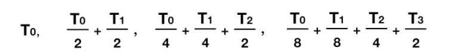

可以看到，在三轮过后，T0 在新的估计值中所占比重下降至 1/8。

有时把这种通过当前测量值和先前估计值进行加权平均从而得到下一个估计值的技术称作 `老化(aging)`。这种方法会使用很多预测值基于当前值的情况。

### 9. 协程与线程的区别

* 线程和进程都是同步机制，而协程是异步机制。
* 线程是抢占式，而协程是非抢占式的。需要用户释放使用权切换到其他协程，因此同一时间其实只有一个协程拥有运行权，相当于单线程的能力。
* 一个线程可以有多个协程，一个进程也可以有多个协程。
* 协程不被操作系统内核管理，而完全是由程序控制。线程是被分割的CPU资源，协程是组织好的代码流程，线程是协程的资源。但协程不会直接使用线程，协程直接利用的是执行器关联任意线程或线程池。
* 协程能保留上一次调用时的状态。

### 10. 并发和并行的区别

并发就是在一段时间内，多个任务都会被处理；但在某一时刻，只有一个任务在执行。单核处理器可以做到并发。比如有两个进程`A`和`B`，`A`运行一个时间片之后，切换到`B`，`B`运行一个时间片之后又切换到`A`。因为切换速度足够快，所以宏观上表现为在一段时间内能同时运行多个程序。

并行就是在同一时刻，有多个任务在执行。这个需要多核处理器才能完成，在微观上就能同时执行多条指令，不同的程序被放到不同的处理器上运行，这个是物理上的多个进程同时进行。
### 11. 进程与线程的切换流程

进程切换分两步：

1、切换**页表**以使用新的地址空间，一旦去切换上下文，处理器中所有已经缓存的内存地址一瞬间都作废了。

2、切换内核栈和硬件上下文。

对于linux来说，线程和进程的最大区别就在于地址空间，对于线程切换，第1步是不需要做的，第2步是进程和线程切换都要做的。

因为每个进程都有自己的虚拟地址空间，而线程是共享所在进程的虚拟地址空间的，因此同一个进程中的线程进行线程切换时不涉及虚拟地址空间的转换。

### 12. 进程间通信方式有哪些

进程间的通信方式比较多，首先你需要理解下面这几个概念

- 竞态条件：即两个或多个线程同时对一共享数据进行修改，从而影响程序运行的正确性时，这种就被称为竞态条件(race condition)。

- 临界区：不仅共享资源会造成竞态条件，事实上共享文件、共享内存也会造成竞态条件、那么该如何避免呢？或许一句话可以概括说明：**禁止一个或多个进程在同一时刻对共享资源（包括共享内存、共享文件等）进行读写。**换句话说，我们需要一种 `互斥(mutual exclusion) 条件`，这也就是说，如果一个进程在某种方式下使用共享变量和文件的话，除该进程之外的其他进程就禁止做这种事（访问统一资源）。

  **一个好的解决方案，应该包含下面四种条件:**

  1. 任何时候两个进程不能同时处于临界区
  2. 不应对 CPU 的速度和数量做任何假设
  3. 位于临界区外的进程不得阻塞其他进程
  4. 不能使任何进程无限等待进入临界区

- 忙等互斥：当一个进程在对资源进行修改时，其他进程必须进行等待，进程之间要具有互斥性，我们讨论的解决方案其实都是基于忙等互斥提出的。

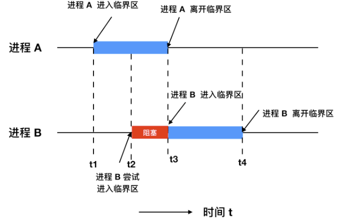

进程间的通信用专业一点的术语来表示就是 `Inter Process Communication，IPC`，它主要有下面 6种通信方式:

- 管道：管道这种通讯方式有两种限制，一是半双工的通信，数据只能单向流动，二是只能在具有亲缘关系的进程间使用。进程的亲缘关系通常是指父子进程关系。

  管道可以分为两类：匿名管道和命名管道。匿名管道是单向的，只能在有亲缘关系的进程间通信；命名管道以磁盘文件的方式存在，可以实现本机任意两个进程通信。

- 信号 ： 信号是一种比较复杂的通信方式，信号可以在任何时候发给某一进程，而无需知道该进程的状态。

  >  **Linux系统中常用信号**：
  >  （1）**SIGHUP**：用户从终端注销，所有已启动进程都将收到该进程。系统缺省状态下对该信号的处理是终止进程。
  >
  >  （2）**SIGINT**：程序终止信号。程序运行过程中，按`Ctrl+C`键将产生该信号。
  >
  >  （3）**SIGQUIT**：程序退出信号。程序运行过程中，按`Ctrl+\\`键将产生该信号。
  >
  >  （4）**SIGBUS和SIGSEGV**：进程访问非法地址。
  >
  >  （5）**SIGFPE**：运算中出现致命错误，如除零操作、数据溢出等。
  >
  >  （6）**SIGKILL**：用户终止进程执行信号。shell下执行`kill -9`发送该信号。
  >
  >  （7）**SIGTERM**：结束进程信号。shell下执行`kill 进程pid`发送该信号。
  >
  >  （8）**SIGALRM**：定时器信号。
  >
  >  （9）**SIGCLD**：子进程退出信号。如果其父进程没有忽略该信号也没有处理该信号，则子进程退出后将形成僵尸进程。

- 信号量：信号量是一个**计数器**，可以用来控制多个进程对共享资源的访问。它常作为一种**锁机制**，防止某进程正在访问共享资源时，其他进程也访问该资源。因此，主要作为进程间以及同一进程内不同线程之间的同步手段。

- 消息队列：消息队列是消息的链接表，包括Posix消息队列和System V消息队列。有足够权限的进程可以向队列中添加消息，被赋予读权限的进程则可以读走队列中的消息。消息队列克服了信号承载信息量少，管道只能承载无格式字节流以及缓冲区大小受限等缺点。

- 共享内存：共享内存就是映射一段能被其他进程所访问的内存，这段共享内存由一个进程创建，但多个进程都可以访问。共享内存是最快的 IPC 方式，它是针对其他进程间通信方式运行效率低而专门设计的。它往往与其他通信机制，如信号量，配合使用，来实现进程间的同步和通信。

- Socket：与其他通信机制不同的是，它可用于不同机器间的进程通信。

**优缺点**：

* 管道：速度慢，容量有限；

* Socket：任何进程间都能通讯，但速度慢；

* 消息队列：容量受到系统限制，且要注意第一次读的时候，要考虑上一次没有读完数据的问题；

* 信号量：不能传递复杂消息，只能用来同步；

* 共享内存区：能够很容易控制容量，速度快，但要保持同步，比如一个进程在写的时候，另一个进程要注意读写的问题，相当于线程中的线程安全，当然，共享内存区同样可以用作线程间通讯，不过没这个必要，线程间本来就已经共享了同一进程内的一块内存。

### 13. 进程间同步的方式有哪些？

1、临界区：通过对多线程的串行化来访问公共资源或一段代码，速度快，适合控制数据访问。

优点：保证在某一时刻只有一个线程能访问数据的简便办法。

缺点：虽然临界区同步速度很快，但却只能用来同步本进程内的线程，而不可用来同步多个进程中的线程。

2、互斥量：为协调共同对一个共享资源的单独访问而设计的。互斥量跟临界区很相似，比临界区复杂，互斥对象只有一个，只有拥有互斥对象的线程才具有访问资源的权限。

优点：使用互斥不仅仅能够在同一应用程序不同线程中实现资源的安全共享，而且可以在不同应用程序的线程之间实现对资源的安全共享。

缺点：

* 互斥量是可以命名的，也就是说它可以跨越进程使用，所以创建互斥量需要的资源更多，所以如果只为了在进程内部是用的话使用临界区会带来速度上的优势并能够减少资源占用量。

* 通过互斥量可以指定资源被独占的方式使用，但如果有下面一种情况通过互斥量就无法处理，比如现在一位用户购买了一份三个并发访问许可的数据库系统，可以根据用户购买的访问许可数量来决定有多少个线程/进程能同时进行数据库操作，这时候如果利用互斥量就没有办法完成这个要求，信号量对象可以说是一种资源计数器。

3、信号量：为控制一个具有有限数量用户资源而设计。它允许多个线程在同一时刻访问同一资源，但是需要限制在同一时刻访问此资源的最大线程数目。互斥量是信号量的一种特殊情况，当信号量的最大资源数=1就是互斥量了。

优点：适用于对Socket（套接字）程序中线程的同步。

缺点:

* 信号量机制必须有公共内存，不能用于分布式操作系统，这是它最大的弱点；

* 信号量机制功能强大，但使用时对信号量的操作分散， 而且难以控制，读写和维护都很困难，加重了程序员的编码负担；

* 核心操作P-V分散在各用户程序的代码中，不易控制和管理，一旦错误，后果严重，且不易发现和纠正。

4、事件： 用来通知线程有一些事件已发生，从而启动后继任务的开始。

优点：事件对象通过通知操作的方式来保持线程的同步，并且可以实现不同进程中的线程同步操作。

### 14. 线程同步的方式有哪些

1、临界区：当多个线程访问一个独占性共享资源时，可以使用临界区对象。拥有临界区的线程可以访问被保护起来的资源或代码段，其他线程若想访问，则被挂起，直到拥有临界区的线程放弃临界区为止，以此达到用原子方式操 作共享资源的目的。

2、事件：事件机制，则允许一个线程在处理完一个任务后，主动唤醒另外一个线程执行任务。

3、互斥量：互斥对象和临界区对象非常相似，只是其允许在进程间使用，而临界区只限制与同一进程的各个线程之间使用，但是更节省资源，更有效率。

4、信号量：当需要一个计数器来限制可以使用某共享资源的线程数目时，可以使用“信号量”对象。

区别：

* 互斥量与临界区的作用非常相似，但互斥量是可以命名的，也就是说互斥量可以跨越进程使用，但创建互斥量需要的资源更多，所以如果只为了在进程内部是用的话使用临界区会带来速度上的优势并能够减少资源占用量 。因为互斥量是跨进程的互斥量一旦被创建，就可以通过名字打开它。

* 互斥量，信号量，事件都可以被跨越进程使用来进行同步数据操作。

### 15. 线程的分类

从线程的运行空间来说，分为用户级线程（user-level thread, ULT）和内核级线程（kernel-level, KLT）

**内核级线程**：这类线程依赖于内核，又称为内核支持的线程或轻量级进程。无论是在用户程序中的线程还是系统进程中的线程，它们的创建、撤销和切换都由内核实现。比如英特尔i5-8250U是4核8线程，这里的线程就是内核级线程

**用户级线程**：它仅存在于用户级中，这种线程是**不依赖于操作系统核心**的。应用进程利用**线程库来完成其创建和管理**，速度比较快，**操作系统内核无法感知用户级线程的存在**。

###  16. 什么是临界区，如何解决冲突？

每个进程中访问临界资源的那段程序称为临界区，**一次仅允许一个进程使用的资源称为临界资源。**

解决冲突的办法：

- 如果有若干进程要求进入空闲的临界区，**一次仅允许一个进程进入**，如已有进程进入自己的临界区，则其它所有试图进入临界区的进程必须等待；
- 进入临界区的进程要在**有限时间内退出**。
- 如果进程不能进入自己的临界区，则应**让出CPU**，避免进程出现“忙等”现象。

## 三、内存管理篇

### 1. 什么是按需分页

在操作系统中，进程是以页为单位加载到内存中的，按需分页是一种`虚拟内存`的管理方式。在使用请求分页的系统中，只有在尝试访问页面所在的磁盘并且该页面尚未在内存中时，也就发生了`缺页异常`，操作系统才会将磁盘页面复制到内存中。

### 2. 什么是虚拟内存？

`虚拟内存`就是说，让物理内存扩充成更大的逻辑内存，从而让程序获得更多的可用内存。虚拟内存使用部分加载的技术，让一个进程或者资源的某些页面加载进内存，从而能够加载更多的进程，甚至能加载比内存大的进程，这样看起来好像内存变大了，这部分内存其实包含了磁盘或者硬盘，并且就叫做虚拟内存。

### 3. 虚拟内存的实现方式有哪些?

虚拟内存中，允许将一个作业分多次调入内存。釆用连续分配方式时，会使相当一部分内存空间都处于暂时或`永久`的空闲状态，造成内存资源的严重浪费，而且也无法从逻辑上扩大内存容量。因此，虚拟内存的实需要建立在离散分配的内存管理方式的基础上。虚拟内存的实现有以下三种方式：

- 请求分页存储管理。
- 请求分段存储管理。
- 请求段页式存储管理。

**不管哪种方式，都需要有一定的硬件支持。一般需要的支持有以下几个方面：**

- 一定容量的内存和外存。
- 页表机制（或段表机制），作为主要的数据结构。
- 中断机构，当用户程序要访问的部分尚未调入内存，则产生中断。
- 地址变换机构，逻辑地址到物理地址的变换。

### 4. 什么是分页？

把内存空间划分为**大小相等且固定的块**，作为主存的基本单位。因为程序数据存储在不同的页面中，而页面又离散的分布在内存中，**因此需要一个页表来记录映射关系，以实现从页号到物理块号的映射。**

访问分页系统中内存数据需要**两次的内存访问** (一次是从内存中访问页表，从中找到指定的物理块号，加上页内偏移得到实际物理地址；第二次就是根据第一次得到的物理地址访问内存取出数据)。


### 5. 什么是分段？

**分页是为了提高内存利用率，而分段是为了满足程序员在编写代码的时候的一些逻辑需求(比如数据共享，数据保护，动态链接等)。**

分段内存管理当中，**地址是二维的，一维是段号，二维是段内地址；其中每个段的长度是不一样的，而且每个段内部都是从0开始编址的**。由于分段管理中，每个段内部是连续内存分配，但是段和段之间是离散分配的，因此也存在一个逻辑地址到物理地址的映射关系，相应的就是段表机制。


### 6. 分页和分段有什区别？

- 分页对程序员是透明的，但是分段需要程序员显式划分每个段。 
- 分页的地址空间是一维地址空间，分段是二维的。 
- 页的大小不可变，段的大小可以动态改变。 
- 分页主要用于实现虚拟内存，从而获得更大的地址空间；分段主要是为了使程序和数据可以被划分为逻辑上独立的地址空间并且有助于共享和保护。

### 7. 物理地址、逻辑地址、有效地址、线性地址、虚拟地址的区别?

物理地址就是内存中真正的地址，它就相当于是你家的门牌号，你家就肯定有这个门牌号，具有唯一性。**不管哪种地址，最终都会映射为物理地址**。

在`实模式`下，段基址 + 段内偏移经过地址加法器的处理，经过地址总线传输，最终也会转换为`物理地址`。

但是在`保护模式`下，段基址 + 段内偏移被称为`线性地址`，不过此时的段基址不能称为真正的地址，而是会被称作为一个`选择子`的东西，选择子就是个索引，相当于数组的下标，通过这个索引能够在 GDT 中找到相应的段描述符，段描述符记录了**段的起始、段的大小**等信息，这样便得到了基地址。如果此时没有开启内存分页功能，那么这个线性地址可以直接当做物理地址来使用，直接访问内存。如果开启了分页功能，那么这个线性地址又多了一个名字，这个名字就是`虚拟地址`。

不论在实模式还是保护模式下，段内偏移地址都叫做`有效地址`。有效抵制也是逻辑地址。

线性地址可以看作是`虚拟地址`，虚拟地址不是真正的物理地址，但是虚拟地址会最终被映射为物理地址。下面是`虚拟地址 -> 物理地址`的映射。

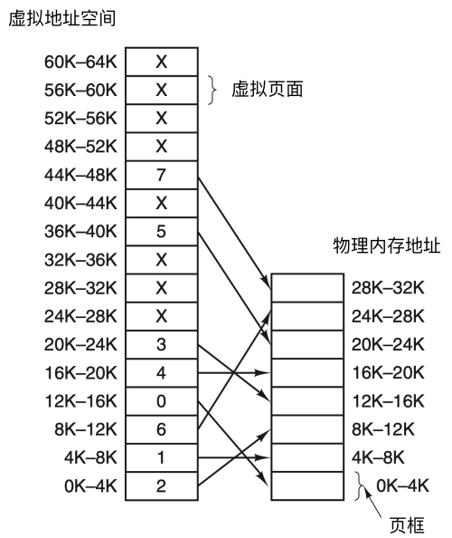

### 8. 空闲内存管理的方式

操作系统在动态分配内存时（`malloc，new`），需要对空间内存进行管理。一般采用了两种方式：`位图`和`空闲链表`。

#### 8.1 使用位图进行管理

使用位图方法时，内存可能被划分为小到几个字或大到几千字节的分配单元。每个分配单元对应于位图中的一位，0 表示空闲， 1 表示占用（或者相反）。一块内存区域和其对应的位图如下

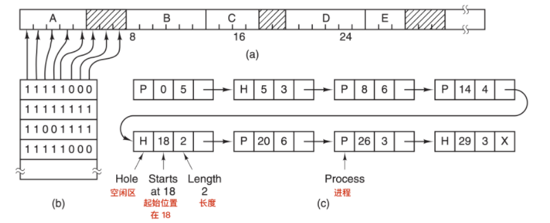

> 图 a 表示一段有 5 个进程和 3 个空闲区的内存，刻度为内存分配单元，阴影区表示空闲（在位图中用 0 表示）；图 b 表示对应的位图；图 c 表示用链表表示同样的信息

分配单元的大小是一个重要的设计因素，分配单位越小，位图越大。然而，即使只有 4 字节的分配单元，32 位的内存也仅仅只需要位图中的 1 位。`32n `位的内存需要 n 位的位图，所以1 个位图只占用了 1/32 的内存。如果选择更大的内存单元，位图应该要更小。如果进程的大小不是分配单元的整数倍，那么在最后一个分配单元中会有大量的内存被浪费。

位图提供了一种简单的方法在固定大小的内存中跟踪内存的使用情况，因为位图的大小取决于内存和分配单元的大小。这种方法有一个问题，当决定为把具有 k 个分配单元的进程放入内存时，内容管理器(`memory manager`) 必须搜索位图，在位图中找出能够运行 k 个连续 0 位的串。在位图中找出制定长度的连续 0 串是一个很耗时的操作，这是位图的缺点。（可以简单理解为在杂乱无章的数组中，找出具有一大长串空闲的数组单元）

#### 8.2 使用空闲链表

另一种记录内存使用情况的方法是，维护一个记录已分配内存段和空闲内存段的链表，段会包含进程或者是两个进程的空闲区域。可用上面的图 c 来表示内存的使用情况。链表中的每一项都可以代表一个 空闲区(H) 或者是进程(P)的起始标志，长度和下一个链表项的位置。

在这个例子中，`段链表(segment list`)是按照地址排序的。这种方式的优点是，当进程终止或被交换时，更新列表很简单。一个终止进程通常有两个邻居（除了内存的顶部和底部外）。相邻的可能是进程也可能是空闲区，它们有四种组合方式。

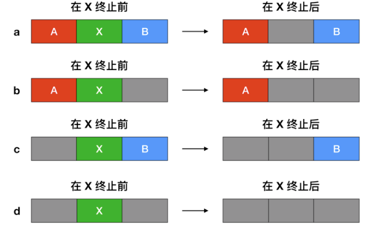

当按照地址顺序在链表中存放进程和空闲区时，有几种算法可以为创建的进程（或者从磁盘中换入的进程）分配内存。

1. 首次适配算法：在链表中进行搜索，直到找到最初的一个足够大的空闲区，将其分配。除非进程大小和空间区大小恰好相同，否则会将空闲区分为两部分，一部分为进程使用，一部分成为新的空闲区。该方法是速度很快的算法，因为索引链表结点的个数较少。
2. 下次适配算法：工作方式与首次适配算法相同，但每次找到新的空闲区位置后都记录当前位置，下次寻找空闲区从上次结束的地方开始搜索，而不是与首次适配放一样从头开始；
3. 最佳适配算法：搜索整个链表，找出能够容纳进程分配的最小的空闲区。这样存在的问题是，尽管可以保证为进程找到一个最为合适的空闲区进行分配，但大多数情况下，这样的空闲区被分为两部分，一部分用于进程分配，一部分会生成很小的空闲区，而这样的空闲区很难再被进行利用。
4. 最差适配算法：与最佳适配算法相反，每次分配搜索最大的空闲区进行分配，从而可以使得空闲区拆分得到的新的空闲区可以更好的被进行利用。

### 9. 页面替换算法有哪些？

在程序运行过程中，如果要访问的页面不在内存中，就发生缺页中断从而将该页调入内存中。此时如果内存已无空闲空间，系统必须从内存中调出一个页面到磁盘对换区中来腾出空间。

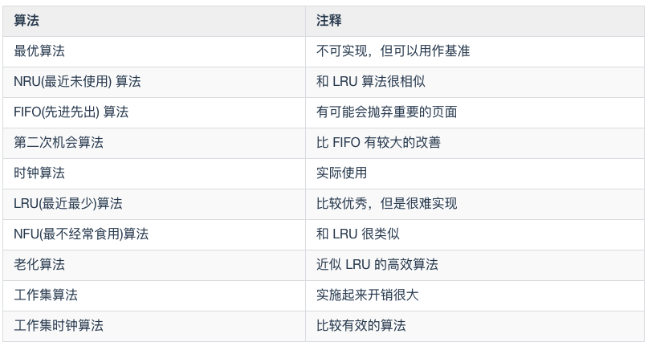

- `最优算法`在当前页面中置换最后要访问的页面。不幸的是，没有办法来判定哪个页面是最后一个要访问的，`因此实际上该算法不能使用`。然而，它可以作为衡量其他算法的标准。
- `NRU` 算法根据 R 位和 M 位的状态将页面分为四类。从编号最小的类别中随机选择一个页面。NRU 算法易于实现，但是性能不是很好。存在更好的算法。
- `FIFO` 会跟踪页面加载进入内存中的顺序，并把页面放入一个链表中。有可能删除存在时间最长但是还在使用的页面，因此这个算法也不是一个很好的选择。
- `第二次机会`算法是对 FIFO 的一个修改，它会在删除页面之前检查这个页面是否仍在使用。如果页面正在使用，就会进行保留。这个改进大大提高了性能。
- `时钟` 算法是第二次机会算法的另外一种实现形式，时钟算法和第二次算法的性能差不多，但是会花费更少的时间来执行算法。
- `LRU` 算法是一个非常优秀的算法，但是没有`特殊的硬件(TLB)`很难实现。如果没有硬件，就不能使用 LRU 算法。
- `NFU` 算法是一种近似于 LRU 的算法，它的性能不是非常好。
- `老化` 算法是一种更接近 LRU 算法的实现，并且可以更好的实现，因此是一个很好的选择
- 最后两种算法都使用了工作集算法。工作集算法提供了合理的性能开销，但是它的实现比较复杂。`WSClock` 是另外一种变体，它不仅能够提供良好的性能，而且可以高效地实现。

**最好的算法是老化算法和WSClock算法**。他们分别是基于 LRU 和工作集算法。他们都具有良好的性能并且能够被有效的实现。还存在其他一些好的算法，但实际上这两个可能是最重要的。

### 10. 为什么虚拟地址空间切换会比较耗时？

进程都有自己的虚拟地址空间，把虚拟地址转换为物理地址需要查找页表，页表查找是一个很慢的过程，因此通常使用Cache来缓存常用的地址映射，这样可以加速页表查找，这个Cache就是TLB（translation Lookaside Buffer，TLB本质上就是一个Cache，是用来加速页表查找的）。

由于每个进程都有自己的虚拟地址空间，那么显然每个进程都有自己的页表，那么**当进程切换后页表也要进行切换，页表切换后TLB就失效了**，Cache失效导致命中率降低，那么虚拟地址转换为物理地址就会变慢，表现出来的就是程序运行会变慢，而线程切换则不会导致TLB失效，因为线程无需切换地址空间，因此我们通常说线程切换要比较进程切换块，原因就在这里。

### 11. 什么是死锁？死锁产生的条件？

**什么是死锁**：

在两个或者多个并发进程中，如果每个进程持有某种资源而又等待其它进程释放它或它们现在保持着的资源，在未改变这种状态之前都不能向前推进，称这一组进程产生了死锁。通俗的讲就是两个或多个进程无限期的阻塞、相互等待的一种状态。

**死锁产生的四个必要条件**：（有一个条件不成立，则不会产生死锁）

- 互斥条件：一个资源一次只能被一个进程使用
- 请求与保持条件：一个进程因请求资源而阻塞时，对已获得资源保持不放
- 不剥夺条件：进程获得的资源，在未完全使用完之前，不能强行剥夺
- 循环等待条件：若干进程之间形成一种头尾相接的环形等待资源关系

**如何处理死锁问题**

常用的处理死锁的方法有：死锁预防、死锁避免、死锁检测、死锁解除、鸵鸟策略。

**（1）死锁的预防：**基本思想就是确保死锁发生的四个必要条件中至少有一个不成立：

> - ① 破除资源互斥条件
> - ② 破除“请求与保持”条件：实行资源预分配策略，进程在运行之前，必须一次性获取所有的资源。缺点：在很多情况下，无法预知进程执行前所需的全部资源，因为进程是动态执行的，同时也会降低资源利用率，导致降低了进程的并发性。
> - ③ 破除“不可剥夺”条件：允许进程强行从占有者那里夺取某些资源。当一个已经保持了某些不可被抢占资源的进程，提出新的资源请求而不能得到满足时，它必须释放已经保持的所有资源，待以后需要时再重新申请。这意味着进程已经占有的资源会被暂时被释放，或者说被抢占了。
> - ④ 破除“循环等待”条件：实行资源有序分配策略，对所有资源排序编号，按照顺序获取资源，将紧缺的，稀少的采用较大的编号，在申请资源时必须按照编号的顺序进行，一个进程只有获得较小编号的进程才能申请较大编号的进程。

**（2）死锁避免：**

死锁预防通过约束资源请求，防止4个必要条件中至少一个的发生，可以通过直接或间接预防方法，但是都会导致低效的资源使用和低效的进程执行。而死锁避免则允许前三个必要条件，但是通过动态地检测资源分配状态，以确保循环等待条件不成立，从而确保系统处于安全状态。所谓安全状态是指：如果系统能按某个顺序为每个进程分配资源（不超过其最大值），那么系统状态是安全的，换句话说就是，如果存在一个安全序列，那么系统处于安全状态。银行家算法是经典的死锁避免的算法。

**（3）死锁检测：**

死锁预防策略是非常保守的，他们通过限制访问资源和在进程上强加约束来解决死锁的问题。死锁检测则是完全相反，它不限制资源访问或约束进程行为，只要有可能，被请求的资源就被授权给进程。但是操作系统会周期性地执行一个算法检测前面的循环等待的条件。死锁检测算法是通过资源分配图来检测是否存在环来实现，从一个节点出发进行深度优先搜索，对访问过的节点进行标记，如果访问了已经标记的节点，就表示有存在环，也就是检测到死锁的发生。

> - 如果进程-资源分配图中无环路，此时系统没有死锁。 
> - 如果进程-资源分配图中有环路，且每个资源类中只有一个资源，则系统发生死锁。 
> - 如果进程-资源分配图中有环路，且所涉及的资源类有多个资源，则不一定会发生死锁。

**（4）死锁解除：**

死锁解除的常用方法就是终止进程和资源抢占，回滚。所谓进程终止就是简单地终止一个或多个进程以打破循环等待，包括两种方式：终止所有死锁进程和一次只终止一个进程直到取消死锁循环为止；所谓资源抢占就是从一个或者多个死锁进程那里抢占一个或多个资源。

**（5）鸵鸟策略：**

把头埋在沙子里，假装根本没发生问题。因为解决死锁问题的代价很高，因此鸵鸟策略这种不采取任何措施的方案会获得更高的性能。当发生死锁时不会对用户造成多大影响，或发生死锁的概率很低，可以采用鸵鸟策略。大多数操作系统，包括 Unix，Linux 和 Windows，处理死锁问题的办法仅仅是忽略它。


### 12. 进程调度策略有哪几种？

* **先来先服务**：非抢占式的调度算法，按照请求的顺序进行调度。有利于长作业，但不利于短作业，因为短作业必须一直等待前面的长作业执行完毕才能执行，而长作业又需要执行很长时间，造成了短作业等待时间过长。另外，对`I/O`密集型进程也不利，因为这种进程每次进行`I/O`操作之后又得重新排队。

* **短作业优先**：非抢占式的调度算法，按估计运行时间最短的顺序进行调度。长作业有可能会饿死，处于一直等待短作业执行完毕的状态。因为如果一直有短作业到来，那么长作业永远得不到调度。

* **最短剩余时间优先**：最短作业优先的抢占式版本，按剩余运行时间的顺序进行调度。 当一个新的作业到达时，其整个运行时间与当前进程的剩余时间作比较。如果新的进程需要的时间更少，则挂起当前进程，运行新的进程。否则新的进程等待。

* **时间片轮转**：将所有就绪进程按 `FCFS` 的原则排成一个队列，每次调度时，把 `CPU` 时间分配给队首进程，该进程可以执行一个时间片。当时间片用完时，由计时器发出时钟中断，调度程序便停止该进程的执行，并将它送往就绪队列的末尾，同时继续把 `CPU` 时间分配给队首的进程。

  时间片轮转算法的效率和时间片的大小有很大关系：因为进程切换都要保存进程的信息并且载入新进程的信息，如果时间片太小，会导致进程切换得太频繁，在进程切换上就会花过多时间。 而如果时间片过长，那么实时性就不能得到保证。 

* **优先级调度**：为每个进程分配一个优先级，按优先级进行调度。为了防止低优先级的进程永远等不到调度，可以随着时间的推移增加等待进程的优先级。

### 13. 什么是交换空间？

操作系统把物理内存(physical RAM)分成一块一块的小内存，每一块内存被称为**页(page)**。当内存资源不足时，**Linux把某些页的内容转移至硬盘上的一块空间上，以释放内存空间**。硬盘上的那块空间叫做**交换空间**(swap space),而这一过程被称为交换(swapping)。**物理内存和交换空间的总容量就是虚拟内存的可用容量。**

用途：

- 物理内存不足时一些不常用的页可以被交换出去，腾给系统。
- 程序启动时很多内存页被用来初始化，之后便不再需要，可以交换出去。

### 14. 什么是缓冲区溢出？有什么危害？

缓冲区溢出是指当计算机向缓冲区填充数据时超出了缓冲区本身的容量，溢出的数据覆盖在合法数据上。

危害有以下两点：

- 程序崩溃，导致拒绝额服务
- 跳转并且执行一段恶意代码

造成缓冲区溢出的主要原因是程序中没有仔细检查用户输入。

## 四、文件系统篇

### 1. 硬链接和软链接有什么区别？

- 硬链接就是在目录下创建一个条目，记录着文件名与 `inode` 编号，这个 `inode` 就是源文件的 `inode`。删除任意一个条目，文件还是存在，只要引用数量不为 `0`。但是硬链接有限制，它不能跨越文件系统，也不能对目录进行链接。
- 符号链接文件保存着源文件所在的绝对路径，在读取时会定位到源文件上，可以理解为 `Windows` 的快捷方式。当源文件被删除了，链接文件就打不开了。因为记录的是路径，所以可以为目录建立符号链接。

### 2. 提高文件系统性能的方式

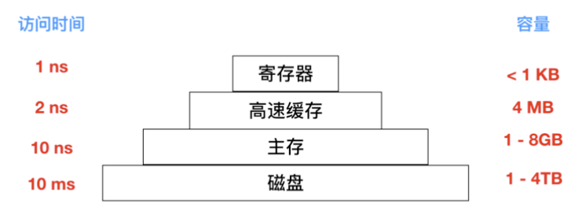

#### 2.1 高速缓存

最常用的减少磁盘访问次数的技术是使用块高速缓存`(block cache)` 或者 缓冲区高速缓存`(buffer cache)`。高速缓存指的是一系列的块，它们在逻辑上属于磁盘，但实际上基于性能的考虑被保存在内存中。

管理高速缓存有不同的算法，常用的算法是：检查全部的读请求，查看在高速缓存中是否有所需要的块。如果存在，可执行读操作而无须访问磁盘。如果检查块不再高速缓存中，那么首先把它读入高速缓存，再复制到所需的地方。之后，对同一个块的请求都通过高速缓存来完成。

高速缓存的操作如下图所示

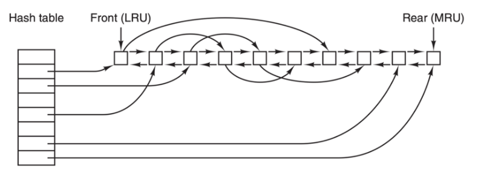

由于在高速缓存中有许多块，所以需要某种方法快速确定所需的块是否存在。常用方法是将设备和磁盘地址进行散列操作。然后在散列表中查找结果。具有相同散列值的块在一个链表中连接在一起，这样就可以沿着冲突链查找其他块。

如果高速缓存已满，此时需要调入新的块，则要把原来的某一块调出高速缓存，如果要调出的块在上次调入后已经被修改过，则需要把它写回磁盘。这种情况与分页非常相似。

#### 2.2 块提前读

第二个明显提高文件系统的性能是在需要用到块之前试图提前将其写入高速缓存从而提高命中率。许多文件都是顺序读取。如果请求文件系统在某个文件中生成块 k，文件系统执行相关操作并且在完成之后，会检查高速缓存，以便确定块 k + 1 是否已经在高速缓存。如果不在，文件系统会为 k + 1 安排一个预读取，因为文件希望在用到该块的时候能够直接从高速缓存中读取。

当然，块提前读取策略只适用于实际顺序读取的文件。对随机访问的文件，提前读丝毫不起作用。甚至还会造成阻碍。

#### 2.3 减少磁盘臂运动

高速缓存和块提前读并不是提高文件系统性能的唯一方法。另一种重要的技术是把有可能顺序访问的块放在一起，当然最好是在同一个柱面上，从而减少磁盘臂的移动次数。当写一个输出文件时，文件系统就必须按照要求一次一次地分配磁盘块。如果用位图来记录空闲块，并且整个位图在内存中，那么选择与前一块最近的空闲块是很容易的。如果用空闲表，并且链表的一部分存在磁盘上，要分配紧邻的空闲块就会困难很多。

不过，即使采用空闲表，也可以使用 块簇 技术。即不用块而用连续块簇来跟踪磁盘存储区。如果一个扇区有 512 个字节，有可能系统采用 1 KB 的块（2 个扇区），但却按每 2 块（4 个扇区）一个单位来分配磁盘存储区。这和 2 KB 的磁盘块并不相同，因为在高速缓存中它仍然使用 1 KB 的块，磁盘与内存数据之间传送也是以 1 KB 进行，但在一个空闲的系统上顺序读取这些文件，寻道的次数可以减少一半，从而使文件系统的性能大大改善。若考虑旋转定位则可以得到这类方法的变体。在分配块时，系统尽量把一个文件中的连续块存放在同一个柱面上。

在使用 inode 或任何类似 inode 的系统中，另一个性能瓶颈是，读取一个很短的文件也需要两次磁盘访问：一次是访问 inode，一次是访问块。通常情况下，inode 的放置如下图所示:

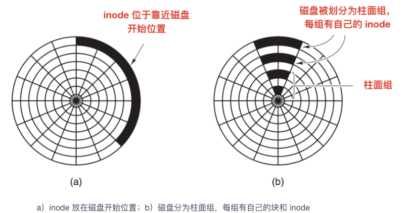

其中，全部 inode 放在靠近磁盘开始位置，所以 inode 和它所指向的块之间的平均距离是柱面组的一半，这将会需要较长时间的寻道时间。

一个简单的改进方法是，在磁盘中部而不是开始处存放 inode ，此时，在 inode 和第一个块之间的寻道时间减为原来的一半。另一种做法是：将磁盘分成多个柱面组，每个柱面组有自己的 inode，数据块和空闲表，如上图 b 所示。

当然，只有在磁盘中装有磁盘臂的情况下，讨论寻道时间和旋转时间才是有意义的。现在越来越多的电脑使用 固态硬盘(SSD)，对于这些硬盘，由于采用了和闪存同样的制造技术，使得随机访问和顺序访问在传输速度上已经较为相近，传统硬盘的许多问题就消失了。但是也引发了新的问题。

#### 2.4 磁盘碎片整理

在初始安装操作系统后，文件就会被不断的创建和清除，于是磁盘会产生很多的碎片，在创建一个文件时，它使用的块会散布在整个磁盘上，降低性能。删除文件后，回收磁盘块，可能会造成空穴。

磁盘性能可以通过如下方式恢复：移动文件使它们相互挨着，并把所有的至少是大部分的空闲空间放在一个或多个大的连续区域内。Windows 有一个程序 defrag 就是做这个事儿的。Windows 用户会经常使用它，SSD 除外。

磁盘碎片整理程序会在让文件系统上很好地运行。Linux 文件系统（特别是 ext2 和 ext3）由于其选择磁盘块的方式，在磁盘碎片整理上一般不会像 Windows 一样困难，因此很少需要手动的磁盘碎片整理。而且，固态硬盘并不受磁盘碎片的影响，事实上，在固态硬盘上做磁盘碎片整理反倒是多此一举，不仅没有提高性能，反而磨损了固态硬盘。所以碎片整理只会缩短固态硬盘的寿命。

### 3. RAID 的不同级别

RAID 称为 磁盘冗余阵列，简称 磁盘阵列。利用虚拟化技术把多个硬盘结合在一起，成为一个或多个磁盘阵列组，目的是提升性能或数据冗余。

RAID 有不同的级别

1. RAID 0 - 无容错的条带化磁盘阵列
2. RAID 1 - 镜像和双工
3. RAID 2 - 内存式纠错码
4. RAID 3 - 比特交错奇偶校验
5. RAID 4 - 块交错奇偶校验
6. RAID 5 - 块交错分布式奇偶校验
7. RAID 6 - P + Q冗余

## 五、IO 篇

### 1. 操作系统中的时钟是什么

时钟(Clocks) 也被称为定时器(timers)，时钟/定时器对任何程序系统来说都是必不可少的。时钟负责维护时间、防止一个进程长期占用 CPU 时间等其他功能。时钟软件(clock software) 也是一种设备驱动的方式。

### 2. 设备控制器的主要功能

设备控制器是一个可编址的设备，当它仅控制一个设备时，它只有一个唯一的设备地址；如果设备控制器控制多个可连接设备时，则应含有多个设备地址，并使每一个设备地址对应一个设备。

设备控制器主要分为两种：`字符设备`和`块设备`

设备控制器的主要功能有下面这些：

1. 接收和识别命令：设备控制器可以接受来自 CPU 的指令，并进行识别。设备控制器内部也会有寄存器，用来存放指令和参数
2. 进行数据交换：CPU、控制器和设备之间会进行数据的交换，CPU 通过总线把指令发送给控制器，或从控制器中并行地读出数据；控制器将数据写入指定设备。
3. 地址识别：每个硬件设备都有自己的地址，设备控制器能够识别这些不同的地址，来达到控制硬件的目的，此外，为使 CPU 能向寄存器中写入或者读取数据，这些寄存器都应具有唯一的地址。
4. 差错检测：设备控制器还具有对设备传递过来的数据进行检测的功能。

### 3. 中断处理过程

1. 保护现场：将当前执行程序的相关数据保存在寄存器中，然后入栈。
2. 开中断：以便执行中断时能响应较高级别的中断请求。
3. 中断处理
4. 关中断：保证恢复现场时不被新中断打扰
5. 恢复现场：从堆栈中按序取出程序数据，恢复中断前的执行状态。

上面我们罗列了大致的中断步骤，不同性质的操作系统和中断处理程序能够处理的中断步骤和细节也不尽相同，下面是一个嵌套中断的具体运行步骤:


### 4. 中断和轮询有什么区别？

* 轮询：CPU对**特定设备**轮流询问。中断：通过**特定事件**提醒CPU。
* 轮询：效率低等待时间长，CPU利用率不高。中断：容易遗漏问题，CPU利用率不高。

### 5. 什么是设备驱动程序

在计算机中，设备驱动程序是一种计算机程序，它能够控制或者操作连接到计算机的特定设备。驱动程序提供了与硬件进行交互的软件接口，使操作系统和其他计算机程序能够访问特定设备，不用需要了解其硬件的具体构造。

### 6. 什么是 DMA

DMA 的中文名称是`直接内存访问`，它意味着 CPU 授予 I/O 模块权限在不涉及 CPU 的情况下读取或写入内存。也就是 DMA 可以不需要 CPU 的参与。这个过程由称为 DMA 控制器（DMAC）的芯片管理。由于 DMA 设备可以直接在内存之间传输数据，而不是使用 CPU 作为中介，因此可以缓解总线上的拥塞。DMA 通过允许 CPU 执行任务，同时 DMA 系统通过系统和内存总线传输数据来提高系统并发性。

**直接内存访问的特点:**

- 数据传送以数据块为基本单位
- 所传送的数据从设备直接送入主存，或者从主存直接输出到设备上
- 仅在传送一个或多个数据块的开始和结束时才需 CPU 的干预，而整块数据的传送则是在控制器的控制下完成。

DMA 方式和中断驱动控制方式相比，减少了 CPU 对 I/O 操作的干预，进一步提高了 CPU 与 I/O 设备的并行操作程度。

DMA 方式的线路简单、价格低廉，适合高速设备与主存之间的成批数据传送，小型、微型机中的快速设备均采用这种方式，但其功能较差，不能满足复杂的 I/O 要求。

### 7. 讲一讲IO多路复用？

**IO多路复用是指内核一旦发现进程指定的一个或者多个IO条件准备读取，它就通知该进程。IO多路复用适用如下场合**：

- 当客户处理多个描述字时（一般是交互式输入和网络套接口），必须使用I/O复用。
- 当一个客户同时处理多个套接口时，而这种情况是可能的，但很少出现。
- 如果一个TCP服务器既要处理监听套接口，又要处理已连接套接口，一般也要用到I/O复用。
- 如果一个服务器即要处理TCP，又要处理UDP，一般要使用I/O复用。
- 如果一个服务器要处理多个服务或多个协议，一般要使用I/O复用。
- 与多进程和多线程技术相比，I/O多路复用技术的最大优势是系统开销小，系统不必创建进程/线程，也不必维护这些进程/线程，从而大大减小了系统的开销。

### 8. Unix 常见的IO模型：

对于一次IO访问（以read举例），数据会先被拷贝到操作系统内核的缓冲区中，然后才会从操作系统内核的缓冲区拷贝到应用程序的地址空间。所以说，当一个read操作发生时，它会经历两个阶段：

> - 等待数据准备就绪 (Waiting for the data to be ready)
> - 将数据从内核拷贝到进程中 (Copying the data from the kernel to the process)

正式因为这两个阶段，linux系统产生了下面五种网络模式的方案：

> - 阻塞式IO模型(blocking IO model)
> - 非阻塞式IO模型(noblocking IO model)
> - IO复用式IO模型(IO multiplexing model)
> - 信号驱动式IO模型(signal-driven IO model)
> - 异步IO式IO模型(asynchronous IO model)

其中，IO多路复用模型指的是：使用单个进程同时处理多个网络连接IO，他的原理就是select、poll、epoll 不断轮询所负责的所有 socket，当某个socket有数据到达了，就通知用户进程。该模型的优势并不是对于单个连接能处理得更快，而是在于能处理更多的连接。

在linux中，对于一次IO访问（以read举例），数据会先被拷贝到操作系统内核的缓冲区中，然后才会从操作系统内核的缓冲区拷贝到应用程序的地址空间。所以说，当一个read操作发生时，它会经历两个阶段：

- 等待数据准备就绪 (Waiting for the data to be ready)
- 将数据从内核拷贝到进程中 (Copying the data from the kernel to the process)

正式因为这两个阶段，linux系统产生了下面五种网络模式的方案：

- 阻塞式IO模型(blocking IO model)
- 非阻塞式IO模型(noblocking IO model)
- IO复用式IO模型(IO multiplexing model)
- 信号驱动式IO模型(signal-driven IO model)
- 异步IO式IO模型(asynchronous IO model)

下面我们来分别谈一下这些IO模型

#### 8.1 阻塞式IO模型(blocking IO model)

在linux中，默认情况下所有的IO操作都是blocking，一个典型的读操作流程大概是这样：

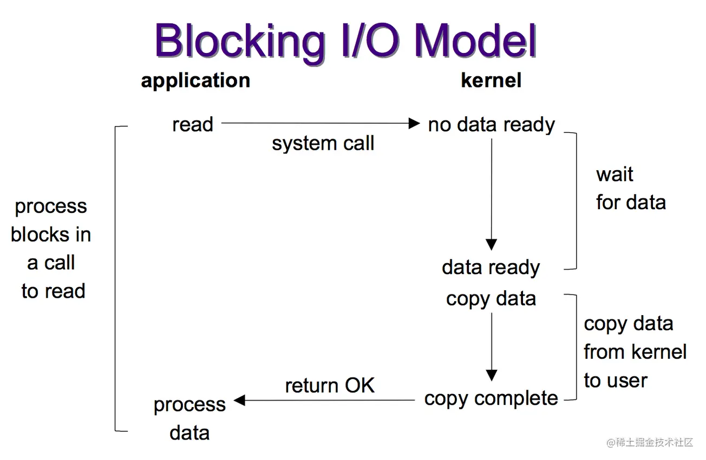

当用户进程调用了recvfrom这个系统调用，kernel就开始了IO的第一个阶段：准备数据（对于网络IO来说，很多时候数据在一开始还没有到达。比如，还没有收到一个完整的UDP包。这个时候kernel就要等待足够的数据到来），而数据被拷贝到操作系统内核的缓冲区中是需要一个过程的，这个过程需要等待。而在用户进程这边，整个进程会被阻塞（当然，是进程自己选择的阻塞）。当kernel一直等到数据准备好了，它就会将数据从kernel中拷贝到用户空间的缓冲区以后，然后kernel返回结果，用户进程才解除block的状态，重新运行起来。

所以：blocking IO的特点就是在IO执行的下两个阶段的时候都被block了。

- 等待数据准备就绪 (Waiting for the data to be ready) 「阻塞」
- 将数据从内核拷贝到进程中 (Copying the data from the kernel to the process) 「阻塞」

#### 8.2 非阻塞 I/O（nonblocking IO）

linux下，可以通过设置socket使其变为non-blocking。通过java可以这么操作：

```
InetAddress host = InetAddress.getByName("localhost");
Selector selector = Selector.open();
ServerSocketChannel serverSocketChannel = ServerSocketChannel.open();
serverSocketChannel.configureBlocking(false);
serverSocketChannel.bind(new InetSocketAddress(hos1234));
serverSocketChannel.register(selector, SelectionKey.OP_ACCEPT);
复制代码
```

socket设置为 NONBLOCK（非阻塞）就是告诉内核，当所请求的I/O操作无法完成时，不要将进程睡眠，而是返回一个错误码(EWOULDBLOCK) ，这样请求就不会阻塞。


当用户进程调用了recvfrom这个系统调用，如果kernel中的数据还没有准备好，那么它并不会block用户进程，而是立刻返回一个EWOULDBLOCK error。从用户进程角度讲 ，它发起一个read操作后，并不需要等待，而是马上就得到了一个结果。用户进程判断结果是一个EWOULDBLOCK error时，它就知道数据还没有准备好，于是它可以再次发送read操作。一旦kernel中的数据准备好了，并且又再次收到了用户进程的system call，那么它马上就将数据拷贝到了用户空间缓冲区，然后返回。

可以看到，I/O 操作函数将不断的测试数据是否已经准备好，如果没有准备好，继续轮询，直到数据准备好为止。整个 I/O 请求的过程中，虽然用户线程每次发起 I/O 请求后可以立即返回，但是为了等到数据，仍需要不断地轮询、重复请求，消耗了大量的 CPU 的资源。

所以，non blocking IO的特点是用户进程需要不断的主动询问kernel数据好了没有：

- 等待数据准备就绪 (Waiting for the data to be ready) 「非阻塞」
- 将数据从内核拷贝到进程中 (Copying the data from the kernel to the process) 「阻塞」

一般很少直接使用这种模型，而是在其他 I/O 模型中使用非阻塞 I/O 这一特性。这种方式对单个 I/O 请求意义不大,但给 I/O 多路复用铺平了道路.

#### 8.3 I/O 多路复用（ IO multiplexing）

IO multiplexing就是我们常说的select，poll，epoll，有些地方也称这种IO方式为event driven IO。select/epoll的好处就在于单个process就可以同时处理多个网络连接的IO。它的基本原理就是select，poll，epoll这些个function会不断的轮询所负责的所有socket，当某个socket有数据到达了，就通知用户进程。

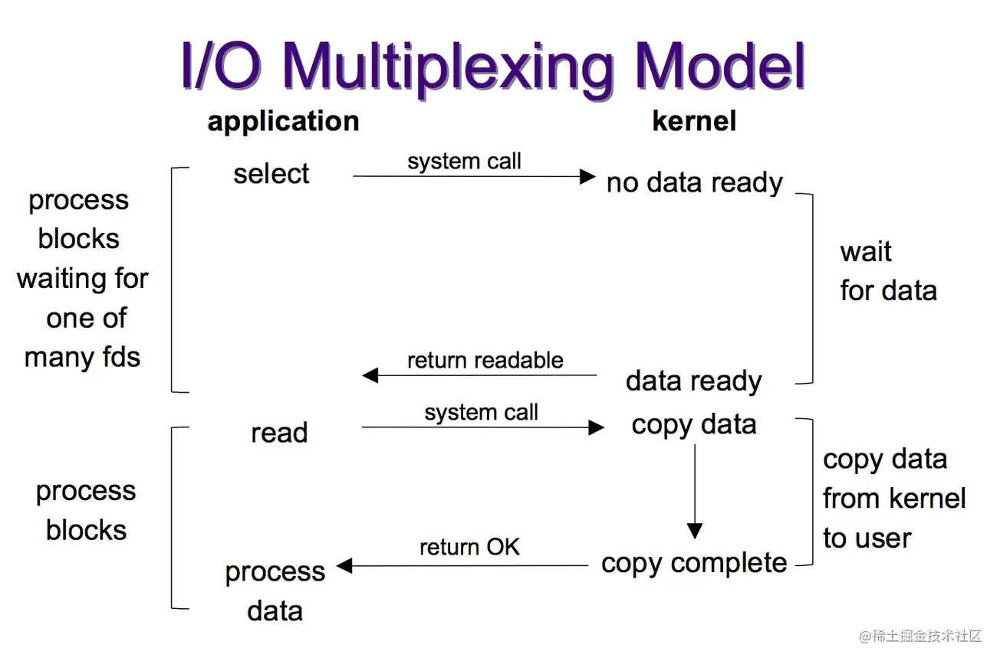

当用户进程调用了select，那么整个进程会被block，而同时，kernel会“监视”所有select负责的socket，当任何一个socket中的数据准备好了，select就会返回。这个时候用户进程再调用read操作，将数据从kernel拷贝到用户进程。

所以，I/O 多路复用的特点是通过一种机制一个进程能同时等待多个文件描述符，而这些文件描述符（套接字描述符）其中的任意一个进入读就绪状态，select()函数就可以返回。

这个图和blocking IO的图其实并没有太大的不同，事实上因为IO多路复用多了添加监视 socket，以及调用 select 函数的额外操作，效率更差。还更差一些。因为这里需要使用两个system call (select 和 recvfrom)，而blocking IO只调用了一个system call (recvfrom)。但是，但是，使用 select 以后最大的优势是用户可以在一个线程内同时处理多个 socket 的 I/O 请求。用户可以注册多个 socket，然后不断地调用 select 读取被激活的 socket，即可达到在同一个线程内同时处理多个 I/O 请求的目的。而在同步阻塞模型中，必须通过多线程的方式才能达到这个目的。

所以，如果处理的连接数不是很高的话，使用select/epoll的web server不一定比使用multi-threading + blocking IO的web server性能更好，可能延迟还更大。select/epoll的优势并不是对于单个连接能处理得更快，而是在于能处理更多的连接。）

在IO multiplexing Model中，实际中，对于每一个socket，一般都设置成为non-blocking，但是，如上图所示，整个用户的process其实是一直被block的。只不过process是被select这个函数block，而不是被socket IO给block。

因此对于IO多路复用模型来说： -等待数据准备就绪 (Waiting for the data to be ready) 「阻塞」

- 将数据从内核拷贝到进程中 (Copying the data from the kernel to the process) 「阻塞」

#### 8.4 异步 I/O（asynchronous IO）

接下来我们看看linux下的asynchronous IO的流程：

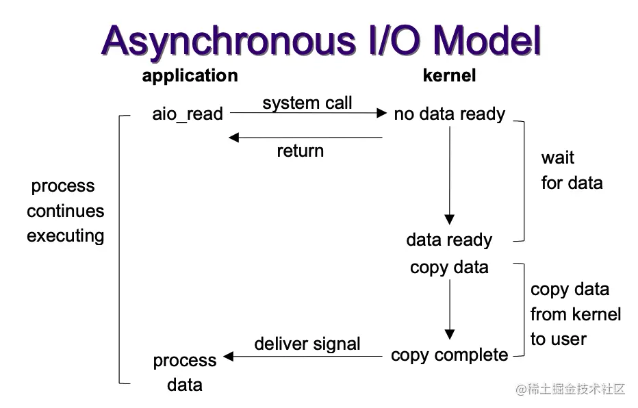

用户进程发起aio_read调用之后，立刻就可以开始去做其它的事。而另一方面，从kernel的角度，当它发现一个asynchronous read之后，首先它会立刻返回，所以不会对用户进程产生任何block。然后，kernel会等待数据准备完成，然后将数据拷贝到用户内存，当这一切都完成之后，kernel会给用户进程发送一个signal，告诉它read操作完成了。

异步 I/O 模型使用了 Proactor 设计模式实现了这一机制。

因此对异步IO模型来说：

- 等待数据准备就绪 (Waiting for the data to be ready) 「非阻塞」
- 将数据从内核拷贝到进程中 (Copying the data from the kernel to the process) 「非阻塞」

#### 8.5 信号驱动式IO模型(signal-driven IO model)

首先我们允许 socket 进行信号驱动 I/O,并安装一个信号处理函数，进程继续运行并不阻塞。当数据准备好时，进程会收到一个SIGIO信号，可以在信号处理函数中调用 I/O 操作函数处理数据。


但是这种IO模确用的不多，所以我这里也就不详细提它了。

### 9. select、poll 和 epoll 之间的区别?

- select：时间复杂度 O(n)


select 仅仅知道有 I/O 事件发生，但并不知道是哪几个流，所以只能无差别轮询所有流，找出能读出数据或者写入数据的流，并对其进行操作。所以 select 具有 O(n) 的无差别轮询复杂度，同时处理的流越多，无差别轮询时间就越长。

- poll：时间复杂度 O(n)


poll 本质上和 select 没有区别，它将用户传入的数组拷贝到内核空间，然后查询每个 fd 对应的设备状态， 但是它没有最大连接数的限制，原因是它是基于链表来存储的。

- epoll：时间复杂度 O(1)


epoll 可以理解为 event poll，不同于忙轮询和无差别轮询，epoll 会把哪个流发生了怎样的 I/O 事件通知我们。所以说 epoll 实际上是事件驱动（每个事件关联上 fd）的。

> select，poll，epoll 都是 IO 多路复用的机制。I/O 多路复用就是通过一种机制监视多个描述符，一旦某个描述符就绪（一般是读就绪或者写就绪），就通知程序进行相应的读写操作。但 select，poll，epoll 本质上都是同步 I/O，因为他们都需要在读写事件就绪后自己负责进行读写，也就是说这个读写过程是阻塞的，而异步 I/O 则无需自己负责进行读写，异步 I/O 的实现会负责把数据从内核拷贝到用户空间。

## 六、死锁篇

### 1. 什么是僵尸进程

僵尸进程是已完成且处于终止状态，但在进程表中却仍然存在的进程。僵尸进程通常发生在父子关系的进程中，由于父进程仍需要读取其子进程的退出状态所造成的。

### 2. 死锁产生的原因

死锁产生的原因大致有两个：资源竞争和程序执行顺序不当

### 3. 死锁产生的必要条件

资源死锁可能出现的情况主要有

1. 互斥条件：每个资源都被分配给了一个进程或者资源是可用的
2. 保持和等待条件：已经获取资源的进程被认为能够获取新的资源
3. 不可抢占条件：分配给一个进程的资源不能强制的从其他进程抢占资源，它只能由占有它的进程显示释放
4. 循环等待：死锁发生时，系统中一定有两个或者两个以上的进程组成一个循环，循环中的每个进程都在等待下一个进程释放的资源。

### 4. 死锁的恢复方式

针对检测出来的死锁，我们要对其进行恢复，下面我们会探讨几种死锁的恢复方式：

**通过抢占进行恢复**

在某些情况下，可能会临时将某个资源从它的持有者转移到另一个进程。比如在不通知原进程的情况下，将某个资源从进程中强制取走给其他进程使用，使用完后又送回。这种恢复方式一般比较困难而且有些简单粗暴，并不可取。

**通过回滚进行恢复**
如果系统设计者和机器操作员知道有可能发生死锁，那么就可以定期检查流程。进程的检测点意味着进程的状态可以被写入到文件以便后面进行恢复。检测点不仅包含存储映像(memory image)，还包含资源状态(resource state)。一种更有效的解决方式是不要覆盖原有的检测点，而是每出现一个检测点都要把它写入到文件中，这样当进程执行时，就会有一系列的检查点文件被累积起来。

为了进行恢复，要从上一个较早的检查点上开始，这样所需要资源的进程会回滚到上一个时间点，在这个时间点上，死锁进程还没有获取所需要的资源，可以在此时对其进行资源分配。

**杀死进程恢复**
最简单有效的解决方案是直接杀死一个死锁进程。但是杀死一个进程可能照样行不通，这时候就需要杀死别的资源进行恢复。

另外一种方式是选择一个环外的进程作为牺牲品来释放进程资源。

### 5. 如何破坏死锁

和死锁产生的必要条件一样，如果要破坏死锁，也是从下面四种方式进行破坏。

**破坏互斥条件**
我们首先考虑的就是破坏互斥使用条件。如果资源不被一个进程独占，那么死锁肯定不会产生。如果两个打印机同时使用一个资源会造成混乱，打印机的解决方式是使用 假脱机打印机(spooling printer) ，这项技术可以允许多个进程同时产生输出，在这种模型中，实际请求打印机的唯一进程是打印机守护进程，也称为后台进程。后台进程不会请求其他资源。我们可以消除打印机的死锁。

后台进程通常被编写为能够输出完整的文件后才能打印，假如两个进程都占用了假脱机空间的一半，而这两个进程都没有完成全部的输出，就会导致死锁。

因此，尽量做到尽可能少的进程可以请求资源。

**破坏保持等待的条件**
第二种方式是如果我们能阻止持有资源的进程请求其他资源，我们就能够消除死锁。一种实现方式是让所有的进程开始执行前请求全部的资源。如果所需的资源可用，进程会完成资源的分配并运行到结束。如果有任何一个资源处于频繁分配的情况，那么没有分配到资源的进程就会等待。

很多进程无法在执行完成前就知道到底需要多少资源，如果知道的话，就可以使用银行家算法；还有一个问题是这样无法合理有效利用资源。

还有一种方式是进程在请求其他资源时，先释放所占用的资源，然后再尝试一次获取全部的资源。

**破坏不可抢占条件**
破坏不可抢占条件也是可以的。可以通过虚拟化的方式来避免这种情况。

**破坏循环等待条件**
现在就剩最后一个条件了，循环等待条件可以通过多种方法来破坏。一种方式是制定一个标准，一个进程在任何时候只能使用一种资源。如果需要另外一种资源，必须释放当前资源。另一种方式是将所有的**资源统一编号**，进程可以在任何时间提出请求，但是**所有的请求都必须按照资源的顺序提出**。如果按照此分配规则的话，那么资源分配之间不会出现环。

### 6. 死锁类型

#### 6.1 两阶段加锁

虽然很多情况下死锁的避免和预防都能处理，但是效果并不好。随着时间的推移，提出了很多优秀的算法用来处理死锁。例如在数据库系统中，一个经常发生的操作是请求锁住一些记录，然后更新所有锁定的记录。当同时有多个进程运行时，就会有死锁的风险。

一种解决方式是使用 `两阶段提交(two-phase locking)`。顾名思义分为两个阶段，一阶段是进程尝试一次锁定它需要的所有记录。如果成功后，才会开始第二阶段，第二阶段是执行更新并释放锁。第一阶段并不做真正有意义的工作。

如果在第一阶段某个进程所需要的记录已经被加锁，那么该进程会释放所有锁定的记录并重新开始第一阶段。从某种意义上来说，这种方法类似于预先请求所有必需的资源或者是在进行一些不可逆的操作之前请求所有的资源。

不过在一般的应用场景中，两阶段加锁的策略并不通用。如果一个进程缺少资源就会半途中断并重新开始的方式是不可接受的。

#### 6.2 通信死锁

上面一直讨论的是资源死锁，资源死锁是一种死锁类型，但并不是唯一类型，还有通信死锁，也就是两个或多个进程在发送消息时出现的死锁。进程 A 给进程 B 发了一条消息，然后进程 A 阻塞直到进程 B 返回响应。假设请求消息丢失了，那么进程 A 在一直等着回复，进程 B 也会阻塞等待请求消息到来，这时候就产生死锁。

尽管会产生死锁，但是这并不是一个资源死锁，因为 A 并没有占据 B 的资源。事实上，通信死锁并没有完全可见的资源。根据死锁的定义来说：每个进程因为等待其他进程引起的事件而产生阻塞，这就是一种死锁。相较于最常见的通信死锁，我们把上面这种情况称为`通信死锁(communication deadlock)`。

通信死锁不能通过调度的方式来避免，但是可以使用通信中一个非常重要的概念来避免：超时(timeout)。在通信过程中，只要一个信息被发出后，发送者就会启动一个定时器，定时器会记录消息的超时时间，如果超时时间到了但是消息还没有返回，就会认为消息已经丢失并重新发送，通过这种方式，可以避免通信死锁。

但是并非所有网络通信发生的死锁都是通信死锁，也存在资源死锁，下面就是一个典型的资源死锁。

当一个数据包从主机进入路由器时，会被放入一个缓冲区，然后再传输到另外一个路由器，再到另一个，以此类推直到目的地。缓冲区都是资源并且数量有限。如下图所示，每个路由器都有 10 个缓冲区（实际上有很多）。

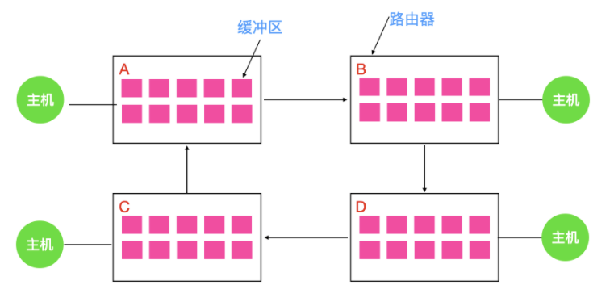

假如路由器 A 的所有数据需要发送到 B ，B 的所有数据包需要发送到 D，然后 D 的所有数据包需要发送到 A 。没有数据包可以移动，因为在另一端没有缓冲区可用，这就是一个典型的资源死锁。

#### 6.3 活锁

某些情况下，当进程意识到它不能获取所需要的下一个锁时，就会尝试礼貌的释放已经获得的锁，然后等待非常短的时间再次尝试获取。可以想像一下这个场景：当两个人在狭路相逢的时候，都想给对方让路，相同的步调会导致双方都无法前进。

现在假想有一对并行的进程用到了两个资源。它们分别尝试获取另一个锁失败后，两个进程都会释放自己持有的锁，再次进行尝试，这个过程会一直进行重复。很明显，这个过程中没有进程阻塞，但是进程仍然不会向下执行，这种状况我们称之为` 活锁(livelock)`。

#### 6.4 饥饿

与死锁和活锁的一个非常相似的问题是 `饥饿(starvvation)`。想象一下你什么时候会饿？一段时间不吃东西是不是会饿？对于进程来讲，最重要的就是资源，如果一段时间没有获得资源，那么进程会产生饥饿，这些进程会永远得不到服务。

假设打印机的分配方案是每次都会分配给最小文件的进程，那么要打印大文件的进程会永远得不到服务，导致进程饥饿，进程会无限制的推后，虽然它没有阻塞。