## 1 搜索与回溯算法

#### 1.1 广度优先搜索(层遍历)

>从上到下打印出二叉树的每个节点，同一层的节点按照从左到右的顺序打印。

```java
class Solution {
    public int[] levelOrder(TreeNode root) {
        if(root == null) return new int[0];
        
        Queue<TreeNode> queue = new LinkedList<>(){{ add(root); }};
        ArrayList<Integer> ans = new ArrayList<>();
        
        while(!queue.isEmpty()) {
            TreeNode node = queue.poll();
            ans.add(node.val);
            if(node.left != null) queue.add(node.left);
            if(node.right != null) queue.add(node.right);
        }
        int[] res = new int[ans.size()];
        for(int i = 0; i < ans.size(); i++)
            res[i] = ans.get(i);
        return res;
    }
}
```

#### 1.2 序列化、反序列化二叉树

>实现两个函数，分别用来序列化和反序列化二叉树。


```
输入：root = [1,2,3,null,null,4,5]
输出：[1,2,3,null,null,4,5]
```

```java
public class Codec {
    
    // Encodes a tree to a single string.
    public String serialize(TreeNode root) {
        if(root == null) return "[]";
        StringBuilder res = new StringBuilder("[");
        Queue<TreeNode> queue = new LinkedList<>() {{ add(root); }};
        while(!queue.isEmpty()) {
            TreeNode node = queue.poll();
            if(node != null) {
                res.append(node.val + ",");
                queue.add(node.left);
                queue.add(node.right);
            }
            else res.append("null,");
        }
        res.deleteCharAt(res.length() - 1);
        res.append("]");
        return res.toString();
    }

     // Decodes your encoded data to tree.
    public TreeNode deserialize(String data) {
        if(data.equals("[]")) return null;
        String[] vals = data.substring(1, data.length() - 1).split(",");
        TreeNode root = new TreeNode(Integer.parseInt(vals[0]));
        Queue<TreeNode> queue = new LinkedList<>() {{ add(root); }};
        int i = 1;
        while(!queue.isEmpty()) {
            TreeNode node = queue.poll();
            if(!vals[i].equals("null")) {
                node.left = new TreeNode(Integer.parseInt(vals[i]));
                queue.add(node.left);
            }
            i++;
            if(!vals[i].equals("null")) {
                node.right = new TreeNode(Integer.parseInt(vals[i]));
                queue.add(node.right);
            }
            i++;
        }
        return root;
    }
}
```

#### 1.3 二叉搜索树第K大节点

给定一棵二叉搜索树，请找出其中第k大的节点。

```
输入: root = [3,1,4,null,2], k = 1
   3
  / \
 1   4
  \
   2
输出: 4
```

本文解法基于性质：二叉搜索树的中序遍历为递增序列。根据此性质，易得二叉搜索树的 中序遍历倒序 为 递减序列 。因此，求 “二叉搜索树第 kk 大的节点” 可转化为求 “此树的中序遍历倒序的第 kk 个节点”。

```java
// 打印中序遍历倒序
void dfs(TreeNode root) {
    if(root == null) return;
    dfs(root.right); // 右
    System.out.println(root.val); // 根
    dfs(root.left); // 左
}
```

## 2 排序

### 2.1排序算法简介

#### 2.1.1**概述**

排序算法用作实现列表的排序，列表元素可以是整数，也可以是浮点数、字符串等其他数据类型。生活中有许多需要排序算法的场景，例如：

- 整数排序： 对于一个整数数组，我们希望将所有数字从小到大排序；
- 字符串排序： 对于一个姓名列表，我们希望将所有单词按照字符先后排序；
- 自定义排序： 对于任意一个 已定义比较规则 的集合，我们希望将其按规则排序；

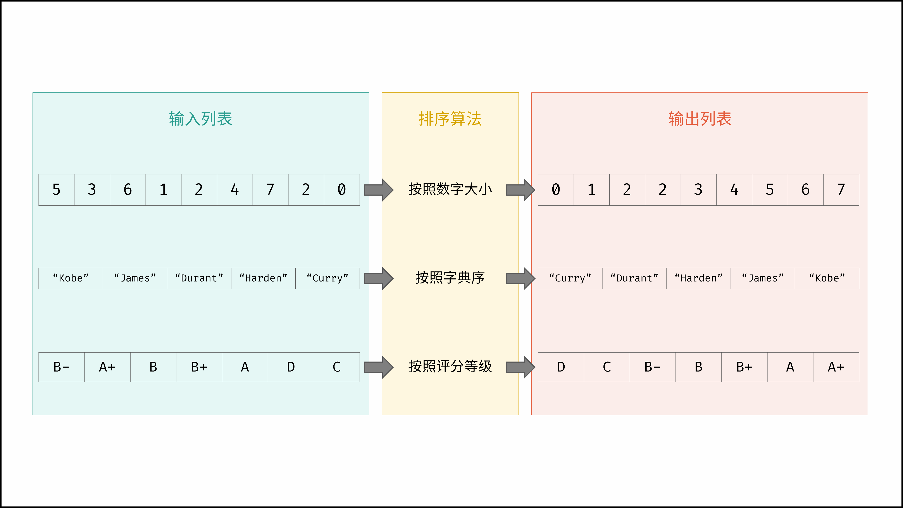

同时，某些算法需要在排序算法的基础上使用（即在排序数组上运行），例如：

- 二分查找： 根据数组已排序的特性，才能每轮确定排除两部分中的哪一部分；

- 双指针： 例如合并两个排序链表，根据已排序特性，才能通过双指针移动在线性时间内将其合并为一个排序链表

#### 2.1.2常见算法

常见排序算法包括「冒泡排序」、「插入排序」、「选择排序」、「快速排序」、「归并排序」、「堆排序」、「基数排序」、「桶排序」。如下图所示，为各排序算法的核心特性与时空复杂度总结。

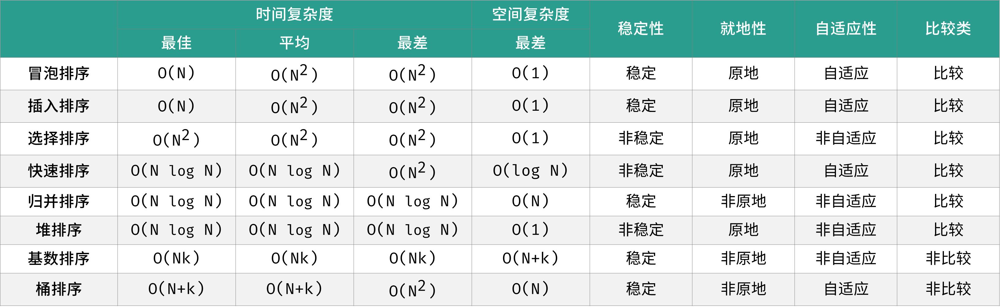

如下图所示，为在 「随机乱序」、「接近有序」、「完全倒序」、「少数独特」四类输入数据下，各常见排序算法的排序过程

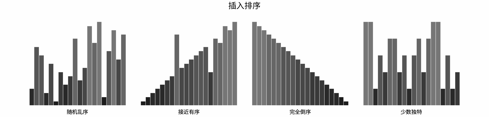


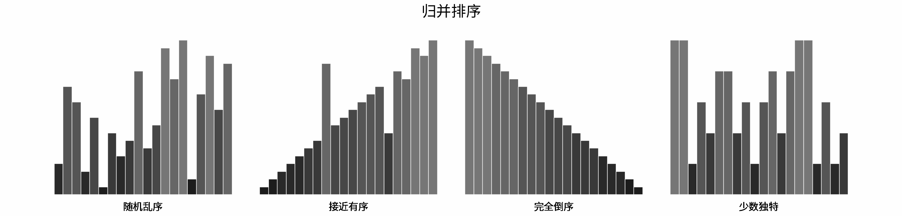


#### 2.1.3分类方法

排序算法主要可根据稳定性 、就地性 、自适应性分类。理想的排序算法具有以下特性：

- 具有稳定性，即相等元素的相对位置不变化；

- 具有就地性，即不使用额外的辅助空间；
- 具有自适应性，即时间复杂度受元素分布影响；

特别地，任意排序算法都 **不同时具有以上所有特性** 。因此，排序算法的选型使用取决于具体的列表类型、元素数量、元素分布情况等应用场景特点。

**稳定性：**
根据 相等元素 在数组中的 相对顺序 是否被改变，排序算法可分为「稳定排序」和「非稳定排序」两类。

- 「稳定排序」在完成排序后，不改变 相等元素在数组中的相对顺序。例如：冒泡排序、插入排序、归并排序、基数排序、桶排序。
- 「非稳定排序」在完成排序后，相等素在数组中的相对位置 可能被改变。例如：选择排序、快速排序、堆排序。

> **何时需考虑排序算法的稳定性？**
>
> 数组排序中，由于元素皆为数字，因此稳定和非稳定排序皆可输出相同结果，此时无需考虑排序算法的稳定性。
>
> 非稳定排序会改变相等元素的相对次序，这在实际应用场景中可能是不能接受的。如以下代码所示，非稳定排序破坏了输入列表 people 按姓名排序的性质。
>
> ```
> # 人 = (姓名, 年龄) ，按姓名排序
> people = [
>     ('A', 19),
>     ('B', 18),
>     ('C', 21),
>     ('D', 19),
>     ('E', 23)
> ]
> 
> # 非稳定排序（按年龄）
> sort_by_age(people)
> 
> # 人 = (姓名, 年龄) ，按年龄排序
> people = [
>     ('B', 18),
>     ('D', 19), # ('D', 19) 和 ('A', 19) 的相对位置改变，输入时按姓名排序的性质丢失
>     ('A', 19),
>     ('C', 21),
>     ('E', 23)
> ]
> ```

**就地性：**
根据排序过程中 是否使用额外内存（辅助数组），排序算法可分为「原地排序」和「异地排序」两类。一般地，由于不使用外部内存，原地排序相比非原地排序的执行效率更高。

- 「原地排序」不使用额外辅助数组，例如：冒泡排序、插入排序、选择排序、快速排序、堆排序。
- 「非原地排序」使用额外辅助数组，例如：归并排序、基数排序、桶排序。

**自适应性**：
根据算法 时间复杂度 是否 受待排序数组的元素分布影响 ，排序算法可分为「自适应排序」和「非自适应排序」两类。

- 「自适应排序」的时间复杂度受元素分布影响；例如：冒泡排序、插入排序、快速排序、桶排序。
- 「非自适应排序」的时间复杂度恒定；例如：选择排序、归并排序、堆排序、基数排序。

**比较类：**
比较类排序基于元素之间的 比较算子（小于、相等、大于）来决定元素的相对顺序；相对的，非比较排序则不基于比较算子实现。

- 「比较类排序」基于元素之间的比较完成排序，例如：冒泡排序、插入排序、选择排序、快速排序、归并排序、堆排序。

- 「非比较类排序」不基于元素之间的比较完成排序，例如：基数排序、桶排序。

> 基于比较的排序算法的平均时间复杂度最优为$$O(N \log N)$$ ，而非比较排序算法可以达到线性级别的时间复杂度。

#### 2.1.4时空复杂度

总体上看，排序算法追求时间与空间复杂度最低。而即使某些排序算法的时间复杂度相等，但实际性能还受 **输入列表性质、元素数量、元素分布等** 等因素影响。

> 设输入列表元素数量为 N*N* ，常见排序算法的「时间复杂度」和「空间复杂度」如下图所示。

| 算法     | 最佳时间        | 平均时间        | 最差时间   | 最差空间  |
| -------- | --------------- | --------------- | ---------- | --------- |
| 冒泡排序 | $\Omega(N)$     | $\Theta(N^2)$   | $O(N^2)$   | $O(1)$    |
| 插入排序 | $\Omega(N)$     | $\Theta(N^2)$   | $O(N^2)$   | $O(1)$    |
| 选择排序 | $\Omega(N^2)$   | $\Theta(N^2)$   | $O(N^2)$   | $O(1)$    |
| 快速排序 | $\Omega(NlogN)$ | $\Theta(NlogN)$ | $O(N^2)$   | $O(logN)$ |
| 归并排序 | $\Omega(NlogN)$ | $\Theta(NlogN)$ | $O(NlogN)$ | $O(N)$    |
| 堆排序   | $\Omega(NlogN)$ | $\Theta(NlogN)$ | $O(NlogN)$ | $O(1)$    |
| 基数排序 | $\Omega(Nk)$    | $\Theta(Nk)$    | $O(Nk)$    | $O(N+k)$  |
| 桶排序   | $\Omega(N+k)$   | $\Theta(N+k)$   | $O(N^2)$   | $O(N)$    |

对于上表，需要特别注意：

- 「基数排序」适用于正整数、字符串、特定格式的浮点数排序，$k$ 为最大数字的位数；「桶排序」中 $k$为桶的数量。

- 普通「冒泡排序」的最佳时间复杂度为 $O(N^2)$，通过增加标志位实现 提前返回 ，可以将最佳时间复杂度降低至 $O(N)$ 。
- 在输入列表完全倒序下，普通「快速排序」的空间复杂度劣化至$O(N)$ ，通过代码优化 **Tail Call Optimization** 保持算法递归较短子数组，可以将最差递归深度降低至 $\log N$ 。
- 普通「快速排序」总以最左或最右元素为基准数，因此在输入列表有序或倒序下，时间复杂度劣化至 $O(N^2)$ ；通过 **随机选择基准数** ，可极大减少此类最差情况发生，尽可能地保持$O(N \log N) $的时间复杂度。
- 若输入列表是数组，则归并排序的空间复杂度为$ O(N)$；而若排序 链表 ，则「归并排序」不需要借助额外辅助空间，空间复杂度可以降低至 $O(1)$ 。

### 2.2冒泡排序

**算法解析**
冒泡排序是最基础的排序算法，由于其直观性，经常作为首个介绍的排序算法。其原理为：

- 内循环： 使用相邻双指针 `j `,` j + 1 `从左至右遍历，依次比较相邻元素大小，若左元素大于右元素则将它们交换；遍历完成时，**最大元素会被交换至数组最右边** 。


- 外循环： 不断重复「内循环」，每轮将当前最大元素交换至 **剩余未排序数组最右边** ，直至所有元素都被交换至正确位置时结束。


如下图所示，冒泡排序的「外循环」共 N - 1*N*−1 轮，每轮「内循环」都将当前最大元素交换至数组最右边，从而完成对整个数组的排序：

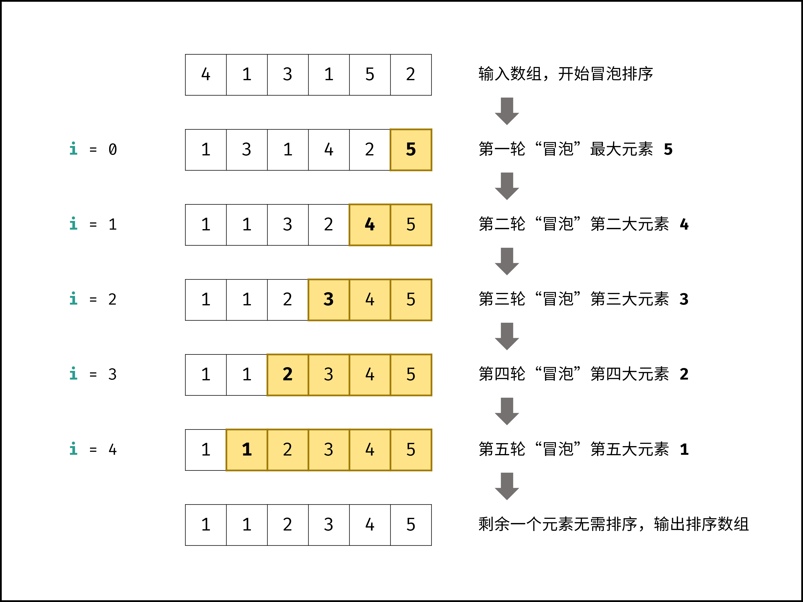

**算法特性：**

- 时间复杂度为 $O(N^2)$，因为其是通过不断 交换元素 实现排序（交换 2 个元素需要 3 次赋值操作），因此速度较慢；
- 原地： 指针变量仅使用常数大小额外空间，空间复杂度为 $O(1)$ ；
- 稳定： 元素值相同时不交换，因此不会改变相同元素的相对位置；
- 自适应： 通过增加一个标志位 flag ，若某轮内循环未执行任何交换操作时，说明已经完成排序，因此直接返回。此优化使冒泡排序的最优时间复杂度达到 $O(N)$（当输入数组已排序时）；

**代码：**

```
void bubbleSort(int[] nums) {
	int N = nums.length;
	for (int i = 0; i < N - 1; i++) {          // 外循环
		for (int j = 0; j < N - i - 1; j++) {  // 内循环
			if (nums[j] > nums[j + 1]) {
                // 交换 nums[j], nums[j + 1]
				int tmp = nums[j];
				nums[j] = nums[j + 1];
				nums[j + 1] = tmp;
			}
		}
	}
}
```

**效率优化：**

> 以上普通冒泡排序的时间复杂度恒为 O(N^2)*O*(*N*2) ，与输入数组的元素分布无关。

通过增加一个标志位 `flag` ，若在某轮「内循环」中未执行任何交换操作，则说明数组已经完成排序，直接返回结果即可。

优化后的冒泡排序的最差和平均时间复杂度仍为 $O(N^2)$ ；在输入数组 **已排序** 时，达到 **最佳时间复杂度** $\Omega(N)$。

```
void bubbleSort(int[] nums) {
	int N = nums.length;
	for (int i = 0; i < N - 1; i++) {
		boolean flag = false; // 初始化标志位
		for (int j = 0; j < N - i - 1; j++) {
			if (nums[j] > nums[j + 1]) {
				int tmp = nums[j];
				nums[j] = nums[j + 1];
				nums[j + 1] = tmp;
				flag = true;  // 记录交换元素
			}
		}
		if (!flag) break;     // 内循环未交换任何元素，则跳出
	}
}
```

### 2.3快速排序

**算法解析：**
快速排序算法有两个核心点，分别为 **哨兵划分** 和 **递归** 。

**哨兵划分：**

以数组某个元素（一般选取首元素）为 基准数 ，将所有小于基准数的元素移动至其左边，大于基准数的元素移动至其右边。

**递归：**

对 **左子数组** 和 **右子数组** 分别递归执行 **哨兵划分**，直至子数组长度为 1 时终止递归，即可完成对整个数组的排序。

> 如下图所示，为示例数组 [2,4,1,0,3,5] 的快速排序流程。观察发现，快速排序和 二分法 的原理类似，都是以 \loglog 时间复杂度实现搜索区间缩小。
>


**代码：**

```
void quickSort(int[] nums, int l, int r) {
    // 子数组长度为 1 时终止递归
    if (l >= r) return;
    // 哨兵划分操作
    int i = partition(nums, l, r);
    // 递归左（右）子数组执行哨兵划分
    quickSort(nums, l, i - 1);
    quickSort(nums, i + 1, r);
}

int partition(int[] nums, int l, int r) {
    // 以 nums[l] 作为基准数
    int i = l, j = r;
    while (i < j) {
        while (i < j && nums[j] >= nums[l]) j--;
        while (i < j && nums[i] <= nums[l]) i++;
        swap(nums, i, j);
    }
    swap(nums, i, l);
    return i;
}

void swap(int[] nums, int i, int j) {
    // 交换 nums[i] 和 nums[j]
    int tmp = nums[i];
    nums[i] = nums[j];
    nums[j] = tmp;
}

// 调用
int[] nums = { 4, 1, 3, 2, 5 };
quickSort(nums, 0, nums.length - 1);
```

**算法特性：**

1. 虽然平均时间复杂度与「归并排序」和「堆排序」一致，但在实际使用中快速排序 **效率更高** ，这是因为：

   - 最差情况稀疏性： 虽然快速排序的最差时间复杂度为$O(N^2)$，差于归并排序和堆排序，但统计意义上看，这种情况出现的机率很低。大部分情况下，快速排序以 $O(N \log N)$ 复杂度运行。

   - **缓存使用效率高：** 哨兵划分操作时，将整个子数组加载入缓存中，访问元素效率很高；堆排序需要跳跃式访问元素，因此不具有此特性。

   - **常数系数低：** 在提及的三种算法中，快速排序的 **比较**、**赋值**、**交换** 三种操作的综合耗时最低（类似于插入排序快于冒泡排序的原理）。

2. **原地**： 不用借助辅助数组的额外空间，递归仅使用 $O(\log N)$ 大小的栈帧空间。
3. **非稳定：** 哨兵划分操作可能改变相等元素的相对顺序。

4. **自适应**： 对于极少输入数据，每轮哨兵划分操作都将长度为 NN 的数组划分为长度 11 和 N - 1N−1 两个子数组，此时时间复杂度劣化至 $O(N^2)$


**算法优化**

快速排序的常见优化手段有「Tail Call」和「随机基准数」两种。

Tail Call ：

由于普通快速排序每轮选取「子数组最左元素」作为「基准数」，因此在输入数组 完全倒序 时， `partition()`的递归深度会达到$N$ ，即 最差空间复杂度 为 $O(N)$。

每轮递归时，仅对 较短的子数组 执行哨兵划分`partition()`，就可将最差的递归深度控制在 $O(\log N)$（每轮递归的子数组长度都$\leq$当前数组长度$/ 2$ ），即实现最差空间复杂度 $O(\log N)$。

```
void quickSort(int[] nums, int l, int r) {
    // 子数组长度为 1 时终止递归
    while (l < r) {
        // 哨兵划分操作
        int i = partition(nums, l, r);
        // 仅递归至较短子数组，控制递归深度
        if (i - l < r - i) {
            quickSort(nums, l, i - 1);
            l = i + 1;
        } else {
            quickSort(nums, i + 1, r);
            r = i - 1;
        }
    }
}
```

随机基准数：

同样地，由于快速排序每轮选取「子数组最左元素」作为「基准数」，因此在输入数组 **完全有序** 或 **完全倒序** 时， `partition()` 每轮只划分一个元素，达到最差时间复杂度 $O(N^2) 
$ 。

因此，可使用 **随机函数** ，每轮在子数组中随机选择一个元素作为基准数，这样就可以极大概率避免以上劣化情况。

值得注意的是，由于仍然可能出现最差情况，因此快速排序的最差时间复杂度仍为 $O(N^2)$ 。

```
int partition(int[] nums, int l, int r) {
    // 在闭区间 [l, r] 随机选取任意索引，并与 nums[l] 交换
    int ra = (int)(l + Math.random() * (r - l + 1));
    swap(nums, l, ra);
    // 以 nums[l] 作为基准数
    int i = l, j = r;
    while (i < j) {
        while (i < j && nums[j] >= nums[l]) j--;
        while (i < j && nums[i] <= nums[l]) i++;
        swap(nums, i, j);
    }
    swap(nums, i, l);
    return i;
}
```

### 2.4归并排序

算法解析
归并排序体现了 “分而治之” 的算法思想，具体为：

- 「分」： 不断将数组从 中点位置 划分开，将原数组的排序问题转化为子数组的排序问题；

- 「治」： 划分到子数组长度为 1 时，开始向上合并，不断将 左右两个较短排序数组 合并为 一个较长排序数组，直至合并至原数组时完成排序；

> 如下图所示，为数组 `[7,3,2,6,0,1,5,4]` 的归并排序过程。

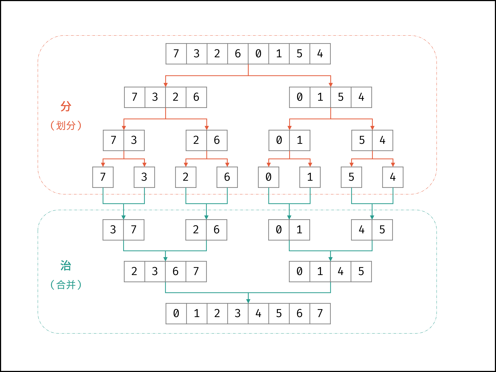

算法流程：

1. **递归划分：**
   1. 计算数组中点 $m$ ，递归划分左子数组 `merge_sort(l, m)` 和右子数组 `merge_sort(m + 1, r)` ；
   2. 当 $l \geq r $时，代表子数组长度为 1 或 0 ，此时 **终止划分** ，开始合并；
   
2. **合并子数组：**
   1. 暂存数组$nums$ 闭区间 $[l, r] $内的元素至辅助数组 $tmp$ ；
   
   2. **循环合并：** 设置双指针 $i , j$ 分别指向$tmp$ 的左 / 右子数组的首元素；
   
      > 注意： $nums$ 子数组的左边界、中点、右边界分别为 $l , m , r $，而辅助数组$tmp$ 中的对应索引为$ 0 , m - l , r - l$；
   
      - 当$ i = m - l + 1$时： 代表左子数组已合并完，因此添加右子数组元素$ tmp[j]$ ，并执行$ j = j + 1$ ；
      - 否则，当$ j == r - l + 1$ 时： 代表右子数组已合并完，因此添加左子数组元素$tmp[i]$ ，并执行 $i=i+1$ 
      - 否则，当 $tmp[i] \leq tmp[j]$时： 添加左子数组元素 $tmp[i]$ ，并执行$i=i+1 $；
      - 否则（即当 $tmp[i] > tmp[j]$ 时）： 添加右子数组元素 $tmp[j]$ ，并执行 $j = j + 1$ ；

**代码**

为简化代码，「当 $j = r + 1$ 时」 与 「当 $tmp[i] \leq tmp[j]$时」 两判断项可合并。

```
void mergeSort(int[] nums, int l, int r) {
    // 终止条件
    if (l >= r) return;
    // 递归划分
    int m = (l + r) / 2;
    mergeSort(nums, l, m);
    mergeSort(nums, m + 1, r);
    // 合并子数组
    int[] tmp = new int[r - l + 1]; // 暂存需合并区间元素
    for (int k = l; k <= r; k++)
        tmp[k - l] = nums[k];
    int i = 0, j = m - l + 1;       // 两指针分别指向左/右子数组的首个元素
    for (int k = l; k <= r; k++) {  // 遍历合并左/右子数组
        if (i == m - l + 1)
            nums[k] = tmp[j++];
        else if (j == r - l + 1 || tmp[i] <= tmp[j])
            nums[k] = tmp[i++];
        else {
            nums[k] = tmp[j++];
        }
    }
}

// 调用
int[] nums = { 3, 4, 1, 5, 2, 1 };
mergeSort(nums, 0, len(nums) - 1);
```

**算法特性**

- 时间复杂度： 最佳 $\Omega(N \log N )$，平均$ \Theta(N \log N) $，最差 $O(N \log N)$ 。
- 空间复杂度 $O(N)$ ： 合并过程中需要借助辅助数组 $tmp$ ，使用$O(N) $大小的额外空间；划分的递归深度为$ \log N$ ，使用 $O(\log N)$大小的栈帧空间。
- 若输入数据是 **链表** ，则归并排序的空间复杂度可被优化至 $O(1)$ ，这是因为：
  - 通过应用「双指针法」，可在$ O(1)$ 空间下完成两个排序链表的合并，省去辅助数组 $tmp$ 使用的额外空间；
  - 通过使用「迭代」代替「递归划分」，可省去递归使用的栈帧空间；
- **非原地：** 辅助数组 $tmp$需要使用额外空间
- **稳定：** 归并排序不改变相等元素的相对顺序。
- **非自适应：** 对于任意输入数据，归并排序的时间复杂度皆相同。

### 3 有限状态自动机

有限状态自动机(FSM,"finite state machine"，或FSA"finite state automation")

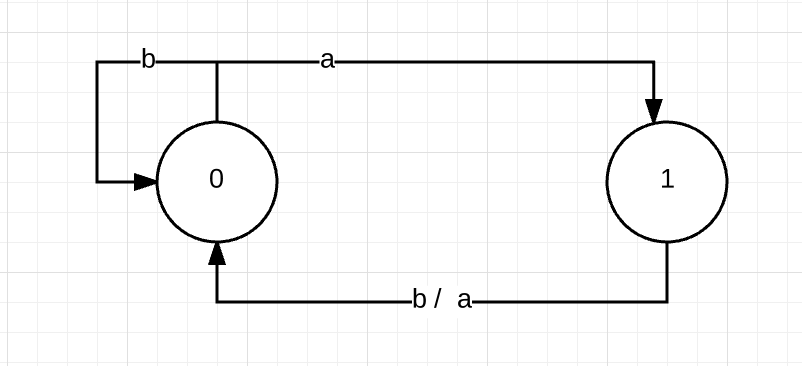

上面这个图描述的就叫一个有限状态自动机，图中两个圆圈，也叫节点，用于表示状态，从图中可以看成，它有两个状态，分别叫0和1. 从每个节点出发，都会有若干条边，当处于某个状态时，如果输入的字符跟该节点出发的某条边的内容一样，那么就会引起状态的转换。例如，如果当前状态处于0，输入是字符a,那么状态机就会从状态0进入状态1.如果当前状态是1，输入字符是b或a,那么，状态机就会从状态1进入状态0.如果当前所处的状态，没有出去的边可以应对输入的字符，那么状态机便会进入到错误状态。例如，如果当前处于状态0，输入字符是c,那么状态机就会出错，因为从状态0开始，没有哪条边对应的字符是c.

状态机会有一个初始节点，和一个接收节点，以上图为例，我们可以设置初始节点为0，接收节点为1，当进行一系列的输入，使得状态机的状态不断变化，只要最后一个输入使得状态机处于接收节点，那么就表明当前输入可以被状态机接收。例如对应字符串”abaaa”, 从初始节点0开始，状态机根据该字符串的输入所形成的状态变化序列为：{0，1，0，1，0，1}。由于最后状态机处于状态1，所以该字符串可以被状态机接收。如果输入的字符串是:abbaa, 那么状态机的变化序列为：{0，1，0，0，1，0}， 由于最后状态机处于非接收状态，因此这个字符串被状态机拒绝。

在程序中，我们一般使用二维表来表示一个状态机，例如上面的状态机用二维表来表示如下：

| 输入  | a    | b    |
| ----- | ---- | ---- |
| 状态0 | 1    | 0    |
| 状态1 | 0    | 0    |

通过查表，可知道状态机的转换，例如处于状态0，输入字符是a时，从表中得到的数值是1，也就是说处于状态0，输入字符a，那么状态机将转入节点1.


## 3 集合

### PriorityQueue

`Queue`是一个先进先出（FIFO）的队列。

在银行柜台办业务时，我们假设只有一个柜台在办理业务，但是办理业务的人很多，怎么办？

可以每个人先取一个号，例如：`A1`、`A2`、`A3`……然后，按照号码顺序依次办理，实际上这就是一个`Queue`。

如果这时来了一个VIP客户，他的号码是`V1`，虽然当前排队的是`A10`、`A11`、`A12`……但是柜台下一个呼叫的客户号码却是`V1`。

这个时候，我们发现，要实现“VIP插队”的业务，用`Queue`就不行了，因为`Queue`会严格按FIFO的原则取出队首元素。我们需要的是优先队列：`PriorityQueue`。

`PriorityQueue`和`Queue`的区别在于，它的出队顺序与元素的优先级有关，对`PriorityQueue`调用`remove()`或`poll()`方法，返回的总是优先级最高的元素。

要使用`PriorityQueue`，我们就必须给每个元素定义“优先级”。我们以实际代码为例，先看看`PriorityQueue`的行为：

```java
public class Main {
    public static void main(String[] args) {
        Queue<String> q = new PriorityQueue<>();
        // 添加3个元素到队列:
        q.offer("apple");
        q.offer("pear");
        q.offer("banana");
        System.out.println(q.poll()); // apple
        System.out.println(q.poll()); // banana
        System.out.println(q.poll()); // pear
        System.out.println(q.poll()); // null,因为队列为空
    }
}
```

放入的顺序是`"apple"`、`"pear"`、`"banana"`，但是取出的顺序却是`"apple"`、`"banana"`、`"pear"`，这是因为从字符串的排序看，`"apple"`排在最前面，`"pear"`排在最后面。

因此，放入`PriorityQueue`的元素，必须实现`Comparable`接口，`PriorityQueue`会根据元素的排序顺序决定出队的优先级。

如果我们要放入的元素并没有实现`Comparable`接口怎么办？`PriorityQueue`允许我们提供一个`Comparator`对象来判断两个元素的顺序。我们以银行排队业务为例，实现一个`PriorityQueue`：

```java
public class Main {
    public static void main(String[] args) {
        Queue<User> q = new PriorityQueue<>(new UserComparator());
        // 添加3个元素到队列:
        q.offer(new User("Bob", "A1"));
        q.offer(new User("Alice", "A2"));
        q.offer(new User("Boss", "V1"));
        System.out.println(q.poll()); // Boss/V1
        System.out.println(q.poll()); // Bob/A1
        System.out.println(q.poll()); // Alice/A2
        System.out.println(q.poll()); // null,因为队列为空
    }
}

class UserComparator implements Comparator<User> {
    public int compare(User u1, User u2) {
        if (u1.number.charAt(0) == u2.number.charAt(0)) {
            // 如果两人的号都是A开头或者都是V开头,比较号的大小:
            return u1.number.compareTo(u2.number);
        }
        if (u1.number.charAt(0) == 'V') {
            // u1的号码是V开头,优先级高:
            return -1;
        } else {
            return 1;
        }
    }
}

class User {
    public final String name;
    public final String number;

    public User(String name, String number) {
        this.name = name;
        this.number = number;
    }

    public String toString() {
        return name + "/" + number;
    }
}

```

#### 算法体现

[leetcode 295. 数据流的中位数](https://leetcode-cn.com/problems/find-median-from-data-stream/)

>中位数是有序列表中间的数。如果列表长度是偶数，中位数则是中间两个数的平均值。
>
>例如，
>
>[2,3,4] 的中位数是 3
>
>[2,3] 的中位数是 (2 + 3) / 2 = 2.5
>
>设计一个支持以下两种操作的数据结构：
>
>void addNum(int num) - 从数据流中添加一个整数到数据结构中。
>
>double findMedian() - 返回目前所有元素的中位数。
>
>示例：
>
>addNum(1)
>
>addNum(2)
>
>findMedian() -> 1.5
>
>addNum(3) 
>
>findMedian() -> 2

```java
Queue<Integer> A, B;

public LeetCode_MedianFinder() {

        A = new PriorityQueue<>();
        B = new PriorityQueue<>((x, y) -> (y - x));
}

public void addNum(int num) {

    if (A.size() != B.size()) {
        A.add(num);
        B.add(A.poll());
    } else {
        B.add(num);
        A.add(B.poll());
    }
}

public double findMedian() {

    return A.size() != B.size() ? A.peek() : (A.peek() + B.peek()) / 2.0;
}
```


## 4 BitMap&Bloom Filters

### 4.1BitMap

Bit-map的基本思想就是用一个bit位来标记某个元素对应的Value，而Key即是该元素。由于采用了Bit为单位来存储数据，因此在存储空间方面，可以大大节省。（ **节省存储空间**）

假设有这样一个需求：在20亿个随机整数中找出某个数m是否存在其中，并假设32位操作系统，4G内存

在Java中，int占4字节，1字节=8位（1 byte = 8 bit）

如果每个数字用int存储，那就是20亿个int，因而占用的空间约为 (2000000000*4/1024/1024/1024)≈**7.45G**

如果按位存储，20亿个数就是20亿位，占用空间约为 (2000000000/8/1024/1024/1024)≈**0.233G**

那么，问题来了，如何表示一个数呢？

刚才说了，每一位表示一个数，0表示不存在，1表示存在，这正符合二进制。这样我们可以很容易表示{1,2,4,6}这几个数：

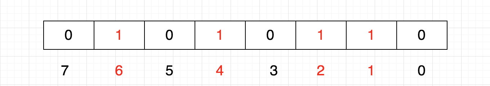


计算机内存分配的最小单位是字节，也就是8位，那如果要表示{12,13,15}怎么办呢？当然是在另一个8位上表示了：


这样的话，好像变成一个二维数组了

1个int占32位，那么我们只需要申请一个int数组长度为 int tmp[1+N/32] 即可存储，其中N表示要存储的这些数中的最大值，于是乎：

tmp[0]：可以表示0~31

tmp[1]：可以表示32~63

tmp[2]：可以表示64~95

。。。

==如此一来，给定任意整数M，那么M/32就得到下标，M%32就知道它在此下标的哪个位置==

#### 4.1.1添加 

这里有个问题，我们怎么把一个数放进去呢？例如，想把5这个数字放进去，怎么做呢？

首先，5/32=0，5%32=5，也是说它应该在tmp[0]的第5个位置，那我们把1向左移动5位，然后按位或

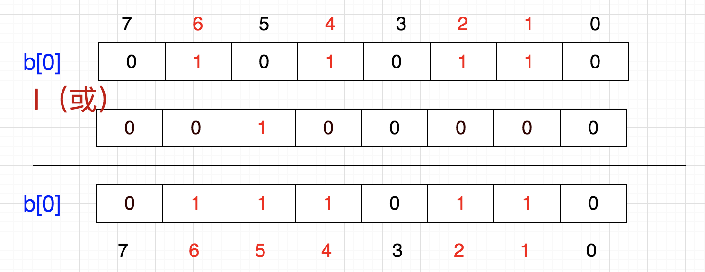

换成二进制就是

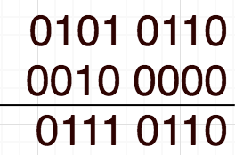

这就相当于 `86 | 32 = 118`

`86 | (1<<5) = 118`

`b[0] = b[0] | (1<<5)`

也就是说，要想插入一个数，将1左移带代表该数字的那一位，然后与原数进行按位或操作

化简一下，就是 `86 + (5/8) | (1<<(5%8))`。因此，公式可以概括为：`p + (i/8)|(1<<(i%8))` 其中，p表示现在的值，i表示待插入的数。

#### 4.1.2清除

以上是添加，那如果要清除该怎么做呢？还是上面的例子，假设我们要6移除，该怎么做呢？

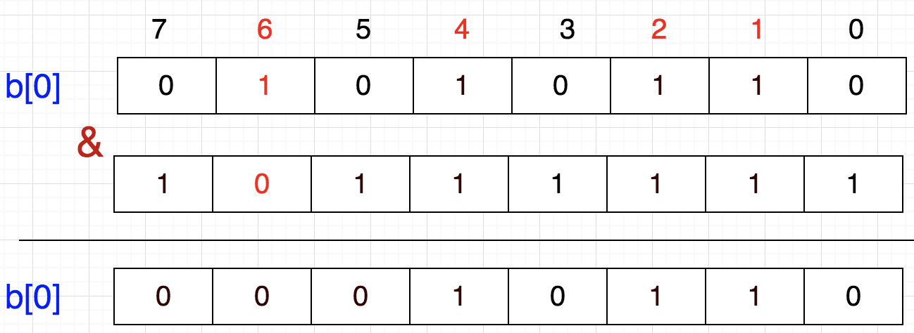

从图上看，只需将该数所在的位置为0即可

1左移6位，就到达6这个数字所代表的位，然后按位取反，最后与原数按位与，这样就把该位置为0了

`b[0] = b[0] & (~(1<<6))`

`b[0] = b[0] & (~(1<<(i%8)))`

#### 4.1.3查找 

前面我们也说了，每一位代表一个数字，1表示有（或者说存在），0表示无（或者说不存在）。通过把该为置为1或者0来达到添加和清除的小伙，那么判断一个数存不存在就是判断该数所在的位是0还是1

假设，我们想知道3在不在，那么只需判断 `b[0] & (1<<3) `如果这个值是0，则不存在，如果是1，就表示存在。

### 4.2Bitmap有什么用

==大量数据的快速排序、查找、去重==

#### 4.2.1快速排序

假设我们要对0-7内的5个元素(4,7,2,5,3)排序（这里假设这些元素没有重复）,我们就可以采用Bit-map的方法来达到排序的目的。

要表示8个数，我们就只需要8个Bit（1Bytes），首先我们开辟1Byte的空间，将这些空间的所有Bit位都置为0，然后将对应位置为1。

最后，遍历一遍Bit区域，将该位是一的位的编号输出（2，3，4，5，7），这样就达到了排序的目的，时间复杂度O(n)。

优点：

- 运算效率高，不需要进行比较和移位；
- 占用内存少，比如N=10000000；只需占用内存为N/8=1250000Byte=1.25M

缺点：

- 所有的数据不能重复。即不可对重复的数据进行排序和查找。
- 只有当数据比较密集时才有优势

#### 4.2.2 快速去重

20亿个整数中找出不重复的整数的个数，内存不足以容纳这20亿个整数。 

首先，根据“内存空间不足以容纳这05亿个整数”我们可以快速的联想到Bit-map。下边关键的问题就是怎么设计我们的Bit-map来表示这20亿个数字的状态了。其实这个问题很简单，一个数字的状态只有三种，分别为不存在，只有一个，有重复。因此，我们只需要2bits就可以对一个数字的状态进行存储了，假设我们设定一个数字不存在为00，存在一次01，存在两次及其以上为11。那我们大概需要存储空间2G左右。

接下来的任务就是把这20亿个数字放进去（存储），如果对应的状态位为00，则将其变为01，表示存在一次；如果对应的状态位为01，则将其变为11，表示已经有一个了，即出现多次；如果为11，则对应的状态位保持不变，仍表示出现多次。

最后，统计状态位为01的个数，就得到了不重复的数字个数，时间复杂度为O(n)。

#### 4.2.3 快速查找

这就是我们前面所说的了，int数组中的一个元素是4字节占32位，那么除以32就知道元素的下标，对32求余数（%32）就知道它在哪一位，如果该位是1，则表示存在。

### 4.3总结

==Bitmap主要用于快速检索关键字状态，通常要求关键字是一个连续的序列（或者关键字是一个连续序列中的大部分）， 最基本的情况，使用1bit表示一个关键字的状态（可标示两种状态），但根据需要也可以使用2bit（表示4种状态），3bit（表示8种状态）。==

Bitmap的主要应用场合：表示连续（或接近连续，即大部分会出现）的关键字序列的状态（状态数/关键字个数 越小越好）。

32位机器上，对于一个整型数，比如int a=1 在内存中占32bit位，这是为了方便计算机的运算。但是对于某些应用场景而言，这属于一种巨大的浪费，因为我们可以用对应的32bit位对应存储十进制的0-31个数，而这就是Bit-map的基本思想。==Bit-map算法利用这种思想处理大量数据的排序、查询以及去重。==

## 4.4Boolm Filters

==Bloom filter 是一个数据结构，它可以用来判断某个元素是否在集合内，具有运行快速，内存占用小的特点。==而高效插入和查询的代价就是，Bloom Filter 是一个基于概率的数据结构：它只能告诉我们一个元素绝对不在集合内或可能在集合内。Bloom filter 的基础数据结构是一个 ==比特向量==（可理解为数组）。

主要应用于大规模数据下不需要精确过滤的场景，如检查垃圾邮件地址，爬虫URL地址去重，解决缓存穿透问题等。如果想判断一个元素是不是在一个集合里，一般想到的是将集合中所有元素保存起来，然后通过比较确定。链表、树、散列表（哈希表）等等数据结构都是这种思路，但是随着集合中元素的增加，需要的存储空间越来越大；同时检索速度也越来越慢，检索时间复杂度分别是O(n)、O(log n)、O(1)。

布隆过滤器的原理是，当一个元素被加入集合时，通过 K 个散列函数将这个元素映射成一个位数组（Bit array）中的 K 个点，把它们置为 1 。检索时，只要看看这些点是不是都是1就知道元素是否在集合中；如果这些点有任何一个 0，则被检元素一定不在；如果都是1，则被检元素很可能在（之所以说“可能”是误差的存在）。

 ### 4.4.1 BloomFilter 流程

1. 首先需要 k 个 hash 函数，每个函数可以把 key 散列成为 1 个整数；
2. 初始化时，需要一个长度为 n 比特的数组，每个比特位初始化为 0；
3. 某个 key 加入集合时，用 k 个 hash 函数计算出 k 个散列值，并把数组中对应的比特位置为 1；
4. 判断某个 key 是否在集合时，用 k 个 hash 函数计算出 k 个散列值，并查询数组中对应的比特位，如果所有的比特位都是1，认为在集合中。

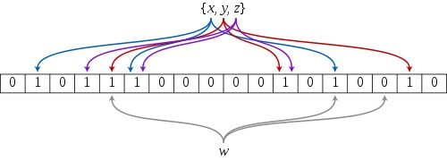

## 5 跳表

Redis里面使用skiplist是为了实现sorted set这种对外的数据结构。sorted set提供的操作非常丰富，可以满足非常多的应用场景。这也意味着，sorted set相对来说实现比较复杂。

分成三个部分进行介绍：

1. 介绍经典的skiplist数据结构，并进行简单的算法分析。这一部分的介绍，与Redis没有直接关系。我会尝试尽量使用通俗易懂的语言进行描述。
2. 讨论Redis里的skiplist的具体实现。为了支持sorted set本身的一些要求，在经典的skiplist基础上，Redis里的相应实现做了若干改动。
3. 讨论sorted set是如何在skiplist, dict和ziplist基础上构建起来的。

### 5.1 skiplist数据结构简介

skiplist本质上也是一种查找结构，用于解决算法中的查找问题（Searching），即根据给定的key，快速查到它所在的位置（或者对应的value）。

我们先来看一个有序链表，如下图（最左侧的灰色节点表示一个空的头结点）：


在这样一个链表中，如果我们要查找某个数据，那么需要从头开始逐个进行比较，直到找到包含数据的那个节点，或者找到第一个比给定数据大的节点为止（没找到）。也就是说，时间复杂度为O(n)。同样，当我们要插入新数据的时候，也要经历同样的查找过程，从而确定插入位置。

假如我们每相邻两个节点增加一个指针，让指针指向下下个节点，如下图：


这样所有新增加的指针连成了一个新的链表，但它包含的节点个数只有原来的一半（上图中是7, 19, 26）。现在当我们想查找数据的时候，可以先沿着这个新链表进行查找。当碰到比待查数据大的节点时，再回到原来的链表中进行查找。比如，我们想查找23，查找的路径是沿着下图中标红的指针所指向的方向进行的：


- 23首先和7比较，再和19比较，比它们都大，继续向后比较。
- 但23和26比较的时候，比26要小，因此回到下面的链表（原链表），与22比较。
- 23比22要大，沿下面的指针继续向后和26比较。23比26小，说明待查数据23在原链表中不存在，而且它的插入位置应该在22和26之间。

在这个查找过程中，由于新增加的指针，我们不再需要与链表中每个节点逐个进行比较了。需要比较的节点数大概只有原来的一半。

利用同样的方式，我们可以在上层新产生的链表上，继续为每相邻的两个节点增加一个指针，从而产生第三层链表。如下图：


在这个新的三层链表结构上，如果我们还是查找23，那么沿着最上层链表首先要比较的是19，发现23比19大，接下来我们就知道只需要到19的后面去继续查找，从而一下子跳过了19前面的所有节点。可以想象，当链表足够长的时候，这种多层链表的查找方式能让我们跳过很多下层节点，大大加快查找的速度。

skiplist正是受这种多层链表的想法的启发而设计出来的。实际上，按照上面生成链表的方式，上面每一层链表的节点个数，是下面一层的节点个数的一半，这样查找过程就非常类似于一个二分查找，使得查找的时间复杂度可以降低到O(log n)。但是，这种方法在插入数据的时候有很大的问题。新插入一个节点之后，就会打乱上下相邻两层链表上节点个数严格的2:1的对应关系。如果要维持这种对应关系，就必须把新插入的节点后面的所有节点（也包括新插入的节点）重新进行调整，这会让时间复杂度重新蜕化成O(n)。删除数据也有同样的问题。

skiplist为了避免这一问题，它不要求上下相邻两层链表之间的节点个数有严格的对应关系，而是为每个节点随机出一个层数(level)。比如，一个节点随机出的层数是3，那么就把它链入到第1层到第3层这三层链表中。为了表达清楚，下图展示了如何通过一步步的插入操作从而形成一个skiplist的过程：

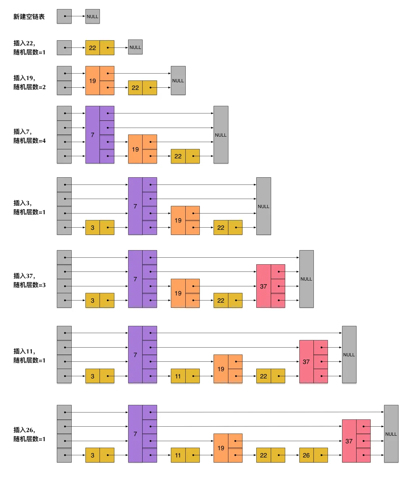

从上面skiplist的创建和插入过程可以看出，每一个节点的层数（level）是随机出来的，而且新插入一个节点不会影响其它节点的层数。因此，**插入操作只需要修改插入节点前后的指针，而不需要对很多节点都进行调整**。这就降低了插入操作的复杂度。**实际上，这是skiplist的一个很重要的特性，这让它在插入性能上明显优于平衡树的方案**。这在后面我们还会提到。

根据上图中的skiplist结构，我们很容易理解这种数据结构的名字的由来。skiplist，翻译成中文，可以翻译成“跳表”或“跳跃表”，**指的就是除了最下面第1层链表之外，它会产生若干层稀疏的链表，这些链表里面的指针故意跳过了一些节点（而且越高层的链表跳过的节点越多）**。这就使得我们在查找数据的时候能够先在高层的链表中进行查找，然后逐层降低，最终降到第1层链表来精确地确定数据位置。在这个过程中，我们跳过了一些节点，从而也就加快了查找速度。

刚刚创建的这个skiplist总共包含4层链表，现在假设我们在它里面依然查找23，下图给出了查找路径：

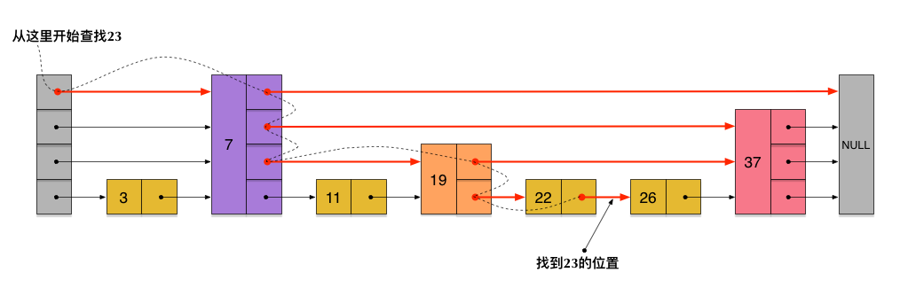

需要注意的是，前面演示的各个节点的插入过程，实际上在插入之前也要先经历一个类似的查找过程，在确定插入位置后，再完成插入操作。

至此，skiplist的查找和插入操作，我们已经很清楚了。而删除操作与插入操作类似，我们也很容易想象出来。这些操作我们也应该能很容易地用代码实现出来。

当然，实际应用中的skiplist每个节点应该包含key和value两部分。前面的描述中我们没有具体区分key和value，但实际上列表中是按照key进行排序的，查找过程也是根据key在比较。

但是，如果你是第一次接触skiplist，那么一定会产生一个疑问：**节点插入时随机出一个层数，仅仅依靠这样一个简单的随机数操作而构建出来的多层链表结构，能保证它有一个良好的查找性能吗**？为了回答这个疑问，我们需要分析skiplist的统计性能。

在分析之前，我们还需要着重指出的是，执行插入操作时计算随机数的过程，是一个很关键的过程，它对skiplist的统计特性有着很重要的影响。这并不是一个普通的服从均匀分布的随机数，它的计算过程如下：

- 首先，每个节点肯定都有第1层指针（每个节点都在第1层链表里）。
- 如果一个节点有第i层(i>=1)指针（即节点已经在第1层到第i层链表中），那么它有第(i+1)层指针的概率为p。
- 节点最大的层数不允许超过一个最大值，记为MaxLevel。

这个计算随机层数的伪码如下所示：

```c
randomLevel()
level := 1
// random()返回一个[0...1)的随机数
while random() < p and level < MaxLevel do
level := level + 1
return level
```

randomLevel()的伪码中包含两个参数，一个是p，一个是MaxLevel。在Redis的skiplist实现中，这两个参数的取值为：

```
p = 1/4
MaxLevel = 32
```

平均时间复杂度为O(log n)。

### 5.2 skiplist与平衡树、哈希表的比较

- skiplist和各种平衡树（如AVL、红黑树等）的元素是有序排列的，而哈希表不是有序的。因此，在哈希表上只能做单个key的查找，不适宜做范围查找。所谓范围查找，指的是查找那些大小在指定的两个值之间的所有节点。
- 在做**范围查找**的时候，平衡树比skiplist操作要复杂。在平衡树上，我们找到指定范围的小值之后，还需要以中序遍历的顺序继续寻找其它不超过大值的节点。如果不对平衡树进行一定的改造，这里的中序遍历并不容易实现。而在skiplist上进行范围查找就非常简单，只需要在找到小值之后，对第1层链表进行若干步的遍历就可以实现。
- **平衡树的插入和删除操作可能引发子树的调整，逻辑复杂，而skiplist的插入和删除只需要修改相邻节点的指针，操作简单又快速。**
- 从内存占用上来说，skiplist比平衡树更灵活一些。一般来说，平衡树每个节点包含2个指针（分别指向左右子树），而skiplist每个节点包含的指针数目平均为**1/(1-p)**，具体取决于参数p的大小。如果像Redis里的实现一样，取p=1/4，那么平均每个节点包含1.33个指针，比平衡树更有优势。
- 查找单个key，skiplist和平衡树的时间复杂度都为O(log n)，大体相当；而哈希表在保持较低的哈希值冲突概率的前提下，查找时间复杂度接近O(1)，性能更高一些。所以我们平常使用的各种Map或dictionary结构，大都是基于哈希表实现的。
- 从算法**实现难度**上来比较，skiplist比平衡树要简单得多。

### 5.3 redis中的skiplist

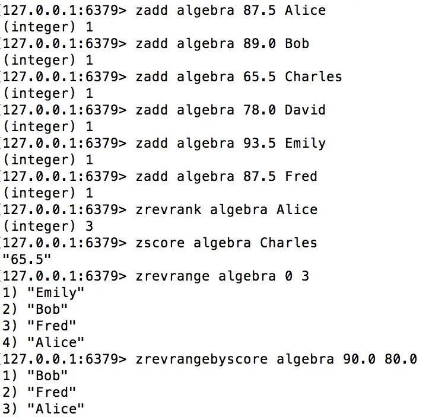

对于上面的这些命令，我们需要的注意的地方包括：

- 前面的6个zadd命令，将6位同学的名字和分数(score)都输入到一个key值为algebra的sorted set里面了。注意Alice和Fred的分数相同，都是87.5分。
- zrevrank命令查询Alice的排名（命令中的rev表示按照倒序排列，也就是从大到小），返回3。排在Alice前面的分别是Emily、Bob、Fred，而排名(rank)从0开始计数，所以Alice的排名是3。注意，其实Alice和Fred的分数相同，这种情况下sorted set会把分数相同的元素，按照字典顺序来排列。按照倒序，Fred排在了Alice的前面。
- zscore命令查询了Charles对应的分数。
- zrevrange命令查询了从大到小排名为0~3的4位同学。
- zrevrangebyscore命令查询了分数在80.0和90.0之间的所有同学，并按分数从大到小排列。


sorted set中的每个元素主要表现出3个属性：

- 数据本身（在前面的例子中我们把名字存成了数据）。
- 每个数据对应一个分数(score)。
- 根据分数大小和数据本身的字典排序，每个数据会产生一个排名(rank)。可以按正序或倒序。

#### 5.3.1 redis中的skiplist的特殊性

简单分析一下前面出现的几个查询命令：

- zrevrank由数据查询它对应的排名，这在前面介绍的skiplist中并不支持。
- zscore由数据查询它对应的分数，这也不是skiplist所支持的。
- zrevrange根据一个排名范围，查询排名在这个范围内的数据。这在前面介绍的skiplist中也不支持。
- zrevrangebyscore根据分数区间查询数据集合，是一个skiplist所支持的典型的范围查找（score相当于key）。

实际上，Redis中sorted set的实现是这样的：

- 当数据较少时，sorted set是由一个ziplist来实现的。
- 当数据多的时候，sorted set是由一个dict + 一个skiplist来实现的。简单来讲，dict用来查询数据到分数的对应关系，而skiplist用来根据分数查询数据（可能是范围查找）。

看一下sorted set与skiplist的关系：

- zscore的查询，不是由skiplist来提供的，而是由那个dict来提供的。
- 为了支持排名(rank)，Redis里对skiplist做了扩展，使得根据排名能够快速查到数据，或者根据分数查到数据之后，也同时很容易获得排名。而且，根据排名的查找，时间复杂度也为O(log n)。
- zrevrange的查询，是根据排名查数据，由扩展后的skiplist来提供。
- zrevrank是先在dict中由数据查到分数，再拿分数到skiplist中去查找，查到后也同时获得了排名。

前述的查询过程，也暗示了各个操作的时间复杂度：

- zscore只用查询一个dict，所以时间复杂度为O(1)
- zrevrank, zrevrange, zrevrangebyscore由于要查询skiplist，所以zrevrank的时间复杂度为O(log n)，而zrevrange, zrevrangebyscore的时间复杂度为O(log(n)+M)，其中M是当前查询返回的元素个数。

总结起来，Redis中的skiplist跟前面介绍的经典的skiplist相比，有如下不同：

- 分数(score)允许重复，即skiplist的key允许重复。这在最开始介绍的经典skiplist中是不允许的。
- 在比较时，不仅比较分数（相当于skiplist的key），还比较数据本身。在Redis的skiplist实现中，数据本身的内容唯一标识这份数据，而不是由key来唯一标识。另外，当多个元素分数相同的时候，还需要根据数据内容来进字典排序。
- 第1层链表不是一个单向链表，而是一个双向链表。这是为了方便以倒序方式获取一个范围内的元素。
- 在skiplist中可以很方便地计算出每个元素的排名(rank)。

#### 5.3.2 skiplist的数据结构定义

```c
#define ZSKIPLIST_MAXLEVEL 32
#define ZSKIPLIST_P 0.25

typedef struct zskiplistNode {
robj *obj;
double score;
struct zskiplistNode *backward;
struct zskiplistLevel {
struct zskiplistNode *forward;
unsigned int span;
} level[];
} zskiplistNode;

typedef struct zskiplist {
struct zskiplistNode *header, *tail;
unsigned long length;
int level;
} zskiplist;
```

这段代码出自server.h，我们来简要分析一下：

- 开头定义了两个常量，ZSKIPLIST_MAXLEVEL和ZSKIPLIST_P，分别对应我们前面讲到的skiplist的两个参数：一个是MaxLevel，一个是p。
- zskiplistNode定义了skiplist的节点结构。
  - obj字段存放的是节点数据，它的类型是一个string robj。本来一个string robj可能存放的不是sds，而是long型，但zadd命令在将数据插入到skiplist里面之前先进行了解码，所以这里的obj字段里存储的一定是一个sds。。这样做的目的应该是为了方便在查找的时候对数据进行字典序的比较，而且，skiplist里的数据部分是数字的可能性也比较小。
  - score字段是数据对应的分数。
  - backward字段是指向链表前一个节点的指针（前向指针）。节点只有1个前向指针，所以只有第1层链表是一个双向链表。
  - level[]存放指向各层链表后一个节点的指针（后向指针）。每层对应1个后向指针，用forward字段表示。另外，每个后向指针还对应了一个span值，它表示当前的指针跨越了多少个节点。span用于计算元素排名(rank)，这正是前面我们提到的Redis对于skiplist所做的一个扩展。需要注意的是，level[]是一个柔性数组(flexible array member)，因此它占用的内存不在zskiplistNode结构里面，而需要插入节点的时候单独为它分配。也正因为如此，skiplist的每个节点所包含的指针数目才是不固定的，我们前面分析过的结论——skiplist每个节点包含的指针数目平均为1/(1-p)——才能有意义。
- zskiplist定义了真正的skiplist结构，它包含：
  - 头指针header和尾指针tail。
  - 链表长度length，即链表包含的节点总数。注意，新创建的skiplist包含一个空的头指针，这个头指针不包含在length计数中。
  - level表示skiplist的总层数，即所有节点层数的最大值。

下图以前面插入的代数课成绩表为例，展示了Redis中一个skiplist的可能结构：

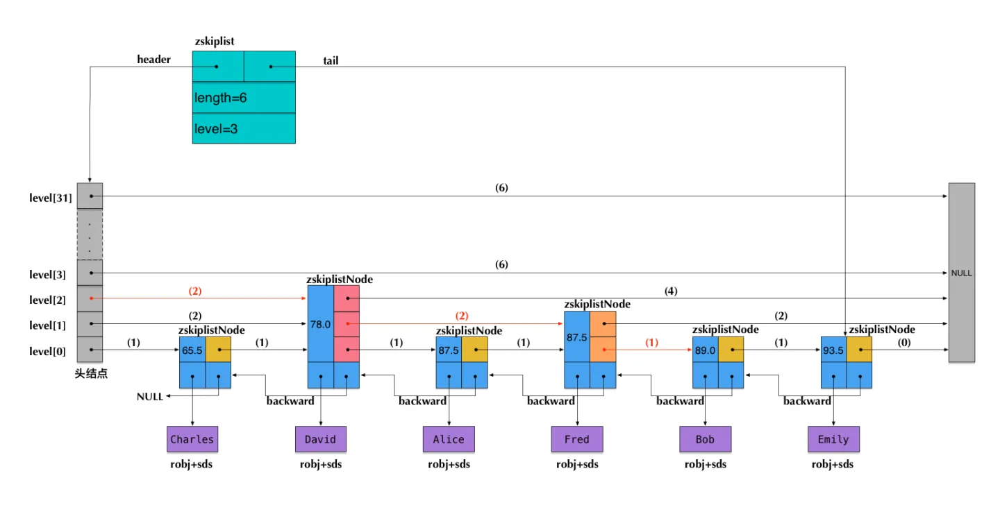

> 图中前向指针上面括号中的数字，表示对应的span的值。即当前指针跨越了多少个节点，这个计数不包括指针的起点节点，但包括指针的终点节点。

假设我们在这个skiplist中查找score=89.0的元素（即Bob的成绩数据），在查找路径中，我们会跨域图中标红的指针，这些指针上面的span值累加起来，就得到了Bob的排名(2+2+1)-1=4（减1是因为rank值以0起始）。需要注意这里算的是从小到大的排名，而如果要算从大到小的排名，只需要用skiplist长度减去查找路径上的span累加值，即6-(2+2+1)=1。

可见，在查找skiplist的过程中，通过累加span值的方式，我们就能很容易算出排名。相反，如果指定排名来查找数据（类似zrange和zrevrange那样），也可以不断累加span并时刻保持累加值不超过指定的排名，通过这种方式就能得到一条O(log n)的查找路径。

#### 5.3.3 Redis中的sorted set

我们前面提到过，Redis中的sorted set，是在skiplist, dict和ziplist基础上构建起来的:

- 当数据较少时，sorted set是由一个ziplist来实现的。
- 当数据多的时候，sorted set是由一个叫zset的数据结构来实现的，这个zset包含一个dict + 一个skiplist。dict用来查询数据到分数(score)的对应关系，而skiplist用来根据分数查询数据（可能是范围查找）。

在这里我们先来讨论一下前一种情况——基于ziplist实现的sorted set。ziplist就是由很多数据项组成的一大块连续内存。由于sorted set的每一项元素都由数据和score组成，因此，当使用zadd命令插入一个(数据, score)对的时候，底层在相应的ziplist上就插入两个数据项：数据在前，score在后。

ziplist的主要优点是节省内存，但它上面的查找操作只能按顺序查找（可以正序也可以倒序）。因此，sorted set的各个查询操作，就是在ziplist上从前向后（或从后向前）一步步查找，每一步前进两个数据项，跨域一个(数据, score)对。

随着数据的插入，sorted set底层的这个ziplist就可能会转成zset的实现（转换过程详见t_zset.c的zsetConvert）。那么到底插入多少才会转呢？

```
zset-max-ziplist-entries 128
zset-max-ziplist-value 64
```

这个配置的意思是说，在如下两个条件之一满足的时候，ziplist会转成zset（具体的触发条件参见t_zset.c中的zaddGenericCommand相关代码）：

- 当sorted set中的元素个数，即(数据, score)对的数目超过128的时候，也就是ziplist数据项超过256的时候。
- 当sorted set中插入的任意一个数据的长度超过了64的时候。

最后，zset结构的代码定义如下：

```c
typedef struct zset {
dict *dict;
zskiplist *zsl;
} zset;
```

#### 5.3.5 Redis为什么用skiplist而不用平衡树？

Redis的作者 @antirez 是怎么说的：

```
There are a few reasons:

1) They are not very memory intensive. It's up to you basically. Changing parameters about the probability of a node to have a given number of levels will make then less memory intensive than btrees.
占用内存少

2) A sorted set is often target of many ZRANGE or ZREVRANGE operations, that is, traversing the skip list as a linked list. With this operation the cache locality of skip lists is at least as good as with other kind of balanced trees.
查找性能不必平衡树差

3) They are simpler to implement, debug, and so forth. For instance thanks to the skip list simplicity I received a patch (already in Redis master) with augmented skip lists implementing ZRANK in O(log(N)). It required little changes to the code.
简单，易于实施调试
```


